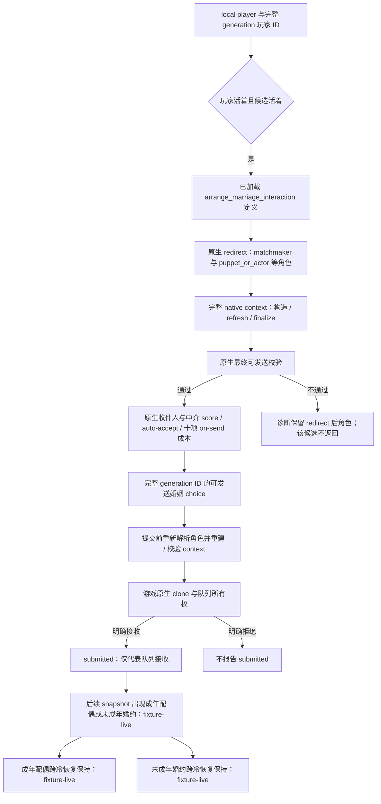

# CK3 1.20.0.2：婚姻与角色关系迁移

本页是 2026-10-01 后台静态迁移的新版本账本。构建固定为 `1.20.0.2 (Crozier)`、Steam build `25588574`，EXE SHA-256
`AE1BA6FF060BA603842F6F4A2DED0AF4B7D3666B3DD271F75FB01B0DA8E81B2D`。所有地址都是 RVA。
当前关系、合法候选、双方接受度、auto-accept、十项零成本、成年成婚与未成年婚约后置、两者的保存与冷恢复均已获协调者的 **fixture-live** 记录，
本次婚姻迁移夹具矩阵已闭合。非零付款仍属既有未验证范围，不追加为此次关系迁移验收的前置。本工作包没有自行注入、输入、暂停、关闭或重启游戏。

冻结文件：`artifacts/migrations/2026-09-30/post-update-1.20.0.2/installation/binaries/ck3.exe`。
同一冻结安装的 `game/common/character_interactions/00_marriage_interactions.txt` SHA-256 为
`9481FD44A078F2D06034DD4A2107FE183F231D2B49D8B90F106C1D54F7A501F0`。
ABI 和源码常量见 `ck3_autonomous_player/native_bridge/research/ck3_1_20_0_2_context.json`，实现为
`ck3_12002_context.hpp/.cpp`，使用版本无关的 `ArrangeMarriageChoice` 与诊断 DTO。

## 已闭合的原生路径

| 输入或对象 | 1.20.0.2 证据 | 迁移结果 |
|---|---|---|
| 角色家庭数据 | `0x1B971C5` 读取 `CCharacter+0x1A8` | 替换旧 `+0x1A0` |
| 婚约 | `0x1B971D6` 读取 family `+0x10`，随后完整 generation ID 解析 | 保留原生 absent 与有效角色的区分 |
| 主配偶 | `0x1B9727E` 读取 family `+0x14` | 同样验证完整 generation ID |
| 配偶数组 | `0x137598C..0x13759BB` 使用 family `+0x20`，数组指针 `+0`、count `+0x0C`、int32 stride | 枚举所有有效配偶，过滤过期 ID |
| 互动数据库 | getter `0x89DA60` 读取 slot `0x5C67538` | 私有绑定直接读取已加载数据库 |
| 安排婚姻定义 | `0x3214C90` 引用字符串 `0x470E200`，`0x3214C9E` 写 database `+0xF30` | 替换旧 `+0xF48` |
| redirect | `0x3148DE0`，原生婚姻 caller `0x1AA80CD..0x1AA810D` | **新增第六个角色指针**，旧函数签名不能复用 |
| 完整角色 context | `0x3076E50`，原生婚姻 caller `0x1AA8151` | 仍为 `0x338` bytes，使用 redirect 后角色 |
| scope 刷新和 finalize | `0x3078A60`、`0x3078C90` | 对每个查询和提交重新构造完整 native context |
| 最终可发送校验 | `0x307C040` | 直接调用原生合法性和支付能力检查 |
| 接受度 | 收件人 `0x307C460`；中介 `0x307C360` | 读取原生定点 score，scale `100000`；不把 score 说成概率 |
| 发送成本 | definition `+0x40`、scope `context+0x08`，evaluator `0x310CEE0` | 零初始化十项原生成本并调用 evaluator；保留 native 结果 |
| auto-accept | definition trigger `+0x2290`，scalar `+0x2718`；`0x372DF30` 执行 trigger | 区分原生自动接受判定与最终配偶关系 |
| 发送命令 | constructor `0x2968170`，primary/secondary vtable `0x448BCE0/0x448BCB0` | `0x368` bytes，复制 context 到 `+0x20`，两项 score 在 `+0x358/+0x360` |
| 销毁 | context destructor `0x30773A0` | source context 与命令复制的 context 各自销毁；队列独立拥有 clone |

新原版文件第 94 行开始的 redirect 直接使用 `puppet_or_actor` scope。静态 caller/callee 已证明新增第六个角色输出指针，
但尚未把该指针的标签单独绑定到 string registry，不能仅因 stock 出现新 scope 就给它臆定名称。
原生婚姻 caller 把新增输出 ID 初始化为 `-1`，传入七参数 redirect，再调用普通 all-role constructor；本实现遵循这条
确切调用链，不依赖猜测新增标签。不能把旧五个角色输出指针的函数类型仅替换成新地址。

十项成本顺序由新 formatter `0x310B460` 的十分支和 render loop `0x310C1C0` 共同证明，仍是
`gold / prestige / piety / renown / influence / herd / treasury / treasury_or_gold / merit / barter_goods`。
render loop 每次同步增加 formatter ordinal 与 `0xF0` 大小的 compiled cost 行，终止于 10；新增的
spiritual-fulfillment 状态不是第十一项成本。slot 7 仍是原生路由类别，不能直接当成独立余额。

## 原生判定与本模块的状态树

本模块没有改自动玩家策略。原版文件明确指出婚姻特殊 AI 分支会用 `ai_accept` 决定是否向玩家提出婚姻；stock
`ai_accept` 调用 `marriage_ai_accept_modifier`。候选查询调用原生最终校验，观察原生最终 score，避免自己重算这些权重。
婚姻有效目标脚本包含必要的信仰判定；它们只通过上述原生结果参与此婚姻调用，本次没有展开 faith、doctrine、tenet、
fervor、改宗或 holy order 专题。

`MarriageCandidateEvaluation12002` 提供合法候选的角色、接受度、auto-accept 与十项发送成本。保留现有查询契约时可以只返回
`ArrangeMarriageChoice`；需要这些观测时传入 evaluation 输出数组，读取失败会使该次完整查询不可用，不用 `null` 伪造完成。
接受度、auto-accept、合法性、队列 ACK 都不等于已经结婚；成功结果仍以随后关系快照为准。

## 离线验证与实机边界

- Manifest 固定 **16 个唯一签名、2 组 vtable 前缀、26 条关键指令、16 个源码常量**。签名与 vtable 从新冻结 EXE
  提取，角色新增参数由实际 native caller 和 callee 共同支持。
- MSVC 19.51 / C++20 直接构建 `ck3_12002.cpp`、`ck3_12002_commands.cpp`、`ck3_12002_context.cpp` 和
  `ck3_12002_context_test.cpp`。夹具进程只有自身数组和测试函数，执行输出
  `PASS 1.20.0.2 offline relationships, redirected marriage legality/cost/acceptance and command ownership`。
- 夹具覆盖旧 family 和 database offset 的非空诱饵、新死亡 offset、过期 generation、完整配偶数组、新增角色参数、
  redirect 后角色、原生合法候选和无合法候选、成本 evaluator 零初始化、负接受度、命令 clone、队列拒绝、命令
  vtable 不匹配及 context 成对销毁。
- Artifact：`artifacts/migrations/2026-09-30/post-update-1.20.0.2/build-context-msvc/context_test.exe`；旁证反汇编为
  `marriage-context-constructors.txt`。测试与源码 hash 保存在同目录的 `context-binding-result.json`。

本次关系矩阵的成年成婚、未成年婚约及两者保存与冷恢复均已有下述新版本实际记录，没有剩余实机项；
零发送成本不代表非零支付已完成，也没有借用旧版本 live 结果。非零付款保留既有未验证边界，不为此次矩阵另造场景。

2026-10-01 用户授权协调者统一实机后，已准备 [新版婚姻实机夹具与具体调用序列](ck3-1.20.0.2-marriage-live-fixture.md)：
成年配偶与未成年婚约两份独立 seed、公开结果文件验证器，以及复用现有 owning-thread callback 的私有 native probe。
私有采样只保留真实 evaluator 字段；关系验证器明确把付款余额后置与关系后置分开。新 probe 的离线 MSVC / JSON 夹具通过。

## 协调者的 1.20.0.2 首次婚姻读取证据

只读复盘 `artifacts/migrations/2026-09-30/post-update-1.20.0.2/live-1.20.0.2/attempt-02/probe.json`。
该 session 于 UTC `2026-09-30 21:26:10..21:27:21` 执行，桥 DLL SHA-256 为
`34A8DF28950226D38C2D5DA7C116371289C43077FAEE5EDEFAF15CCB6144157E`；EXE 是本页固定版本。

| 已实际观察的字段或调用 | 真实值与范围 | 本次验证边界 |
|---|---|---|
| 玩家与关系 | player `29829`；primary/spouse `34730`；betrothed absent | public 与 private 关系一致；尚未制造新关系 |
| 时点 | raw date `53168784`，paused `true` | 两次 public/private 查询前后日期完全相同 |
| storage 完整遍历 | capacity/scanned `131072`；empty `65330`；live `34391`；dead `31350`；self `1`；generation mismatch `0` | 五类相加恰好等于扫描总数 |
| context 生命周期 | constructed `34391`，construct failures `0` | 实际 native ctor/refresh/finalize/validator/destroy 路径可运行 |
| 最终合法性 | validate true `0`，false `34391`；公开 choices `[]` | 已婚玩家的 negative path，不能当作合法候选路径验收 |
| redirect 角色 | candidate `16777218` 改 recipient 为 `62934`；candidate `16777219` 改为 `16786170` | 真实 matchmaker 路由已观察，不只是传回原候选 ID |
| 接受度、auto-accept、十项成本 | `marriage_candidate_evaluations=[]` | **本次没有合法行，因此 evaluator 未执行，数值均未实机验证** |

private probe 的 schema 为 `1`，`kind=ck3_12002_marriage_native_probe`，`query_status=available`、
`core_observable=true`、`relationships_observable=true`。`cost_order` 是 serializer 的固定 schema 标签，本次不能把这些
标签误报成十项真实资源成本。public 与 private 的所有诊断数值及八条 rejected sample 完全一致。

## 首个合法候选与真实 evaluator 行

F15 在 seed 后增加 1 秒收敛等待后，public 和 private 查询均 GREEN，证实 F14 的 immediate-query 是尚未收敛的旧 snapshot
比较失败，未修改婚姻 ABI。三个原始文件位于 `live-1.20.0.2/attempt-15/`：`adult-before.json`、`adult-choices.json`、
`adult-probe.json`；单次 15 项文件验证为 `adult-positive-probe-verification.json`。

玩家 `29829` 在 paused raw date `53168784` 的 primary spouse、betrothed 都 absent，spouse array 为空。公开返回 **440** 条完整
choice，私有返回 **440** 条真实 evaluator 行，两组 `(player,candidate)` 完整 ID 集合一致。debug 标记确认的新候选为 `65742`，
公开 choice 为 `29829-65742`。

| candidate `65742` 字段 | 实际值 |
|---|---|
| native legal / auto-accept | `true / true` |
| 收件人 / 中介接受度原值 | `10000000 / 10000000`，scale `100000`，即各 `100` 分；不是概率 |
| 原生十项发送成本 | 十项均为 `0`，完整 evaluator 调用成功；未验证非零付款 |
| redirect 后角色 | actor、recipient、secondary actor 均为 `29829`；secondary recipient 为 `65742`；intermediary 为 `-1` |
| slot 与 generation ID | slot `65742`，完整 candidate ID `65742` |

这行首次实机覆盖了 `EvaluateChoice` 的两个 score reader、cost evaluator 与 auto-accept 判定。actor=recipient 对应自己 court 的
原生 matchmaker 路由；接受度和自动接受标记仍不等于真实配偶。发送、关系与冷恢复结果应另按随后 artifact 验收。

## 成年婚姻实际命令与配偶后置

F15 后续官方 MCP 在 UTC `23:03:53.964` 发送 `arrange-marriage-29829-65742`，队列报告 submitted。
至 `23:03:54.424` paused snapshot 已从 before 的空关系变为 primary spouse `65742`、spouse array `[65742]`、betrothed absent；
日期始终为 `53168784`。这是真实新关系后置，而不是只有 ACK。

原始文件为 `attempt-15/adult-submission.json`、`adult-after.json`、`adult-checkpoint.json`。已用捕获验证器**一次**验证
before → public choice → private 原生行 → submitted → 新配偶，输出 `attempt-15/adult-outcome-verification.json`，状态 PASS。
checkpoint 已由 managed driver 报告 materialized，size `64607967`，SHA-256
`A819016E525AB30AD78E082995D386E9E3E79DA0714F11B1B71A07A77D3F62BA`，日期与配偶后置相同；F16 冷恢复结果见下节。

F15 整体 harness 后来标量 RED 来自故意提交的 malformed title 导航验证，发生在婚姻保存成功之后；本域提交、关系、保存均
PASS。不能把该 harness RED 改写成婚姻 capability RED，也不能因为三步成功就宣称婚约、非零费用或冷恢复全矩阵已完成。

## F16 成年婚姻冷恢复与未成年婚约

`attempt-16/adult-cold-after.json` 在新实例冷加载后仍为 player `29829`、primary spouse `65742`、spouse array `[65742]`、
betrothed absent；paused、map-ready 为 true，日期仍为保存时的 `53168784`。复用 F15 已通过的成婚与 checkpoint 证明，
只验证这一新增冷读结果，输出 `attempt-16/adult-cold-outcome-verification.json`，九项检查均 PASS，没有重跑成年提交或静态测试。

同一受控 fixture 在完成成年冷恢复后 reset seed guard，再创建 12 岁 candidate `65743`。`child-before.json` 的关系为空；
`child-choices.json` 与 `child-probe.json` 分别返回 11 条 choice 与 11 条真实 evaluator 行。目标 `29829-65743` 的 native legal、
auto-accept 均为 true，两个 raw score 均为 `10000000`、scale `100000`，十项 send cost 均为 `0`。
redirect 后 actor、recipient、secondary actor 为 `29829`，secondary recipient 为 `65743`，intermediary 为 `-1`。

`child-submission.json` 保存实际官方 MCP 的 `arrange-marriage-29829-65743` submitted 结果；`child-after.json` 随后出现
betrothed `65743`，primary spouse absent、spouse array `[]`，日期仍为 `53168784`。捕获验证器只执行一次，输出
`attempt-16/child-outcome-verification.json`，`relationship_result=accepted_betrothal`、PASS。该后置证明原生命令创建了婚约，
没有把 candidate 混写为配偶。`child-checkpoint.json` 已报告 saved，size `64723651`，SHA-256
`B4F00A85195D9E52BD68EC6176232CF252671BE5E40F0AC2C142CA03A6AC99CC`；婚约冷读见 F17 验证。

F16 后续 harness 的 nested hold 重入 `001-child-military`，再次尝试同一 child-submit 后发生 harness error；上述原始婚约查询、
提交、真实婚约与保存已经完成，不改记为婚姻 capability RED。两个关系验证结果均保留
`payment_result=not_measured_by_relationship_frames`：这里只实测了十项零 send cost，不声明非零资源扣款。

## F17 婚约冷恢复与本次 readiness

`attempt-17/child-cold-after.json` 真实冷读仍为 player `29829`、betrothed `65743`、primary spouse absent、spouse array `[]`，
paused 与 map-ready 为 true，日期为 checkpoint 的 `53168784`。只校验这一新增冷读结果并复用 F16 已通过的婚约与保存证明，
输出 `attempt-17/child-cold-outcome-verification.json`，九项检查全部 PASS，没有重跑 before、提交或静态测试。

| 本次迁移验收项 | 真实证据 | 状态 |
|---|---|---|
| 合法候选、原生双 score、auto-accept、十项零 send cost、redirect 角色 | F15 adult / F16 child 的公开 choices 与 private probe | fixture-live |
| 成年实际 MCP 提交 → 主配偶与配偶数组 → 保存 | F15 `adult-outcome-verification.json`、`adult-checkpoint.json` | fixture-live |
| 成年配偶跨冷恢复保持 | F16 `adult-cold-outcome-verification.json` | fixture-live |
| 未成年实际 MCP 提交 → 婚约且配偶为空 → 保存 | F16 `child-outcome-verification.json`、`child-checkpoint.json` | fixture-live |
| 未成年婚约跨冷恢复保持 | F17 `child-cold-outcome-verification.json` | fixture-live |

冻结汇总与本工作包源码、文档、原始证据 hash 落在 `fixtures/marriage/marriage-fixture-readiness.json`。本次完成的是 exact-build
婚姻迁移夹具矩阵，不扩称整局 production-live loop 或完整 OODA；非零付款保留旧未验证范围，不新增门禁。
