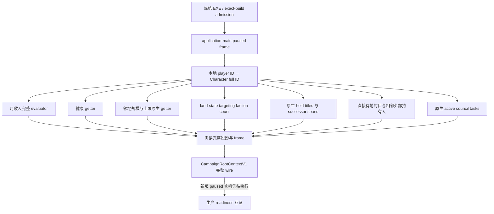

# CK3 1.20.0.2 非战争 campaign-root 观测

本包只读取冻结安装与 EXE、编写和运行离线测试。没有查看、启动、注入、连接或操纵本地 CK3，也没有修改用户游戏目录、存档、播放集或工坊。

## 版本与用途

冻结版本为 `1.20.0.2 Crozier`，EXE SHA-256 为 `AE1BA6FF060BA603842F6F4A2DED0AF4B7D3666B3DD271F75FB01B0DA8E81B2D`。本包沿用 master 的 `CampaignRootContextV1` DTO，把 1.20 初次迁移时只含身份、头衔、首府、领主、政府与规则的读取，补到非战争消费者所需的完整上下文。新增原生映射需要后续 paused 实机互证；离线通过不表示 production-live。

实际必要性：master Python 非战争消费者读取月收入、健康、领地规模/上限、针对玩家的派系、内阁、头衔继承与关系候选；旧 1.20 投影没有这些值，且其八项 aggregate readiness 初始化已不适配扩充后的 DTO。此次修复按字段赋值，读取到值后才设相应 readiness。

## 原生输入树

这是原生状态读取及其消费输入树，不声称复原全部原版 AI 的候选权重。本包不改我方策略，不研究通用宗教，也不扩展 MCP 公共工具数。

## 已闭合的静态入口

| 观测 | 1.20.0.2 RVA | 读取含义 |
|---|---:|---|
| 完整月金币收入 | `0x2BCA960` | `out, Character, optional breakdown, evaluation context`；不把缓存当完整收入 |
| 健康 | `0x28C6500` | Character extension `+0x1B0`，健康叶 `+0x2F0` |
| 领地规模 | `0x28B7200` | 原生逐头衔/省份/政府条件求值；不把 held-title 数量当领地规模 |
| 领地上限 | `0x28B71D0` | land state `+0x1C0`，上限叶 `+0x3D8` |
| 针对角色的派系 trigger | `0x2B250D0` | land state `+0x1C0`，针对玩家的派系列表 count `+0x12C` |
| 内阁任务 ID 枚举 | `0x2916CE0` | land state `+0x1C0`，任务 IDs `+0x230` / count `+0x23C` |
| active council task storage | `0x5D1DEA0` | fallback `0x5D1DDF8`；保留 full ID 验证 |
| 内阁 value progress 当前/最大 | `0x31AB520` / `0x31AB840` | task type 与其实际 scopes 的原生结果 |

内阁 task scopes 从旧版 `+0x38` 移到新版 `+0x40`，frozen 从 `+0x35` 移到 `+0x39`；task-type position/kind/progress-kind 从 `+0x38/+0x40/+0x4C` 移到 `+0x40/+0x48/+0x54`。这些位移只用于已证对应对象，不能全仓替换所有相同旧 offset。

## 实现与离线验收

主读取为 [ck3_12002_campaign.cpp](../../ck3_autonomous_player/native_bridge/src/ck3_12002_campaign.cpp)，与 [完整 serializer](../../ck3_autonomous_player/native_bridge/src/ck3_12002_campaign_serializer.cpp) 共同发布 master 已定义的扩充 DTO。三个独立只读 helper 分别负责 [物质/健康指标](ck3-1.20.0.2-nonwar-metrics-migration.md)、[内阁](ck3-1.20.0.2-nonwar-council.md) 和 [领地/继承/关系](ck3-1.20.0.2-nonwar-realm-projection.md)。各自的 ABI 合同、原生指令和验证器在对应专题中。

`ObservationV1` 同时存储三个 helper 的完整结果，再读两次比较；原有 frame、角色完整 generation、暂停和 application-main 约束保留。收入、健康、领地和针对玩家的派系是实际求值结果，缺失时沿用原 typed unavailable。legitimacy 仅作物质诊断，未读到时保留原因，不冒充合法零值。内阁维持原 standard-landed 范围，celestial/nomadic/landless 的内阁组件 typed unavailable 不使身份与其他根字段消失。规则服务暂时不可读取时，保留其余实测字段并令规则与总体 readiness 为 false。

2026-10-01 离线整合验收 GREEN：MSVC C++20 `/W4 /DNOMINMAX` 编译真实 campaign reader、serializer 和三组 helper，执行 [完整 fixture](../../ck3_autonomous_player/native_bridge/src/ck3_12002_campaign_test.cpp) 的 15 组检查，覆盖可用完整值、合法缺席、legitimacy 缺失、继承/持有头衔失败、收入/健康/领地失败、内阁动态任务/空缺/value 进度/帧变化、范围外内阁、规则服务缺席、派系 count 与身份/版本边界。该 fixture 沿用旧版已验证的输入语义，仅将内存布置和地址换成新版实际反汇编证据；不是把旧 offset 重新标注成新版本。

持久 artifact 为 `artifacts/nonwar-offline/2026-10-01/campaign-root-12002/`，其中 `result.json` 记录源码/fixture 哈希、15 组检查名称和证据路径；`native-campaign-wire.json` 是离线生产 reader→serializer 实际输出，SHA-256 为 `b7a4a20a864a6ba890df8cc293b5d460f0f8bc382acb68f37a903f60196f9591`，供 Python 合同进行跨语言验证。研究 PE 证据单独保留为 metrics/council/realm verification，不以 JSON 字段存在代替原生读取。

Python transport 已直接消费上述实际 native wire，扩充 normalizer 返回 GREEN，`normalized_matches_producer=true`，保留全部已发布字段与 readiness。评估保存在同目录 `native-campaign-wire-python-replay.json`。这是实际原生离线输出与 Python 消费合同的互证，未运行游戏。

本包等级为 `static-ready`。下一次获准使用游戏时，只需在真实 1.20 暂停帧调用既有 root 查询，核对材料、内阁、继承与关系读回；没有新增游戏动作或客户端工具。完整一代人的策略与生产 outcome 验收仍按交接文档推进，不因本包离线 GREEN 宣称完成。
