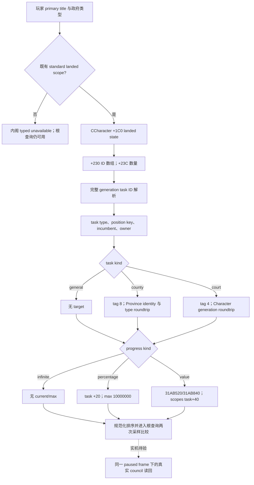

# 1.20.0.2 非战争内阁状态投影

2026-10-01；状态 `static-ready`。本包只读取冻结 EXE、编译与执行离线内存夹具，没有启动、检查或连接本地 CK3。真实 paused frame 的内阁读回仍待用户开放实机时间。

绑定 CK3 `1.20.0.2`，EXE SHA-256：
`AE1BA6FF060BA603842F6F4A2DED0AF4B7D3666B3DD271F75FB01B0DA8E81B2D`。
输入为迁移时冻结的 `artifacts/migrations/2026-09-30/post-update-1.20.0.2/installation/binaries/ck3.exe`。

此包恢复既有 `query-campaign-root-context-v1` 的内阁组件，服务交接文档要求的非战争维护。直接观测玩家内阁的职位、现任者、任务、目标、冻结状态和进度；没有修改任命策略或实现新的内阁动作。

## 原生链与布局变化

通过原生 `GetCouncillorPosition` 的唯一错误字符串引用，定位查找函数 `0x2684F00`；其正式有效分支在 `0x268500B` 调用 `0x2916CE0`，再按完整 generation ID 解析 ActiveCouncilTask。枚举函数明确读取 `CCharacter+0x1C0` 的 landed state，再读 `+0x230/+0x23C` 的任务 ID 列表。`+0x1B8` 是不同的 unlanded state，不能沿用旧版 council 路径。

| 项目 | 1.19.0.6 | 1.20.0.2 | 新版证据 |
|---|---:|---:|---|
| 职位查找 | `0x23F7800` | `0x2684F00` | 原生错误字符串、枚举调用、完整 task ID 解析 |
| 任务枚举 | `0x2666CD0` | `0x2916CE0` | 字符 landed state、ID 数据/数量、职位类型匹配 |
| task storage/fallback | `0x570C778/0x570C6D8` | `0x5D1DEA0/0x5D1DDF8` | 查找与枚举两条独立 RIP load |
| value current/maximum | `0x2D650A0/0x2D65390` | `0x31AB520/0x31AB840` | current/max 原生 progress core 的直接调用 |
| 字符 landed state | `+0x1B8` | `+0x1C0` | 枚举入口 `0x2916CE6` |
| task scopes | `+0x38` | `+0x40` | 两个 progress core 与任务 validator |
| incumbent/owner | `+0x38/+0x3C` | `+0x40/+0x44` | 任务枚举与 owner validator |
| target tag/value | `+0x40/+0x48` | `+0x48/+0x50` | county dispatch、court resolver |
| frozen byte | `+0x35` | `+0x39` | 叶函数 `0x31B5610` |
| task type 的 position/type/progress-kind | `+0x38/+0x40/+0x4C` | `+0x40/+0x48/+0x54` | 枚举、county dispatch、两个 progress core |

ActiveCouncilTask 的 identity/type/progress 仍为 `+0x10/+0x18/+0x20`。任务和职位的 authored key 继续使用 `+0x18` 的 MSVC 字符串。所有读取都来自同一玩家 owner；没有跨角色策略输入。



value evaluator 的 ABI 保持 `int64_t* __fastcall(task_type, output, task_scopes)`，必须返回调用者提供的 output 指针。发布值保持 Q100000；percentage 的最大值为 raw `10000000`，即 100。`infinite` 的空 current/max 是任务自身语义，不是观测缺口。

## 实现与范围

实现为 [ck3_12002_nonwar_council.cpp](../../ck3_autonomous_player/native_bridge/src/ck3_12002_nonwar_council.cpp)，独立 [头文件](../../ck3_autonomous_player/native_bridge/include/xar_bridge/ck3_12002_nonwar_council.hpp) 提供 `BindNonwarCouncil12002` 和 `ReadNonwarCouncilProjection12002`。主 campaign 查询在 application-main、暂停状态下调用，并把完整 council DTO 纳入既有两次采样比较。

保留既有 scope：有 primary title，且政府标志不含 landless adventurer、nomadic、celestial。范围外返回 `outside_standard_landed_non_nomadic_core_scope`，不会使整个根查询失败。范围内读取失败使用既有 `council_unavailable`。

保留五个已定义 core vacancy row；materialized auxiliary 职位仍从真实任务列表读取，`auxiliary_vacancies_complete=false`。现任为空时保留职位空缺，任务字段为空。任务 owner、incumbent 和 court target 都验证完整 Character generation；county target 验证 province 数组、identity 和新版 `+0x85C` native type tag。

`councillor_court_chaplain` 只保留已有 opaque 职位/任务标识和公开 DTO，不读取信仰、教义、宗教改革或宗教政策输入。宗教域的所有者暂缓仍有效。

## 离线验证与实机剩余项

[`nonwar_council12002_abi.json`](../../ck3_autonomous_player/native_bridge/research/nonwar_council12002_abi.json) 冻结 10 段函数字节哈希、17 条语义指令、4 条 storage RIP load 和 6 个绑定。专用 verifier 全部 GREEN：

```cmd
tools\.venv\Scripts\python.exe -X utf8 ck3_autonomous_player/native_bridge/research/verify_nonwar_council12002.py --exe artifacts/migrations/2026-09-30/post-update-1.20.0.2/installation/binaries/ck3.exe
```

[`ck3_12002_nonwar_council_test.cpp`](../../ck3_autonomous_player/native_bridge/src/ck3_12002_nonwar_council_test.cpp) 以 MSVC C++20 `/W4` 编译执行通过。夹具覆盖：五个空缺席位；county percentage；court value；两个 value helper 实际收到 `task+0x40`；旧 `character+0x1B8` 被置空而新版路径仍成功；完整 generation 不匹配、重复职位、其他 owner 的任务；标准范围外 typed unavailable。测试直接调用生产投影函数，没有新开游戏。

持久结果：`artifacts/nonwar-offline/2026-10-01/campaign-root-12002/council-pe-verification.json` 与 `council-msvc-fixture.log`。主 campaign reader、完整 serializer 与三组非战争 helper 的 15 组整合 fixture 同样通过；其 `result.json` 和实际 native wire 已在同目录保存。最终生产 DLL 链接和提交由非战争集成协调者处理。

唯一后续验收是实际 paused frame 上运行现有 root 查询，并与同帧内阁现任、任务、目标和进度互证。空缺、percentage/value 及标准范围外现场按真实存在的样本安排；离线 GREEN 不提升为 `fixture-live` 或 `production-live`，也不代表完整内阁策略完成。
