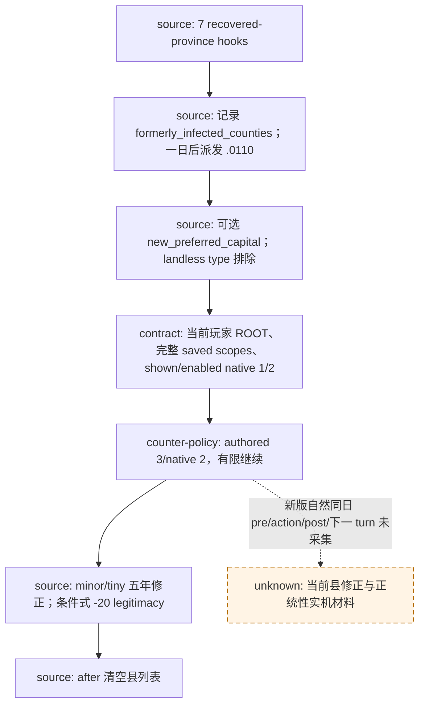

# CK3 1.20.0.2 非战争事件：源码迁移与后台接线

本包接续 [2026-09-30 非战争交接](../handover/2026-09-30-nonwar-maintainer-vacation-handoff.md)，只读冻结 EXE、原版脚本与历史 artifact，并运行离线生产消费者。没有启动、连接、暂停或操作本地 CK3；没有运行自然事件等待 worker，CE1 私有近邻观察开关继续默认关闭。

## 实际问题与迁移方式

交接 master 的通用 vanilla registry 有 195 条记录，`registry.py`、`source_index.py` 与若干窄 policy 分支只接受 CK3 1.19.0.6。旧 `.0110` 还把旧 epidemic source SHA 当作 optional-capital 投影的身份，stress 图标 consumer 的 coverage 也固定为旧版本。把 EXE 常量改成新版会错误地把旧 live exemplar 和旧效果预测一起改名。

现保留旧 195 表、旧索引、旧观察与底层查询的旧版默认值，另增 1.20.0.2 的 source-index、源码差异账本和 current-build 消费组合。生产 event policy 从当前原生 context 的 `provenance.backend_id=ck3-1.20.0.2-native-event-window-v1` 选择新版记录；显式 `ck3_build` 也可用于离线回放。MCP 的 knowledge/list/source-provenance 入口默认当前版本；历史 portable evidence list/read 保留其实际 1.19 身份。来源查询和 discovery 接受两个版本，新版 discovery 不把旧 observation 或旧 portable keys 计入当前 live 数。

| 身份 | 值 |
|---|---|
| 当前版本 | `1.20.0.2 / steam25588574` |
| 当前 EXE SHA-256 | `AE1BA6FF060BA603842F6F4A2DED0AF4B7D3666B3DD271F75FB01B0DA8E81B2D` |
| 旧版本 | `1.19.0.6 / steam23530548` |
| 旧 EXE SHA-256 | `2D00FF3101EF70B566F2FCBAE292F09263199C80E9DC8F139B82D7D96F83DB86` |
| 当前 source-index | 192 个唯一定义、72 个定义文件、535 个 lexical caller candidate、82 个 candidate 文件；缺失与歧义均为 0 |
| 当前 source-index dataset SHA-256 | `BF4ADC6FEE5742B1E57F0768E2BE120113E9176D4A8FABAA3BF30EB42FB22DF8` |
| 当前源码消费资格 | 192 个有界继续契约可消费；source contract adaptation pending 为 0；这是 `static-ready`，不是 192 个 live |
| compatibility dataset SHA-256 | `B261172AD03B306251A6ED5B03F905EFF951FEC89FAD36C67E616C6C4EF40857` |
| compatibility 文件 SHA-256 | `075D18610715E4B18B0CFE6353656ADB366A7B01E57F630A37FD635E78F2A564` |
| 既有切片未覆盖 | `fervor.1002`、`court_chaplain_task.0313` 尚待对应源码契约/观测施工；2026-10-02 全面宗教授权已撤销旧排除理由。`great_holy_war.0011` 的战争执行仍受当前战争开关和停止战争研究的约束 |

索引只证明 token 所在文件、行号与字节身份，caller candidate 不等于已证明的原生日程或执行边。本文的源码复用结论也不提升 [新版通用 event/window 迁移验收](ck3-1.20.0.2-r3-capability-comparison.md) 以外的自然事件实机资格。

## 原版变化与当前消费边界

192 个定义中，60 个 ordered-token body 完全不变，132 个发生变化；原版文件整体 SHA 改变不能据此认定每个事件都不兼容。变化主体是 `stress_impact` 改为 `stress_and_fulfillment_impact`，以及新规则条件。差异账本逐条区分完整 body 变化、当前弹窗的 scope/option 投影、所选有限继续路线和效果预测。

132 个变化定义已逐条审阅。其中 126 个保留显示窗口中的原有有限继续路径；另外六个的实际 current-only 契约更新如下。旧版契约没有被覆盖，原生 shown/enabled 判定仍是选项可用性的输入。

| 变化事件 | 新版真实变化与消费修复 | 仍未声称的能力 |
|---|---|---|
| `birth.1003` | native 0 使用单胎／双胎动态文本，native 1 已是 suppressed-bastardy alternative。父亲为玩家的现有路径统一选 native 0，支持 source 中可选 `child_2/child_3`，以及显示 native `(0)` 或 `(0,1)` 的形状 | 新 childbirth reward／条件式 adoption 的完整结果或 utility；新出生实机 |
| `culture_notification.1111` | `new_tradition/lost_tradition` 由可选 random-tradition 分支保存。五个基础 scope 加零、一、两项共四种精确集合；新增项类型为 `culture_tradition`，继续非 founder native 1 ACK | tradition stable-key identity、新版 paused frame、文化改革策略 |
| `char_interaction.0232/.0240/.0251/.0370` | 保留 inherited `actor`，添加实际 `puppet_or_actor` sender。现有普通 sender 与 actor 相同的路径可继续，nullable secondary role 保留 unavailable；不把 `actor` 全局重命名 | distinct puppet 的新角色关系、该类操作的 material outcome |

`culture_tradition` 的类型名由 exact-build GenericValueTypeRegistry 注册链闭合：RVA `0x444880` 初始化 interned identifier `0x37FE`，`0x3796120` 写 type slot `0x2D`（45），名称通过当前 event decoder 使用的 resolver 链 `0x3796230 → 0x3F4F900` 解析。`tradition` 是 iterator 关键词，不是该 registry type name。静态证据 `artifacts/nonwar-offline-1.20.0.2/events/culture-tradition-scope-static.json`，SHA-256 `7a0ac00f8da371e4cf6f10c4266f02f1b4742b99e0bee4fbd6339c63381dac45`。production decoder 仍只对 character 解 typed identity，其余 culture/tradition payload 保持 opaque。

### `.0110` 疫后重建

原版当前链仍是：七种疫病的 recovered-province 回调 → `plague_recovery_event_effect` 记录旧疫县和领主 → 一日后 `.0110` → 玩家选项 → `after` 清空旧疫县列表。十三个窄 value/effect/trigger/modifier 块和七个 recovered-province hook 已从新旧脚本直接比对。

新版的具体变化是：首都候选检查排除 landless-type title，并把 `title_capital_county =` 改成可选访问 `?=`；`new_preferred_capital` 仍是可选 scope。native 2 由直接 `has_legitimacy` 判定改经 `add_legitimacy_effect` / `is_valid_for_legitimacy_change`，要求仍在世、已落地的领主、有王朝、伯爵或以上，且非共和国/神权制。`miniscule_legitimacy_loss=-20` 未变，但它是有条件的 authored 值。

沿已有显示 native `(1,2)` 的投影，仍只选 authored 3/native 2：不花金钱、不迁都，重大及以上给五年 minor 恢复，否则给五年 tiny 恢复。该有限继续策略不声称全球最优，也不开放未单独验过的 native `(0,1,2)` 投影。

交接中 CE1 近邻 observer 已有的动作前冻结县 ID、动作后按显式 ID 读取的设计继续有效，因为 `after` 仍会清空列表。但旧 observer ABI 不能仅凭这些源码结论改名为新版本实测；没有本次自然场景，没有县修正续期证据，旧十五日 legitimacy 差值仍不具有独占因果。详见 [原 `.0110` 账本](epidemic-events-0110-recovery.md)。

### stress 与 fulfillment

新版冻结 EXE 的原生效果说明明确：`stress_and_fulfillment_impact` 保持 base 与匹配 trait 的 stress 输入求和，同时根据角色的 sinful/virtuous trait 行为增加 spiritual fulfillment。旧 stress-only profile 因而不能直接声称新版本的完整效果集合或完整 utility 等价。

当前组合仅在已核对的具体源值/所选分支上保留窄 stress、gold 或 prestige 物质观察 profile；其余旧预测放入明确的 legacy 字段。`death_management.1007` 的 stress 分支新增 opaque grief-immunity gate，不能保留旧无条件 stress 变化断言。此处只记录通用事件效果的新维度，不探索通用宗教系统。完整来源和字节证据见 [stress/fulfillment 源码专题](event-stress-and-fulfillment-1.20.0.2-source-review.md)。

### prison notice

`prison_notification.0001/.2001/.2002` 的 authored body 不变。当前 typed ROOT 和四个 authored role 的核对继续使用，允许 unrelated inherited scope 留在原始记录中。确认唯一 native 0 只处理通知本身，不把窗口消失或 ACK 写成囚禁/释放材料成功。

## 离线验证与仍需实机的项

新测试直接回放生产 policy：当前 `.0110` 两种既有 optional-scope 形状、native 投影 drift、当前 prisoner role 绑定、birth 的新选项含义、四类 interaction 的新 sender／nullable role、culture 的四种 optional-tradition 集合，以及双版本 knowledge/provenance 与 discovery 的 live 计数分账。旧 registry/policy 和 replay 工具联合检查为 **61 passed、62 subtests passed**；新增三条 current-build 工具回放夹具后，当前聚焦文件为 **9 passed**。源码提取器的字符串引号／注释／转义／token 次序、自哈希、192 个非暂缓定义、`.0110` 窄依赖及 grief 条件保留检查为 GREEN。

工具回放夹具提供 `.0110`、双胎 birth 与双 tradition 通知的 synthetic context 和显式 snapshot 绑定，使用生产 policy/outcome；没有提供 action receipt 或真实 after-state。三例都返回有限推荐，而 material plan 明确为 `material_postcondition_not_supported`。回放指纹同时绑定 Python 代码、当前 source-index 和 compatibility 数据，不能将新的完整效果预测凭空填入。机器输出：

- `artifacts/nonwar-offline-1.20.0.2/events/production-event-policy-replay.json`，SHA-256 `a1b52c9b06f443ef5d8af1fa71a177e0deef9bc734c393f8a1616f086aaa695b`。
- `artifacts/nonwar-offline-1.20.0.2/events/source-comparison-validation.json` 与 `source-compatibility-generation.json` 留下最终数据身份、源码分类和窄依赖检查结果。
- [可再回放 fixture](../../ck3_autonomous_player/tests/fixtures/vanilla_event_migration_12002_replay.json)，SHA-256 `28286d277282145bb258115f811346d370b876e5284658455c83c17b1337bb50`；不是历史 live bundle。

当前包的资格为 `static-ready`。下一次占用 CK3 只为新版真实普通继续现场中的自然事件材料及 CE1 私有 observer ABI/加载验收；自然阳性未出现时不专门挂等待 worker，不重跑旧查询和同一材料。Robert 的 3153/36524 游戏日、G2 3/8、M2/M4/M5 边界保持交接事实；本包没有新增日期、typed event 动作、婚配或新存档。

源码与再生成入口：

- [双版本 registry](../../ck3_autonomous_player/src/xar_autoplayer/vanilla_events/registry.py)、[current-build 组合](../../ck3_autonomous_player/src/xar_autoplayer/vanilla_events/migration_1_20_0_2.py)、[production policy](../../ck3_autonomous_player/src/xar_autoplayer/vanilla_events/policy.py)。
- [source-index 生成器](../../tools/gen_vanilla_event_source_index.py)、[源码差异提取器](../../ck3_autonomous_player/native_bridge/research/ck3_12002_nonwar_event_sources.py)、[离线生产回放](../../tools/replay_vanilla_event_research.py)。
- [当前 source-index](../../ck3_autonomous_player/src/xar_autoplayer/vanilla_events/data/source_index_1_20_0_2.json)、[compatibility 数据](../../ck3_autonomous_player/src/xar_autoplayer/vanilla_events/data/source_compatibility_1_20_0_2.json)、[聚焦消费测试](../../ck3_autonomous_player/tests/unit/test_vanilla_event_migration_1_20_0_2.py)。
- [逐事件 source review 与 current-only 契约更新账本](../../ck3_autonomous_player/src/xar_autoplayer/vanilla_events/data/source_compatibility_reviews_1_20_0_2.json)。
