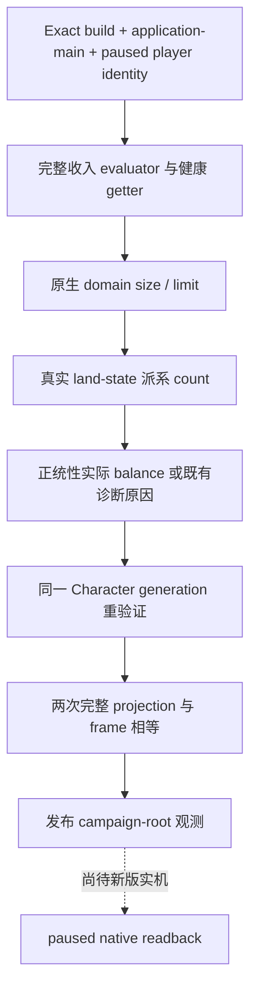

# CK3 1.20.0.2：campaign-root 收入、健康、直辖与派系观测迁移

本包为 **static-ready**。它把非战争整局策略所需的收入、健康、直辖容量与针对玩家的派系数量接到新版实际 native getter，并保留正统性的既有诊断字段。没有使用本地 CK3 进程、管道、桌面、存档或 userdir；新版 paused application-main 读回仍待后续统一实机验收。

这是一组当前状态观测，原生 AI 决策树为 N/A。没有修改收入策略、健康策略、宗教策略或 AI 行为。它服务于 [非战争维护交接](../handover/2026-09-30-nonwar-maintainer-vacation-handoff.md) 与 [完整一代人的阻点账本](../autonomous-agent-progress/one-generation-blocker-ledger.md)。旧版本的字段定义见 [月收入](player-monthly-gold-income-v1.md) 与 [campaign root](campaign-root-context.md)。

## Exact build 与定位方法

冻结 CK3 `1.20.0.2 Crozier`、Steam build `25588574`；EXE 为 `101039736` bytes，SHA-256：

`AE1BA6FF060BA603842F6F4A2DED0AF4B7D3666B3DD271F75FB01B0DA8E81B2D`

输入为 `artifacts/migrations/2026-09-30/post-update-1.20.0.2/installation/binaries/ck3.exe`。所有 RVA 相对于模块基址。

先比较旧 build 的 getter 与新 build 候选，再核对新版反射注册名、callback thunk 与实际调用。收入的大函数入口经过重写，旧 signature 直接匹配失败；最终从已迁移的 `top_liege` 调用者定位，核对四参数寄存器、完整收入 evaluator 的调用以及输出指针返回，未采用旧址的固定增量。Domain size 在新 build 中内联了原来的 title predicate，必须调用整个函数，不能拿 held-title 数量冒充直辖数量。

| 数据 | 旧 RVA | 新 RVA / 布局 | 静态闭合证据 |
|---|---|---|---|
| authoritative monthly gold income | `0x28DBE90` | `0x2BCA960` | 四参数 ABI、Character kind/ID/death 判断、`top_liege 0x28BFDA0`、完整 evaluator、输出指针返回 |
| current health | `0x2619AD0` | `0x28C6500` | `GetHealth` 注册 `0x55DDC0` → thunk `0x28CFE60` → native getter；extension `Character+0x1B0`、health leaf `+0x2F0` |
| domain size | `0x260BA50` | `0x28B7200` | `GetDomainSize` 注册 `0x55FF70` → thunk `0x28D0440`；逐标题 generation 检查、原生省份与 holding/government predicate |
| domain limit | `0x260BA20` | `0x28B71D0` | `GetDomainLimit` 注册 `0x560270` → thunk `0x28D04C0`；land-state `+0x3D8` 与原版最小值一 |
| targeting faction count | trigger `0x283FAE0` | trigger `0x2B250D0`；`Character+0x1C0 → land_state+0x12C` | Character full-generation 解引用、目标派系 vector `+0x120`、count `+0x0C`；空 land-state fallback 的静态 count 确认为零 |
| legitimacy diagnostic | `Character+0x1C0 → +0x28` | `Character+0x1C8 → +0x28` | `GetLegitimacy` 注册 `0x568050` → thunk `0x28D2C50`，直接读取相同 Q100000 balance |

月收入与健康仍为 signed Q100000；负月收入与负健康都是可发布的实际数值。完整月收入 evaluator 接收 `(output, character, nullptr, nullptr)`，健康 getter 接收 `(character, output)`，二者都必须返回调用方的输出指针。历史实机已证明收入缓存叶可滞后，因此缓存叶不参与本包的发布或 readiness equality。

Domain size 要求 `>=0`，domain limit 要求 `>=1`。派系的合法空 land-state 返回实际零；无法读取 land-state 或非空对象的 count 时返回 unavailable，不能用零补齐。

`GetLegitimacy` 的 UI thunk 会把缺失及负值折成零；既有 campaign-root 诊断合同继续区分这些情况：`data_pointer_unreadable / data_absent / balance_unreadable / balance_invalid`，只发布实际非负值。实际零 balance 为 available。这一 optional diagnostic 不改变 campaign-root readiness。

## 实现与边界

新 helper 位于 `ck3_autonomous_player/native_bridge/include/xar_bridge/ck3_12002_nonwar_metrics.hpp` 与 `src/ck3_12002_nonwar_metrics.cpp`：

- `BindNonwarMetrics12002` 只绑定四个新版 native 函数，不修改 enclosing reader 的 exact-build admission。
- `ReadNonwarMetrics12002` 从已解析的 played Character 取得五项 required metrics 与 legitimacy diagnostic；callback 缺失或实际读取失败会返回具体失败原因。
- `NonwarMetricsProjection12002` 参与 enclosing reader 的既有两次采样相等比较。played Character 的 full-generation revalidation、paused frame 与 application-main 检查继续由 enclosing campaign-root reader 执行。

本 helper 本身不新增 MCP schema，不选择策略，不接受人物 ID，也不执行任何游戏动作。最终发布入口由 campaign-root 集成包统一绑定；不能把这一独立 fixture 当成新版 native paused readback。

## 离线验证与 artifact

`research/ck3_12002_nonwar_metrics_abi.json` 冻结 **13 段代码、39 条指令与 5 项字面值**，包括四个反射名称和空 land-state 的实际零值。`research/verify_ck3_12002_nonwar_metrics.py` 在冻结 EXE 上退出码 `0 / GREEN`，`live_verified=false`。

MSVC C++20 `/W4` 独立 helper 编译成功，实际测试 executable 通过。它覆盖新版布局（旧 land offset 放置错误 sentinel）、负月收入/健康、空 land-state、直辖最小值、output-pointer 合同、实际读取失败，以及 legitimacy 的正值、实际零、缺失、负值与不可读诊断。测试用受控 memory callback 与 native ABI callback，不接游戏。

静态证据目录：`Z:/ck3_mod_rewrite/artifacts/offline/2026-10-01/nonwar-metrics-12002/`：

| artifact | SHA-256 |
|---|---|
| `disassembly.json` | `0AEC02103763ABF5790F3AAF838C4F4C98ABFFB41BE78DCAB8CA712E84B09394` |
| `nonwar_metrics12002_test.exe` | `D046E2E7CCE9F0E804B13F60003E0CC4BFEF9589EB4A0D265FE92B60E602773B` |
| ABI manifest | `5F21A23F2196777B91B06FB971785C13F6AACE322AEB9C8B38A3990D811124A8` |

`verification-result.json` 记录 source hash、真实 standalone 测试退出码与无游戏访问边界。`compile-and-bare-path-harness-red.log` 保留首次编译后的裸 executable 名称查找失败；随后绝对路径调用成功。它是 cmd harness RED，不能记为 native capability RED，也不能丢弃失败记录。

父工作包随后把 helper 与完整 campaign-root reader、serializer、held-title/council helper 一起编译，并通过 **15 组**完整新版布局的生产读取/序列化 fixture。统一凭证目录为 `Z:/ck3_mod_rewrite/artifacts/nonwar-offline/2026-10-01/campaign-root-12002/`，由父工作包保存编译结果、上述独立 verification receipt 与 Python transport 交接材料。独立证据目录同时保留 `abi-verifier-result.json` 的实际命令、工作目录和退出码。

状态仍为 static-ready / live pending。后续只剩新增观测面的新版 paused 实机互证；收入、健康、直辖和派系策略仍须按各自原生输入与真实 outcome 另行验收。
