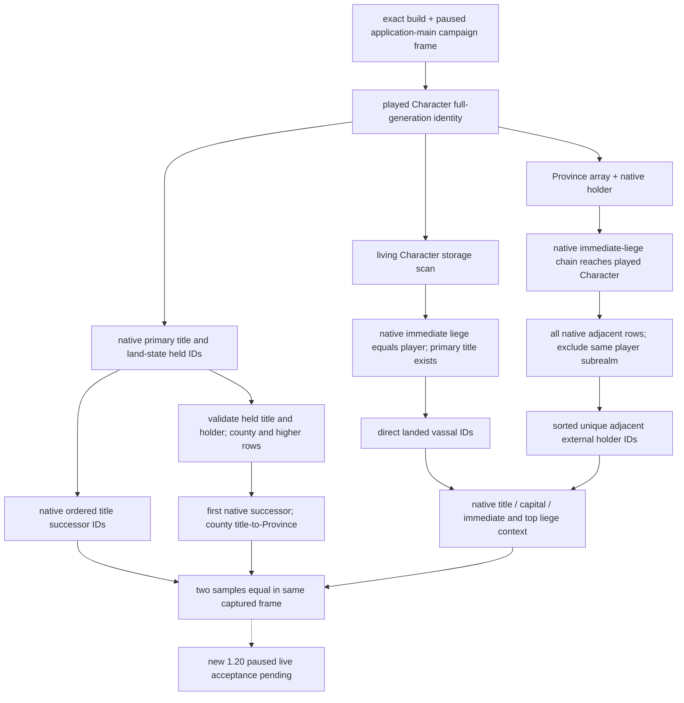

# CK3 1.20.0.2 非战争领地、继承与人物关系观测

2026-10-01 后台施工。本次只读取冻结 EXE、已有原生 ABI 和离线内存 fixture；没有启动、检查或连接本地 CK3 进程。新观测字段的等级为 `static-ready`，须在下一次获准实机时以 paused snapshot 验收后才能升级为新版 live。

本工作承接 [非战争维护者交接](https://github.com/XenoAmess/ck3_eternal_recurrence/blob/46ca368cebfaff64cf09c29dd6d8b0de206c661c/docs/handover/2026-09-30-nonwar-maintainer-vacation-handoff.md) 的继承、领地和人物关系输入，扩充已有 `query-campaign-root-context-v1`。本次没有创建新策略；完整 native AI 决策树仍分别见 [继承与法律](laws-contracts-and-succession.md)、[持有头衔分割](held-title-partition-v1.md) 和 [campaign root](campaign-root-context.md)。这里冻结的是这些树依赖的观测来源，不声称实现一般继承法预测。

## Exact build 与原生来源

游戏版本 `1.20.0.2 Crozier`，Steam build `25588574`，EXE 为 101,039,736 字节，SHA-256 `AE1BA6FF060BA603842F6F4A2DED0AF4B7D3666B3DD271F75FB01B0DA8E81B2D`。

| 输入 | 1.20.0.2 来源 | 对照旧版的变化 |
|---|---|---|
| 角色 land state | `CCharacter+0x1C0` | 原 `+0x1B8` |
| 持有头衔 ID 列表 | land state `+0x1E0` data、`+0x1E8` capacity、`+0x1EC` count，ID 步长 4 | 列表内部布局未变；容器入口移动 |
| 头衔 identity、template、tier | `LandedTitle+0x10`、`+0x48`、template `+0x64` | template 原 `+0x160`，tier 原 `+0x5C` |
| 头衔持有人 | `LandedTitle+0x128` | 原 `+0x258` |
| 原生继承顺序 | 头衔 `+0x150` data、`+0x158` capacity、`+0x15C` count，CharacterID 步长 4 | 原 `+0x278/+0x280/+0x284`；不能按持有人偏移差推算为 `+0x148` |
| 县首府 Province | 原生 `0x230F900(Title*) -> Province*` | 原 `0x20B6B20`；沿原生县下级头衔读取最后的 `title+0x338` |
| Province 持有人 | 原生 `0x247D030(Province*, int32_t*) -> int32_t*` | 原 `0x220C3F0`；优先 `Province+0x73C`，否则 `+0x738` TitleID，男爵领父头衔 `+0xE8`，最终 holder `+0x128` |
| Province 图邻接 | Province `+0x08` map node；node `+0x50/+0x5C`；行步长 `0x30`，kind `+0x00`、目标 ID `+0x04` | 复用已冻结的新版本 routes 布局 |
| 角色死亡与 generation | `Character+0x1D0` death pointer；identity `+0x18`；storage ID 低 24 位索引、slot 步长 16、对象 `+8`，完整 ID 相等 | 死亡指针原 `+0x1C8`，其余 storage 契约保留 |

持有头衔 native enumerator `0x2BB11E0` 直接读取 `Character+0x1C0`、land state `+0x1E0` 和 4 字节 IDs，再通过新 title storage 校验完整 generation；其 tier 判断在 `0x2BB127C/0x2BB1280`。stock My Realm 的首继承人展示在 `0x12435F3` 检查 `title+0x15C`，在 `0x1243604/0x124360B` 读取 `title+0x150` 的第一个 CharacterID。头衔析构在 `0x2308BE6/0x2308BF2/0x2308BF9` 对应清理 count、data 和 capacity，使用元素大小 4 的 allocator，闭合整个继承向量布局。

## 只读投影逻辑



`NonwarRealmProjection12002` 输出五组真实字段：`primary_title_succession_character_ids`、`held_title_partition`、`direct_landed_vassal_character_ids`、`adjacent_external_province_holder_character_ids`、`related_character_contexts`。它由 campaign root 在同一暂停帧读取两次，整个投影参与 equality。全部字段读取成功后才交付，已有 unavailable reason 沿用原 wire 契约。

持有头衔的 barony 仍验证 holder 与 generation，再按原 stock My Realm 展示语义排除；county 及更高层级按 title ID 排序。每一项 `first_heir_character_id` 来自该头衔原生继承向量首项；原生合法空向量表示没有继承人。更高层头衔没有合成 capital Province。county 通过原生 title-to-Province 读取。

直辖封臣只纳入当前 Character store 中 generation 有效、存活、native immediate liege 恰为玩家且有有效 primary title 的角色。边界 holder 根据每个 Province 的原生持有人以及原生 immediate-liege 链判断玩家子领地，然后读取所有原生邻接种类 `0..3`，排除玩家子领地内的目标持有人，发布排序去重的外部 holder ID。

`related_character_contexts` 为上述两组角色读取原生 primary title、capital、immediate/top liege，并验证其角色仍满足原来关系条件。Crozier 的 native capital resolver 可能返回 canonical no-Province 对象；该对象的 Province tag 不为 `0x50726F76`，依照现有新版本 campaign root 的原生 sentinel 语义发布首府缺席。这不是用 `null` 替代尚未读取的真实首府。

faith、宗教系统、holy order 均不在该查询中。邻接角色的不同 top liege 身份只作为 opaque realm identity；这里不计算宣战合法性、继承法改变或行动分数。

## 文件与验证

实现：[header](../../ck3_autonomous_player/native_bridge/include/xar_bridge/ck3_12002_nonwar_realm.hpp)、[reader](../../ck3_autonomous_player/native_bridge/src/ck3_12002_nonwar_realm.cpp)。冻结 ABI：[manifest](../../ck3_autonomous_player/native_bridge/research/ck3_1_20_0_2_nonwar_realm.json)、[PE verifier](../../ck3_autonomous_player/native_bridge/research/verify_ck3_12002_nonwar_realm.py)。原有 DTO 与两次读取的调用方继续由 `ck3_12002_campaign.cpp` 管理。

```cmd
tools\.venv\Scripts\python.exe ck3_autonomous_player\native_bridge\research\verify_ck3_12002_nonwar_realm.py --exe artifacts\migrations\2026-09-30\post-update-1.20.0.2\installation\binaries\ck3.exe
```

2026-10-01 静态 PE 核对通过：25 条实际指令与字节完全匹配，26 个实现常量匹配；持久报告 `artifacts/nonwar-offline/2026-10-01/campaign-root-12002/realm-pe-verification.json`，`local_ck3_used=false`、`live_verified=false`。父工作包把旧版完整 campaign fixture 适配为已证新 offset 与原生 callback ABI，MSVC C++20 `/W4 /DNOMINMAX` 的 15 组整合 fixture 全部通过，其中覆盖真实持有头衔、继承顺序、直辖封臣、相邻 holder 与关系投影，及 malformed successor / holder 的失败边界。统一结果与实际 native wire 在同目录 `result.json` / `native-campaign-wire.json`；最终提交由协调者汇入当天日报、W40 周报及本轮交付文档。

下一次实机只需验证已完成的查询：暂停下 primary-title successor 顺序、每个 held title 首继承人、直辖封臣、相邻外部 holder 及其原生首府／liege 投影。无需先改变任何策略或创建新的游戏动作。
