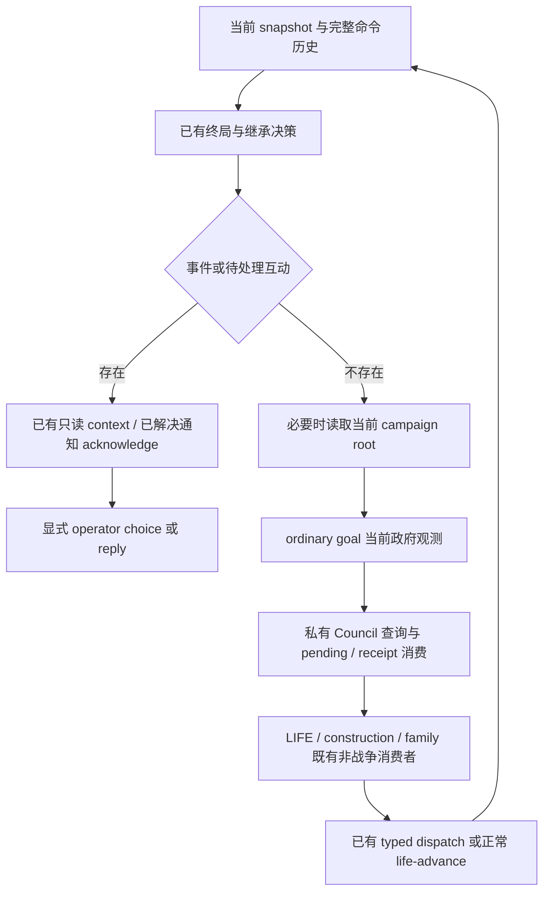

# CK3 1.20.0.2 非战争生产规划模式

2026-10-01 增量。项目所有者要求继续 G2 功能施工，同时停止战争研究和主动战争操作。`--nonwar-only` 是这个工作模式的显式入口；没有该参数时保留原公共工具及 runner 的默认合同。当前源代码接线与生产夹具验证为 **static-ready**，新冻结运行树中的 paused 验收由唯一实机 owner 执行。

## 正式入口

- MCP CLI：`xar-ck3-mcp --nonwar-only ...`。`ck3_plan_turn` 调用 `GameplayBridgeService.plan_nonwar_turn()`；`ck3_auto_turn` 调用 `auto_nonwar_turn()`。
- 有界 runner：`native-auto-run --nonwar-only ...` 使用同一生产服务。`--allow-private-government-runtime-adapter-query` 把已有只读政府许可交给实际 driver；默认关闭。普通战役目标需要的当前政府观测不会仅因 MCP 曾开启过许可而自动继承到 runner。
- Council 沿既有 MCP `--private-council-action` 许可使用私有查询、任命与回执，不添加不存在的公共 Council capability。
- 独立 Sway 材料观测：`--private-active-scheme-sway-outcome-opinion-query` 发布只读工具 `ck3_query_active_scheme_sway_outcome_opinion_private_v1(expected_revision, target_character_id)`，默认关闭。原生 selector 为 `query-sway-outcome-opinion-v1-private`。

## 每轮实际行为

新规划器不调用 `choose_one_life_turn`、战争 core 或 M5 collector。`active_wars` 仍来自实际 snapshot 并保留在计划里；正常引擎时间推进仍可能改变战争状态。事件与互动保持真实原生 ID，通过已有 context 口读取；需要语义选择时由 operator 显式处理，不进入旧 Raiktor 或战争回复决策。死亡、结算、匹配继承的原决策提取为共用 helper，两个模式复用同一实现。

Council 使用 `private_council_formal_consumer_v1`。提交前后 ledger 分别记录 `submission_unresolved` 与 `receipt_pending`；同帧 ACK 不算 applied，也不会重提。确认 pending 后可正常推进到独立帧，再读取原生 receipt 与当前 holder/task。后续计划再次独立读取 root 与 final gates，只有实际 holder 仍一致才设置 `council_receipt_consumed.next_turn_consumed`。R10 的真实现任 33433 stewardship 15，高于最佳合法替代者 32716 的 11，因此读取结果为 `NO_CHANGE`，不为证明动作而换差的人。

普通战役每次以当前 actor、date、native revision 的政府查询构造 `plan.campaign_government_context_used`。完整 44 feature、adapter verdict 与 provenance 被保留。OFF 零查询；查询错误留下类型与原文，基础规划继续。继承后不会缓存前任政府。观测可用与 core adapter 可用分别记录，不能据此把尚未实现的政府 family 宣称为完整策略。

Sway 查询读取目标对玩家的总意见、`scheme_sway_opinion` 和 `sway_blocker_opinion` 的 observed/present/value。合法零值与缺席的 null 分开；它不需要事件窗口，也不证明 phase、terminal outcome 或材料变化的因果归属。

## 验证和剩余工作

新增生产验证：非战争 service / public MCP 8 cases、政府 service 3 cases、有界 runner / CLI 2 cases，以及两份真实 C++ Sway完整 packet 的组合官方 SDK 1 case。Council 与政府域先前的专有 leaf 验证直接复用。测试使用文件夹具与内存 endpoint，未接触 CK3、真实 pipe、桌面、Steam 或 Git。

一次 CLI harness 误导入旧 unittest class，导致 pytest 意外收集旧测试；旧 feast 夹具 identity 的 RED 保留在 `artifacts/g2-offline-2026-10-01/python-routes/nonwar-native-auto-run-cli.json`，没有扩大为本增量的旧域修复。随后改为模块引用，最终只执行两个新增 case。新代码的必要用例通过后不重复旧矩阵。

完整证据与源清单由 `artifacts/g2-offline-2026-10-01/python-routes/NONWAR-SERVICE-R11-SHARED-READY.json` 汇总。剩余为新冻结 source/DLL 配对、paused 正式非战争推进、普通战役当前政府消费与后续独立 checkpoint/cold 验证。夹具成功不替代这些实机结果，也不增加 G2 complete 计分。
