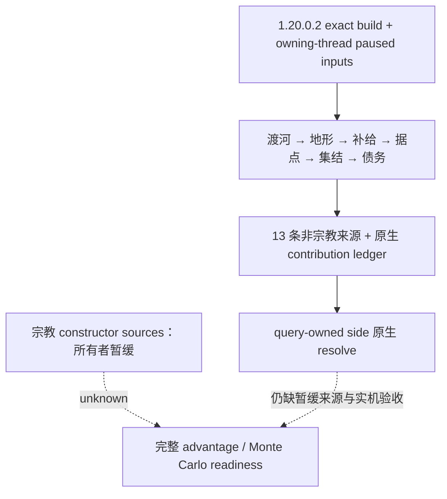

# CK3 1.20.0.2：战斗优势构造的非宗教迁移

本包已完成离线 `static-ready`：从新版 EXE 闭合地形、渡河、补给、据点防守、集结、领主债务和财政债务的原生选择器及数据布局，实现对应 13 条 constructor source 的读取、阶段顺序、每阶段钳位和原生 ledger 投影。未接触用户当前游戏，未做注入、进程读取或实机验收。

精确构建：`1.20.0.2 (Crozier)`，Steam build `25588574`，EXE SHA-256 `AE1BA6FF060BA603842F6F4A2DED0AF4B7D3666B3DD271F75FB01B0DA8E81B2D`。证据固定在 `artifacts/migrations/2026-09-30/post-update-1.20.0.2/installation/binaries/ck3.exe`；ABI 清单位于 [ck3_1_20_0_2_phase_advantage.json](../../ck3_autonomous_player/native_bridge/research/ck3_1_20_0_2_phase_advantage.json)。

## 新版调用链与布局

原生开战构造调用点 `0x247A9CF..0x247AB22` 先追加渡河与地形，再调用 `0x2586ED0` 追加补给、据点、集结、债务等来源。所用 PhaseEffect DB getter 为 `0x8FC3E0`，与 men-at-arms type DB getter `0x899E40` 是不同数据库。

| 来源 | 新布局 / 调用点 | 迁移证据 |
|---|---|---|
| attacker / defender adjacency | DB `+0xF70` / `+0xFA0`，每项指针 8 字节 | `0x247A9CF` / `0x247AA34` |
| 攻方忽略渡河惩罚 | modifier aggregator `+0x68`，flag ID `0x1A4`，predicate `0x23037B0` | `0x247AA84..0x247AA92` |
| 地形攻方 / 守方 effect | terrain `+0x48` / `+0x50` | `0x247AAC4` / `0x247AAED`；旧 `+0x40/+0x48` 不可沿用 |
| supplied / running low / starving | DB `+0xF20/+0xF30/+0xF40`，selector `0x25870B0` | `0x2587395..0x25873AF` |
| 据点防守 | DB `+0xF10`，province modifier ID `0x1EB` 与 holding modifier ID `0x1D6` | `0x25874CB..0x258753B` |
| 集结优势来源 | DB `+0xF00`；primary CArmy `+0x5C != 0` | `0x2586F85..0x2586F9E` |
| 领主 debt | DB array `+0xFD0`，count `+0xFDC` | `0x25876AE..0x2587764` |
| treasury debt | DB array `+0x1078`，count `+0x1084` | `0x258785A..0x25878E1` |
| no-income effect | DB `+0xF60`；当 selector 等于对应 array count 时选择 | `0x258773F` / `0x25878BC` |
| effect 身份 / advantage points | inline magic `uint32 +0x38 == 0x4744624F`，points `int32 +0x40` | `0x247A9D7`、`0x2586CA3`、`0x2587764`；不使用旧 vslot 布尔判定 |

新版依然有两种独立的“集结”输入。战斗侧与 dynamic advantage 使用 CArmy `+0x1D0`，而 constructor gathering effect 使用 CArmy `+0x5C`。本包保留两者差异，不能按字段名称统一成同一偏移。

补给选择按原生阈值数组 `0x5456498/0x54564A4`、CArmy supply `+0x180` 与符合原生 eligibility 的当前 regiment soldiers 统计。CRegiment 新 inline magic 位于 `+0x14`；类型值为 1 时，再读取首个 membership 的 supply unit `+0x141`。严格多于半数 supplied 时选 supplied，严格多于半数 supplied + running low 时选 running low，其余选 starving；总人数零选 supplied。读取所得 effect 必须与当前 native selector 返回的同一指针相符。

财政债务来源的新版 gate 是 government `+0x40` bit 29、character `+0x1B0`，以及 `+0x1C0/+0x1D0` realm container。最终 treasury 使用 inline `Land` magic `+0x14`、full ID `+0x10 != -1`、余额 `+0x318 < 0`，再调用 debt selector 的 mode 3。此路径仅用于战斗优势财政来源。

## 原生 ledger 的第二个字段

原生 append helper `0x2586C90` 把 effect 的整数点数乘以 Q100000 尺度，按攻守方向更新 base accumulator，并在每阶段钳位到 `[-10,000,000, 10,000,000]`。原生 ledger 每项 16 字节，存储 `{effect pointer, scaled contribution_raw}`。

这里的 `contribution_raw` 尚未按 defender 改符号。`0x2586D61/0x2586D68` 保存 effect 和乘积，`0x2586E10` 将这 16 字节复制进 ledger。它不是旧代码变量名暗示的 `scale_raw`；holding 尺度 250000、effect 5 点时，ledger 第二字段必须为 1250000。

实现位于 [ck3_12002_phase_advantage.cpp](../../ck3_autonomous_player/native_bridge/src/ck3_12002_phase_advantage.cpp)，入口 `BuildNonReligiousAdvantagePlan` 输出 `NonReligiousAdvantagePlan`。上层在自己的 query-owned native side 中分配两侧 ledger，再写 shell `+0x6C8` 的 base accumulator，并调用原生 resolve helper。该函数自身不分配 CK3 对象，不安装 hook，不提交命令。

## 诚实能力边界与验证

完整模型原来有 15 条来源；最后两条宗教来源继续保留显式 `religion_domain_deferred_by_owner`，本包没有读取对应信仰/教义字段，也没有把未采集来源当成真实零。`nonreligious_available=true` 只表示其余 13 条施工完成，`model.available=false`，原因是 `religion_constructor_sources_deferred_by_owner`。不宣称完整优势、完整 v3 或 Monte Carlo ready。

离线 MSVC `cl /std:c++20 /EHsc /W4 /WX` 编译与 [ck3_12002_phase_advantage_test.cpp](../../ck3_autonomous_player/native_bridge/src/ck3_12002_phase_advantage_test.cpp) 执行通过。fixture 覆盖新旧地形偏移干扰、scaled contribution ledger、攻守符号、holding 尺度、新 flag ID、财政债务余额 gate、native supply selector 不一致，以及同索引不同 generation 的 regiment。精确 EXE 校验通过 8 个唯一函数签名；清单另冻结 57 条审阅指令和 11 个源码常量，供统一 ABI verifier 使用。

构建与运行产物：`artifacts/migrations/2026-09-30/post-update-1.20.0.2/phase-advantage-build/phase_advantage_test.exe`；原生消费者反汇编为同目录上层 `phase-advantage-disassembly.txt`。下一项是与 phase 侧集成后，在获准的 owning-thread paused 实机窗口核验非宗教来源、native ledger 和最终 helper 值。宗教专项施工仍等待所有者解除暂缓。
