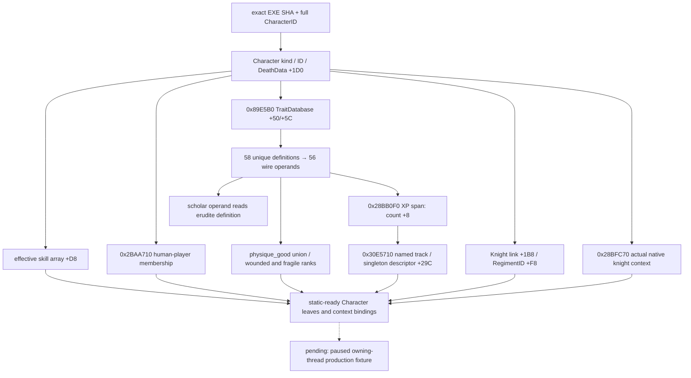

# CK3 1.20.0.2：战斗阶段角色、特质与经验迁移

2026-10-01 后台静态迁移。状态为 `static-ready`；本工作包只读取磁盘 EXE/原版数据并运行自有对象 fixture，没有读取、注入或操作正在运行的 CK3。

冻结 EXE 为 `artifacts/migrations/2026-09-30/post-update-1.20.0.2/installation/binaries/ck3.exe`，版本 **1.20.0.2 / Steam build 25588574**，SHA-256 **AE1BA6FF060BA603842F6F4A2DED0AF4B7D3666B3DD271F75FB01B0DA8E81B2D**。ABI 机器账本为 [ck3_1_20_0_2_phase_character.json](../../ck3_autonomous_player/native_bridge/research/ck3_1_20_0_2_phase_character.json)。

## 已实现入口

`xar::ck3_12002::phase_character::ReadPhaseCharacterIdentityTraits` 填写现有 `game::CombatPhaseCharacterV3` 的 alive、is_ai、martial、learning、prowess、56 个稳定 trait/group operand、wounded/fragile rank，以及 fragile、blademaster、tourney bow/foot/horse 五个 Q100000 XP；保留调用者已经填写的角色来源与其他关系字段。`physique_good` 是三个具体特质的 native presence 并集。该入口不读 faith/doctrine/tenet/religion。

调用者仍需在迁移后的 owning thread 上先解析、再回验 full-generation CharacterID，并保持同一 paused snapshot frame。这个叶子不把离线 fixture 宣称为实机能力，不注册 MCP capability。

## 实际 ABI 变化

| 读口 | 1.19.0.6 | 1.20.0.2 静态证据 |
| --- | --- | --- |
| TraitDatabase getter | `0x8318F0` | `0x89E5B0`；singleton `0x5C67528`；两个旧 getter 调用点与新 `CTraitDatabase` 构造链互证 |
| CharacterHasTrait | `0x260F740` | `0x28BB1F0`；具体 trait ID 位于定义 `+0x10`，角色 trait IDs `+0xF8/+0x104` |
| CharacterTraitTracks | `0x260F640` | `0x28BB0F0`；角色禁用标志 `+0x1A5`，XP `+0x140/+0x14C` |
| TraitTrackIndex | `0x2CAFFD0` | `0x30E5710`；descriptor rows `+0x290/+0x29C`，stride `0x650`，native string 逐项比较 |
| TraitDatabase 定义表 | `+0x68/+0x74` | `+0x50/+0x5C`；`0xC85F37/0xC85F3C` indexed read、数据库析构和 name getter 互证 |
| 六项有效技能数组 | `+0xD4` | `+0xD8`，getter `0x28B16B0`；martial **`+0xDC`**，learning **`+0xE8`**，prowess **`+0xEC`** |
| alive | DeathData `+0x1C8` | DeathData `+0x1D0`；native inline validity 为 kind `+0x1C == 0x43686172`、full ID `+0x18 != -1` |
| IsHumanPlayerCharacter | `0x28BCEB0` | `0x2BAA710`；GameData player ID array `+0x22358/+0x22364` |
| Knight regiment link | Character `+0x1B0` / link `+0xF8` | Character **`+0x1B8`** / link `+0xF8`；`0x28CC080/0x28CC0B0` |
| Knight context | `0x2613480` | **`0x28BFC70`**；native 展示函数 `0x2C06D30` 在 `0x2C06D46` 调它，随后在 `0x2C06D56` 调 `0x2C06B00` effectiveness |

技能偏移只移动了 **4 字节**，不能跟着后段角色 component 统一加 8；`0x2C06BD1` 直接读取 `Character+0xEC` 的 prowess，提供独立互证。相邻 `0x28B1650` 从 `+0xC0` 读取 base skills，不能替代有效技能 getter。

新的 Character validity 已由原生调用点内联，不复制旧的 secondary vtable bool slot。trait 定义通过 exact-build 数据库定义表和唯一 key 解析，不把新 trait vtable 的初始化函数当 bool predicate。

### XP 输出 span 的实际 count

`CharacterTraitTracks` 返回调用者提供的 16 字节 `{data, count, reserved}`，**count 在 `+0x08`**。新 EXE `0x28BB1BF` 写 `[out+8]`，空结果路径也写 `+8`。现有旧版 `combat_v3.cpp` 的 leaf 读 `+0x0C`；本包没有修改用户正在编辑的旧文件，新版模块按实际 native ABI 读 `+8`。离线 fixture 在 `+0x0C` 写入非零污染值，并确认三个 named track 和单一 unnamed track仍读出正确 XP。

### scholar 的原版改名

1.20 的 `00_traits.txt` 已无 `scholar`，改为 `erudite`；原版 `game/common/traits/trait_conversion.lookup:22` 明确写有 `scholar = erudite`。迁移后的 reader 保留既有 wire operand `scholar`，从 native `erudite` 定义读取其 presence。转换文件冻结在本包 artifact 内，源文件 SHA 与新 traits SHA 记录在 ABI 账本。

按这条显式转换、以及 `physique_good` 三个具体定义展开后，56 个 wire operand 对应的 **58 个新原版定义全部存在**。缺失或重复定义会返回读取失败，不会变成一个错误的 `false`；这是使完整 trait leaf 可用的实际迁移修复。

### Knight context 发生拆分

`0x28BFC70` 的 landed 分支读 `Character+0x1C0 → object+0x1C0 → pointer+0x28`，有效 Character 返回 liege，无有效 liege时返回当前角色。courtier 分支读 `Character+0x1B8` 的 employer full ID `+0xC8`，通过新 CharacterStorage 与 generation readback 解析；读取不到时返回原版 canonical fallback。

另一个新函数 `0x28BFCF0` 实现 strict liege 分支。部分旧 `0x2613480` 调用者改为调用它，因此不能按单一 old/new RVA 替换整批调用点。Knight 的新原生实际 consumer 明确选择 `0x28BFC70`。



## 验证与实机边界

静态验证器：

```powershell
py -3.13 ck3_autonomous_player/native_bridge/research/verify_ck3_12002_phase_character.py --exe artifacts/migrations/2026-09-30/post-update-1.20.0.2/installation/binaries/ck3.exe
```

结果为 **10 个唯一 signature、1 个 vtable prefix、25 个 instruction checks、18 个源码常量**通过。C++ 使用 MSVC 19.51.36257、`/std:c++20 /EHsc /utf-8 /W4` 离线构建并通过自有对象 fixture。

Fixture 覆盖 new skills/DeathData/knight link 的旧偏移 decoy、full-generation 与 Character kind、短/长 native string、唯一定义与缺失定义、三个 physique children、scholar→erudite 映射、互斥 wounded ranks、五项 XP、有效零 XP，以及 native span count `+8` 与 `+0x0C` 污染。

编译输出、失败的初次启动命令、成功运行输出、静态验证日志与 result JSON 保留在 `artifacts/migrations/2026-09-30/post-update-1.20.0.2/phase-character-offline/`。首次编译已经成功，初次用裸文件名启动 fixture 时被 Windows 环境的 executable search 行为拒绝；改为明确 `./phase-character-test.exe` 后通过，不涉及游戏。

下一项必要验证是新 owning thread 上的 paused Character/trait/XP snapshot，与原版 tooltip/角色字段比对；在用户允许实机验收前继续保持此工作包 `static-ready`。
