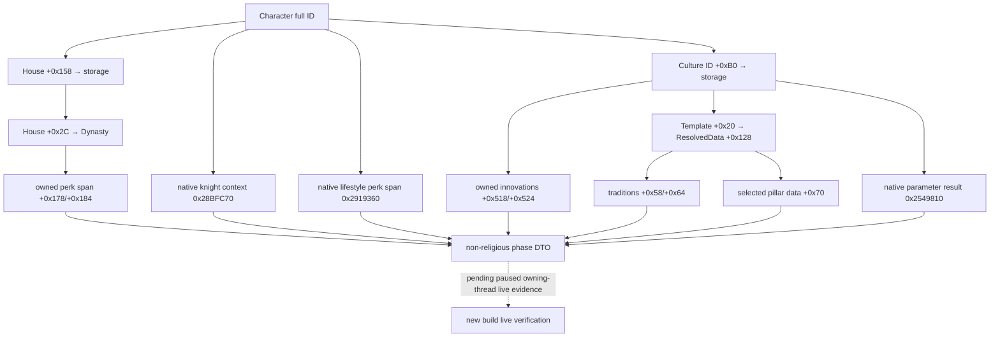

# CK3 1.20.0.2：战斗阶段文化、家族与非宗教 perk 迁移

记录时间：2026-10-01 02:00，Asia/Shanghai。状态为 `static-ready`；尚无新版本 paused live 证据。

本包只迁移既有 combat v3 的非宗教 operands：文化身份、选定 heritage、已取得 innovation、实际文化 tradition、文化 parameter、House/Dynasty 身份、战争传承和角色 lifestyle perk。没有新增策略，也没有研究或读取 faith、religion、doctrine、tenet、fervor 或 holy order。

## 固定构建与可复现入口

- 游戏：CK3 **1.20.0.2 (Crozier)**，Steam build **25588574**。
- EXE SHA-256：`AE1BA6FF060BA603842F6F4A2DED0AF4B7D3666B3DD271F75FB01B0DA8E81B2D`。
- 冻结文件：`artifacts/migrations/2026-09-30/post-update-1.20.0.2/installation/binaries/ck3.exe`。
- ABI 合同：[ck3_1_20_0_2_phase_culture.json](../../ck3_autonomous_player/native_bridge/research/ck3_1_20_0_2_phase_culture.json)，包含 **11 个函数 signature、45 个逐指令 semantic check、33 项源代码常量**。
- 实现：[ck3_12002_phase_culture.hpp](../../ck3_autonomous_player/native_bridge/include/xar_bridge/ck3_12002_phase_culture.hpp)、[ck3_12002_phase_culture.cpp](../../ck3_autonomous_player/native_bridge/src/ck3_12002_phase_culture.cpp)。
- 离线 fixture：[ck3_12002_phase_culture_test.cpp](../../ck3_autonomous_player/native_bridge/src/ck3_12002_phase_culture_test.cpp)。

所有证据来自冻结 EXE 的静态反汇编和 fixture 自有内存，没有打开或读取玩家 CK3 进程，没有修改窗口、暂停状态、存档或用户目录。

## 必须实改的 ABI 差异

| 生产读取点 | 1.19.0.6 | 1.20.0.2 | 新版本生产证据 |
|---|---|---|---|
| Character 的 House full ID | `+0x150` | `+0x158` | `0x9D56E1`，随后按 House storage 的完整 generation 解引用 |
| Character relation component | `+0x1B0` | `+0x1B8` | knight-context getter `0x28BFC77` |
| relation 的 employer ID | `+0xC8` | `+0xC8` | `0x28BFCB2` |
| House 的 Dynasty full ID | `+0x2C` | `+0x2C` | `0xC78CDB`，随后核对 Dynasty `+0x10` |
| Dynasty 的 owned perk pointer span | `+0x170/+0x17C` | `+0x178/+0x184` | `has_dynasty_perk` evaluator `0x2B203C0` |
| Character lifestyle component | `+0x1A8` | `+0x1B0` | 原生 getter `0x2919360`；其内部 perk span 仍在 component `+0x220` |
| loaded definition DB 的 pointer span | `+0x68/+0x74` | `+0x50/+0x5C` | DynastyPerk `0x2457F0A/0x2457F0E`、CharacterPerk `0x2755186/0x275518A`、Innovation `0x254255E`、Tradition `0x2FDC13A/0x2FDC143` |
| Character 的 Culture full ID | `+0xB0` | `+0xB0` | `0xC6E0FB` |
| Culture 的 owned innovation span | `+0x758/+0x764` | `+0x518/+0x524` | `has_innovation` evaluator `0x2B117C0`、parameter getter `0x2549810` |
| 实际选定 tradition span | Culture `+0x178/+0x184` | `*( *(culture+0x20)+0x128 )` 的 `+0x58/+0x64` | evaluator `0x2B12530`，`0x2B1263E..0x2B1267F` |
| 实际选定 pillar pointer data | Culture `+0x190` | 上述 resolved data 的 `+0x70` | evaluator `0x2B12490`；正常 category 为 `0..4`，`5` 是缺失项分支 |
| culture parameter | `0x22C5800` | `0x2549810` | compiled evaluator `0x2B12760` tail-call 同一 helper |
| tradition definition 有效性 | primary vtable slot 0 的旧常量真 predicate | definition `+0x38 == 0x4744624F` | evaluator `0x2B125AC` |

新版本把文化的 tradition、pillar 和部分 parameter 缓存移到 `Culture → Template → ResolvedData` 链。只改 RVA、保留旧文化偏移会读到其他成员；fixture 特意使旧偏移为空，确保实际结果来自新布局。

新 tradition primary vtable slot 0 已改成另一条调用链，因此不能继续把它作为 `bool (*)(void*)` 的有效性判定。现在直接镜像原生 evaluator 的对象种类检查。definition 的 stable key 仍是 `+0x18` 的 MSVC `std::string`；数据库存在某个 definition，不代表该文化已经持有它。

此前用 16 字节 prolog 搜索得到过 `0x2917350` 候选，完整语义检查证明它属于 accolade 逻辑，已排除；正式源码不使用它。原 `CharacterLiege` 名称对应的战斗阶段上下文 getter 实际迁到 **`0x28BFC70`**，与 phase character 包的 knight-context binding 相同。这里保持既有 wire 的 `liege/liege_house` 字段含义，没有据名字替换成另一种政治领主解析。

## 新版本 storage 与数据库

| 对象 | slot RVA | fallback slot RVA |
|---|---|---|
| Character | `0x5C67568` | `0x5C67570` |
| House | `0x5D1DAF0` | `0x5D1DAE8` |
| Dynasty | `0x5D1DE78` | `0x5D1DE28` |
| Culture | `0x5D1E2F0` | `0x5D1E2E8` |
| Innovation definition DB | `0x5D1DEE8` | `0x5D202C8` |
| Tradition definition DB | `0x5D1EB18` | `0x5D202A8` |
| DynastyPerk definition DB | `0x5D1FC00` | 本包按 loaded stable key 解析 |
| CharacterPerk definition DB | `0x5C67128` | 本包按 loaded stable key 解析 |

storage 仍采用 `+0x20` slots、`+0x2C` capacity、slot stride `0x10`、slot 中 object pointer `+0x08`。索引取 ID 的低 24 位，读取后必须核对对象完整 ID，不能把同索引的不同 generation 当成同一对象。只有合法 `-1` 才是 missing identity，解析失败返回 `false`。

只读 script identifier helper 是 `0x3F4F870`，名称回查为 `0x3F4F900`。所有十项文化 parameter 都按 stable key 解析并 round-trip；未加载或解析不匹配是读失败，不能变成 observed false。文化 parameter helper 新算法先查 resolved template 中的已整理 ID，再检查该文化拥有的 innovation 的 parameter，因此实现继续调用最终原生 helper。

## 接入与验证结果

```cpp
namespace xar::ck3_12002::phase_culture {
Bindings BindImage(std::uintptr_t image_base, std::string_view executable_sha256);
bool ReadPhaseCharacterCultureRelations(
    const Bindings&, void* character, game::CombatPhaseCharacterV3&) noexcept;
}
```

`BindImage` 只计算显式传入 module base 的地址，并绑定上述 exact SHA；没有自动查找或连接进程。调用者需在 owning thread 内先解析 Character full ID，维持原 v3 的同帧要求。函数只写非宗教 DTO 字段，已有 faith/religion 字段保持原值。

MSVC **19.51.36257.0 x64**、`/std:c++20 /EHsc /W4` 直接编译两份源码并执行 standalone fixture：**exit 0**。fixture 覆盖新模板指针链、culture 实际 ownership、House/Dynasty/employer/liege 身份、perk pointer membership、heritage、十项 parameter、同索引 stale generation、合法零 ownership、malformed span、新 tradition kind 检查、重复 stable key、合法 missing culture，以及宗教字段不被改写。输出位于 `artifacts/migrations/2026-09-30/post-update-1.20.0.2/build-phase-culture/phase-culture-test.exe`。

协调者负责把该 binding 接入 `PhaseBindings`、角色读链和总构建，并统一更新当天日报、当周周报与 commit/push。此包已经可作为完整非宗教原生 leaf reader 集成；仍需新版本 paused owning-thread 实机验证，不能把离线 fixture 当成 `fixture-live` 或 `production-live`，也不能因此宣称完整 combat v3/OODA 已完成。


