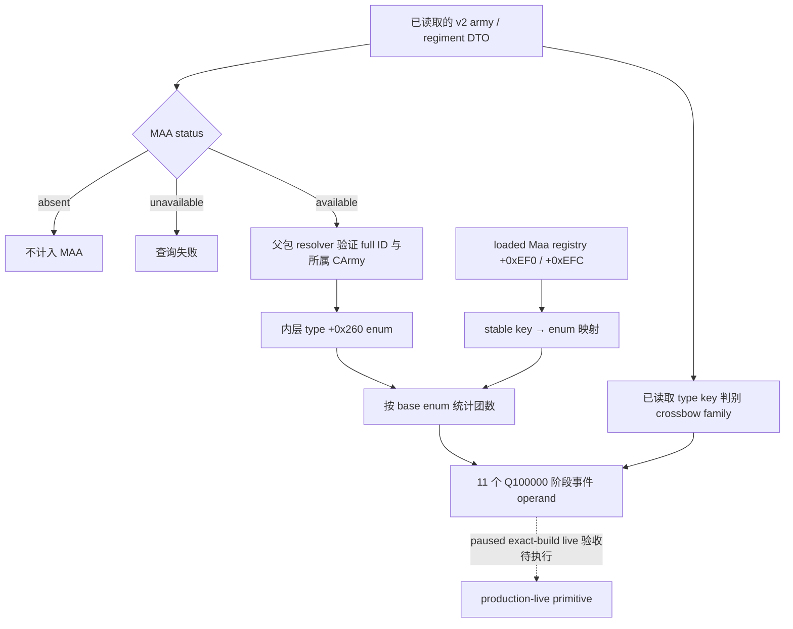

# CK3 1.20.0.2：战斗阶段 definitions、难度与兵种统计迁移

> **2026-10-03 授权覆盖：** 宗教领域已全面开放；项目所有者已撤销战争研究停止、非战争限定及 `WAR_CASH/PREWAR=OFF` 的旧授权限制，当前执行者可全面开展战争研究、实现、策略及实机运行。历史实际 OFF 状态和旧 attempt 仍按原记录保留；授权不代表开关已经开启或完整 combat v3 已就绪。罗贝尔 29829 唯一原始 campaign 入口、exact-build 绑定、原生 AI 研究优先及最小化/noFocus 实机规则继续有效。

本包冻结 EXE 为 `AE1BA6FF060BA603842F6F4A2DED0AF4B7D3666B3DD271F75FB01B0DA8E81B2D`，Steam build `25588574`。证据来自磁盘 EXE、原生消费者与本地合成对象；状态为 `static-ready`。没有读取、注入或操作正在运行的游戏，没有 paused live artifact。通用宗教领域已于 2026-10-02 全面开放研究，其只读字段与 ABI 尚需独立施工和实机验收。

代码为 `native_bridge/include/xar_bridge/ck3_12002_phase_definitions.hpp` 与对应 `.cpp`，仅用于 1.20.0.2 的候选 adapter。完整源常量、原生指令与虚表合同保存在 `research/ck3_1_20_0_2_phase_definitions.json`，可用 `verify_ck3_12002_phase_definitions.py --exe <frozen EXE>` 离线重验。

| 对象 / 查询 | 新构建绑定 | 原生证据 |
| --- | --- | --- |
| `CMenAtArmsTypeDatabase` | getter `0x899E40`，slot `0x5C67558`，vtable `0x4883908` | getter 两次读取同一 global；RTTI `0x5586BE0`；counter-class consumer `0x2653F42` |
| loaded base-type enums | data `+0xEF0`，count `+0xEFC`，stride `0x58`，enum `+0`，MSVC key `+8` | `0x30C1E12`、`0x30C1E19`、`0x30C1E20`、`0x30C1E40`、`0x30C1E8C` |
| base-type count trigger | `0x2B37AF0`：`T=*(CRegiment+0x18)`，比较 `T+0x260` | `0x2B37BA6`、`0x2B37BAE`；旧函数 `0x284D370` 比较 `T+0x270` |
| game-rule selection | service slot `0x5CB3D78`，virtual slot `+0x10`，返回 selected array `+8/count +0x14` | `0x312B18F` 至 `0x312B1B2` |
| game-rule tokens | registry slot `0x5D34358`，hash `0x3F7E240`，lookup `0x366C2C0`，fallback slot `0x5D37A60` | constructor `0x366C253`，vtable `0x491C430`，fallback `0x366C3CA`；token key 在 `+0x18`，初始化 `0x3665947` |
| variable identifiers | table getter `0x3F8A800`，lookup `0x3F8A680`，name `0x3F8A6F0` | 逐函数对照原构建锁、返回缓冲与 name round trip；不新增变量 |
| script identifiers | lookup `0x3F4F870`，name `0x3F4F900`；missing sentinel `12` | `0x3F4F8E8` 返回 `0xC`；name 使用同一 identifier service |
| scope variable context | dispatcher `0x370EB10` | scope kind → loaded descriptor → `+0x30` callback；本包只绑定 callback，不发布未经迁移的 context row decoder |
| combat phase effects | getter `0x8FC3E0`，slot `0x5C67200` | `0x258A112` native call；no-commander effect `+0xEF0`，points `+0x40` |

兵种统计复用 v2 已完整读取的 regiment identity、MAA 观察状态与 key。只有 `available` 的 MAA 行才通过父包的 generation-valid `resolve_regiment(context, full_id)` 取内层 type enum；仍核对 regiment `+0x10` 的 full ID 与 `+0x140` 的所属 CArmy。`absent` 的 levy 行不计入 MAA；`unavailable` 导致查询失败。数值含义保持为**团数量**乘 `100000`，不能用士兵数代替。crossbow family 是 `crossbowmen/shenbigong/accolade_maa_crossbowers` 三个 key；其余 archer 数等于 archers 总团数减 crossbow 团数。

六个战斗 defines 通过同一 native getter 中的 `NCombat` 与精确 stable key 闭合，没有按旧全局地址的相对顺序猜测迁移。

| Define | 新 global RVA | stable-key consumer |
| --- | --- | --- |
| `COMMANDER_MIN_ROLL` | `0x5C699BC` | `0x237B1E3` / key `0x237B1F1` |
| `COMMANDER_MAX_ROLL` | `0x5C699B8` | `0x237B4E3` / key `0x237B4F1` |
| `KNIGHT_DAMAGE_PER_PROWESS` | `0x5C699A8` | `0x237C593` / key `0x237C5A1` |
| `KNIGHT_TOUGHNESS_PER_PROWESS` | `0x5C699B0` | `0x237C8D3` / key `0x237C8E1` |
| `MINIMUM_COMBAT_WIDTH` | `0x5C699C8` | `0x237BAC3` / key `0x237BAD1` |
| `BASE_WIDTH_RATIO`，int64 | `0x5C69BA8` | `0x237B073` / key `0x237B081` |

counter efficiency/resistance indices 改为 `0x113/0x114`（native `0x2C534A0/0x2C53405`）；commander min/max roll 改为 `0x115/0x116`（`0x258B60D` 与角色分支）。terrain min/max roll index 字段改为 `+0x776/+0x778`（`0x258B653/0x258B65C`）。这些新数值已发送给 combat v2 / phase 的协调者同步。

迁移中证实一个容易误判的情况：singleton getter、database constructors 与 NDefines getter 大量共享模板，短 masked signature 即使唯一命中，也可能只是模板尾部出现位置恰好唯一。必须核对 RTTI、真实 consumer 或 getter 中的 stable key。本包将 `MaaType DB (0x899E40)` 与 `phase effect DB (0x8FC3E0)` 分开记录；完整 JSON pinning 对所有签名做唯一性检查。

验证：MSVC x64 `cl /std:c++20 /EHsc /W4` 编译并通过 `ck3_12002_phase_definitions_test.cpp`，覆盖新 Maa registry offset 与旧 offset decoy、重排 enum 表、重复与缺失 key、难度互斥与 fallback、identifier name round trip、Maa 团数与 levy 排除、错误军队 membership 以及 defines 读取。产物位于 `artifacts/migrations/2026-09-30/post-update-1.20.0.2/phase-definitions-msvc/`。离线 verifier 通过 11 个唯一函数签名、2 个虚表前缀和 42 条原生指令；未运行 live acceptance。

父包集成时需要将自己的 regiment resolver 填入 `PhaseDefinitionBindings.resolve_regiment/regiment_context`，并在已冻结、已暂停的 owning thread 上执行这些原生 callbacks。接下来的 live 验收应核对 loaded enums、当前难度、零与非零兵种团数以及 identifier round trip；离线 fixture 不代表真实加载帧已经可读。
