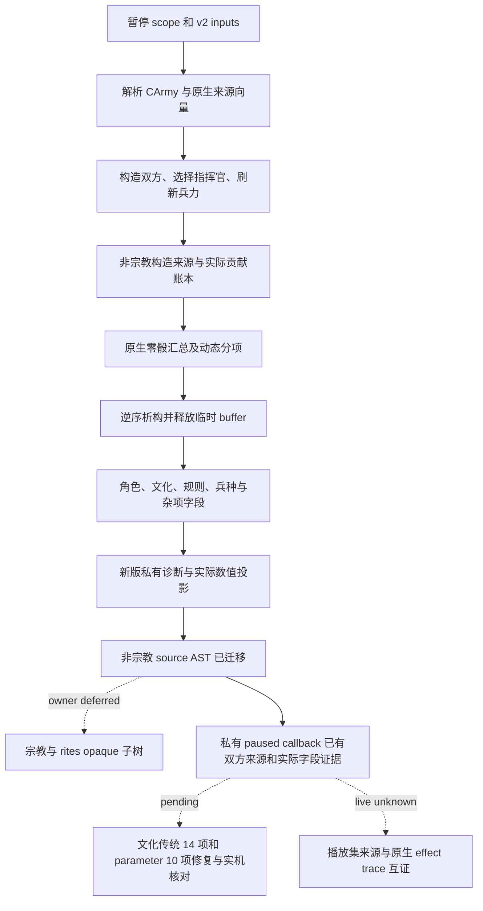

# CK3 1.20.0.2 战斗阶段迁移

新版非宗教阶段输入已在 `attempt-09` 的私有 paused 实机诊断中达到 `fixture-live`：`nonreligious_ready=true`，33 个角色、4 支军队、2 个 side、双方来源等价证明及 15 行构造优势账本完整返回；文化传统 registry 修复已实测生效。范围是单一显式假设接战输入，完整 v3 继续因所有者暂缓宗教与 rites 而未就绪。本工作包仅读取冻结文件、合成对象和根协调者保存的 artifact，没有连接或操纵游戏。

冻结构建为 `1.20.0.2` / Steam `25588574`，EXE SHA-256 为 `AE1BA6FF060BA603842F6F4A2DED0AF4B7D3666B3DD271F75FB01B0DA8E81B2D`。完整 `query-combat-simulation-inputs-v3-N` 继续不注册，因为所有者暂缓宗教与 rites；这不影响内部非宗教诊断的实际字段输出。加载播放集来源和原生 effect trace 也仍须专门的 paused 实机证据，离线夹具不代表生产就绪。

## 已核对的原生链

| 原生作用 | 1.19.0.6 RVA | 1.20.0.2 RVA |
|---|---:|---:|
| CCombatSide 构造 | `0x23C7D30` | `0x264CA60` |
| 添加 CArmy | `0x23C9100` | `0x264DE30` |
| 选择战斗指挥官 | `0x23C8A60` | `0x264D790` |
| 刷新双方兵力 | `0x23CB840` | `0x26505E0` |
| 读取双方最终兵力 | `0x23CC340` | `0x2651100` |
| CCombatSide 析构 | `0x2303B00` | `0x25861A0` |
| 汇总动态优势 | `0x2308D50` | `0x258B510` |
| 单边动态优势 | `0x2307CB0` | `0x258A470` |
| commander 来源列表 | `0x19DD750` | `0x1BA1230` |
| knight 来源列表 | `0x19DD670` | `0x1BA1150` |

新指挥官动态优势、side modifier、relation kind 分别使用 `0x2589E10`、`0x25899C0`、`0x2589810`。RTTI 和调用链互证各函数身份，不把短签名命中当作充分依据。

## 已修正的真实差异

`CCombatSide` 大小仍为 `0x348`，CCombat shell 为 `0x718`，双方起点为 `+0x20/+0x368`。gathering 从旧 `+0x340` 移到 `+0x344`；新 `+0x340` 是 `CoSi` 类型标记。新构造器、serializer 和析构共同证明这一变化。CCombat 根的主、次 vtable 使用 `0x473D138/0x473D100`，临时根的类型标记为 `Comb`。

双方来源证明保持 native 的“全部 commander，再全部 knight”顺序；角色 DTO 则保持每支 v2 army 的“commander，再该军 knight”顺序。来源列表从 side `+0x10/+0x1C` 与 `+0x40/+0x4C` 读取；后者混合普通 MAA 和骑士，项步长 `0x60`，`+0x08` 是实际 CArmyRegiment ID。只有该 regiment 的 `+0x148` 不为 `-1` 时，原生 knight source helper 才输出角色。新版 CArmyRegiment 的兵种指针为 `+0x18`，owner/knight ID 为 `+0x140/+0x148`。它与兵种在 `+0x118` 的另一 CRegiment 类型不同。

临时 side 账本 `+0x78/+0x80/+0x84` 写入 `{effect, contribution_raw}`；第二字段是已经乘过效果点数的实际贡献，不能填 `scale_raw`。shell `+0x6C8` 保留构造总和，零骰结果须等于该总和加双方动态差。构造来源读取 primary CArmy `+0x5C`，动态 gathering 读取 `+0x1D0`，二者在原生代码中是不同输入。

新版 inline Character/Regiment/数据库对象类型标记替代旧虚函数 validity 方案。Character 技能 getter、traits/tracks 布局及数据库对象 span 都按新构建核对；不把旧偏移整体加八作为依据。详情见各叶子专题。

## 实现与实际投影

`BindPhaseImage(base, sha)` 同时构造 v2 和五个叶子 bindings；只计算冻结构建地址。`ReadCombatSimulationInputsV3` 接收已捕获的 paused scope，先调用新版 v2，再组装 `PhaseEnvironment`。`ReadNonReligiousPhaseOperands` 单次读取原生双方并填入全部非宗教 DTO，返回各域的 `completed_domains/failed_domains`；每请求缓存一次 Misc 的 27 项定义。

`SerializeCombatPhaseInputsV3` 输出实际 `nonreligious_fields` 与 `nonreligious_advantage_model`，包括角色属性、勋号、政府、变量、兵种计数、来源 digest、构造贡献及 commander/side/residual 动态分项。`SerializeNonReligiousPhaseOperands` 再包裹实际域完成账本。完整就绪保持 false，宗教专用默认字段不进入诊断，指挥官 metadata 使用新 `native_0x264D790`。旧 132 refs、81/51 分类和旧 manifest hash 都没有贴到新 payload。

## 新版 source AST

`research/build_ck3_12002_phase_ast.py` 从实际冻结文件重建有序 Clausewitz AST，保留重复键、列表值、比较符和 `?=`，递归冻结事件实际引用的 source definitions。结果为 11 份来源文件、13 个事件、59 个可达定义，以及 17 个仅保存原文和 SHA 的宗教 opaque 子树。兼容的非宗教 normalized 表达式复用已有 Q100000 算法；遇到 deferred 节点明确返回未实现，不能按 false 或零处理。

AST 已落实三项非宗教变化：`accolade ?=` 在 scope 不存在时跳过；`has_none_of_variables` 检查两项 variable presence，cooldown 不再解释为 character flag；`00_combat_values.txt:12` 的 `accolade_progress` 新增 `is_alive` 条件，因此 dead liege 即使留有旧变量也应输出合法零，且不再读取该 stale variable。

宗教变化（faith → rites、cranial trophy gate、personal tenet/spiritual fulfillment）只记录原文与 hash，未研究或实现专用系统。新 source AST SHA 为 `A6647A6DC0E3E15D6C9D0C050A18CE0C68D42FA498AE61704A4D9540B0137E66`；source delta SHA 为 `878E82FD735D3D5A04715049242DB6A7FE560AFC6EEE54849CE29A69A56B04B7`。后者记录 `nonreligious_ast_migrated=true` 和完整 `ast_migrated=false`，不冒充完整 v3 AST。

## 离线验证和后续边界

主 manifest 冻结 14 个唯一签名、3 个 vtable prefix、61 条逐指令检查和 17 项常量。五叶子的签名、具体数据布局、夹具和结果分别见 [角色](ck3-1.20.0.2-phase-character.md)、[定义与规则](ck3-1.20.0.2-phase-definitions.md)、[文化与关系](ck3-1.20.0.2-phase-culture.md)、[构造优势](ck3-1.20.0.2-phase-advantage.md)、[变量与勋号等杂项](ck3-1.20.0.2-phase-misc.md)。

MSVC x64 C++20 `/W4 /WX` 合编以及 7/7 CTest GREEN，assert 保持启用。持久综合夹具 `src/ck3_12002_phase_composition_test.cpp` 证明构造总和 `150000`、holding ledger 贡献 `1250000`、零骰总和 `1650000`、动态差 `1500000`；同时覆盖失败汇总与全部临时分配释放。新版 Misc dead-liege 13 场景 GREEN；新版 AST 的来源复现、数值算法、nullable scope、variable presence、dead liege 和宗教 deferred 共 7 项 Python 用例 GREEN。

初次静态结果索引为 `artifacts/migrations/2026-09-30/post-update-1.20.0.2/phase-integrated-result.json`；随后实机暴露的身份混用、混合 regiment 数组和文化传统故障及其修复增量见下文。`attempt-09` 已通过授权非宗教输入的专用 paused callback 验收；完整播放集来源和 effect trace 仍需独立证据。宗教与 rites 继续等待所有者明确恢复授权，失败尝试全部保留。

## 最小非宗教实机诊断入口

用户后来授权实机核对后，新增 `ck3_12002_phase_diagnostic.hpp/.cpp`，供 owning-thread mailbox 复用现成读取链。`ReadPhaseNonreligiousDiagnostic(bindings, scope, request, output)` 返回原 v2/phase DTO、原 query result、单独的 `nonreligious_ready` 和实际字段 JSON；原阶段结果为 `phase_inputs_unavailable` 时仍可完成诊断，完整 v3 状态继续为 false。已有读取结果也可直接交给 `ProjectPhaseNonreligiousDiagnostic`，无需再次执行原生读取。

私有前缀约定为 `query-combat-phase-nonreligious-v1-`，后缀参数沿用 `query-combat-simulation-inputs-v3-` 的 grammar。桥接层将它映射已有的 owning-thread callback，不新增完整 v3 capability、不进入旧 132-ref Python parser。诊断是否实际接入和实机结果由根协调者记录；本工作包仍只编辑文件，没有连接游戏。

独立 `/MD /W4 /WX` 夹具 GREEN，覆盖实际数值投影、宗教暂缓与非宗教读取失败的区别，以及 unpaused、无有效玩家、错误构建的早退。首次独立链接因 `/MT` 与已有 `/MD` 库不一致发生 harness RED，修正为同一 runtime 后 GREEN。结果见 `phase-diagnostic-fixture/result.json`；它是离线证据，不代表实机诊断已完成。

## attempt-02 实机失败后的文件修复

根协调者的 `live-1.20.0.2/attempt-02/probe.json` 已实际进入私有 owning-thread callback。请求为目标省份 `2591`、攻击入口 `2592`，攻击 army `83886341`，防守 armies `33554493/33554657/357`。v2 输入完成，但阶段输出只剩 `phase_nonreligious_operand_unavailable:native_sides`，具体 native 失败原因被上层丢失；该 RED 保留，不能宣称 phase 已 live。

实际输入还揭示了必须修正的身份错配：攻击军公开 ID 为 `83886341`，内部 CArmy ID 为 `50331733`；v2 knight 的 `army_id` 按原 reader 合同保存后者。阶段来源检查却与前者比较，因此读取到这些 native knight rows 时必定失败。现改为与 `native_carmy_id` 核对，source proof 的 `source_army_id` 再明确映射回公开 ID。原合成夹具使用了错误的公开 knight army ID，现使用 `native=101/public=1`，并验证反向填错仍拒绝。

所有 native leaf 原因现保留为 `native_sides:<reason>`；构造优势 plan 的原因也继续附在具体 stage 后。生产 `ReadCombatPhaseInputs` 回归覆盖 source mismatch、gathering failure、动态汇总误差与 native supply selector 不一致，具体原因穿透到最终诊断且 ready 保持 false，成功和失败的临时分配均释放。两个 `/MD /W4 /WX` 夹具 GREEN，结果索引为 `phase-live-failure-regression/result.json`。现有冻结 `0x24E9EDC` 指令证明原生 commander getter 和阶段检查同读 `CArmy+0x120`，这组输入没有发现 commander offset 差异。

本次只编辑文件，未操作游戏。新的真实 phase 结果仍须根协调者下一次 owning-thread 诊断确认；旧泛化原因无法排除更早失败阶段，因此上述确定性错配修复不冒充整个实机问题已解决。combat v2 的实测 terrain width 另由其负责人修正，phase 不修改该模块。

## attempt-03 普通兵种被误判为骑士的修复

根协调者的 `live-1.20.0.2/attempt-03/mcp.json` 仍返回 `native_sides:phase_native_candidate_source_unavailable`。冻结 EXE 的 `0x264DF76` 检查有效 MAA 类型并在 `0x264DF7D` 跳至 `0x264E065`，把普通 MAA 加入 side `+0x40`；有效骑士也进入这个数组。因此攻击军的普通 pikemen regiment `67109785` 不能与 v2 的 14 名 knight 成员匹配，原检查必定拒绝。

现复用已绑定的 regiment resolver，按原 knight source helper `0x1BA11A5` 从 row `+0x08` 取 ID，解析 CArmyRegiment 后在 `0x1BA11D0` 读取 `+0x148`，并依照 `0x1BA11D6/0x1BA11D9` 跳过 `-1`。真实骑士才继续匹配角色及内部 army 身份；源证明仍输出公开 army ID，保持“所有 commander，再所有 knight”的原生顺序。没有新增原生调用或槽位。

失败原因细分为 `army_header`、`army_id`、`commander`、`regiment_header`、`regiment_identity`、`knights_unavailable`、`knight_duplicate`、`knight_membership`、`knight_character` 与 `knight_unmatched`；字符串包含相应 side、index、实际与预期 ID 或 count/capacity，不输出地址。这样根协调者下一次 paused probe 可以直接识别具体失败字段。

修正后的生产 reader 夹具在 mixed array 首位放普通 MAA `67109785`，随后放 `2751..2764` 共 14 个 knight regiment，并用独立 CArmyRegiment 的 `+0x148` 解析角色，额外写入 row `+0x00` 假 ID 防止错读。验证普通 MAA 不出现在 proof，14 名骑士按 `0x60` 顺序出现；失败回归覆盖 header、regiment identity、commander、membership、character 与 unmatched，失败和成功均释放临时对象。MSVC `/MD /W4 /WX` 编译及 assert 夹具 GREEN，结果为 `phase-native-source-regression/result.json`。初次执行命令因 CMD 不能以斜线路径直接启动生成 EXE 发生 harness RED；同一个 EXE 随后经修正的历史执行入口得到 GREEN，日志保留。当前执行方式应使用 cmd.exe 的反斜线 EXE 路径，或由 Python `subprocess.run` 直接启动该产物。该修复仍是离线确认，实机是否继续到后续阶段由根协调者验收。

## attempt-07 实机已读字段与文化阻点

根协调者的 `live-1.20.0.2/attempt-07/mcp.json` 已越过候选来源与原生双方构造。实际输出 33 个角色、4 支军队和 2 个 side；双方 source proofs 的 `source_vector_equivalence=true`，来源行数分别为 15 与 18，digest 分别为 `2EDE9FD353BF05295F53ACCB81205CF7165352888F43C1500E5A463BFCE94E8E`、`16EF277795890CA243E7DF881191F529AF3BCF8CB8C7E7DA2EAFE7260AAF93B2`。构造优势共 15 行，`original_total_helper_match=true`；零骰原生总和为 `1200000`，双方 commander 动态贡献分别为 `4000000/2800000`。这些是私有 paused 诊断的实测值，完整 v3 capability 仍未注册。

全部 33 个角色已经有文化身份和 12 项 innovation 字段，但 tradition 与 parameter 均为空。当前失败为 `phase_nonreligious_operand_unavailable:culture_relations_perks`，具体缺口是 14 项 tradition 和 10 项 parameter；它属于非宗教读取故障，不能以 religion/rites 暂缓代替处理。逐角色分布见 `attempt-07/phase-culture-field-assessment.json`，SHA-256 为 `B512044513D047935D86703F386C98D5CFA46C847001EAD05E20A4570E450874`。

主 reader 已接文化叶子的可选 `std::string *unavailable_reason`，把首个失败保存为 `culture_relations_perks:character=<full_id>:<leaf_reason>`；leaf 会区分具体定义 key、registry span、找不到已加载 key、fallback 对象及类型标记。读取继续遍历其余角色，并保留已经观察到的字段；没有新增零值或 false 替代缺失输入。主接线与新 leaf API 的 `/MD /W4 /WX` 定向编译和生产 reader 夹具 GREEN，证明确切原因进入 `failed_domains` 与 serializer，已有角色、side、来源证明和 knight 字段保留。结果为 `phase-culture-projection-regression/result.json`。

文化叶子已闭合实际 registry 选错：Tradition DB slot 改为 `0x5D1DEE0`，fallback 改为 `0x5D1FB50`；`0x2B156B0 → 0xA14910 → 0x225D520` 的原生 indexed resolver 证明对应数据库。保留原 `+0x38 == GDbo` predicate，因为 `0x314CEB7` 构造器明确写入该标记。叶子独立夹具先精确复现 12 innovations、0 traditions、0 parameters 的失败，再切正确 registry 得到 14 traditions 和 10 parameters，且覆盖具体 kind mismatch 原因。该文件修复已冻结，具体证据维护在[文化与关系专题](ck3-1.20.0.2-phase-culture.md)；下一次实机结果仍由根协调者验收。

## attempt-09：非宗教私有输入实机 GREEN

2026-10-01 06:37（Asia/Shanghai），根协调者保存的
`artifacts/migrations/2026-09-30/post-update-1.20.0.2/live-1.20.0.2/attempt-09/phase-private.json`
已实际返回 `nonreligious_ready=true` 与 `nonreligious_fields_ready=true`。
原始文件 SHA-256 为 `F5184032AD72C298D82F00AC5FF23E0F36058911CB30BAB4511C109D748E4756`。

本包只读这份已保存响应，完成一次必要核验：

- 33 个角色、4 支军队、2 个 side 完整保留；每个角色均有 12 项 innovation、14 项 tradition、10 项 parameter。
- 有实际正值：角色 `29829` 的 `tradition_ep3_audacious_cadets` 与 `knights_slightly_more_prone_to_injury` 为 true；角色 `57582` 的 `tradition_mubarizuns` 为 true。
- 原生有序 army partitions 与请求一致；双方 source proofs 等价，来源行数为 15/18，digest 与 attempt-07 中已通过的原生来源顺序一致。
- 15 行 constructor ledger 返回；攻击/防守动态值为 `4000000/2800000`，零骰差 `1200000`，与原生 total helper 完全相等。
- 快照实际暂停，`date_raw=53168784`、public revision `3`、native revision `2`；平原倍率 `100000`，初始 base/final width `3493/3493`。

唯一未就绪原因精确为 `phase_religion_and_rites_owner_deferred`，`deferred_domains` 只包含
`religion_and_rites`。外层 `status=unavailable` 继承完整 v3 的结果，不能据此把已经 ready 的非宗教诊断
记为 capability RED；`full_phase_inputs_ready=false` 与完整 v3 不公开继续保持。
这项成果为单场私有输入 `fixture-live`，不升级为完整模拟、生产战斗循环或 OODA。
文件核验结果为 `attempt-09/phase-nonreligious-validation.json`，SHA-256
`AA778E1D2675172FE5C1D8DA7DE9E9AC9DB35EF76787D582D056FD61DB18162D`；未重复查询或操作游戏。
