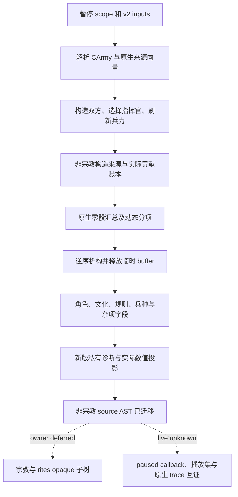

# CK3 1.20.0.2 战斗阶段迁移

新版所有非宗教阶段输入已完成静态迁移：双方来源与指挥官选择、角色身份和技能、特质及 XP、文化和关系、勋号和变量、政府与宫廷职位、难度、兵种数量、构造优势账本及动态优势分项。工作仅读取冻结文件和合成对象，没有连接、读取或操纵用户正在运行的游戏。状态为 `static-ready`，没有新版 live artifact。

冻结构建为 `1.20.0.2` / Steam `25588574`，EXE SHA-256 为 `AE1BA6FF060BA603842F6F4A2DED0AF4B7D3666B3DD271F75FB01B0DA8E81B2D`。完整 `query-combat-simulation-inputs-v3-N` 继续不注册，因为所有者暂缓宗教与 rites；这不影响内部非宗教诊断的实际字段输出。加载播放集来源和原生 effect trace 也仍须专门的 paused 实机证据，离线夹具不代表生产就绪。

## 已核对的原生链

| 原生作用 | 1.19.0.6 RVA | 1.20.0.2 RVA |
|---|---:|---:|
| CCombatSide 构造 | `0x23C7D30` | `0x264CA60` |
| 添加 CArmy | `0x23C9100` | `0x264DE30` |
| 选择战斗指挥官 | `0x23C8A60` | `0x264D790` |
| 刷新双方兵力 | `0x23CB840` | `0x26505E0` |
| 读取双方最终兵力 | `0x23CC340` | `0x2651100` |
| CCombatSide 析构 | `0x2303B00` | `0x25861A0` |
| 汇总动态优势 | `0x2308D50` | `0x258B510` |
| 单边动态优势 | `0x2307CB0` | `0x258A470` |
| commander 来源列表 | `0x19DD750` | `0x1BA1230` |
| knight 来源列表 | `0x19DD670` | `0x1BA1150` |

新指挥官动态优势、side modifier、relation kind 分别使用 `0x2589E10`、`0x25899C0`、`0x2589810`。RTTI 和调用链互证各函数身份，不把短签名命中当作充分依据。

## 已修正的真实差异

`CCombatSide` 大小仍为 `0x348`，CCombat shell 为 `0x718`，双方起点为 `+0x20/+0x368`。gathering 从旧 `+0x340` 移到 `+0x344`；新 `+0x340` 是 `CoSi` 类型标记。新构造器、serializer 和析构共同证明这一变化。CCombat 根的主、次 vtable 使用 `0x473D138/0x473D100`，临时根的类型标记为 `Comb`。

双方来源证明保持 native 的“全部 commander，再全部 knight”顺序；角色 DTO 则保持每支 v2 army 的“commander，再该军 knight”顺序。来源列表从 side `+0x10/+0x1C` 与 `+0x40/+0x4C` 读取；knight 项步长 `0x60`，`+0x08` 是实际 CArmyRegiment ID。新版 CArmyRegiment 的兵种指针为 `+0x18`，owner/knight ID 为 `+0x140/+0x148`。它与兵种在 `+0x118` 的另一 CRegiment 类型不同。

临时 side 账本 `+0x78/+0x80/+0x84` 写入 `{effect, contribution_raw}`；第二字段是已经乘过效果点数的实际贡献，不能填 `scale_raw`。shell `+0x6C8` 保留构造总和，零骰结果须等于该总和加双方动态差。构造来源读取 primary CArmy `+0x5C`，动态 gathering 读取 `+0x1D0`，二者在原生代码中是不同输入。

新版 inline Character/Regiment/数据库对象类型标记替代旧虚函数 validity 方案。Character 技能 getter、traits/tracks 布局及数据库对象 span 都按新构建核对；不把旧偏移整体加八作为依据。详情见各叶子专题。

## 实现与实际投影

`BindPhaseImage(base, sha)` 同时构造 v2 和五个叶子 bindings；只计算冻结构建地址。`ReadCombatSimulationInputsV3` 接收已捕获的 paused scope，先调用新版 v2，再组装 `PhaseEnvironment`。`ReadNonReligiousPhaseOperands` 单次读取原生双方并填入全部非宗教 DTO，返回各域的 `completed_domains/failed_domains`；每请求缓存一次 Misc 的 27 项定义。

`SerializeCombatPhaseInputsV3` 输出实际 `nonreligious_fields` 与 `nonreligious_advantage_model`，包括角色属性、勋号、政府、变量、兵种计数、来源 digest、构造贡献及 commander/side/residual 动态分项。`SerializeNonReligiousPhaseOperands` 再包裹实际域完成账本。完整就绪保持 false，宗教专用默认字段不进入诊断，指挥官 metadata 使用新 `native_0x264D790`。旧 132 refs、81/51 分类和旧 manifest hash 都没有贴到新 payload。

## 新版 source AST

`research/build_ck3_12002_phase_ast.py` 从实际冻结文件重建有序 Clausewitz AST，保留重复键、列表值、比较符和 `?=`，递归冻结事件实际引用的 source definitions。结果为 11 份来源文件、13 个事件、59 个可达定义，以及 17 个仅保存原文和 SHA 的宗教 opaque 子树。兼容的非宗教 normalized 表达式复用已有 Q100000 算法；遇到 deferred 节点明确返回未实现，不能按 false 或零处理。

AST 已落实三项非宗教变化：`accolade ?=` 在 scope 不存在时跳过；`has_none_of_variables` 检查两项 variable presence，cooldown 不再解释为 character flag；`00_combat_values.txt:12` 的 `accolade_progress` 新增 `is_alive` 条件，因此 dead liege 即使留有旧变量也应输出合法零，且不再读取该 stale variable。

宗教变化（faith → rites、cranial trophy gate、personal tenet/spiritual fulfillment）只记录原文与 hash，未研究或实现专用系统。新 source AST SHA 为 `A6647A6DC0E3E15D6C9D0C050A18CE0C68D42FA498AE61704A4D9540B0137E66`；source delta SHA 为 `878E82FD735D3D5A04715049242DB6A7FE560AFC6EEE54849CE29A69A56B04B7`。后者记录 `nonreligious_ast_migrated=true` 和完整 `ast_migrated=false`，不冒充完整 v3 AST。

## 离线验证和后续边界

主 manifest 冻结 14 个唯一签名、3 个 vtable prefix、56 条逐指令检查和 17 项常量。五叶子的签名、具体数据布局、夹具和结果分别见 [角色](ck3-1.20.0.2-phase-character.md)、[定义与规则](ck3-1.20.0.2-phase-definitions.md)、[文化与关系](ck3-1.20.0.2-phase-culture.md)、[构造优势](ck3-1.20.0.2-phase-advantage.md)、[变量与勋号等杂项](ck3-1.20.0.2-phase-misc.md)。

MSVC x64 C++20 `/W4 /WX` 合编以及 7/7 CTest GREEN，assert 保持启用。持久综合夹具 `src/ck3_12002_phase_composition_test.cpp` 证明构造总和 `150000`、holding ledger 贡献 `1250000`、零骰总和 `1650000`、动态差 `1500000`；同时覆盖失败汇总与全部临时分配释放。新版 Misc dead-liege 13 场景 GREEN；新版 AST 的来源复现、数值算法、nullable scope、variable presence、dead liege 和宗教 deferred 共 7 项 Python 用例 GREEN。

所有允许推进的本包静态工作均已完成。下一步需要专用 paused 实机核对 owning-thread 原生 callback、角色/兵种实际值、双方来源顺序、临时对象回收、播放集来源和 effect trace；用户仍在游玩，本包没有执行这些步骤。宗教与 rites 继续等待所有者明确恢复授权。最终结果索引为 `artifacts/migrations/2026-09-30/post-update-1.20.0.2/phase-integrated-result.json`，失败尝试保留在同一迁移 artifact 树。
