# CK3 1.20.0.2 战斗阶段：变量、勋号、政府与宫廷职位迁移

本工作包已经达到 `static-ready`。新版独立 reader、定义解析与合成内存 fixture 已实现，MSVC x64 编译通过，13 项 fixture 场景通过。没有访问正在运行的 CK3，没有调用实机原生函数，没有 attach、注入、控制输入、关闭或重启游戏。生产 owning-thread 的 paused snapshot 验证仍需后续实机完成。

精确构建为 CK3 **1.20.0.2**、Steam build **25588574**，EXE SHA-256 为 `AE1BA6FF060BA603842F6F4A2DED0AF4B7D3666B3DD271F75FB01B0DA8E81B2D`。研究只读取冻结副本 `artifacts/migrations/2026-09-30/post-update-1.20.0.2/installation/binaries/ck3.exe`。证据账本是 [ck3_1_20_0_2_phase_misc.json](../../ck3_autonomous_player/native_bridge/research/ck3_1_20_0_2_phase_misc.json)，包含 11 个入口签名、53 条逐指令语义核对与 22 项源码常量。

实现位于 [ck3_12002_phase_misc.hpp](../../ck3_autonomous_player/native_bridge/include/xar_bridge/ck3_12002_phase_misc.hpp)、[ck3_12002_phase_misc.cpp](../../ck3_autonomous_player/native_bridge/src/ck3_12002_phase_misc.cpp)，测试位于 [ck3_12002_phase_misc_test.cpp](../../ck3_autonomous_player/native_bridge/src/ck3_12002_phase_misc_test.cpp)。旧版 `combat_v3.cpp` 没有修改。

统一 EXE verifier 发现两条初始 32 字节模板 prolog 不唯一：modifier lookup 有 205 个命中、court-position trigger 有 5 个命中。最终冻结签名分别扩大到已审阅函数的 `0x13A` 字节与 `0xA8` 字节，包含 modifier canonical fallback 和 court storage 的具体 RIP 引用，保持每条签名仅有一个命中的要求。初次 RED 保存在 `migration-abi-verification-phase-misc-anchor-red.json`。

修复后使用统一 `OfflineVerifier.verify_module` 对冻结 EXE 实际校验，结果为 **GREEN**：5 项构建身份、11 个唯一签名、53 条指令、22 项源码常量，`failures=[]`。结果保存在 `artifacts/migrations/2026-09-30/post-update-1.20.0.2/phase-misc-fixture/abi-verification.json`；没有扩大实机操作范围。

| 对象 / 原生入口 | 1.19.0.6 | 1.20.0.2 | 新版证据 |
|---|---:|---:|---|
| CharacterExtension 指针 | character + `0x1A8` | character + `0x1B0` | `0x27C0040`、`0x1AFA1AE` |
| CharacterRelations 指针 | character + `0x1B0` | character + `0x1B8` | `0x2B07C11` |
| 角色勋号完整 ID | extension + `0x568` | extension + `0x570` | `0x27C0058` |
| 勋号类别 span | attribute + `0x3E8` | attribute + `0x3A8` | `0x2AFC899` |
| 勋号等级定义 span | attribute + `0x400` | attribute + `0x3C0` | `0x27BF657` |
| 政府 flags span | government + `0x48` | government + `0x50` | `0x2B1E476`；复用 campaign 账本 |
| 宫廷职位类型数据库对象 span | database + `0x68` / `0x74` | database + `0x50` / `0x5C` | ctor `0x2F4D431` / `0x2F4D459`，consumer `0x309B77C` |
| CanBeAcclaimed | `0x28A4870` | `0x2B91300` | 签名匹配后核对角色身份、死亡与勋号上下文 |
| AccoladeHasParameter | `0x251CB60` | `0x27BF5E0` | 原生遍历属性、校验 GDbO、解析等级，再查询参数 |
| CharacterGovernment | `0x26165B0` | `0x28C2E10` | 复用 [campaign 账本](../../ck3_autonomous_player/native_bridge/research/ck3_1_20_0_2_campaign.json) |
| 静态 modifier lookup | `0xA41F10` | `0xAB8D20` | `has_character_modifier` 初始化 `0x1AF5FBD` / `0x1AF5FD7` / `0x1AF5FE1` |

变量 context 与 identifier ABI 复用 [phase definitions](../../ck3_autonomous_player/native_bridge/include/xar_bridge/ck3_12002_phase_definitions.hpp)。`PhaseVariableTarget` 是 16 字节，`kind` 在 `+0`，类型为 uint16；`payload` 在 `+8`，类型为 int64。Character 类型是 `4`，raw fixed 类型是 `1`。保存变量 context 的 rows/count 仍是 `+0x10/+0x1C`，row stride 仍为 `0x20`，identifier 是 row `+8`，target 是 row `+0x10`，因此 target payload 位于 row `+0x18`。`0x37274C0` 与 `0x3727500` 分别提供原生 presence 和 target 返回语义。

`conqueror` 与 13 项 attribute unlock 输出的是变量是否存在；数值 `0` 仍代表存在。`hold_court_8050_knight` 与 employer 的 `hold_court_8050_promise` 必须是 Character target，解析完整 generation ID 后才发布。新版冻结 `game/common/script_values/00_combat_values.txt:12` 的 `accolade_progress` helper 先要求 `is_alive=yes`，再判断变量和读取数值；reader 因此先解析 liege 完整 ID，并检查 DeathData `+0x1D0`。dead liege 合法输出 `0`，即使存在 stale progress 也不读取变量。living liege 的变量必须是 raw fixed target，并按脚本 `max=20` 做上限 `2,000,000` 截断；负值不擅自改为零。extreme conqueror modifier 行继续使用 extension `+0x188/+0x194`、stride `0x48`、row `+0` definition pointer；只移动了 extension 本身。

勋号状态有一个必须更换的调用点：新版 `CAccolade` 主 vtable 在 `0x4751B08`，析构函数之后紧接 RTTI COL，`vtable +8` 已经不是 bool 函数。新版 reader 镜像 `CIsAcclaimedTrigger` 的最终判断：完整 ID 成功解析，accolade `+0x0C` magic 等于 `0x4163636F`，ID `+8` 不等于 `-1`。这由 `0x2AFB791/0x2AFB79A` 直接证明。没有复制旧版 `VcallBool(accolade, 0x08)`。

新版 standalone accolade validator 已内联。`0x27BF5E0` 先验证属性非空、attribute `+0x38` magic 为 `0x4744624F`，随后按 row `+8` 等级解析 attribute `+0x3C0`，再查询 tier `+0x5E0` 参数 flags。reader 先按原生同一 magic 验证属性与类别 span，六项 accolade parameter 则直接调用新版原生最终结果。类别 span 不要求有序，fixture 使用无序类别数据核对这一行为。

宫廷职位列表仍在 relations `+0xD0/+0xDC`，ID stride 为 `4`。原生 `CHasCourtPositionTrigger` 在 `0x2B07BA0` 使用 storage slot `0x5D1DD10`、fallback slot `0x5D1DD08`，比较完整 position ID `+8`，再比较 position type `+0x110`。`garuda_court_position` definition 从新版 CourtPositionType DB slot `0x5C67330` 的 `+0x50/+0x5C` 对象列表按稳定 key 唯一解析。稳定 key 仍为对象 `+0x18` 的 MSVC string；modifier 从 DB slot `0x5C670F8` 经原生 hash `0x3F7E240` 与 lookup `0xAB8D20` 解析并核对稳定 key。

```mermaid
flowchart TD
    Image[精确构建 / SHA] --> Bind[PhaseMiscBindings]
    Bind --> Defs[27 项非宗教定义与 identifier]
    Char[角色 + 完整 ID / employer / liege] --> Variables[变量与 modifier]
    Defs --> Variables
    Defs --> Accolade[勋号身份 / 类别 / 六项原生参数]
    Char --> Accolade
    Char --> Government[原生 government getter + flags]
    Defs --> Government
    Char --> Court[relations → position full ID → garuda type]
    Defs --> Court
    Variables --> Fields[四组字段 static-ready]
    Accolade --> Fields
    Government --> Fields
    Court --> Fields
    Fields -.-> Live[待 paused owning-thread 实机核对]
```

主 phase 集成应先读取关系叶得到 employer/liege，调用 `BuildPhaseMiscDefinitions` 每次请求解析一次，再对所有候选角色复用 `ReadPhaseCharacterMisc(bindings, definitions, character, output)`。reader 不覆盖 martial、traits、culture 或其他叶字段。便捷 overload 会自行解析定义，适用于单角色调用。

fixture 覆盖精确版本地址绑定、全部 27 项定义、旧偏移诱饵、存在但数值为零的变量、合法缺失与空列表、native callback ABI、Character target 类型和 generation、accolade identity/magic、attribute magic、宫廷职位 generation、重复变量、进度上限和负值、dead liege 的 stale progress / stale target 合法归零、其他叶字段保留。编译器为 MSVC 19.51 x64，`/std:c++20 /W4 /WX`；结果是进程退出码 0、`phase_misc: 13 fixture scenarios passed`。可执行测试产物位于 `artifacts/migrations/2026-09-30/post-update-1.20.0.2/phase-misc-fixture/phase_misc_test.exe`。

剩余工作为协调者的完整 phase snapshot 集成，以及获准触碰游戏后在 owning-thread 的 paused snapshot 核对新版原生 callback 与实际返回字段。本叶没有 remaining static offset 缺口。faith、religion、doctrine 与 holy order 不在本包范围，也没有因此宣称完整宗教域或整局 OODA 已迁移。
