# Player religion Tenets: private Python transport

The independent Python leaf reads selector `query-player-religion-tenets-v1`, domain `player_religion_tenets_v1` and backend `ck3-1.20.0.2-native-player-religion-tenets-v1`. It binds the source snapshot hello and DTO to CK3 1.20.0.2 / EXE SHA-256 `AE1BA6FF060BA603842F6F4A2DED0AF4B7D3666B3DD271F75FB01B0DA8E81B2D`. Its permission is `allow_private_player_religion_tenets_query`.

The helper `query_player_religion_tenets_private_v1(driver, expected_revision, timeout_seconds)` uses the existing G2 paused execute-step transport. It reads one full native `command_result` from the actual protocol cache and preserves the `ck3_12002_tenet_rows_v1` producer DTO. The central owner registered the production NativeDriver method `query_player_religion_tenets_private_v1(expected_revision)` and readonly API `ck3_query_player_religion_tenets_v1(expected_revision)` with default-off flag `--private-player-religion-tenets-query`.

The two Rite scopes remain separate. `current_rite.core_tenets` comes from the player's current Rite; `faith_main_rite.core_tenets` comes from its Faith's main Rite. Their entry `current_rite_status` values are the actual native getter's result for the current Rite, including the main Rite entries. `personal_tenets` remains the character's personal collection. `effective_tenet_states` preserves the native provider's observed definition union and order; it does not enumerate every Tenet definition or supply pick permissions.

Native states remain `unknown=0`, `known=1`, `prohibited=2`, `permitted=3`, `core=4`. Current Rite full ID `0` and personal Unknown `0` are legal. An absent current Rite retains personal keys with `current_rite_status=null`. An absent character extension produces a complete, observed empty personal list. A failed reader retains `available=false`, `personal_tenets_complete=false`, its typed reason and owner date/played actor. The owner-pump `capture_epoch` is distinct from the published `snapshot_revision`.

```mermaid
flowchart LR
    N[Actual owned native mailbox / serializer] --> P[Complete command_result protocol_version 1]
    P --> I[Production NativeProtocolState.ingest]
    I --> W[Production wait_for_command_result]
    W --> Q[G2 readonly query / Tenet normalizer]
    Q --> D[Registered production NativeDriver method]
    D --> M[Registered readonly MCP / official SDK Client]
    M -. paused CK3 evidence required .-> L[production-live primitive]
```

The four actual packets are read directly from the [portable native fixture](../../research/religion_doctrine12002_tenet_rows_mailbox_wire_fixtures.json), SHA-256 `489a430bbd919f059219792d7374d642df4f9087a44171f9391762fdf669ee1d`, without duplicating fixtures. The [native mailbox delivery](religion_doctrine12002_tenet_rows_mailbox.md) `/Od` and `/O2` runs each passed 29 checks. The Python focused test uses the real `NativeProtocolState.ingest` and `wait_for_command_result`, including an ingested exact-build hello. Its endpoint changes only the generated request ID and does not substitute a command-result cache. This exercises the production protocol parser that the earlier GOV live RED showed must be included in offline transport verification.

Focused Python verification passed **3 tests and 8 actual-packet subtests** in 0.205 seconds. After shared registration, **one new official MCP SDK test** passed in 1.652 seconds. It sends all four actual complete native packets through production `NativeProtocolState.ingest` / `wait_for_command_result`, the production NativeDriver method and `mcp.Client(create_server(driver))`. The fixture binds the real method without initializing a live pipe driver. It verifies default-off CLI/tool hiding, explicit-on readonly discovery, all DTO fields, native five-state values, legal Rite `0`, personal Unknown `0`, absent-Rite nulls, complete empty personal lists and unavailable reason/completeness/owner fields. The previous focused tests and native `/Od` / `/O2` results were reused without rerun.

The leaf and complete query are **static-ready**, with `offline_verified=true`. Exact source/dependency hashes, test receipts and report fields are frozen in `artifacts/g2-offline-2026-10-01/python-religion-tenets-next/SDK-READY.json`. No paused live artifact, religious action, Tenet candidate policy or full OODA outcome is claimed. This leaf does not touch CK3, processes, pipes, UI or Steam. Git changes and paused game verification belong to root.
