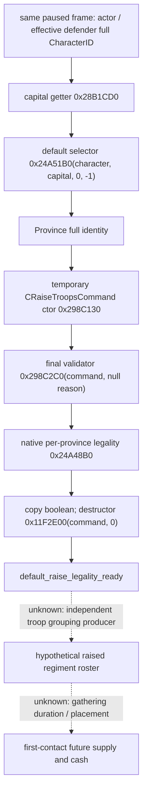

# CK3 1.20.0.2 原生默认集结点最终合法性

状态：`static-ready`；尚未进行该查询的真实 paused 验收。游戏版本为 Crozier 1.20.0.2，Steam build 25588574，EXE SHA-256 为 `AE1BA6FF060BA603842F6F4A2DED0AF4B7D3666B3DD271F75FB01B0DA8E81B2D`。

本查询补齐声明双方当前默认集结点的原生最终合法性。已有默认 Province 位置不等于可以在该位置集结；查询按照正式 default-raise 的选择、构造和校验顺序读取结果，释放临时 command 后返回，不调用 submit 或 execute。合法性返回 `false` 是完整的原生负面结果，不是读取失败。

## exact-build 调用树

`0x298C130` writes its caller-owned 0x50-byte command and allocates a one-entry temporary Province array; it sets raise mode `+0x44=1`, `+0x40=-1`, and the two vtables at `0x45345C0` / `0x4534658`. `0x298C2C0` validates complete CharacterID resolution, the character's valid capital, the entry's valid Province and `0x24A48B0`. Passing a null reason suppresses reason construction; the query never reaches execution entry `0x2A9B5A0`.

`0x24A48B0` first calls `0x24A4540` and then evaluates the native province/controller/character realm branches. These checks are reused unchanged. We do not rewrite them as a player policy or infer legality from ownership alone. Its native `false` covers all final rejection branches, so this query does not invent a more specific reason.

## Provider 与边界

`ReadPrewarDefaultMusterV1` reuses the actual 1.20 `MilitaryBindings` and `MilitaryWorldAccess`. It reports one row per primary side, with full CharacterID, nullable default ProvinceID and nullable final boolean. The actor must match the paused played character; each character and Province is resolved through the existing full identity resolvers. The returned context includes actor/effective-defender identity and game date.

`default_raise_legality_ready` only covers the current default raise command. It does not claim a war-aware preferred rally point, hypothetical roster, future ArmyID, gathering time, declaration participants, future supply or campaign cost. Those production sources remain the next RE inputs. No local CK3 process, pipe, desktop, Steam or save is accessed by offline tests.

## 验证

`ck3_12002_prewar_muster_test` supplies caller-owned character/Province bytes and the production callbacks. It exercises an actual positive and negative final validator result, both sides, constructor/destructor lifetime, a missing default location, paused/player binding and the serialized null/boolean distinction. `verify_ck3_12002_prewar_muster.py` checks the exact frozen EXE's ctor, final validator and native per-province call edges. Fixture success is not live qualification.

2026-10-01 offline verification: MSVC 19.51 x64 Release (`/O2`, `/W4`, `/WX`) compile and fixture execution **PASS**; three exact native call chains **PASS**. Actual C++ JSON output is at `artifacts/g2-offline-2026-10-01/prewar/default-muster-wire.json`; build receipt and logs are in `artifacts/g2-offline-2026-10-01/prewar/muster-build/`. The frozen instruction evidence is committed as `native_bridge/research/ck3_12002_prewar_muster_abi.json`. No process enumeration or live CK3 query occurred.
