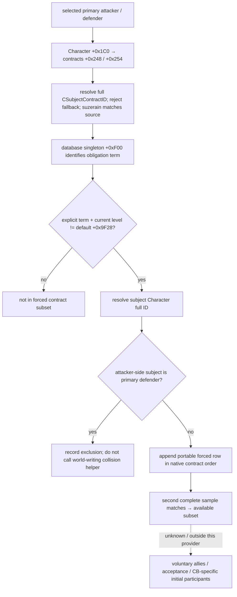

# CK3 1.20.0.2 初始强制属国参战者只读来源

本专题只迁移 initial participant set 中的 `native_forced_tributary_contract` 子集。版本为 Crozier 1.20.0.2 / Steam build 25588574，EXE SHA-256 为 `AE1BA6FF060BA603842F6F4A2DED0AF4B7D3666B3DD271F75FB01B0DA8E81B2D`。证据来自冻结 EXE、原版 subject-contract 数据和离线原生对象夹具；本轮没有连接运行中的 CK3，也没有实机验收。

## 原生来源与迁移差异

| 来源 | 1.19.0.6 | 1.20.0.2 | 语义 |
|---|---|---|---|
| Character land extension | `+0x1B8` | `+0x1C0` | 宗主一端的 contract list 所在对象 |
| Contract IDs / signed count | extension `+0x248/+0x254` | 同旧版 | 4-byte full generation-bearing `CSubjectContractID`，不是盟友 CharacterID |
| Subject-contract storage slot | `0x570CCA0` | `0x5D1EB88` | slot array `+0x20`、capacity `+0x2C`、stride `0x10`、object `+0x08` |
| Storage fallback slot | `0x570CC50` | `0x5D1EB40` | query 不把 fallback 当有效 contract |
| Database singleton slot | `0x570C790` | `0x5D1DED0` | 直接读取，不触发 lazy initialization |
| Obligation database field | `+0xF18` | `+0xF00` | `tributary_war_participation_obligation` |
| Term default-level byte | `+0xAB40` | `+0x9F28` | 对比 contract 当前 level |
| Non-default predicate | `0x2255360` | `0x24C5300` | term 必须显式存在，且 current != default |
| Default comparator | `0x2253C40` | `0x24C3C00` | term-pointer first-match 与并行 level-byte array |
| Builder forced-contract stage | `0x27A1EC0` | `0x2A7EAE0` | attacker round 后 defender round；不得在 query 内调用 |
| Participant mutator | `0x2225FB0` | `0x24961E0` | 分配 row、登记战争关系并产生其他世界写入 |

`CSubjectContract` 的 ID `+0x08`、subject `Character* +0x20`、suzerain `Character* +0x28`、term pointer array/count `+0x38/+0x44`、parallel level array `+0x68` 保持不变。新版 RTTI `.?AVCSubjectContract@@` 位于 type descriptor `0x573EF98`，primary vtable 为 `0x4735878`，COL 为 `0x4DD8C08`。

新版注册链 `0x31C7778` 载入 obligation 字符串，`0x31C7786` 将输出绑定到 database `+0xF00`。不能把另一个 predicate `0x24C5280` 的 `+0xF10` 当战争义务。新版 predicate `0x24C5300` 与 builder defender round `0x2A7EC8B` 独立确认 `+0xF00`；comparator `0x24C3C56` 与 builder `0x2A7ED0B` 独立确认 default byte `+0x9F28`。精确字节、span 哈希、RIP globals、direct call 与 RTTI 检查维护在 `research/ck3_12002_prewar_participants_abi.json`，核验器是同目录 `ck3_12002_prewar_participants.py`。

## 实现与边界

`BindPrewarParticipantsImage12002` 只按传入 exact SHA 与 module base 绑定已经证明的 singleton slots；不发现进程。`ReadForcedPrewarParticipants12002` 解析两侧主角 full IDs，镜像 term-pointer first-match/non-default 判定，并采两份完整输出作一致性比较。调用者使用现有 paused owning-thread query 上下文。它不调用 database accessor `0xA149D0`、predicate、builder stage、collision helper `0x28A7690` 或 participant mutator，也不创建临时战争。

DTO 保留 `source_contract_native_order` 和原始 active/default level。重复 subject/contract row 与 native order 原样保留，不排序、不去重。attacker round 将 subject 等于 primary defender 的 qualifying row 放入 `excluded_primary_defender_collisions`；defender round 没有对称排除。无 land extension 的主角按原生 empty-array 路径得到零 rows。未初始化 database、失效 contract/subject identity 或读取失败会返回具体 unavailable 原因，不将缺少观测假装成合法空集合。

`SerializeForcedPrewarParticipants12002` 输出 portable CharacterID / ContractID DTO；不输出 native 地址。`complete_initial_participants_ready` 始终为 `false`，因为本查询没有观察 voluntary ally acceptance、overlord/top-liege 参战、其他 CB-specific participants 或提交之后的变化。没有研究宗教系统；任何后续必要 CB-specific identity 只能保持 opaque。

2026-10-01 离线核验 GREEN：6 个 exact spans、10 个字段字节检查、7 个 direct calls、7 个 RIP bindings、2 个文字证据、RTTI，以及 1 个原版 contract 文件 SHA。ABI manifest SHA-256 为 `7fbe61b36a4db7d0ac16441453cfd09f5e737e4fda1d05987e50fed7a5a9d59c`。结果保存在 `Z:\ck3_mod_rewrite\artifacts\g2-offline-2026-10-01\prewar\participants\abi-verification.json`。

实际生产 reader 与 serializer 的 MSVC `/Od` 和 `/O2`、`/W4 /WX` 两种构建各通过 11 个有功能意义的对象图 fixture：正常双侧/non-default 子集、duplicate/native order、非对称 collision、自指 subject、unlanded 空集合、未初始化 database、contract generation、source endpoint、subject generation、fallback、缺少显式 term、first-match，以及变动 sample 的拒绝。fixture 源为 `research/ck3_12002_prewar_participants_test.cpp`；`fixture-result.json` 与两份 `forced-participants-wire.json` 同样位于上述 artifact 目录。两个测试 EXE SHA-256 分别为 `/Od` `d8e3092ce133345a11e8a383b16a26b8bd494105a0c744b0d40f6c4a12d260ec`、`/O2` `f7e861c63336526cbc15c4440831a4dfecabc15543de2122d0ecd34121d06e9a`。没有运行游戏 EXE。

本查询的新构建 readiness 最高只能是 `static-ready`。中央 bridge / mailbox / MCP 注册由集成工作包统一接入；本专题的 provider fixture 不冒充请求路径已接入。真实 declaration-bound primaries 的 paused query、实际 builder-produced participant 子集对照，以及完整 participant set qualification 仍必须等待后续实机。
