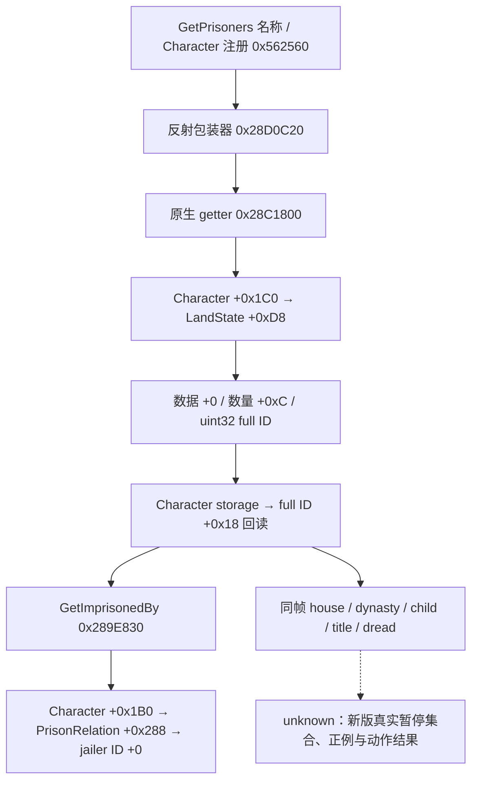

# CK3 1.20.0.2：玩家囚犯集合、监禁者与关系输入

2026-10-01。范围为既有玩家囚犯只读口的新版原生来源迁移；本页仅有冻结文件静态证据，没有访问本地 CK3 进程或提供新版实机结论。

精确构建为 **1.20.0.2 Crozier / Steam 25588574**，EXE 大小 `101039736` 字节、SHA-256 `AE1BA6FF060BA603842F6F4A2DED0AF4B7D3666B3DD271F75FB01B0DA8E81B2D`。ABI 权威清单：[ck3_12002_prisoner_collection_abi.json](../../ck3_autonomous_player/native_bridge/research/ck3_12002_prisoner_collection_abi.json)。验证器只读取文件，冻结 36 条指令、10 个函数片段、13 条相对调用/引用边与 2 个虚表边。

| 输入 | 新版来源与证据 | 迁移含义 |
|---|---|---|
| 囚犯集合 | `GetPrisoners` 名称 RVA `0x45186A0`；名称复制 `0x5625B9`，包装器 `0x28D0C20` 调用 `0x28C1800` | 使用 Character 的原生集合。另一个同名注册位于 CourtWindow；UI 列表不代表原生完整集合 |
| 容器 | `0x28C1800` 读 Character `+0x1C0`，加 `+0xD8`；`0x28C186B..0x28C188A` 读取 `+0` 数据、`+0xC` 数量并按 4 字节步长查找 full CharacterID | 指针为借用值，同一次 application-main 暂停事务内复制 ID；不能继续沿用旧 Character `+0x1B8` |
| 监禁者 | `GetImprisonedBy` 名称 RVA `0x4761828`，复制 `0x569462`；`0x28D3240` 跳入 `0x289E830` | Character extension 改为 `+0x1B0`；PrisonRelation 仍为 `+0x288`，`+0` 是 full jailerID |
| full ID 解析 | `0x289E851` 读 storage `0x5C67568`；storage slots `+0x20`、capacity `+0x2C`，slot stride `0x10`、对象 `+0x8`；`0x289E87B` 比较 Character `+0x18` 与完整 ID | 低 24 位只用于索引。必须保留 generation 比较；fallback `0x5C67570` 不代表有效请求角色 |
| dread | `dread` 注册 `0x5A50D0` → factory 虚表 `0x47F0F80` → factory thunk `0x2B650B0` / `0x2B67560` → trigger 虚表 `0x47F0D60` 的 `+0x100` → `0x2B641F0` | `0x2B6423D` 读 Character `+0x1C0`；`0x2B64249` 读 LandState `+0x350` 的有符号 64 位 CFixedPoint。原生无 LandState 分支返回零 |
| 是玩家子女 | 已冻结 [family subject ABI](../../ck3_autonomous_player/native_bridge/research/ck3_12002_family_subject_abi.json)；`0x2B6EEFC` 读 Character `+0x1A8` FamilyData，`0x2B6EF08/0x2B6EF0D` 比较 full parent IDs `+0x4/+0` | 新版 trigger 内联该判断。不能移用旧独立 predicate `0x26085E0`，可复用已证明的只读 mirror；null FamilyData 为合法 false |
| house / dynasty | 复用同一新版 family subject ABI：Character house ID `+0x158`；House dynasty ID `+0x2C`；House slots/fallback `0x5D1DAF0/0x5D1DAE8`，Dynasty `0x5D1DE78/0x5D1DE28` | lineage identity 为 `+0x10`，保留完整 ID 回读；沿用既有空 dynasty 语义 |
| primary title / tier | 已冻结 [realm ABI](../../ck3_autonomous_player/native_bridge/research/ck3_1_20_0_2_nonwar_realm.json)；PrimaryTitle getter `0x289DA30`，Title slots/fallback `0x5D1DAF8/0x5D1DAE0`；`0x230F900/0x230F904` 验证 template 与 tier | Title identity `+0x10`，template **`+0x48`**、tier **`+0x64`**，两项均不同于旧版 `+0x160/+0x5C` |

当前 readiness 为 `static-ready`。这些输入允许新版 provider 使用真实原生来源构造既有囚犯 DTO；不增加宗教分支、不修改战争持俘意愿，也不由囚犯数量推导 ransom/release 合法性。新版 CanSend、费用与动作回读由对应 interaction 工作包维护。

后续实机需要一次真实暂停玩家集合，正例监禁者 full ID 回读、同帧 dread/lineage/child 控制样本，以及独立 ransom/release 状态与收益回读。此页、编译 fixture 或 command ACK 都不满足 M6 完整循环。
