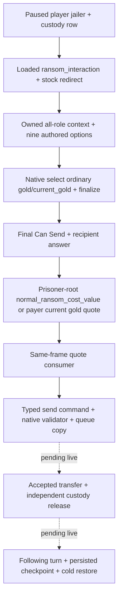

# CK3 1.20.0.2 prisoner ransom 原生迁移

状态：`static-ready`，本轮只读取冻结 EXE 和原版脚本，没有连接、查询或操作本地 CK3。exact build 为 **1.20.0.2 Crozier / Steam 25588574**，EXE SHA-256 为 `AE1BA6FF060BA603842F6F4A2DED0AF4B7D3666B3DD271F75FB01B0DA8E81B2D`。

普通赎金沿用既有 `player_prisoner_ransom_private_v1` 语义，实际 provider 迁到 `ck3_12002_prisoner.cpp`，没有另造 command/receipt 框架。原版 `ransom_interaction` 对非统治者囚犯重定向到其领主作为 payer，囚犯保留在 `secondary_recipient`，jailer 为 actor。新版 redirect 额外角色指针必须按已冻结的 ContextBindings ABI 传入，不能沿用旧版六参数声明。

这次有两项真实脚本变化需要改变生产路径。发送选项从八项增到九项：`extortionate_gold`、`extortionate_current_gold`、`gold`、`current_gold`、`favor`、`influence_send_option`、`herd_send_option`、`current_herd`、`invalid`。新增 `current_herd` 使旧版八项 mask/count 校验必然失配；最后一项 `invalid` 仍只用于 mass-action 无合法报价的 fallback。普通 gold 的原版判断和付款都改读囚犯根的 `normal_ransom_cost_value`；`ransom_cost_value` 现在是普通/勒索分支的聚合，不能继续把它当作普通 gold 分支的名称。

实际原生调用链为：interaction database getter `0x89DA60` → stable key hash `0x3F7E240` → loaded interaction lookup `0xA055E0`。`0x2B744CD/0x2B744E7/0x2B744F1` 与 `0x2D69B9D/0x2D69BB7/0x2D69BC1` 两条本体调用者确认同一 lookup；它与 named-value database lookup `0xA07830` 是不同入口。

新选项操作入口为 clear `0x3078700`、select authored index `0x30787E0`、shown/valid `0x30789C0`、default picker `0x3078650`。Context 的 selected vector `+0x300/+0x30C` 与角色 `+0x2D8/+0x2DC/+0x2E4` 保持；definition 的 rows/count 变为 `+0x2258/+0x2264`，row stride `0x730`，flag identifier `+0x368`，互斥标记 `+0x271E`。每个 flag 通过 loaded script identifier table 查询并逐项对照，再使用原生 select → refresh → finalize；不能仅把自制字节 mask 当成原生最终合法性。

普通金钱报价复用 [gift named-value 原生来源](ck3-1.20.0.2-gift-opinion.md) 的生产 helper `ReadNamedInteractionFixedExact12002`：保留已 finalized interaction named scopes，把根改为囚犯，按 `normal_ransom_cost_value` 调用新版五参数 fixed evaluator并保留 Q100000。该 helper处理新版 InternString source descriptor、有效性 tag 与容器析构；旧版 named definition vtable slot 0 在新版是空 `ret`，不再可当作布尔有效性判定调用。普通 gold 的查值与 payer 当前金钱都必须在同一 paused actor/frame；current_gold 在 on_accept 才保存付款值，因此它只是当前报价。原版 haggler 和后续状态仍可能影响最终转账，接受与金额必须由独立后置观察确认。

typed send 仍通过 `0x2968170` 构造，copy context 后 validator `0x29682A0` 对 context `+0x20` 尾调 final Can Send `0x307C040`。正常 native recipient answer 复用 `0x307BC80`。command enqueue 只代表排队，不能把 ACK 当作赎金到账或囚犯离开监狱。

ABI 合同为 [ck3_12002_prisoner_ransom_abi.json](../../ck3_autonomous_player/native_bridge/research/ck3_12002_prisoner_ransom_abi.json)，校验器为 [verify_ck3_12002_prisoner_ransom.py](../../ck3_autonomous_player/native_bridge/research/verify_ck3_12002_prisoner_ransom.py)。仅验证 changed production inputs、实际指令、选项顺序与三份原版脚本 SHA；同一 named-value 和通用 context ABI 的完整证据由已有专题复用。

离线验证已完成：ABI 校验器通过 **13 个 native spans、37 条实际指令、8 项生产绑定常量、9 个 authored options 和三份原版脚本 SHA**。`ck3_12002_prisoner_ransom_test.cpp` 链接实际 provider/core/context/commands/gift 实现，在 MSVC `/Od` 与 `/O2` 下各通过 **463 项检查**，覆盖普通/当前金钱、原生选项替换、拒绝/低资金、九项 mask 和 command 深拷贝后源 context 析构、入队失败回收。fixture 的 named cost callback 验证 root/角色与选择范围并返回夹具金额；真实 named evaluator 仍以 exact-build ABI 证据为依据，没有调用本地游戏。结果保存在 `Z:\ck3_mod_rewrite\artifacts\g2-offline-2026-10-01\prisoner\ransom-abi\verification.json` 和 `...\prisoner\ransom-fixture\result.json`；早期 verifier 把 on_decline character flag 误混入选项清单的两次失败记录为 harness RED，保存在 `ransom-abi\harness-failed-attempts.json`，已修正按 send_option block 取 flag。

实机边界：尚未获得新版自然 paused 囚犯的 quote/answer、queued action 后 accepted/declined、真实金钱变化和 custody release、next-turn 或 cold checkpoint artifact。本轮不会把离线 fixture 记成 M6 完成；宗教/改宗/圣骑士团不在此工作包。
