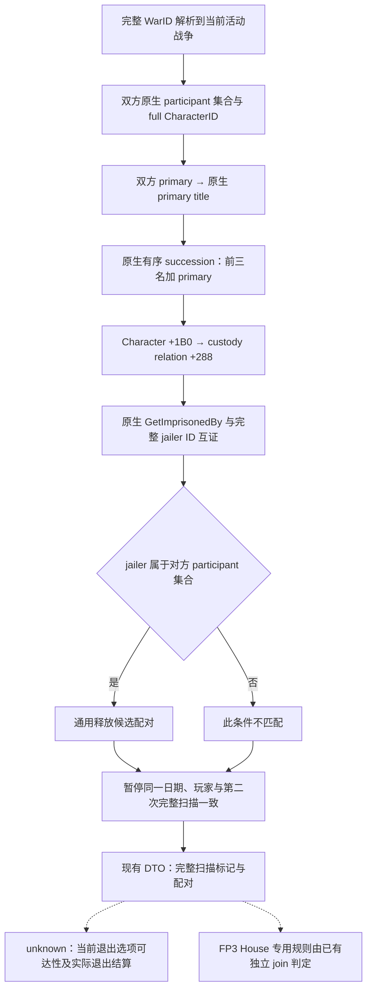

# CK3 1.20.0.2：囚犯战争扣留的通用释放输入

本包补齐已有赎金消费者逐场调用 `query-war-prisoner-release-pairs-v1-<WarID>` 所需的 Crozier 原生来源。身份为 `1.20.0.2-steam25588574`，EXE SHA-256 `AE1BA6FF060BA603842F6F4A2DED0AF4B7D3666B3DD271F75FB01B0DA8E81B2D`。状态为 **static-ready**；只使用冻结 EXE、原版脚本和夹具拥有的内存，没有访问本地 CK3 进程、pipe、桌面或 Steam。

它复用[原有三源 join](h2825-prisoner-war-retention-source-2026-09-28.md)和历史命名空间内的 portable DTO，不把旧版 live 回执转成新版 live。玩家囚犯集合与本包的释放配对图必须来自同一暂停帧，才允许赎金消费者判断某名囚犯是否存在通用 PoW 释放承诺。

## 原版树与实际绑定

冻结 `game/common/scripted_effects/00_war_effects.txt` SHA-256 `F811D12CCB11F3AAE2F61B234E930E20880BE9B7C065BB9F4557400BD711722B`，第 1650–1699 行仍分别遍历两侧参战者的囚犯，释放对方 primary 和其 primary title 前三顺位继承人。新版本行号改变，条件未改变。只读 reader 从候选人物反查 custody，得到同一条件的 `jailer → prisoner` 配对；不调用已发生过崩溃的 loaded-effect preview。



实际 provider 位于 [ck3_12002_prisoner_war_retention.cpp](../../ck3_autonomous_player/native_bridge/src/ck3_12002_prisoner_war_retention.cpp)。它复用已迁移的 Core、World 和 title storage，不改战争策略、日期控制或战争 ownership：War manager `GameData+0x2EBE0`、两侧 `War+0x20/+0x80`、primary ID `+0x288/+0x28C`、CB `+0x100`、完整 generation ID 解析来自既有 1.20 reader。CB 只作为 opaque identity。

`GetPrimaryTitle` 为 `0x289DA30`，真实 primary-title storage 为 `0x5D1DAF8`；title succession data/capacity/count 为 `+0x150/+0x158/+0x15C`。`GetImprisonedBy` 为 `0x289E830`：`Character+0x1B0 → extension+0x288 → relation+0` 是完整 jailer ID，返回值经过原生 character storage/generation 校验。旧版 Character extension `+0x1A8` 没有沿用。候选有 custody 时，reader 同时检查原生 getter 与完整 jailer ID 解析得到的对象一致。

## 交付与证据

[ABI manifest](../../ck3_autonomous_player/native_bridge/research/ck3_12002_prisoner_war_retention_abi.json)保留 27 条 exact-build 指令、8 项实际源码常量和原版 effect 文件哈希。离线 verifier 确认这些输入；既有 CB key/identity、Core 和 World 完整版本合同继续由各自 manifest 承担，不新建第二套通用框架。

实际 production reader 的 `/Od`、`/O2` 两套 `/W4 /WX` fixture 各 **13/13 GREEN**：包括双侧配对、primary 和前三继承人、第四继承人排除、合法完整空集合、不相关 jailer、无效 custody、部分 participant、重复 successor、非参战玩家、未暂停、玩家死亡、已结束战争、日期与集合漂移。初次 fixture 日期漂移注入发生在 clock 采样之后，导致该用例未生效；已调整到第二次图采样期间，初次 RED 作为 harness 记录保留。

离线证据位于 `Z:\ck3_mod_rewrite\artifacts\g2-offline-2026-10-01\prisoner\war-retention\`：`abi-result.json`、`fixture/result.json`（初次 harness RED）、`fixture-corrected/result.json`（两模式 GREEN）。可重跑命令均只读静态文件或本地夹具：

公共接线完成后新增的窄 wire fixture 只检查这次改变的边界：实际 production reader → `SerializePrisonerWarRetentionV1` → 可解析 JSON，一个玩家关押对方第一继承人的非空配对、一个完整已知空集合，以及既有 step 的 exact matcher，`/O2 /W4 /WX` **3/3 GREEN**。没有重复旧 reader 的两套 13 项矩阵。`artifacts/g2-offline-2026-10-01/prisoner/war-retention-wire/result.json` 记录源码身份；其 `actual-wire/positive.json` SHA-256 为 `BC5069B1D961F6C81ED65D2529909C7C2E520838DDB523361CF2308DA3A41F3B`，`empty.json` 为 `B26B085DBAEC7285A73FE316B0BDE807D300436521E00857EB8D3762987C7CAD`，可直接供 Python 的既有 normalizer/join 消费。外层 envelope 仿照正式 handler 构造，内部配对图来自实际 reader 和正式 serializer；这份 fixture 仍不是 main-thread 实机回执。

```cmd
Z:\ck3_mod_rewrite\tools\.venv\Scripts\python.exe ck3_autonomous_player\native_bridge\research\verify_ck3_12002_prisoner_war_retention.py --exe Z:\ck3_mod_rewrite\artifacts\migrations\2026-09-30\post-update-1.20.0.2\installation\binaries\ck3.exe --output Z:\ck3_mod_rewrite\artifacts\g2-offline-2026-10-01\prisoner\war-retention\abi-result.json
Z:\ck3_mod_rewrite\tools\.venv\Scripts\python.exe ck3_autonomous_player\native_bridge\research\run_ck3_12002_prisoner_war_retention_tests.py --output Z:\ck3_mod_rewrite\artifacts\g2-offline-2026-10-01\prisoner\war-retention\fixture-corrected
```

实机开放后还需同一暂停帧的 active war、囚犯集合、配对图和退出选项联读。空配对只有 `full_participant_scan`、`primary_and_first_three_successors_scanned`、`same_frame_stable` 全真才有意义；这仅否定通用 effect 的匹配，不否定全部战争、关系或赎金价值。此包没有释放囚犯、领取赎金、提交终战、推进日期或完成 M6 实机里程碑。

## 既有赎金消费者所需的 runtime 接线

2026-10-01 15:49（Asia/Shanghai），公共接线发现旧 `query-war-prisoner-release-pairs-v1-<WarID>` 分支仍调用 1.19 bindings，导致新版赎金消费者即使已有 provider 也无法取得战争扣留输入。最小修复位于 [ck3_12002_prisoner_mailbox.cpp](../../ck3_autonomous_player/native_bridge/src/ck3_12002_prisoner_mailbox.cpp)：既有 collection executor 的 slot 53 增加只读 `war_retention` mode，在同一 `QueryMailboxEnvelope` 的 Enter/Finish 之间调用上述已验证 reader，并返回原有 `war_prisoner_release_pairs_v1` DTO。query sequence 与囚犯集合的 sequence 分开保存。

matcher 保持既有规范拼写：正的完整 int32 WarID，无前导零或尾随文本。serializer 保留双方 participants、双方 primary 与前三继承人、配对以及三个完整扫描标记；无效或部分扫描不会输出 `available`。该接线只复用已闭合来源，不新增战争策略或退出选项研究。修改后的 wrapper 与 serializer 已通过 `/O2 /W4 /WX` 编译；完整中央 DLL 接线与本包追加的 production reader → wire 夹具另记独立回执，既有 13×2 reader 用例没有重复执行。
