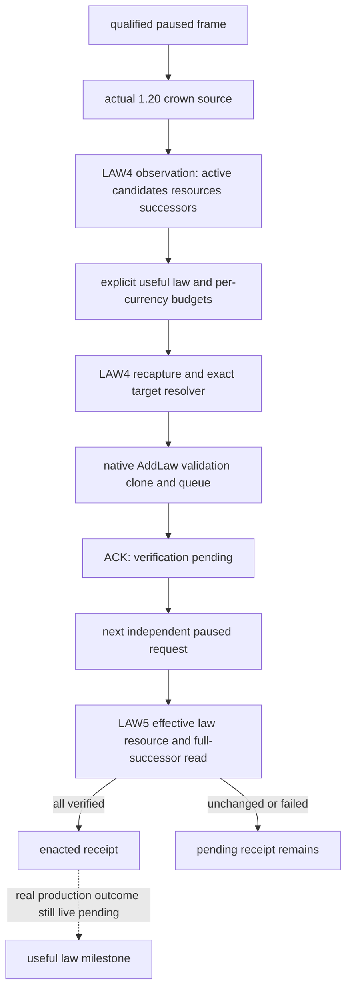

# CK3 1.20.0.2 crown-law action mailbox

固定 Crozier 1.20.0.2 / Steam 25588574，EXE SHA-256 `AE1BA6FF060BA603842F6F4A2DED0AF4B7D3666B3DD271F75FB01B0DA8E81B2D`。这是 **static-ready** 的后台迁移交付：没有查询、注入、操作或枚举本地 CK3，也没有新的 paused/live 证据。原生输入与未闭合分支见 [最终条件树](ck3-1.20.0.2-realm-law-final-terms.md) 和 [crown source 与 receipt](ck3-1.20.0.2-realm-law-crown-source-and-receipt.md)。

原有 LAW4/LAW5 的值观测、费用授权、 typed enact 与独立回执已经存在；本次新增实际 1.20 source caller，把它们接到三个 private worker selector。中央 bridge 在既有默认关闭的 realm-law enact 编译开关下注册 action executor 的 mailbox slot 37；原只读两组 catalog 的 slot 56 保留。

| Selector | 实际来源与结果 |
| --- | --- |
| `query-realm-law-crown-action-v1-private` | 在 owning application-main 的同一暂停帧读取 crown active key、原生最终候选结果与费用、五项有原生余额来源的资源、全部 held-title successor vectors；返回 `available` observation。 |
| `enact-realm-law-crown-v1-private` | 消费明确选择的 law stable key、frame 及逐币种授权上限；原有 LAW4 再捕获输入，通过新版 target resolver 与真实 typed AddLaw clone/queue 提交；成功只返回 `submitted_verification_pending`。 |
| `verify-realm-law-crown-v1-private` | 在之后独立的 mailbox request 内重新读取 effective law、实际资源和全部 successor vectors；三个结果都成立才返回 `enacted`，未变化或失败保留原 pending transaction。 |

wire `request_id` 对每次通信唯一；`submitted_request_id` 是一次法律动作的身份，由提交及独立 verify 共同引用。query/verify 返回 `read_only:true`，enact 返回 false；三个 result 均保留 `private_build:true`、`advertised:false`、`backend_id:native-headless`，未使用的 observation/ack/receipt 为 null。没有选择或默认执行 CA1。CanEnact 仍只证明原生允许，不证明它有治理收益。

`snapshot_revision`、`native_snapshot_revision` 与 `proof_epoch` 在此 caller 指向同一个已限定的 public paused frame；pump epoch 单独证明 owning thread，不被当作新的状态观察时钟。runtime proof 中的 signature digest 是实际 `VerifyRealmLawEnactMutationAbiV1` 验证通过的新版 mutation manifest `BD2000808A4CB293610C5CFF6D5B067AC1BEDDFC863600B8E7C99E68F27A4537`。它不冒充 collection、费用 getter 与 component 等全部 source 的组合 runtime signature manifest；那些 source 的 exact-build 依据来自对应冻结 EXE 的离线 ABI 证据与 admitted SHA。

资源余额只发布已闭合的 gold、prestige、piety、influence、merit。费用涉及未提供余额的币种时，既有 action 会拒绝缺少资源输入，不能把缺失当零。query 的 `title_successors` 为 `{primary_title_id, held_titles:[{title_id,primary,successor_character_ids}]}`；receipt 必须重新取得完整 vectors，命令 ACK 不包含这些后置条件的成功结论。

2026-10-01 离线验收使用 actual source adapter、components、既有 LAW4/LAW5、typed command、worker handler 与 serializer；只有 native memory/call 与 mailbox scheduling 是明确标注的 fixture 替身。MSVC `/Od` 和 `/O2`、`/W4 /WX` 均 GREEN，涵盖真实 wire query、已选择动作的 ACK pending、重复提交被阻止、独立 unchanged receipt 失败并保持 pending、effective law/prestige/full-successor 成功、原生拒绝及 stale frame 无操作。

可复用 runner 为 `ck3_autonomous_player/native_bridge/tools/test_ck3_12002_realm_law_action_mailbox.py --artifacts <Z-path>`。证据在 `artifacts/g2-offline-2026-10-01/law/action-mailbox/result.json`，五份 actual serialized JSON 及 provenance 在 `ck3_autonomous_player/native_bridge/research/fixtures/ck3_12002_realm_law_action/`；这些 actor/date/cost/结果均来自 synthetic stores，不是实机读数。实机下一步仍是 paused observation、选择确有价值的合法法律、typed submit 与独立 active-law/resource/successor receipt；本交付不改变 G2 M6 完成状态。
