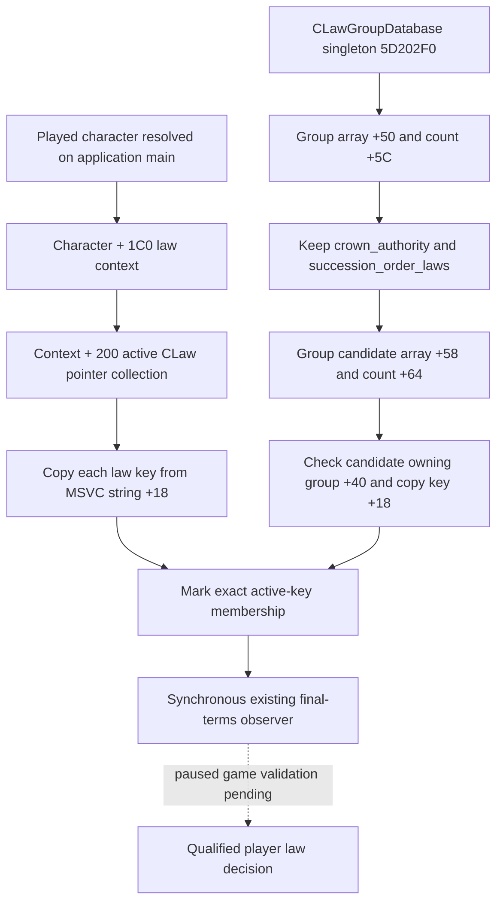

# CK3 1.20.0.2 realm-law active and candidate collections

This is exact-build static research and a read-only provider migration. No game process was opened, queried, injected or controlled. Executable: CK3 1.20.0.2 Crozier, Steam build 25588574, SHA-256 `AE1BA6FF060BA603842F6F4A2DED0AF4B7D3666B3DD271F75FB01B0DA8E81B2D`.

The previous collection DTO and synchronous candidate observer remain the value contract. Native addresses exist only during the owning application-main callback. Candidate membership is a source input for engine-final legality and cost observation; it does not establish that changing a law is beneficial.

| Native source | 1.19.0.6 | 1.20.0.2 | Exact-build evidence |
|---|---|---|---|
| Character law context | `+0x1B8` | `+0x1C0` | Active getter `0x28B6200`, native law walk `0x28A9BD2` |
| Active collection within context | `+0x200` | `+0x200` | Getter adds `0x200`; membership `0x2BA97F0` calls that getter |
| Collection data/count | `+0x00 / +0x0C` | unchanged | Membership and native group walk dereference the pointer and signed count |
| Group database singleton | `0x57C0508` | `0x5D202F0` | `CLawGroupDatabase` RTTI and constructor store `0x2E794A3` |
| Group database data/count | `+0x68 / +0x74` | `+0x50 / +0x5C` | Native walk `0x28A9B8D..0x28A9BA9` |
| Group candidate data/count | `+0x50 / +0x5C` | `+0x58 / +0x64` | Native default selection `0x30B3A0E..0x30B3A31` |
| Law owning group pointer | `+0x38` | `+0x40` | Native active group match `0x28B6316..0x28B6345` |
| Law/group key | MSVC string `+0x18` | unchanged | Law constructor `0x30AE3C4..0x30AE3F7`; group key reader `0x30B3ADC..0x30B3AEA` |

The new base object writes native magic `0x4744624F` at `+0x38`. Treating this location as the previous owning-group pointer would read a different field. The legacy ABI document calls its singleton a law database, but its old constructor RTTI resolves to **CLawGroupDatabase**. The migration uses that actual collection owner rather than the separate `CLawDatabase` singleton (`0x5C67140`).



The feudal projection preserves the existing crown-authority and succession allowlists, including an active native law even when it is outside the ordinary candidate allowlist. No generic religion or government expansion is introduced. The absent active law for a group is represented by `active_found=false`; empty active collections are legal. Failed reads retain the existing typed failure enum instead of inventing zero-valued observations.

The instruction-span SHA-256 contract is [ck3_12002_realm_law_collections_abi.json](../../ck3_autonomous_player/native_bridge/research/ck3_12002_realm_law_collections_abi.json). The verifier only reads the supplied executable file. Synthetic memory fixtures exercise the actual provider and candidate callback. Paused collection equality, final terms and enact outcome remain live work.

Offline verification on 2026-10-01: **8/8 exact-build instruction spans GREEN**; actual provider fixture **12/12 GREEN under both MSVC `/Od` and `/O2`, `/W4 /WX`**. Cases include native short/heap strings, a decoy legacy character-context field, the new law base-object field, callback addresses, filtered large native groups, legal empty active collections and a candidate owning-group mismatch. Local result and binary hashes are in `Z:\ck3_mod_rewrite\artifacts\g2-offline-2026-10-01\law\collections\collections-result.json`.

```text
python ck3_autonomous_player/native_bridge/research/verify_ck3_12002_realm_law_collections.py --exe <frozen-1.20.0.2-executable>
python ck3_autonomous_player/native_bridge/research/run_ck3_12002_realm_law_collections_tests.py --build-root <Z-drive-build-directory>
```
