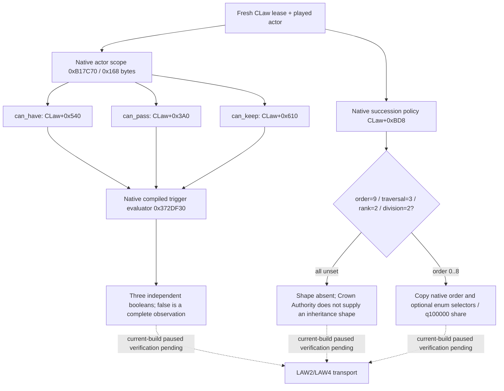

# CK3 1.20.0.2 independent law predicates and succession shape

这是 LAW2/LAW4 source completeness 所需的离线逆向补充，构建 SHA-256 为
`AE1BA6FF060BA603842F6F4A2DED0AF4B7D3666B3DD271F75FB01B0DA8E81B2D`。
没有查询、注入或操作正在运行的 CK3。

不能由 `can_enact=true` 推导 `can_have=true` 或 `can_pass=true`。最终 evaluator
`0x30B1B70` 在读取三组 compiled trigger 前存在原生早退分支；source DTO 必须独立读取三个结果。
`0x37998F0(trigger, scope, null reason)` 明确 tail-call `0x372DF30`，因此 helper 直接调用
相同的无 reason evaluator，避免创建多余 tooltip。actor scope 用原生 `0xB17C70` 构造，
按真实 law caller 的 `+0x118` tail、`+0x100` rows、`+0x18` rows 顺序释放。

以下对应关系来自原生 token registry、CLaw RTTI 和 parser，不是按名字猜 offset：

| Property | Token | Parser handoff | CLaw offset |
| --- | --- | --- | --- |
| `can_pass` | `0x2FF5` | `0x30AEB6D` / compiled section `rdi-0x1D68` | `+0x3A0` |
| `can_have` | `0x300F` | `0x30AEC15` / compiled section `rdi-0x1BC8` | `+0x540` |
| `can_keep` | `0x3454` | `0x30AEDF7` / compiled section `rdi-0x1AF8` | `+0x610` |

CLaw parser 的 `this` 指向 CLaw `+0x2108`，由 RTTI COL `0x4F78438` 证明。
`0x30B23F0` 读取 `+0x610`，对应 **CanKeep**，不能当成 CanHave 使用。
CLaw 构造入口是 `0x30AE340`；`0x30AE330` 属于上一函数的 epilogue。

succession policy 构造器 `0x253FA10` 初始化 order/traversal/rank/title-division 为
`9/3/2/2`。parser `0x253FA70` 分别用 enum table 长度作为未指定 sentinel。
order table 为 `inheritance/election/appointment/theocratic/company/generate/
generate_from_template/player_heir/noble_family`；只作为 opaque canonical keys 复制，
本工作没有解析通用宗教系统。traversal 为 `children/dynasty_house/dynasty`，rank 为
`oldest/youngest`，title division 为 `single_heir/partition`。
primary-heir minimum share 是 policy `+0x60` 的原生 q100000 数值，默认零是合法的观测值；
它表示有效 minimum share，不用它判断脚本是否显式写过零。

当四个 selector 都为未指定 sentinel 且 share 为零，输出整个 shape `absent`；
具有 order 的 shape 则输出明确 canonical order、optional selectors 与原生 share。
partial policy 只有 optional selector 而没有 order 的情况保留 unknown，不能捏造 order。
这些状态解决 Crown Authority 无 succession definition 却长期被标 unknown 的实际 source readiness 缺口。

验证结果：exact-file verifier **GREEN**（15 code/data spans、8 property registry token pairs、
16 canonical key literals）；三项 C++ fixture 覆盖独立 predicate 负值仍 complete、
Crown Authority shape absent、inheritance/partition 的原生零值与 0.5 minimum share。
MSVC `/Od` 和 `/O2` 均通过 `/W4 /WX`。证据和源文件/fixture binary 哈希在
`artifacts/g2-offline-2026-10-01/law/mutation/components-result.json`。
本页新增 readiness 为 `static-ready`，当前构建 paused LAW2/LAW4 query 仍待实机互证。
