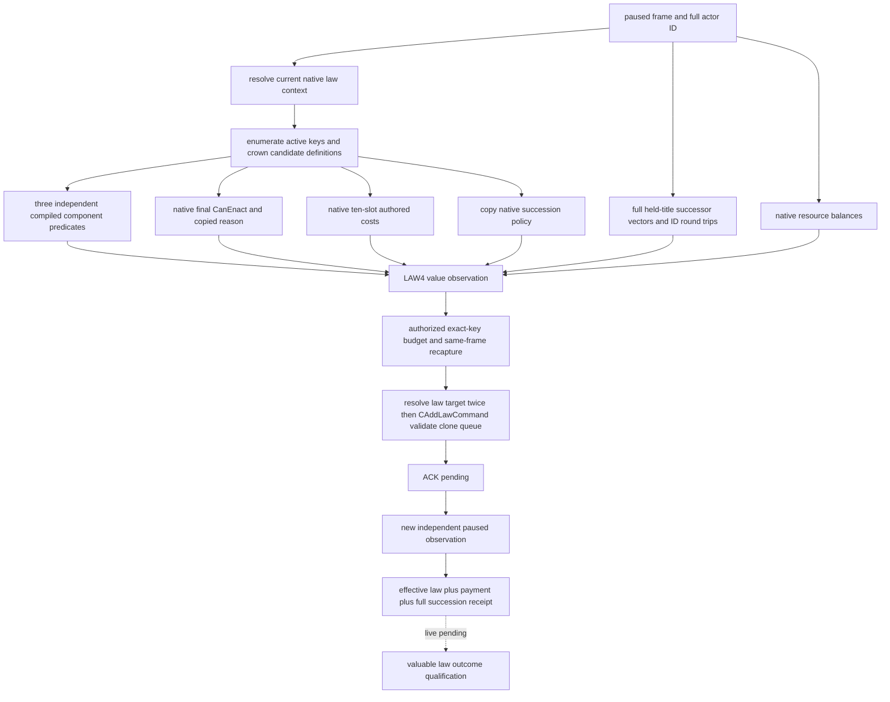

# CK3 1.20.0.2 crown law source and independent receipt

固定 Crozier 1.20.0.2 / Steam 25588574，EXE SHA-256 `AE1BA6FF060BA603842F6F4A2DED0AF4B7D3666B3DD271F75FB01B0DA8E81B2D`。状态为 **static-ready**。本包只读冻结文件并执行离线生产路径 fixture，没有查询、注入、启动或占用本地 CK3。

`ck3_12002_realm_law_source_adapter.hpp/.cpp` 把新版 active/candidate collection、原生最终 CanEnact、十槽费用、独立 compiled CanHave/CanPass 和真实 succession policy 接入既有 LAW2/LAW4/LAW5。LAW2 只投影 `crown_authority`；原始两组完整候选与最终费用仍由新版 final-terms 查询提供。策略必须自行给出有价值的具体 law key 与授权预算，接口不会默认选择 CA1。

原生最终判定有全局 override 提前返回分支。因此最终 CanEnact 为真不能当作独立 CanHave/CanPass 观测。新版 source 真实读取这两个分项，同时将 `engine_final_only` 与 `engine_final_permission_only` 显式标记为最终原生权限语义；LAW4 在此模式下信任最终 CanEnact，允许分项 false 而最终合法的原生结果。旧版默认两个标记均为 false，继续使用原有分项核验。旧 reader 的版本默认仍为 1.19；共享 core 新增显式 expected SHA 参数，1.20 从未伪报旧 SHA。

独立余额来自原生最终 affordability `0x310E710` 的费用 ordinal switch：actor `+0x1B0` 指向资源扩展，gold `+0x100`、prestige `+0x130`、piety `+0x110`、influence `+0x150`、merit `+0x170`，均为 q100000。威望不是 `+0x108`。空扩展在原生对应分支输出合法零余额；读取失败仍不可用。renown、herd、treasury、treasury_or_gold 和 barter_goods 尚不由本 source 提供余额，选定法律若需要这些非零费用，现有预算检查拒绝提交，不将未知余额替换成零。费用中的原生零值才会从 LAW4 charge 列表省略。

继承结果使用既有新版 nonwar realm 的冻结布局：持有头衔完整 ID 列表，头衔 `+0x150/+0x158/+0x15C` 的完整 successor 向量，以及 Character/Title 存储中的 full-generation ID 回验。并非只复制每个头衔的 first heir。crown 法律的 succession absence 来自原生 policy 字段，独立 receipt 仍核对所有持有头衔的继承向量；ACK 或 effective-law key 单独成立不代表完成。

新增 `ck3_12002_realm_law_source_resources_abi.json` 与 verifier 冻结七段 affordability switch/余额/跳表指令。集合、条件、command 和 realm 布局分别复用对应已冻结的 ABI 契约。本包离线 source fixture 在 MSVC `/Od` 和 `/O2`、`/W4 /WX` 下通过，覆盖真实 source → LAW4 → typed command queue → 独立 active-law/威望/完整继承 receipt；保持原状态的 ACK 验证失败、最终 native denial 不提交、未发布 renown 余额不提交、继承向量发生漂移不能宣称成功。

可核验 artifact：`Z:\ck3_mod_rewrite\artifacts\g2-offline-2026-10-01\law\source\build-final\result.json`。原始 harness RED 保留在同目录上层 `build/normal-run.log`：新 final-only 权限模式初次未透过旧 LAW5 的 group 核验，已按同一显式语义修正；原始失败未冒充游戏 capability RED。新的 paused source、可负担且有价值的一次变更、独立实机付款/继承结果仍待允许使用 CK3 时验收。

共享语义 core 的旧版默认兼容另做一次与变更相称的回归：原 LAW2 snapshot 9 项、source adapter 7 项、LAW4 action 8 项、LAW5 binder 8 项，共 32 项，在 `/Od /W4 /WX` 下全部 GREEN。未重新跑旧版 native 大矩阵。结果：`Z:\ck3_mod_rewrite\artifacts\g2-offline-2026-10-01\law\source\legacy\result.json`，SHA-256 `aaf97b1641d3a4b2cb234df15d5b47eaf4c5bddfe2486c4fdc08f1551074d7bc`。

## 2026-10-01 actual crown-source RED: full successor count

Root R2 cold SDK 的 `012-ck3_query_realm_law_crown_action_private_v1.json` 在 actor `29829` / date raw `53169096` 返回真实 capability RED：`native_law_crown_action_observation_unavailable`。同一批 `009` final-terms GREEN 只证明法律目录、最终判定与费用可读，不能代替 LAW4 所需的完整头衔基线。

同批 `003` campaign-root 主头衔 `2141` 发布 **20 个有序完整继承候选 ID**。现有 LAW2 DTO 只容纳 16 个；生产 `Successors()` 在复制前拒绝 count20，传播为 `Titles()` / `title_baseline_unavailable`。Python `_valid_titles` 也有同一个 16 上限。修复仅把两个现有上限一起改为 32，完整保留顺序与所有 ID，不截断、不去重，不改变法律选择策略。

最小离线复现使用实际 actor/title/20 个 ID，内存地址、storage 和单个持有头衔由夹具提供。真实生产 `MakeRealmLawCrownSourceOperations12002().read_title_baseline` 在旧16返回不可用，候选32在 `/Od /W4 /WX` 下返回可用并逐项保留全部20个 ID。Python 生产标题/observation 校验与 query transport 函数也通过实际20列表的离线消费复现。证据在 `Z:\ck3_mod_rewrite\artifacts\g2-offline-2026-10-01\law\live-action-plan\crown-source-red\READY.json`；原 SDK RED 与旧16复现结果永久保留。

这是当前真实数据必然触发的容量阻断，已达 **static-ready** 修复；外层错误没有细分首个内部失败，因此尚不能声称它是唯一实机故障。没有完整非主头衔继承向量或原生 barony 持有列表的 saved packet，不推断它们的大小。下一验收由 root 唯一实机所有者重新 `ck3_take_snapshot`，用该 fresh public revision 调用 `ck3_query_realm_law_crown_action_private_v1`，核对全部20主继承 ID 与各 held-title 基线；尚无修复后的实机 source GREEN，也没有执行任何升权动作。
