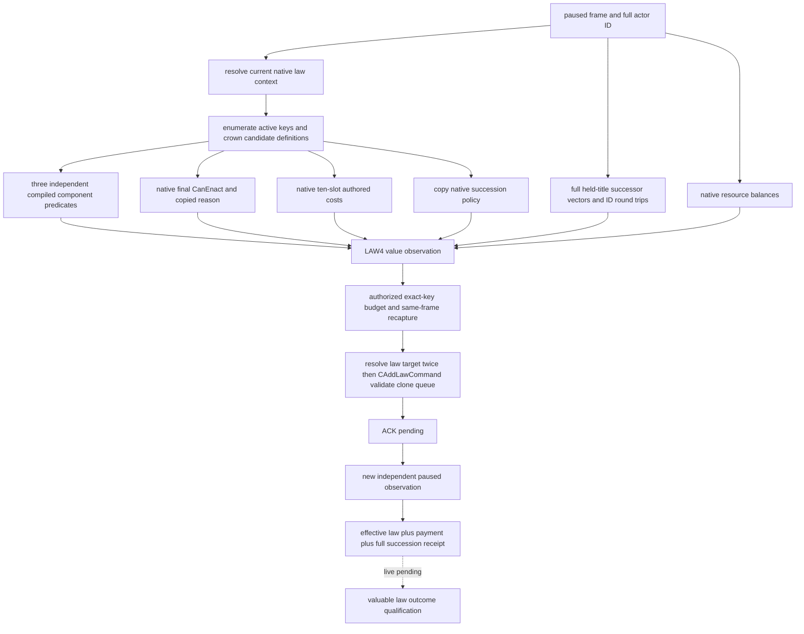

# CK3 1.20.0.2 crown law source and independent receipt

固定 Crozier 1.20.0.2 / Steam 25588574，EXE SHA-256 `AE1BA6FF060BA603842F6F4A2DED0AF4B7D3666B3DD271F75FB01B0DA8E81B2D`。只读 crown-action source 已达 **production-live primitive**（下方 R6 paused SDK）；选定法律提交与独立 receipt 仍为 **static-ready**，未执行升权。研究与离线 fixture 工作者不占用本地 CK3，实机证明由 root 唯一游戏所有者采集。

`ck3_12002_realm_law_source_adapter.hpp/.cpp` 把新版 active/candidate collection、原生最终 CanEnact、十槽费用、独立 compiled CanHave/CanPass 和真实 succession policy 接入既有 LAW2/LAW4/LAW5。LAW2 只投影 `crown_authority`；原始两组完整候选与最终费用仍由新版 final-terms 查询提供。策略必须自行给出有价值的具体 law key 与授权预算，接口不会默认选择 CA1。

原生最终判定有全局 override 提前返回分支。因此最终 CanEnact 为真不能当作独立 CanHave/CanPass 观测。新版 source 真实读取这两个分项，同时将 `engine_final_only` 与 `engine_final_permission_only` 显式标记为最终原生权限语义；LAW4 在此模式下信任最终 CanEnact，允许分项 false 而最终合法的原生结果。旧版默认两个标记均为 false，继续使用原有分项核验。旧 reader 的版本默认仍为 1.19；共享 core 新增显式 expected SHA 参数，1.20 从未伪报旧 SHA。

独立余额来自原生最终 affordability `0x310E710` 的费用 ordinal switch：actor `+0x1B0` 指向资源扩展，gold `+0x100`、prestige `+0x130`、piety `+0x110`、influence `+0x150`、merit `+0x170`，均为 q100000。威望不是 `+0x108`。空扩展在原生对应分支输出合法零余额；读取失败仍不可用。renown、herd、treasury、treasury_or_gold 和 barter_goods 尚不由本 source 提供余额，选定法律若需要这些非零费用，现有预算检查拒绝提交，不将未知余额替换成零。费用中的原生零值才会从 LAW4 charge 列表省略。

继承结果使用既有新版 nonwar realm 的冻结布局：持有头衔完整 ID 列表，头衔 `+0x150/+0x158/+0x15C` 的完整 successor 向量，以及 Character/Title 存储中的 full-generation ID 回验。并非只复制每个头衔的 first heir。crown 法律的 succession absence 来自原生 policy 字段，独立 receipt 仍核对所有持有头衔的继承向量；ACK 或 effective-law key 单独成立不代表完成。

新增 `ck3_12002_realm_law_source_resources_abi.json` 与 verifier 冻结七段 affordability switch/余额/跳表指令。集合、条件、command 和 realm 布局分别复用对应已冻结的 ABI 契约。本包离线 source fixture 在 MSVC `/Od` 和 `/O2`、`/W4 /WX` 下通过，覆盖真实 source → LAW4 → typed command queue → 独立 active-law/威望/完整继承 receipt；保持原状态的 ACK 验证失败、最终 native denial 不提交、未发布 renown 余额不提交、继承向量发生漂移不能宣称成功。

可核验 artifact：`Z:\ck3_mod_rewrite\artifacts\g2-offline-2026-10-01\law\source\build-final\result.json`。原始 harness RED 保留在同目录上层 `build/normal-run.log`：新 final-only 权限模式初次未透过旧 LAW5 的 group 核验，已按同一显式语义修正；原始失败未冒充游戏 capability RED。Paused source 已由下方 R6 SDK 验收；可负担且有价值的一次变更、独立实机付款/继承结果尚未执行。

共享语义 core 的旧版默认兼容另做一次与变更相称的回归：原 LAW2 snapshot 9 项、source adapter 7 项、LAW4 action 8 项、LAW5 binder 8 项，共 32 项，在 `/Od /W4 /WX` 下全部 GREEN。未重新跑旧版 native 大矩阵。结果：`Z:\ck3_mod_rewrite\artifacts\g2-offline-2026-10-01\law\source\legacy\result.json`，SHA-256 `aaf97b1641d3a4b2cb234df15d5b47eaf4c5bddfe2486c4fdc08f1551074d7bc`。

## 2026-10-01 actual crown-source RED: full successor count

Root R2 cold SDK 的 `012-ck3_query_realm_law_crown_action_private_v1.json` 在 actor `29829` / date raw `53169096` 返回真实 capability RED：`native_law_crown_action_observation_unavailable`。同一批 `009` final-terms GREEN 只证明法律目录、最终判定与费用可读，不能代替 LAW4 所需的完整头衔基线。

同批 `003` campaign-root 主头衔 `2141` 发布 **20 个有序完整继承候选 ID**。现有 LAW2 DTO 只容纳 16 个；生产 `Successors()` 在复制前拒绝 count20，传播为 `Titles()` / `title_baseline_unavailable`。Python `_valid_titles` 也有同一个 16 上限。修复仅把两个现有上限一起改为 32，完整保留顺序与所有 ID，不截断、不去重，不改变法律选择策略。

最小离线复现使用实际 actor/title/20 个 ID，内存地址、storage 和单个持有头衔由夹具提供。真实生产 `MakeRealmLawCrownSourceOperations12002().read_title_baseline` 在旧16返回不可用，候选32在 `/Od /W4 /WX` 下返回可用并逐项保留全部20个 ID。Python 生产标题/observation 校验与 query transport 函数也通过实际20列表的离线消费复现。证据在 `Z:\ck3_mod_rewrite\artifacts\g2-offline-2026-10-01\law\live-action-plan\crown-source-red\READY.json`；原 SDK RED 与旧16复现结果永久保留。

R2 诊断收口时这是实际数据必然触发的容量阻断，先达到 **static-ready** 修复；外层错误没有细分首个内部失败，因此尚不能声称它是唯一实机故障。没有完整非主头衔继承向量或原生 barony 持有列表的 saved packet，不推断它们的大小。随后 root 的 R6 fresh paused SDK 查询取得下方 source GREEN；整个阶段没有执行任何升权动作。

## 2026-10-01 R6 paused SDK: crown source production-live

Root `r6-crown-action-readonly-20261001T120433Z/003-ck3_query_realm_law_crown_action_private_v1.json` 实际 SDK 返回 `isError=false / available=true / paused=true / read_only=true`，EXE SHA 为上述冻结 1.20.0.2。actor `29829`，date raw `53169336`；本次 SDK public queried revision `2`，native snapshot revision / proof epoch `11`，二者是不同层的计数，不将保存的 revision 当作下一次查询参数。Packet SHA-256 `16e5a5c8c26193be965fe2eecd140378e815702f1d5c68c1a068b2c33914812f`；完整 proof：`Z:\ck3_mod_rewrite\artifacts\g2-offline-2026-10-01\law\live-action-plan\crown-source-red\r6-source-live-proof\proof.json`，SHA-256 `409e6627a8fd173323913bd05c7389cd1c656496c5ae2f02b4af99709084d81e`。

主头衔确认为 `2141`，完整持有头衔基线有 **10 行**：`2102/2106/2141/2142/2146/2173/2175` 各含 **20 个完整继承 ID**；`2103/2143/2174` 的继承列表为空。主头衔20成员与旧 R2 actual primary 集合完全一致，没有16截断。SDK 返回的精确顺序为 `[30253, 31074, 33435, 34040, 34867, 35050, 35072, 35278, 35637, 36459, 36907, 37380, 37502, 37679, 37854, 38293, 38563, 38822, 38988, 39308]`。

顺序语义必须区分：生产 source callback 的离线测试证明原生采集完整保留20个有序 ID；随后既有 LAW2 `CanonicalizeSnapshot` 主动把每个 successor vector 按 full ID 升序排列。因此上述 SDK 顺序是 **canonical ID 顺序，不是原生继承排名**。首 ID `30253` 不能用作 first heir；旧 R2 campaign 原生首 ID `38822` 与此不同不构成继承人发生变化的证据。本查询已提供完整集合基线，但没有发布当前原生有序排名或 first-heir 字段。

实际活动法律仍为 `crown_authority_0`。`crown_authority_1` 的原生 final `can_enact=true / blocked_reason=""`，仅 prestige 费用 `22300000`（223 威望），实际 prestige 余额 `214250000`（2142.5 威望），费用可负担；没有支付。CA2/CA3 final false，原生理由分别要求现有 CA1/CA2。其他独立余额 raw：gold `45790783`、piety `15550000`、influence `24350000`、merit `0`。

本包没有独立 cooldown expiry/remaining 字段。当前最终 native permission 允许 CA1，但不把它伪报为观测到 cooldown 剩余0：final-only 原生全局 override 可提前返回。原版 prospective20年变更冷却只属于此前静态 authored 规则，不是此帧实际到期日期。当前 partition 的 CA1具体收益仍未证实，因此不据合法且可负担自动升权。

早失败全部保留：首次 SDK 未启用 flag，返回 `Unknown tool`，属于 transport/harness RED；第二次 cached event14 frame 返回 `native_law_crown_action_frame_unavailable`，属于那次运行上下文不可用。root 取得 fresh paused frame 后同一修复源码直接 GREEN，没有追加代码变更。R2 的原始 capacity16 capability RED 和离线旧16失败也保留，不以新成功覆盖。

此里程碑只把 **readonly crown source** 升为 `production-live primitive`；typed law submit、付款/活动法律/继承 independent receipt 尚未实机执行，LAW4/LAW5 动作链仍为 `static-ready`，没有完整有价值的 LAW OODA 或升权动作。

## 2026-10-02：1.20.0.3 合法负虔诚导致完整材料读取 RED

新版 exact EXE 为 `94B55397ABB687A3DCD436805A5D885E6BE90FA6C693FEB44A9E3BBEEADE02A6`；root 的 [actual snapshot026](Z:/ck3_mod_rewrite/artifacts/g2-maintainer-2026-10-02/resume-12003/readonly-c3cd08bc-01/026-ck3_take_snapshot.json) 在 actor29829/raw53170608、paused 帧读到 piety raw **−104190000**（−1041.9）。
[final terms025](Z:/ck3_mod_rewrite/artifacts/g2-maintainer-2026-10-02/resume-12003/readonly-c3cd08bc-01/025-ck3_query_realm_law_final_terms_private_v1.json) 已确认 CA1 持续生效，但 [crown source027](Z:/ck3_mod_rewrite/artifacts/g2-maintainer-2026-10-02/resume-12003/readonly-c3cd08bc-01/027-ck3_query_realm_law_crown_action_private_v1.json) 返回 `native_law_crown_action_observation_unavailable`；没有重发法律动作。
source 的五种余额本来就是 signed int64；共享 binder `ValidResourceSample` 却拒绝任意 `amount_raw < 0`，真实 XAR 一次性虔诚支出形成的合法债务因此必然不能发布完整 observation。顶层错误未记录最早内部失败，修复后的实机读回仍需确认是否有其它原因。
最小修复只移除 binder 的余额负值拒绝，原样发布 debt，保留 key、完整性、重复项及 actor/frame/proof 检查；不截零，不更改费用、预算或 affordability。
同一生产 capture 回调链用实际 gold/prestige/piety 输入、`/O2 /W4 /WX /UNDEBUG` 做了单一 fixture：旧源在 capture 断言失败（退出3221226505），候选读取原样负虔诚并通过（退出0）、submit_calls=0；[结果](Z:/ck3_mod_rewrite/artifacts/g2-maintainer-2026-10-02/resume-12003/m6-law/signed-debt-fixture/RESULT.json)保留两次构建和原失败。
动作路径 `realm_law_enact_action_v1.cpp` 的独立 `CanonicalizeResources` 仍保留原负余额限制；此次只读修复不能升级为负余额场景法律提交资格。
当前为必要读取修复 **static-ready**，待 root 在正常 checkpoint 后统一新 DLL cold 验证；既有 CA1 loop 资格保留，optional 查询 RED 不阻断其它正式 nonwar 回合。

## 2026-10-02：v4 新 PID 真实 cold 已确认 signed 余额读取

root 的 `cold-law-sway-v4-01` 在新 PID **69040**、source `19a0e94510e8a41e0a7ee83e709a9dd914c5dc30`、v4 DLL `94872a6793f4a928c36961966db4be0e7c921e62e255d792eb0b7472d3eeb386` 上实际读取通过；完整[材料与构建绑定](Z:/ck3_mod_rewrite/artifacts/g2-maintainer-2026-10-02/resume-12003/m6-law/LIVE-LAW-DEBT-FIX-PROOF.json)保留原 RED。
source009 为 `available=true/read_only=true`，actor29829/raw53172768，public revision3、native/proof epoch2；五余额 raw 为 gold147435992、prestige193003500、piety **−103800000**、influence24400000、merit0。前三项与 fresh snapshot008 完全一致，负虔诚没有截零。
独立 finalterms007 与 source009 均确认 `crown_authority_1`；primary2141、完整10头衔及全部继承 ID 与先前已 qualified 的 CA1 材料相同，七行保留20个成员、三行为空。canonical ID 排序仍不表示继承排名；没有提交新的法律动作或重新领取原动作回执。
同包 prisoner011 的 schema6 集合 available/complete、count0，真实空集只证明当前无囚犯机会，不补赎金消费者或获得制度动作信用。
修复后的只读 source 现为 **production-live primitive**，既有 CA1 loop 保留并额外取得新版 cold persistence；独立动作余额限制和费用／预算仍未修改，不扩大为负余额 enact 资格，也不授予整个 M6 或新的 G2 里程碑。

## 2026-10-02：Murchad 原生拒绝原因超过材料容量

source `50e353bfa142194cc2a53372c1aec726ddd98da1`、v8 的 [actual finalterms004](Z:/ck3_mod_rewrite/artifacts/g2-maintainer-2026-10-02/resume-12003/murchad-v8-law-01/004-ck3_query_realm_law_final_terms_private_v1.json) 在 actor31853/raw53328360 读到 CA0 当前、CA1 native 可颁且 prestige 费用 raw14600000；saved snapshot005 的 prestige raw112231420、piety raw85985500 均为正。
[actual crown006](Z:/ck3_mod_rewrite/artifacts/g2-maintainer-2026-10-02/resume-12003/murchad-v8-law-01/006-ck3_query_realm_law_crown_action_private_v1.json) 返回真实 `native_law_crown_action_observation_unavailable`，不是先前 Council-only tools listing 的 harness RED；囚犯查询尚未执行，不能填空集。
该帧 CA2/CA3 完整 native_reason 分别为 **453/450 UTF-8 bytes**；生产 `Candidate` 调用 `AssignRealmLawGovernanceReasonV1`，后者以 `value.size() >= 192` 拒绝，合法的 blocked 候选因此使全量 crown 材料不可用。顶层 wire 不报告首个内部失败，已识别的确定性容量阻断不等于声称排除全部更早分支；[输入、源码与诊断](Z:/ck3_mod_rewrite/artifacts/g2-maintainer-2026-10-02/resume-12003/m6-law/murchad-readonly/ACTUAL-MURCHAD-CROWN-RED-DIAGNOSIS.json)保留原 RED。
先前4097容量的同一 focused production capture fixture 编译通过，但默认 stack 实际返回 `0xC00000FD`；[失败记录](Z:/ck3_mod_rewrite/artifacts/g2-maintainer-2026-10-02/resume-12003/m6-law/murchad-readonly/reason-capacity-fixture/RESULT-4097-STACK-RED.json)保留，不用扩大 fixture stack 冒充生产可用，v9 仅 compile-only、未启动。
实际必要修复只把 `kRealmLawGovernanceReasonCapacityV1` 从192改为 **512**，完整保留本次453/450字节原生文本与终止字节，不截断；法律适用性、最终权限、费用、余额、动作和 guard 均不变。native final-terms provider 原有4096字节上限未变，此 DTO 仅接受完整 **≤511字节**；超过仍按原谓词 literal unavailable，只有未来实际观测到更长 reason 才针对新实证处理。
唯一同一 production capture case 正在以512容量、默认 stack 验证旧192 FAIL、新512保留全 bytes PASS 与 CA1合法/费用同读；原4097 stack RED直接复用。新 DLL cold 尚待 root；不得把读取修复授予 Murchad 法律动作、囚犯机会、整个 M6 或复用 rogue CA1 信用。
