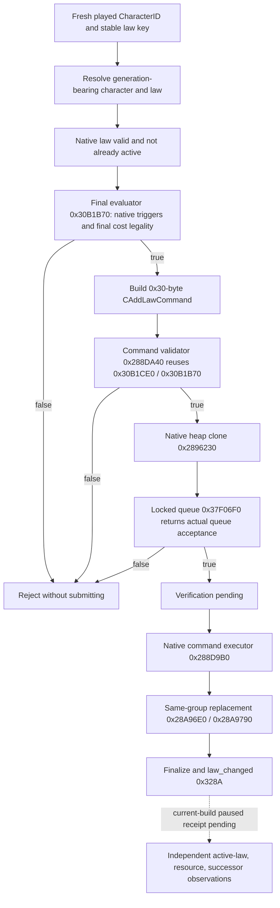

# CK3 1.20.0.2 realm-law typed enactment

本页只记录离线 exact-build 迁移；当前构建的 paused enactment、资源扣除和继承投影尚未实测。

冻结构建为 CK3 **1.20.0.2**，`binaries/ck3.exe` SHA-256 为
`AE1BA6FF060BA603842F6F4A2DED0AF4B7D3666B3DD271F75FB01B0DA8E81B2D`。
机器码、RTTI、vtable 和相对调用边由
`native_bridge/research/ck3_12002_realm_law_enact_mutation_abi.json` 固定，
`verify_ck3_12002_realm_law_enact_mutation.py` 只读取 EXE 文件，不连接游戏。

`CAddLawCommand` 的 0x30 字节布局保持 `+0x00` 主 vtable、`+0x18` 次 vtable、
`+0x20` 完整 CharacterID、`+0x28` 临时 CLaw 指针。新版主 vtable 为 `0x47600F8`，
次 vtable 为 `0x4760190`。native clone 自己分配并复制这些字段；locked queue 消费其所有权。
原生 serializer 仍使用 character 字段 `0x6EC`、law 字段 `0x2FF2`，命令 class key 为 `0x2FF3`。

**实质 ABI 变化：**新版确认 popup 的 law 指针位于 `+0x130`，而旧版为 `+0x160`。
确认入口 `0x41D49C0` 调用 `0x9E16B0(command, flags)`；这个 GUI wrapper 在 queue 返回后
销毁临时对象，没有保留 AL。禁止把它套入旧版的 `bool(manager, command, flags)` 签名，
也禁止把它返回的 AL 当作 ACK。新版适配器复用原生 clone，再直接调用同一 locked queue，
保留该 queue 的明确布尔结果；submit flags 仍为 `0x0E`，manager 为 `module+0x5CC1240`。

executor 的次对象 `this` 是主 command `+0x18`。它以原生 source flags `7` 构造 law mutation
context，遍历当前 active law vector，以目标 `CLaw+0x40` 的 group identity 匹配旧项，
删除旧项并加入目标项，最终发出 `law_changed`。适配器只提交命令，绝不直接调用 executor 或 mutation。

移植沿用 LAW2–LAW8 的稳定 key、request、charge vector、pending 和 independent receipt。
合法且可负担不是有价值；本次未修改 law utility，未强制实施 Crown Authority 1。
ABI verifier 和 fixture 只证明机器码来源与 typed handoff，不能证明游戏已实施法律。

待实机项为：现有 application-main transport 提交一条有策略价值的法律；后续 paused snapshot
证明 effective law、真实资源变化与 successor/title projection；保存与新 PID 续接。

离线验证已完成：Python exact-file verifier **GREEN**（17 instruction spans、24 runtime-function entries、
12 relative edges、8 vtable pointers、2 RTTI anchors）；C++ verifier读取同一冻结 PE 文件，
command fixture覆盖 queue retention / final denial / queue rejection / submit disabled 四个真实交接分支。
两套可执行文件均通过 MSVC `/Od` 与 `/O2`、`/W4 /WX`。测试只启动自己编译的 fixture EXE。
首轮 fixture 编译因 `Fixture` 显式 alignment 引入 C4324 而 RED，调整 fixture 字段顺序与显式尾部 padding
后成功；这是 harness 编译问题，不是 native law capability RED。证据与源文件哈希在
`artifacts/g2-offline-2026-10-01/law/mutation/result.json`。
