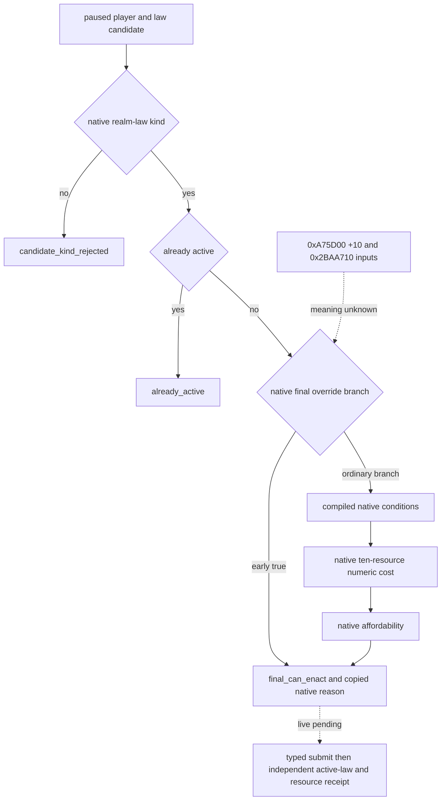

# CK3 1.20.0.2 realm-law final terms

本专题固定 Crozier 1.20.0.2 / Steam build 25588574，EXE SHA-256 `AE1BA6FF060BA603842F6F4A2DED0AF4B7D3666B3DD271F75FB01B0DA8E81B2D`。状态为 **static-ready**；2026-10-01 的文件反汇编、生产 reader 和离线 fixture 不冒充 paused live。

原生 GUI `CanEnact` `0x41D5270` 先解析玩家完整 CharacterID，并检查 `CCharacter+0x1C0` 上下文，再调用 law kind `0x30B2B40`、当前已生效 `0x2BA97F0` 与最终条件/可负担 `0x30B1B70`。最终函数的普通分支依次检查 law 的 compiled 条件块，计算费用，再交给原生 affordability；我方不重写条件或把合法、可负担解释为值得执行。

`0x30B1B90..0x30B1BA9` 另有真实原生 early-true 分支：`0xA75D00` 返回对象 `+0x10` 为真且 `0x2BAA710(FullCharacterID)` 为真时，直接返回 true，未经过下面三个 compiled 条件块。两项输入的完整语义目前**未查明**，账本画为 unknown；不能凭最终 true 伪造已经单独读取了 can_have / can_pass。最终 CanEnact 仍是原生实施许可，选定法律消费器可显式使用 `engine_final_only` 语义，保留未拆开的 component 状态。

费用 getter `0x30B26D0(out80, compiled_cost, FullCharacterID)` 必须接 **CLaw+0xC40**，旧版 `+0xCD8` 已失效。getter 构造 actor scope，调用 `0x310CEE0`；该 evaluator 使用十个 `0xF0` compiled authored 块，输出十个 signed int64 的 q100000 值。blocked 与 active candidate 仍计算费用。顺序沿用既有 transport：gold、prestige、piety、renown、influence、herd、treasury、treasury_or_gold、merit、barter_goods。treasury_or_gold 是原生分派费用，不是额外可独立累加的余额。

完整 reason gate `0x30B1CE0(law, actor, std::string*)` 覆盖 actor 上下文、law kind、已生效及最终条件；短路原因可由原生字符串输出。reader 用原生 MSVC 32 字节 string 的空 inline 状态调用，复制 UTF-8 bytes，再调用原生 destructor `0x856050`，不向 Python 暴露借用指针。getter 的 bool 必须与上述最终 CanEnact 一致。

新增 `ck3_12002_realm_law_final_terms.hpp/.cpp` 复用旧 value DTO，却独立绑定新 RVAs 与 cost offset；旧 1.19 ABI 保留。`ck3_12002_realm_law_final_terms_abi.json` 和 verifier 冻结八段指令、十条调用边与六条布局/scale 指令。生产 transport 继续使用 `realm-law-final-terms-private-read-v1`、两个治理 group、十个 raw cost slot，供既有只读 Python query 使用。

该 reader 解锁新版真实 law candidate 最终费用与阻断原因的后台施工。实机仍须验证当前 active law、候选 CanEnact、合法有价值的单次变更，以及独立的 active-law/resource/succession 结果；CA0→CA1 的旧版 207 prestige 例子不是新版费用常量，也不是策略收益。未加入通用宗教研究。

2026-10-01 离线验证：固定 EXE 的 24 项指令段/调用/布局检查 GREEN；新 cost offset、十个 signed raw slots、blocked/active/kind-rejected 与原生 inline/heap reason 复制 fixture，以及实际新版 native memory collections → terms → 原有 JSON serializer fixture，均在 MSVC `/Od` 与 `/O2`、`/W4 /WX` 通过。artifact 位于 `artifacts/g2-offline-2026-10-01/law/terms/abi-result.json` 与 `terms/wire-fix/result.json`。初次 wire linking RED 是 runner 未链接既有 failure-name 映射函数，修正后 GREEN；该失败日志保留在 `terms/wire-Od/compile.log`，属于 harness RED，未运行游戏。

`research/fixtures/ck3_12002_realm_law_final_terms_wire.json` 来自 actual provider / serializer，使用明确标注的 synthetic memory 与 native-call operations；对应 provenance 固定来源哈希。其 actor/date/cost/reason 不是实机读数，Python 仅在 fixture driver 中添加既有 result envelope。既有 query step 与 `realm-law-final-terms-private-read-v1` 字段保持兼容。
