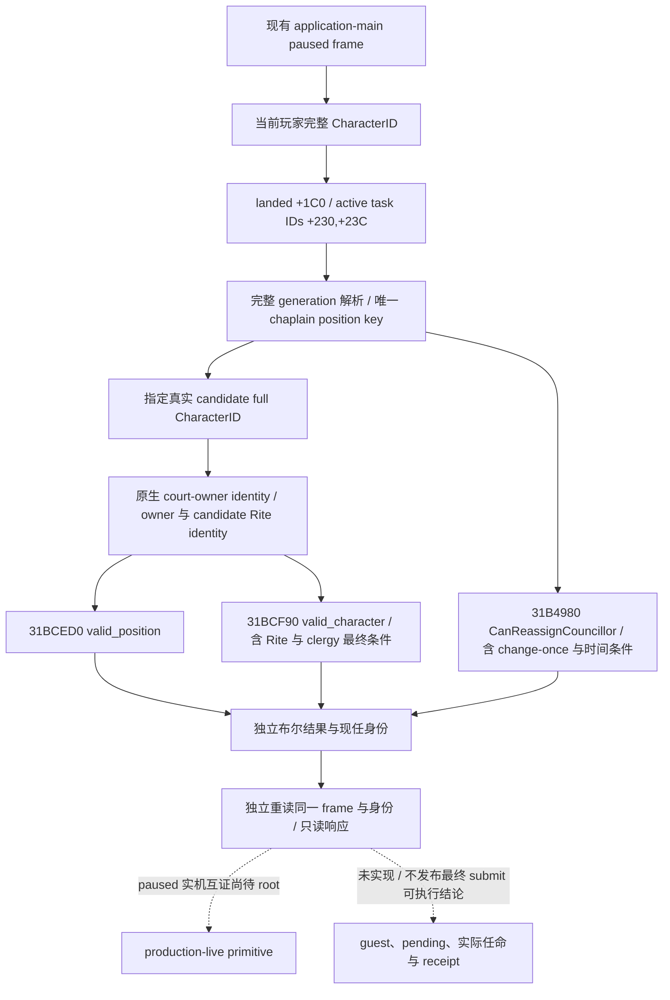

# CK3 1.20.0.2 宫廷祭司任命资格

本包研究当前玩家的 `councillor_court_chaplain`，提供指定真实候选的只读原生资格结果。冻结 EXE 为 CK3 `1.20.0.2`，SHA-256 `AE1BA6FF060BA603842F6F4A2DED0AF4B7D3666B3DD271F75FB01B0DA8E81B2D`。本包不执行任命、转换、政策或战争操作；尚无新版实机资格。已有[枢密院候选](ck3-1.20.0.2-council-candidates.md)与[最终 gates](ck3-1.20.0.2-council-gates.md)是原生入口依据，不重新研究通用枢密院。

## 原版规则与原生最终入口

`common/council_positions/00_council_positions.txt:554` 定义 learning 为主技能，`valid_position` 排除无地冒险者和游牧政府。`valid_character` 在有礼部时转用 minister 规则，否则调用 `can_be_court_chaplain_trigger`，并排除 ceremonial liege。

`common/scripted_triggers/00_councillor_triggers.txt:131–175` 的祭司候选规则包括基础内阁条件、非配偶/宰相、统治者 Rite 的 clergy 性别许可、**候选 Rite 与统治者 Rite 相同**、世俗神权任命对领主类型的限制、逃狱关系、绝罚与婚姻条件。同 Faith 不等于满足同 Rite。此处只是原版输入账本，provider 不自行翻译这些条件。

该文件 `:178–186` 的 `can_appoint_own_court_chaplain_trigger` 有宗教权威本人、非 fixed appointment 与礼部三个分支。位置的 `can_fire`、`can_reassign`、`can_change_once` 使用此 trigger；`can_reassign` 还允许没有祭司的空席。`auto_fill` 另外区分原版 AI、礼部与 `clerical_appointment_ruler`，不能据此推定玩家的最终任命权限。

`common/religion/doctrine_types/20_doctrines.txt` 的 clerical gender / marriage / succession 组提供上述参数。clerical function 组定义祭司修正；上述任命 trigger 没有单独按 function 组筛候选。本包不推导战斗或征募策略。Rite 的有效教义覆盖由[当前 Rite doctrine reader](religion_doctrine12002_rite.md)处理：原生查询读取实际 Rite 有效行，不能拿 Faith main Rite 或无条件合并替代；这里直接使用编译后的原生最终布尔值。

| 观测 | exact RVA / ABI |
|---|---|
| position `valid_position` | `0x31BCED0(CCouncilPosition*, owner CharacterID)`，编译条件 `position+0x1B68` |
| position `valid_character` | `0x31BCF90(CCouncilPosition*, candidate CharacterID)`，编译条件 `position+0x1C38` |
| 当前 task `CanReassignCouncillor` | `0x31B4980(ActiveCouncilTask*, nullptr tooltip)`；GUI reflection `0x15CA30 → 0x11616E0 → 0x31B4980` |
| 原生候选 court owner | `0x28BFC70(CCharacter*)`，复用候选 producer 既有调用证据 |

`CanReassignCouncillor` 先处理任务 auto-fill/vacancy，再对 `task+0x18 → type+0x40` 的 position 求值 `can_reassign`，随后调用 `0x31BD1C0` 处理 `can_change_once` 与原生时间条件。返回的 false 是已观测拒绝；读取失败与无 task 另行表达。它是实际位置更换权限，不能被教义名称或 CanFire 代替。

这些结果能直接回答指定在朝候选是否满足原生 clergy 条件及该位置能否换人。它们不代替完整 candidate collection、guest recruitment、pending interaction 或实际 submit 的独立 final gates，不把三个布尔合取标为最终动作可执行。

## 验证与交付

原生树及 ABI 在 provider 实现前落盘。现在独立 [header](../../ck3_autonomous_player/native_bridge/include/xar_bridge/religion_rite_governance12002_clergy.hpp) / [reader](../../ck3_autonomous_player/native_bridge/src/religion_rite_governance12002_clergy.cpp) 提供 `BindClergyAppointmentImage12002(base,sha)` 与 `ReadClergyAppointment12002(bindings,capture_epoch,candidate_character_id,observation)`。调用者使用既有 application-main owner，并设置真实 `application_main_thread_id`。当前玩家和完整 candidate ID 必须实际解析；没有默认空候选。

reader 从当前玩家 landed extension 的 active-task 集合解析唯一 chaplain position，读取实际 incumbent；三个独立 final predicates 指向上表的新 RVA。候选 court owner 身份另列，防止把另一个宫廷的 `valid_character` 结果误作当前玩家可任命结果。读后再次核对 actual CoreSnapshot、完整玩家/候选/task 身份、现任、Rite 和 court owner。无 chaplain task 是 available 的 position absence；native false 是 available 的拒绝，native 未取得时保持 unavailable，不能用零值代替。

验证与 artifact 位于 `Z:/ck3_mod_rewrite/artifacts/g2-offline-2026-10-01/religion-governance/clergy/`：

- [`religion_rite_governance12002_clergy_research.py`](../../ck3_autonomous_player/native_bridge/research/religion_rite_governance12002_clergy_research.py) + 冻结 ABI manifest：8 spans、5 registration/call edges、1 literal、3 stock hashes 与 14 production constants GREEN。两个 position predicate 与 court-owner 调用复用已完成 council producer 的原生证明。
- [`religion_rite_governance12002_clergy_fixture.py`](../../ck3_autonomous_player/native_bridge/research/religion_rite_governance12002_clergy_fixture.py)：实际 reader → 生产 serializer 在 MSVC C++20 `/W4 /WX /Od` 与 `/O2 /DNDEBUG` 下各 23 checks GREEN。覆盖真实 vacant/occupied task、独立 native false、Rite 零与高位 generation、foreign owner context、合法 position absence、玩家/候选/task 完整身份、paused、读失败与 frame 变化。每配置保留 7 份实际 JSON。
- `fixture-001/Od/build.log` 保留首轮 harness RED：fixture 对 `optional<uint32_t>` 使用有符号零 literal，`/WX` 将 C4389 视为失败。只修 fixture literal 为 `0U`；production reader 无改动。新结果保存在 `fixture-002/fixture-result.json`，不覆盖首轮。

当前状态为 **`static-ready`**。该独立 typed readonly query 尚待中央注册与 root paused 实机互证；没有执行任命，未增加 G2 完成数，也未把 fixture、三个布尔值或 command ACK 算作 production OODA。所有依据来自冻结 EXE/stock 文件与离线夹具，未使用 CK3 进程、内存、pipe、桌面或 Steam。
