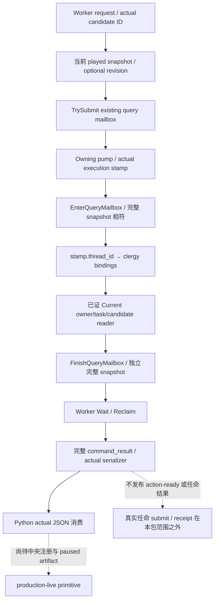

# CK3 1.20.0.2 祭司资格只读 transport

此增量将[已冻结的 clergy reader](ck3-1.20.0.2-religion-clergy-appointment.md)接到现有 owning-thread query mailbox。首批七文件保持不变；不执行任命、不改策略、不研究战争。EXE SHA 为 `AE1BA6FF060BA603842F6F4A2DED0AF4B7D3666B3DD271F75FB01B0DA8E81B2D`。

| 项目 | 固定值 |
|---|---|
| selector | `query-player-clergy-appointment-v1` |
| domain | `player_clergy_appointment_v1` |
| backend | `ck3-1.20.0.2-native-player-clergy-appointment-v1` |
| 独立默认 OFF flag | `XAR_CK3_ENABLE_G2_PLAYER_CLERGY_APPOINTMENT_PRIVATE_QUERY_V1` |
| 结果位置 | `command_result.result.player_clergy_appointment` |
| 中央 named executor 建议 | `permitted_executor_clergy12002`，由中央注册 |

请求必须明确带 `candidate_character_id`，其取值沿现有 council transport 的 positive int32 full CharacterID 范围；缺字段、零及越界不提交邮箱。候选仍须在 owning callback 中由实际 Character storage 完整身份解析。`expected_snapshot_revision` / `expected_revision` 两个别名可选；若同时指定则必须相同，不同于当前 revision 时在 worker handler 进入邮箱前拒绝。请求没有可选 owner：owner 始终来自当前 played Character。

示例：`{"candidate_character_id":100663301,"expected_snapshot_revision":701}`。其中 ID 只是离线 fixture 的真实候选值，不是实机推荐候选。

## 实际 callback 与响应

独立[header](../../ck3_autonomous_player/native_bridge/include/xar_bridge/religion_rite_governance12002_clergy_mailbox.hpp) / [implementation](../../ck3_autonomous_player/native_bridge/src/religion_rite_governance12002_clergy_mailbox.cpp)提供 `IsPlayerClergyAppointmentPrivateStep12002`、`ParsePlayerClergyAppointmentRequest12002`、`ExecutePlayerClergyAppointmentMailbox12002`、`RunPlayerClergyAppointmentMailbox12002`、`HandlePlayerClergyAppointmentPrivate12002` 与 `SerializePlayerClergyAppointmentResult12002`。源码在 flag 未定义时不提供 active handler implementation；中央 CMake option、named permit、bridge step 分派和 Python 注册由对应 owner 接线，本包不修改共享文件。

worker 捕获实际 published snapshot/revision，然后 `TrySubmitMainThreadQueryV1` 排队。现有 application-main pump 执行 callback，`EnterQueryMailbox` 用完整 published snapshot 校验 owning stamp；callback 把真实 `stamp.thread_id` 写入 clergy bindings，再调用指定候选的已证 provider。读后 `FinishQueryMailbox` 比较完整 snapshot，worker `WaitForMainThreadQueryV1` / `ReclaimMainThreadQueryV1` 完成后才序列化。原生读取失败仍可返回同帧 typed unavailable；帧变化不输出成功响应。

外层完整输出 `protocol_version=1`、`accepted=true`、`private_build=true`、`read_only=true`、`advertised=false`、版本/EXE SHA、domain/backend、public snapshot revision 与 date。内层保持原始 clergy schema，区分 `available` 与 `unavailable`，包含实际 owner/candidate、task/incumbent、Rite、court-owner context 和三个独立 native final booleans。`capture_epoch` 来自 owning pump，**不冒充 public revision**。`action_eligibility_complete=false` 固定保留；native false 是可用观测，不是 transport 错误。

## 一次增量验证

[`religion_rite_governance12002_clergy_mailbox_tests.py`](../../ck3_autonomous_player/native_bridge/research/religion_rite_governance12002_clergy_mailbox_tests.py)实际链接 Core、已冻结 provider、现有 query envelope / mailbox、protocol 与新 handler；不链接或运行首轮组件 test main。fixture 在真实 worker 线程排队，由 fixture owner pump Drain，再 Wait/Reclaim；使用现有 primary offline `permitted_executor`，**没有声称已验证中央 production named permit**。bare fixture adapter 的 unwrap 使用 test-only identity stand-in，没有调用游戏模块。

MSVC C++20 `/W4 /WX /Od` 与 `/O2` 各 **57 checks GREEN**。每配置输出七份实际 command_result：`vacant-valid`、`incumbent-reassign-denied`、`candidate-native-denied`、`foreign-context`、`position-absent`、`candidate-unavailable`、`context-unavailable`；Python `json` decoder直接检查实际 metadata、指定候选、native false / null 区分与不可冒充 action 的字段。另保留实际完整 frame 变化的拒绝 receipt，ticket 仍已回收。真实 Handle stale request 和 missing candidate 在排队前被拒绝。首轮 23 组件 checks 未重复。

冻结 native receipt 位于 `Z:/ck3_mod_rewrite/artifacts/g2-offline-2026-10-01/religion-governance/clergy-mailbox/attempt-001/result.json`，SHA-256 `56e59c91bbf1dab76b7e8121ad1489b1b5f6ff32887bb426e308b63e72699258`。两配置 actual wire 保存在同目录 `Od/wire` 与 `O2/wire`。第一轮 mailbox fixture 即 GREEN，没有新的失败尝试；先前 component harness RED 仍保留在其原目录。

状态为 **`static-ready`**。已把实际 wire 交给 Python/MCP owner，SDK 增量由其单独记录；中央 selected DLL/共享注册及 root exact-build paused 互证仍未在此包完成。未触碰 CK3、进程/内存/pipe、桌面或 Steam，未执行任命，也未提升 G2 完成数。提交推送由 root 完成。
