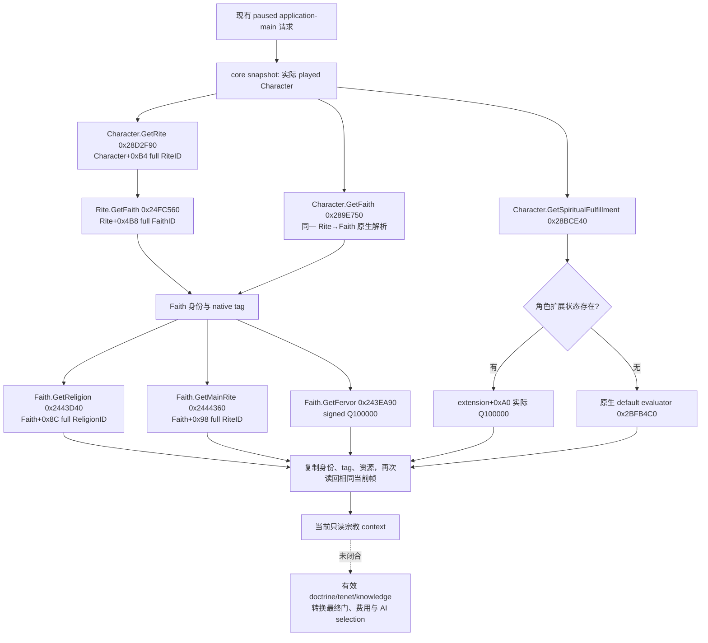

# 1.20.0.2 宗教当前上下文：Rite → Faith → Religion

本专题在项目所有者 2026-10-01 明确允许研究宗教事务后施工；同时遵守其停止战争研究的最新指令。它只研究、读取当前宗教身份与资源，没有战争、宗教动作或 counter-policy。

冻结游戏为 CK3 **1.20.0.2 Crozier / Steam build 25588574**，`ck3.exe` 大小 `101039736` bytes，SHA-256 `AE1BA6FF060BA603842F6F4A2DED0AF4B7D3666B3DD271F75FB01B0DA8E81B2D`。新版 stock 结构、转换规则与真实 AI 脚本入口见 [religion-stock](ck3-1.20.0.2-religion-stock.md)。本包 getter/字段已 **static-confirmed**；实际只读 library provider 与 serializer 已 **static-ready**，中央 query/mailbox、Python/MCP 注册和真实 paused 查询尚未完成。没有本包 live artifact。

## 身份关系不是旧字段换版本号

角色 `+0xB4` 是 **full RiteID**，不能叫作 FaithID。原生 `Character.GetFaith` 先解析这个礼仪，再解析 `Rite+0x4B8` 的 full FaithID。Faith 有自己的 `main_rite`；玩家采用的 Rite 可以与它不同。Faith 的 Religion 来源于 `Faith+0x8C`，不是玩家 Rite ID 的别名。

当前 `ck3_12002_phase_character.cpp`、foundation/core 和 culture-relations reader 没有将 `Character+0xB4` 当作 Faith 读取的生产实现；宗教域此前未实现。旧版 ABI/旧 combat reader 不在此次修改范围。



这是原生状态解析树；它不冒充宗教 AI 的选择树。图中最后的虚线仍是待研究输入，当前 context 不以它们的 schema 或 `null` 宣称完整宗教决策可用。

## 已闭合 ABI

| 原生方法 | RVA | ABI / 结果来源 |
| --- | --- | --- |
| `Character.GetRite` | `0x28D2F90` | `Rite*(Character*)`；角色 `+0xB4` |
| `Character.GetFaith` core | `0x289E750` | `Faith*(Character*)`；先 Rite，再 `Rite+0x4B8` |
| `Character.GetFaith` reflection thunk | `0x28D2F40` | tail jump 到上述 core；`GetFaith` 八字节 immediate 在 `0x568AB2`，callback LEA 在 `0x568B20` |
| `Rite.GetFaith` | `0x24FC560` | `Faith*(Rite*)`；注册 callback LEA `0x4EF9E0` |
| `Faith.GetReligion` | `0x2443D40` | `Religion*(Faith*)`；`Faith+0x8C` |
| `Faith.GetMainRite` | `0x2444360` | `Rite*(Faith*)`；`Faith+0x98` |
| `Faith.GetFervor` core | `0x243EA90` | `int64_t*(Faith*, int64_t* out)`；写 `Faith+0x2F8`，返回同一 `out` |
| `Faith.GetFervor` thunk | `0x2444490` | 实际 call `0x243EA90`；注册 callback LEA `0x4D5654` |
| `Character.GetSpiritualFulfillment` core | `0x28BCE40` | `int64_t*(Character*, int64_t* out)`；缓存或原生 default |
| spiritual fulfillment default | `0x2BFB4C0` | **`int64_t*(int64_t* out, Character*)`**；参数顺序与 public core 不同，只由 core 调用 |
| `Faith.GetTag` core | `0xB801A0` | 返回 `Faith+0xE0` 的 CString 地址 |
| `Religion.GetTag` core | `0x247CA20` | 返回 `Religion.definition(+0x20)->CString(+0x28)` |
| `Religion.GetID` reflection thunk | `0x2481A30` | 读取 `Religion+0x10` 的另一个整数，**不是** full-generation ref |
| `Rite.GetTenets` collection accessor | `0x1CF98A0` | 返回 `Rite+0x758` collection 地址；row type/layout 尚未闭合，不进入当前 provider |

生成代际检查是 native getter 本身的语义：masked index 用于 storage lookup，目标对象 `+0x8` 必须与完整 32 位 ref 相等；失败返回原生 null object。当前 provider 以源 ref 与 getter 结果验证相同身份，保留整个 32 位值，支持其高位 generation。`0xFFFFFFFF` 是合法 absent ref；零 ref 并不被误判为 absent。Religion 的 reflection integer 不替换、截断或重新命名为 full ReligionID。

`Rite.GetName` core `0x24F6E40` 会根据定义或持久自定义名称生成显示值，不能充作 stable authored key。当前 context 因此公开 Rite ID，公开实际 Faith/Religion native tag，未编造 Rite key。新宗教有效 doctrine 合并的 stock 规则已经明确，但原生完整 collection/layout 未闭合，不能借 `Rite.GetTenets` 的地址 accessor 宣称已能读完整条目。

## 实际 provider 与接线接口

实现为 [ck3_12002_religion_context.hpp](../../ck3_autonomous_player/native_bridge/include/xar_bridge/ck3_12002_religion_context.hpp) 与 [production reader/serializer](../../ck3_autonomous_player/native_bridge/src/ck3_12002_religion_context.cpp)。入口为 namespace `xar::ck3_12002::religion`：

```cpp
Bindings BindReligionContextImage12002(uintptr_t module_base, string_view exe_sha);
bool ReadPlayedReligionContext12002(const Bindings&, uint64_t capture_epoch, Context&);
string SerializePlayedReligionContext12002(const Context&);
```

它复用现有 `CoreBindings` 与 `ReadCoreSnapshot`，subject 只能是实际 played Character。在 paused application-main 的现有 pump 中读两个一致的原生 context；自身不发现、附加或启动进程，不切换 UI，不入队任何命令。bind 只在上述 exact SHA 启用。当前首轮 nonwar DLL 完成包不等待本增量；中央 owner 完成下一次 library/query 注册后才可进入 paused 实机。

wire schema 为 `ck3_12002_religion_context_v1`，包含 `available`、`unavailable_reason`、`capture_epoch`、`date_raw`、`played_character_id`、`rite_id`、`faith_id`、`religion_id`、`faith_main_rite_id`、`faith_key`、`religion_key`、`faith_fervor_raw`、`spiritual_fulfillment_raw` 与 `raw_scale=100000`。没有地址、任意角色选择或本机文件路径。

合法不存在身份使用 `null`，已观测零使用 `0`，native 读取失败使 context `available=false` 并保留明确 failure key。Spirit getter 的 extension 缺失会调用原生 default 求值，不手写零。当前 readiness 只适用于这些独立已解锁观测；doctrine、tenet、knowledge、转换门与费用并未进入 context，不能据此执行改宗/改革或宣称整套宗教 OODA 可用。

## 已完成验证与后续

[exact verifier](../../research/religion12002_native.py) 已记录 19 个完整函数、10 个明确 registration slice、25 条语义指令、3 个精确类 RTTI，以及 14 个实际 provider 常量。[冻结 ABI manifest](../../research/religion12002_native_abi.json) 保留实际原始字节与各完整 span SHA。特别是 `GetTag` reflection wrapper 的 `.pdata` 有 chained body，记录覆盖完整 body，未把第一小段误作整函数。native artifact 在 `Z:/ck3_mod_rewrite/artifacts/g2-offline-2026-10-01/religion/native/`。

[组件 fixture](../../ck3_autonomous_player/native_bridge/src/ck3_12002_religion_context_test.cpp) 链接实际 core/provider/serializer；[runner](../../research/religion12002_run_tests.py) 以 MSVC `/W4 /WX /Od`、`/O2` 各通过 **20 项检查**，每种模式的 **5 份实际 C++ JSON**由 Python 解析。包括 actor Rite≠main Rite、不同 full Faith/Religion refs、高位 generation≠reflection integer、零值、合法 absent、原生 default、读失败和真实两次样本不同；它没有调用游戏 EXE 中的函数。fixture receipt 在 `Z:/ck3_mod_rewrite/artifacts/g2-offline-2026-10-01/religion/provider/result.json`。

可复跑：

```text
python research/religion12002_native.py --exe <frozen-exe> --output-dir <Z-artifact-dir>
python research/religion12002_run_tests.py --output-dir <Z-artifact-dir>
```

中央 query 与 Python/MCP 接线后，最小实机验收是同一 paused frame 查询当前玩家 context，并在后续独立采样验证一致身份和定点资源。真实 source artifact 才能提升该 primitive 的 live 资格。有效 doctrines/个人 tenets、knowledge、完整转换/改革成本与最终门、原生 AI 的 scheduler/desire 输入是后续施工入口；这轮没有等待、使用或研究战争分支。
