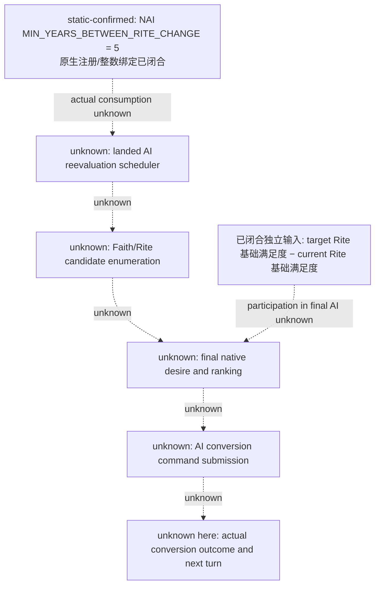
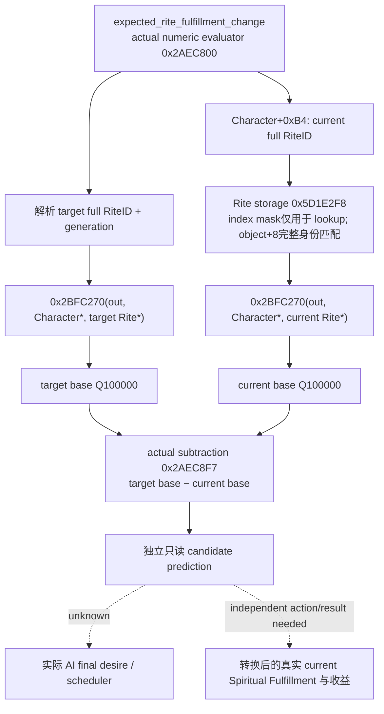

# CK3 1.20.0.2 宗教转换：AI 调度账本与候选基础满足度

2026-10-01 的历史工作包在当时宗教研究开放、战争研究停止的安排下，只交付转换输入，没有转换执行、我方宗教策略、战争或 holy order 研究。2026-10-02 已全面开放宗教与 holy order，2026-10-03 又全面授权战争与战斗研究、实现、策略和实机验收，撤销旧仅非战争及战争暂停限制；这些旧范围不再限制后续施工。授权不提升下文 readiness；实机保留唯一原普通罗贝尔 `29829` campaign、原生 AI 研究优先、exact-build 绑定与最小化/noFocus，由 ROOT 单一 owner 操作。冻结游戏仍为 **1.20.0.2 Crozier / Steam25588574**，EXE SHA-256 **AE1BA6FF060BA603842F6F4A2DED0AF4B7D3666B3DD271F75FB01B0DA8E81B2D**，大小 `101039736` bytes。

**状态分开记录：候选基础精神满足度的实际只读 provider/serializer 为 `static-ready`；原生 AI 最终 desire、候选选择和调度仍为 `research`，没有闭合。** 本包没有真实 paused artifact，不能写 `fixture-live`、`production-live primitive/loop` 或完整宗教 OODA。原版结构与脚本入口见 [religion-stock](ck3-1.20.0.2-religion-stock.md)，当前身份与资源见 [religion-context](ck3-1.20.0.2-religion-context.md)。

## 原生 AI 调度不能由一个 define 冒充

`common/defines/ai/00_ai.txt:1839–1842` 把 `NAI.MIN_YEARS_BETWEEN_RITE_CHANGE=5` 描述为 landed rulers 重新评估 Rite 的最短年数。该文件 SHA 为本包 ABI manifest 中的 `stock_definitions` 值。原生有唯一 RTTI `CDefineRegistryHelper_NAIMIN_YEARS_BETWEEN_RITE_CHANGE`，其 name RVA `0x581BBA0`；define 名称 RVA `0x45AE990`，注册 body `0x1A62780`，实际整数绑定地址 `0x5C68824`，bound-check `0x1A629E0`。这些证据闭合的是**参数身份和注册**。

本次 RIP 引用定位只找到定义注册/元数据相关指令，尚未定位 actual AI scheduler 对此值的消费。不能把注册器写成 AI evaluator，也不能据此断言该版本每五年必转换一次。更不能把玩家 `faith_conversion_recently_converted` 的 UI 冷却套到 AI 上：原版 `pam_on_conversion_effect` 只在 `is_ai=no` 写玩家五年冷却，stock 专题已保存独立来源。



图中候选输入确实由原生脚本数值查询公开；其参与上述最终 AI 选择的调用关系尚未证明。当前 provider 不发布 `final_ai_desire` 的伪值，也不对 AI 转换频率或概率作推断。

## 已闭合、可直接施工的候选输入

原生脚本查询 `expected_rite_fulfillment_change` 的描述是：针对角色与目标 Rite，预期**基础**精神满足度相对当前 Rite 的变化。实际注册 `0x57E300` 把这个名称绑定到 factory vtable `0x4786168`；`+0x08` 指向 factory `0x2AEBCF0`，构造实际 trigger vtable `0x4784E78`。其中 **`+0x100 → 0x2AEC800`** 才是实际数值 evaluator，`+0x60` 是 scope 类型声明，不能混用。



原生基础 evaluator 的 ABI 为 **`int64_t*(int64_t* out, Character*, Rite*)`**，返回同一 `out`。参数顺序不同于 current context 的 `Character.GetSpiritualFulfillment(Character*,out)`。它以角色 native tenet/trait 输入、`Character+0xF8` 输入集调用 `0x2BFAC30`，从 `0x28C3AE0` 的 modifier 集读取 key `0x25D`，加上原生生成的各项贡献，最后按两个原生 bound 值 clamp。冻结 `common/defines/00_defines.txt:888–900` 写 `MIN_SPIRITUAL_FULFILLMENT=-100`、`MAX_SPIRITUAL_FULFILLMENT=100`，以及 personal/core/permitted tenet 与 Religion trait 倍数。本包直接调用完整原生 evaluator，没有在我方代码重新推算这些贡献。

因此以下值必须分开：

| 已观测数值 | 含义与边界 |
| --- | --- |
| `current_rite_base_raw` | 当前 Rite 条件下该角色的原生**基础**满足度，Q100000 |
| `target_rite_base_raw` | 目标 Rite 条件下同一角色的原生**基础**满足度，Q100000 |
| `expected_base_change_raw` | 上述两值相减；可为负、零、正 |
| context `spiritual_fulfillment_raw` | 当前角色实际缓存/default 求值的精神满足度；不被上述基础值替代 |
| 转换后实际收益 | 本包没有执行或测量；必须由 action 后独立 state/next-turn 读回证明 |
| 最终 AI desire | 尚未闭合；不能把基础 delta 改名为最终 desire |

同 Rite 目标得到基础 delta=0 仍是有效预览；它不表示允许转换到当前 Rite。目标属于同 Faith、可转换、有足够知识或可以付款，都由独立 final-terms/provider 判断。本包不会用满足度正值替代这些最终门。

`knows_rite_level` 的原生 body `0x2BDBDE0` 数的是相关已知条目比例，不能作为满足度或 desire getter。本次最初追踪相邻 trigger 方法时发现这一区别，最终 ABI 绑定使用真实 `+0x100` numeric evaluator。

## 实际 provider 与复现

[header](../../ck3_autonomous_player/native_bridge/include/xar_bridge/ck3_12002_religion_conversion_ai_inputs.hpp)、[production reader/serializer](../../ck3_autonomous_player/native_bridge/src/ck3_12002_religion_conversion_ai_inputs.cpp) 的 namespace 为 `xar::ck3_12002::religion_conversion_ai_inputs`：

```cpp
Bindings BindConversionAIInputsImage12002(uintptr_t module_base, string_view exe_sha);
bool ReadExpectedRiteFulfillment12002(const Bindings&, uint64_t epoch,
                                    uint32_t target_full_rite_id, FulfillmentInput&);
string SerializeExpectedRiteFulfillment12002(const FulfillmentInput&);
```

actor 始终取实际 core 的 played Character。现有 paused application-main owner 可把一个已枚举的 full target RiteID 传入组件；组件保留完整 generation，使用实际 Rite storage，先后读真实 target/current native base，再确认 paused frame、actor/current Rite/target 身份仍相同。它没有进程发现、游戏启动、pipe、command enqueue、UI 操作或策略。当前共享注册与 live 由 root/中央 owner 接线，本包不改首轮 profile 或中央 CMake。

wire schema `ck3_12002_expected_rite_base_fulfillment_v1` 保存 frame/epoch、played actor、完整 current/target RiteID 和三项数值。成功零值写 `0`；读取失败三项数值为 `null`，保留 failure key。它还明确 `is_current_fulfillment=false`、`is_observed_conversion_gain=false`、`is_final_ai_desire=false`。

[exact ABI verifier](../../research/religion_conversion12002_ai.py) 与 [ABI manifest](../../research/religion_conversion12002_ai_abi.json) 保存 **6 个完整 exception body、17 条语义指令、2 个实际 vtable slot** 和 7 个 direct E8 base caller site，绑定 provider 的 4 个常量。direct caller census 不等于完整 AI census：尚未闭合的 indirect 调用、inner helper 使用和 inlining 仍是未知。ABI manifest SHA-256 `9fe36e85f5c8ff629ea64f9788c70a3fe7f98246411e7c9c8a6192f8dd98cf30`，disassembly SHA `d6a409da65b8aa5456b8763b2581684d94f93a7fae209c694475c7f8a9112a1b`。

[fixture](../../ck3_autonomous_player/native_bridge/src/ck3_12002_religion_conversion_ai_inputs_test.cpp) 与 [MSVC runner](../../research/religion_conversion12002_ai_tests.py) 链接实际 core/provider/serializer，**`/W4 /WX /Od`、`/O2` 各通过 14 项检查**，每种模式产出 **5 份 actual C++ JSON**，由 Python 解析验证；两种模式的每份 wire SHA 相同。覆盖 signed delta、observed zero、same-Rite preview/full-generation、native getter 失败与 current Rite 在查询中变动。native callbacks 与对象属于夹具进程，未调用真实 CK3 中函数，不冒充 paused/live。

首轮 `/Od` 编译因 fixture 把 `optional<uint32_t>` 与 signed `0` 比较触发 `C4389`，在 `/WX` 下为 **harness RED**；production provider 已编译。仅把 fixture 改为 `0U` 后重跑必要的两种模式。失败 log、对象和原因保留在 `Z:/ck3_mod_rewrite/artifacts/g2-offline-2026-10-01/religion-conversion/ai/attempt-001-fixture-signed-zero/`，`attempts.json` 未删除或改写为游戏能力 RED。

artifact 根为 `Z:/ck3_mod_rewrite/artifacts/g2-offline-2026-10-01/religion-conversion/ai/`。`native/native-result.json`、`provider/result.json`、完整源码 SHA 和 wire SHA 在 `delivery-result.json`。可复现：

```text
python research/religion_conversion12002_ai.py --exe <frozen-exe> --game <frozen-game> --output-dir <Z-artifact-dir>
python research/religion_conversion12002_ai_tests.py --output-dir <Z-artifact-dir>
```

下一施工优先把这个实际 getter 接到 conversion candidate/final terms 的只读预览，使正负收益能够参与真正合法目标的选择，再由 root 取真实 paused artifact。原生 AI scheduler/final desire 的未知保持为单独研究账本，不能拖延已闭合 terms 输入的交付，也不能先写我方策略后补猜测的原生树。
