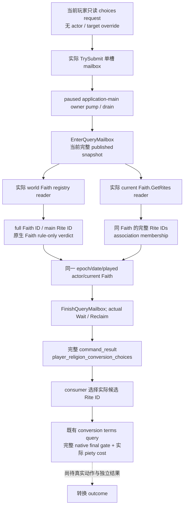

# 1.20.0.2 宗教转换候选：Faith 与当前 Faith 的 Rite 查询

2026-10-01 项目所有者已允许宗教研究，并要求停止战争研究。此增量解决转换查询仍需人工提供目标的问题：把实际 [Faith registry / native rule reader](ck3-1.20.0.2-religion-conversion-faith.md) 和 [当前 Faith 的 Rite association reader](ck3-1.20.0.2-religion-conversion-rite.md) 接到完整只读 mailbox。它没有执行转换、修改策略、接触 CK3 或研究战争。

冻结构建为 **CK3 1.20.0.2 Crozier / Steam build 25588574**，EXE SHA-256 **`AE1BA6FF060BA603842F6F4A2DED0AF4B7D3666B3DD271F75FB01B0DA8E81B2D`**。底层 ABI、provider、fixture 已由原专题闭合并提交，本包保持这些已 GREEN 源码不变，不重跑旧 fixture。新增 choices mailbox、runtime 与真实完整 command-result serializer 为 **`static-ready`**；中央 named permit、共享 MCP 注册和真实 paused artifact 待 root 接线与验收。没有本包 live 证据。

## 候选怎样进入最终资格查询



Faith registry 行保持原生来源、完整 generation 与主 Rite ID；`native_faith_rule_passes` 仍为规则门，`rule_only=true`。当前 Faith 的 Rite ID 列表保持原生 association 顺序，可包含当前 Rite 和原生规则不允许转入的 Rite。**membership 不等于 legality**；chosen ID 必须再用 [conversion terms](ck3-1.20.0.2-religion-conversion.md) 查询支付费用后的最终判定。查询 ACK 不表示已转换，也不表示列表所有成员可转换。

这条查询解锁真实目标采集，不复刻原生 AI 的评分或 scheduler；原生 AI 输入与分支边界见 [religion-conversion-ai](ck3-1.20.0.2-religion-conversion-ai.md)。本包不把静态联通称为宗教 OODA 或 complete。

## 实际接线接口

源文件为 [choices header](../../ck3_autonomous_player/native_bridge/include/xar_bridge/ck3_12002_religion_conversion_choices_mailbox.hpp)、[runtime / caller / serializer](../../ck3_autonomous_player/native_bridge/src/ck3_12002_religion_conversion_choices_mailbox.cpp)。namespace `xar::ck3_12002`：

```cpp
bool IsPlayerReligionConversionChoicesPrivateStep12002(string_view step) noexcept;
bool ParsePlayerReligionConversionChoicesRequest12002(string_view payload, uint64_t& revision) noexcept;
bool ExecutePlayerReligionConversionChoicesMailbox12002(void*, const MainThreadExecutionStampV1&) noexcept;
bool RunPlayerReligionConversionChoicesMailbox12002(PlayerReligionConversionChoicesMailboxContext12002&,
    string_view request_id, string& serialized, string& failure) noexcept;
bool HandlePlayerReligionConversionChoicesPrivate12002(const GameAdapter&, MainThreadQueryMailboxV1&,
    const Snapshot& published, uint64_t revision, string_view step,
    string_view payload, string_view request_id, string& serialized, string& failure) noexcept;
```

唯一 selector 为 **`query-player-religion-conversion-choices-v1`**；与 terms query 共用默认关闭的 **`XAR_CK3_ENABLE_G2_RELIGION_CONVERSION_PRIVATE_QUERY_V1`**。建议中央登记独立 callback **`permitted_executor_religion_conversion_choices12002`**；本包未修改 CMake、中央 registry、adapter、Python 共享文件或 Git refs。

request 只接受当前 played actor 的候选查询，没有 `actor_id`、`played_character_id`、`target_faith_id` 或 `target_rite_id` 参数。`expected_snapshot_revision` 可省略；其 alias 为 `expected_revision`。提供时必须为正整数并匹配当前 published revision，同时提供两者时必须相等。handler 从 exact-version 当前 adapter 的模块 base 绑定两个真实组件；fixture 通过同一 `Run` seam 注入夹具内 native callbacks。

consumer 约定的 MCP 名称为 `ck3_query_player_religion_conversion_choices_v1`，由既有 Python owner 注册。正式 response 顶层为 `type=command_result`、**`protocol_version=1`**、原样 escaped `request_id` 和 `ok=true`。`result` 含：

- `step`、`accepted=true`、`status=observed|unavailable`、`private_build=true`、`read_only=true`、`advertised=false`；
- `game_version=1.20.0.2`、exact EXE SHA、`domain_key=player_religion_conversion_choices_v1`、`backend_id=ck3-1.20.0.2-native-player-religion-conversion-choices-v1`；
- 真正 published `snapshot_revision` 和 `date_raw`；
- **`player_religion_conversion_choices`**，其 schema 为 `ck3_12002_religion_conversion_choices_v1`。

内层 DTO 含 `available`、`unavailable_reason`、实际 `capture_epoch`、`date_raw`、`played_character_id`、**`faith_choices`** 与 **`current_faith_rites`**，并再次标明 **`membership_is_legality=false`**。两组件使用各自已验证的实际生产 serializer，原始 schema 保持不变。`capture_epoch` 来自 owning-thread pump，不能替代或冒充 published revision。

## 空列表、组件失败与帧不一致

两个 reader 在同一主线程请求中执行。组件观测可用时，其实际日期和角色必须匹配 published frame；两者均可用时其 current Faith 身份也须一致，才将整体标为 available。主线程 `FinishQueryMailbox` 继续核对完整 published snapshot。

合法空 registry/association 列表保留 **`status=observed`、`available=true`、空数组**。组件读取失败保留 **`status=unavailable`、整体 `available=false`**，并保持各组件的真实 typed failure；可用的另一组件仍保留实际观察。失败组件日期/角色由仍一致的 owner envelope 填入真实 published frame，没有伪造日期零值、身份或合法空候选结论。

已有 `FaithRites` serializer 在读取失败时可输出 `faith_id=4294967295`，这是原 schema 的 absent sentinel；consumer 必须以该组件的 `available=false` 与 failure key 识别失败，不将其误解为已观察到一个完整 Faith。Faith choices 的未观测 current Faith 保留 `null`。本包没有为了映射样式修改任何已 GREEN reader/serializer。

真实 native pump 日期在请求进入前就与 published frame 不一致时，既有 envelope 会直接拒收，**不产生成功 JSON**；完整 published snapshot 在读取中改变时同样不产生成功响应。这与 native component 读取失败但 query frame 一致时的 typed unavailable 是两种结果。

## 必要验证与保留失败

[新增 fixture](../../ck3_autonomous_player/native_bridge/src/ck3_12002_religion_conversion_choices_mailbox_test.cpp) 链接未替换的 core、两组件 reader/serializer、`QueryMailboxEnvelope`、单槽 mailbox、protocol 和新增 runtime。worker 实际提交，fixture owner 实际执行 `ObserveMainThreadPumpAndDrainV1`，随后实际 Wait/Reclaim；未用 fabricated packet 补齐传输字段。fixture 使用既有 primary permit，中央生产需注册上述 named choices callback；`NativeAdapter12002` 的 standalone identity branch 仅为夹具 shim，没有冒充实机 adapter。

**MSVC `/W4 /WX /Od` 与 `/O2` 各通过 41 项检查、7 个 runtime cases**。每种模式产出 **5 份实际 C++ command-result JSON**，Python 解析验证完整 protocol/metadata、full-generation Faith/Rite ID、原生 tag escaping、capture epoch 与 revision 分离，以及成功/空候选/两个组件各自失败/双组件失败。两个帧拒收 case 只保存 log，没有成功 packet。native callbacks 和对象内存均属夹具进程，不是真实 CK3 paused evidence。

最终 artifact 为 `Z:/ck3_mod_rewrite/artifacts/g2-offline-2026-10-01/religion-conversion/choices/mailbox-final/`：`result.json` 记录所有实际 source 和两种模式的 wire/executable SHA。`O2/choices.json` 的 SHA-256 为 **`e2b28c7e1a94ecd14999b990e66b704530a3011467750e69102e416e66143a07`**，与 Od 的同一实际 wire 逐字节一致，可直接供 SDK consumer 使用。

首次 fixture 对“进入前 native pump 日期与 published frame 不同”的 case 错误期待 typed success。实际 envelope 在 provider 前正确拒收，属于 **harness RED**。原始编译产物、五份 packet、失败 log 已保留在 `choices/mailbox-attempt-001-frame-expectation/`；只修正新增 fixture 的期待，production source 未改变，最终夹具才用于交付。已 GREEN 的 Faith/Rite 单独矩阵没有重跑。

复跑命令：

```text
python research/religion_conversion12002_choices_mailbox_tests.py --output-dir <Z-artifact-dir>
```

下一步是中央独立 selector/permit 注册、Python/MCP 消费实际 C++ packet，以及 root 独占 paused 实机查询。真实候选随后经完整 terms gate 选定目标，再由已有 outcome 工作包完成独立读回；这部分未在当前离线夹具中发生。
