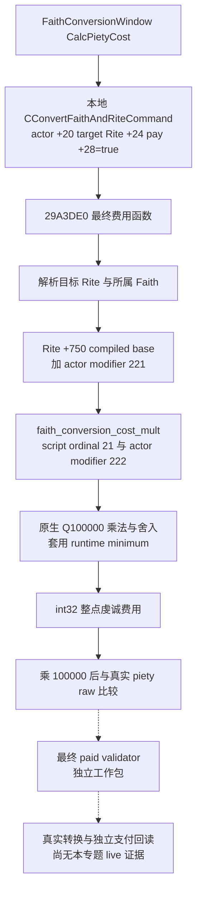

# CK3 1.20.0.2：信仰与礼仪转换最终费用

2026-10-01 16:36（Asia/Shanghai）。宗教研究已获项目所有者恢复授权；战争研究已停止。本专题只读冻结 EXE、原版数据和离线 provider fixture，未触碰本地 CK3 进程、pipe、UI 或 Steam。

- exact build：1.20.0.2 Crozier，Steam build 25588574。
- EXE SHA-256：`AE1BA6FF060BA603842F6F4A2DED0AF4B7D3666B3DD271F75FB01B0DA8E81B2D`，101,039,736 bytes。
- 研究合同：[religion_conversion12002_cost_abi.json](../../research/religion_conversion12002_cost_abi.json)；提取器：[religion_conversion12002_cost.py](../../research/religion_conversion12002_cost.py)。完整调用体 6 个、注册或语义片段 5 个、指令锚点 38 个、provider 常量 6 个，另核对两份 vtable 的 complete-object locator 与 command RTTI。
- 状态：原生链 `static-confirmed`，实际只读 provider/serializer `static-ready`；MCP 集成与真实 paused snapshot 尚未完成。测试中的 native cost getter 是 stub，不能把离线费用数值称为游戏实测。

## 原生费用入口

原版 `gui/window_faith_conversion.gui:64–88` 的费用区域使用 `FaithConversionWindow`。`CalcPietyCost` 注册片段 `0x22EE69` 把 callback 绑定到 `0x1516CD0`，该 thunk 调用 `0x15169B0`。窗口 getter 在栈上构造完整 `CConvertFaithAndRiteCommand`，再调用：

```cpp
int32_t FinalPietyCost(const CConvertFaithAndRiteCommand* command,
                      void* tooltip_or_null); // RVA 0x29A3DE0
```

返回值是 **整点虔诚费用**，不是 Q100000。同信仰的 Rite 转换和跨 Faith 转换均使用这条入口；目标输入始终是 full-generation `RiteID`，费用函数内部再从 `Rite+0x4B8` 解析 full `FaithID`。不能把 `Character+0xB4`、目标 RiteID 或界面选择的 Rite 当作 FaithID。

命令 RTTI 为 `.?AVCConvertFaithAndRiteCommand@@`，type descriptor `0x5A16768`。primary vtable `0x4770340`，secondary vtable `0x47703D8` 的 `this` 偏移为 `0x18`。栈对象大小 `0x30`，actor full CharacterID 位于 `+0x20`，target full RiteID 位于 `+0x24`，支付虔诚标记位于 `+0x28`。GUI 的费用 getter 固定将支付标记置为 `true`；该标记为 `false` 时原生费用函数合法返回 0，这不表示玩家正常转换免费。

provider 复用 [Rite provider 的 FaithAndRiteConversionCommand](../../ck3_autonomous_player/native_bridge/include/xar_bridge/ck3_12002_religion_conversion_rite.hpp)，没有另一份 command layout。费用 provider 不调用 command queue、validator 或转换执行函数。

## 动态求值与单位

`0x29A3DE0` 的费用计算链按当前目标与 actor 重新求值：

1. 用 command `+0x20` 从 Character DB 解析完整 actor；用 `+0x24` 从 Rite DB global `0x5D1E2F8` 解析完整目标，再从目标 Rite 解析所属 Faith。均校验对象中保存的 full ID。
2. 对目标 `Rite+0x750` 的 compiled value 调用 `0x2C64200`，取得 Q100000 基础值，再加 actor modifier ordinal `0x221`（通过 `0x28C3AE0 → 0x2C4D680`）。
3. `0x29A3A20` 求当前 actor 与目标 Faith 的 `faith_conversion_cost_mult`。字符串 `0x46695E0` 在 `0x1D62022/27/2E` 注册为 script-value ordinal `0x21`；helper 从 root `+0xEF0` 的 registry 读取 `+0x108 = 0x21 × 8`，放入 Character scope kind 4/full ID `+0x18` 与 Faith scope kind `0xD`/full ID `+0x08`，再调用 `0x37542F0`。该 script value 未启用时，原生 helper 返回 0 倍率增量。
4. 再求 actor modifier ordinal `0x222`。两个倍率增量均加 Q100000 的 1，再先相乘、后与第 2 步基础值相乘；原生固定点乘法和大值分支保留各自的截断顺序。
5. 原生对最终 Q100000 值作带符号的半点舍入，再输出整点 `int32_t`；最后应用 runtime minimum define `0x5C696AC`。冻结 stock `common/defines/00_defines.txt:878` 为 `FAITH_CONVERSION_PIETY_MINIMUM = 250`，provider 本身不硬编码 250，也不重写原生计算。

`common/script_values/02_religion_values.txt:3355–3439` 给出原版 fervor 与 `faith_conversion_cost_mult` 的 authored 分支。provider 直接使用 native 最终值，不在 Python 重算 fervor、现存 Faith 或 actor 修正。`0x221/0x222` 已确认分别处于加值和乘值位置；其名称到 numeric modifier ordinal 的注册映射尚未单独闭合，暂不以字符串相似性代替该证据。这不影响调用已经闭合的最终费用函数。

## 真实钱包与可支付性

`FaithConversionWindow.CalcPietyMissing`（`0x1516A10`）从当前 actor `+0x1B0` 的资源扩展读 `+0x110` signed Q100000 虔诚余额。扩展不存在时，原生该分支的余额合法为 0；不能改读 spiritual fulfillment 的 `+0x1C8/+0xA0`。

只读 provider 发布 `piety_points`、`piety_cost_raw = piety_points × 100000`、`actor_piety_raw` 和 `can_afford_piety`。余额保留小数与负值；例如余额 250.99999 对费用 251 仍不足。余额不足时费用观测仍然 available。

`can_afford_piety` 只是费用比较。它不是最终转换许可，不检查完整 scripted rules、最近转换冷却、知识、角色资格或其他原生最终否决。其 JSON 明确包含 `final_conversion_legality_observed = false`。选择目标必须结合同帧最终 paid validator；转换后的支付、身份变化与独立回读由 [转换 outcome 专题](ck3-1.20.0.2-religion-conversion-outcome.md) 负责，本专题没有执行转换。



## 实现与验收

实际实现：[header](../../ck3_autonomous_player/native_bridge/include/xar_bridge/ck3_12002_religion_conversion_cost.hpp)、[provider](../../ck3_autonomous_player/native_bridge/src/ck3_12002_religion_conversion_cost.cpp)、[fixture](../../ck3_autonomous_player/native_bridge/src/ck3_12002_religion_conversion_cost_test.cpp)。入口为 `BindReligionConversionCostImage12002` 与 `ReadPlayedReligionConversionCost12002(bindings, target_full_rite_id, capture_epoch, Cost&)`，只支持 played actor 与 paused application-main owner。

2026-10-01 的首次 MSVC `/W4 /WX`、`/Od` 和 `/O2` fixture 均 GREEN，每模式 9 个场景、14 个 assertions、5 份实际 C++ JSON。覆盖跨 Faith、同 Faith Rite、原生 getter 的 command ABI、整点与定点单位、带小数余额不足、负虔诚、资源扩展合法为空、目标/目标 Faith 不可用，以及 paused 同帧采集。成功值来自 fixture stub，不是假称真实 CK3 native cost。

Artifact 根为 `Z:\ck3_mod_rewrite\artifacts\g2-offline-2026-10-01\religion-conversion\cost`；`provider/result.json`、`native/result.json` 分别记录编译、wire 与 exact PE 提取结果。ABI manifest SHA-256 为 `d2a4c4a39a69a999971a033f22810786ed8ebf29218caf014cbc3c7a59cc333b`，完整 disassembly artifact SHA-256 为 `d6cee7b9f7a1f1680c52e40f47e27d9caf27c8b5b0693cb939954f6f78b796c7`。

后续验收只需中央接入目标/terms query 后，由唯一实机操作者对合法目标和自然不足虔诚目标各取 paused snapshot，对照原生转换窗。没有实际转换与独立前后状态前，不能提升为 `production-live primitive` 或宣称转换循环完成。
