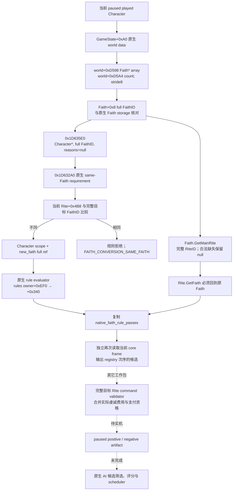

# 1.20.0.2 信仰转换：原生候选与 Faith 规则判定

项目所有者于 2026-10-01 明确恢复宗教研究，并停止战争研究。本包只提供当前玩家的只读 Faith 候选、主 Rite 身份和原生 Faith 转换规则结果；未执行转换、触碰 CK3 进程或 GUI，也没有展开战争树。

冻结构建为 **CK3 1.20.0.2 Crozier / Steam build 25588574**，EXE `101039736` bytes，SHA-256 **`AE1BA6FF060BA603842F6F4A2DED0AF4B7D3666B3DD271F75FB01B0DA8E81B2D`**。身份关系与原版规则复用 [religion-context](ck3-1.20.0.2-religion-context.md) 和 [religion-stock](ck3-1.20.0.2-religion-stock.md)。本包 ABI 为 `static-confirmed`，生产 reader/serializer 与夹具为 `static-ready`；中央 mailbox、MCP 和真实 paused artifact 尚未由本包提供，不能称为 live 或完整宗教 OODA。

## 确认的调用树



这是原生可转换规则与候选状态树，尚未构成原生 AI 选择树。规则中的相关状态由原生最终求值器整体处理；没有复制或扩展任何战争判定逻辑，也没有修改我方宗教策略。

## Faith 规则门与完整按钮门分开

实际 `CConvertRiteCommand` validator `0x29A34C0` 先解析 actor 和目标 Rite。它比较目标 `Rite+0x4B8` 与当前玩家 Rite 的同字段：同 Faith 时调用 `0x1D63700(Character*, RiteID, reasons*)`，不同 Faith 时在 `0x29A365E` 调用 **`0x1D635E0(Character*, FaithID, reasons*)`**。窗口与完整命令判定由 Rite 转换工作包负责，本包复用这条不同 Faith 的原生入口。

`0x1D635E0` 的 ABI 是 **`bool(Character*, uint32_t fullFaithID, reasons* nullable)`**。实际 validator 已证明 `reasons=nullptr` 是原生生产路径，reader 不构造 GUI 窗口或未知 reasons 对象。该函数在 `0x1D635FC` 调用 `0x1D632A0`；其 `std::function` predicate `0x1D66C10` 根据角色的 full RiteID 解析当前 Rite，再比较 `Rite+0x4B8` 与目标完整 FaithID，要求二者不同。原生 negative-requirement evaluator `0x37C5600` 会反转 same-Faith predicate，不能把 lambda 返回 `true` 直接写成“允许转换”。

基础门通过后，该函数建立当前角色 scope，将完整目标 FaithID 以原生 scope type **13** 注入目标 Faith；取规则 owner 的 `+0xEF0` 对象后使用 `+0x340` 的脚本规则。没有 reasons 对象时在 `0x1D63667` 调用 `0x372DF30`；有 reasons 时走 `0x372E4F0`。实际费用和 piety affordability 不在此函数中，因此 wire 字段只叫 **`native_faith_rule_passes`**，并标记 **`rule_only=true`**，没有把它命名为完整 `can_convert`。

原版 `common/scripted_rules/00_rules.txt:38-89` 是 Faith 转换附加规则：目标 `new_faith.main_rite` enabled/convertible、成年/宗教身份、目标 block-conversion variables、recency、知识门与 State Rite 例外。详细 stock 输入及作用域已在 religion-stock 记录；reader 直接消费原生最终规则结果，不手写这些条件。完整 command 门仍需与实际费用工作包组合后才能用于自动动作。

## 候选列表来源

原生 Faith 列表的更新函数 **`0x14C3650`** 有 chained `.pdata` 段，完整主体为 `[0x14C3650,0x14C373A)`。它从现有 `GameState` slot **`0x5C68C50`** 取 `GameState+0xA0` 的 world data：

- 不按 Religion 过滤时，`0x14C36C7` 读取 `world+0xD598` 的 **Faith 指针数组**，`0x14C36CE` 读取 `world+0xD5A4` 的计数；原生步长 **8 bytes**。`0x14C36F8` 从每个 Faith 的 `+0x8` 取得完整 FaithID。
- 按 Religion 过滤时，`0x14C36A9` 使用 `Religion+0x1E8` 的 **FaithID 数组**。实际 copy helper `0xC858C0` 从容器 `+0xC` 取计数，并在 `0xC8590A` 按 **4 bytes** 拷贝。它与 world 的 Faith 指针数组不是同一种 row。
- 列表反射包装器 `0x14C7310` / `0x14C76E0` 发布窗口 `+0x20` 的 datamodel；本包没有调用这些反射包装器，也没有声称复刻后续 GUI 排序或用户过滤。

实际 reader 使用 **原生 world Faith registry 原顺序**，而非一个凭空制造的可转换白名单。Faith storage slot **`0x5D1E300`** 的解析语义复用原生 `Rite.GetFaith`：masked index 仅用于查找 `storage+0x20`、stride16、pointer+8，随后 object `+0x8` 必须匹配完整 FaithID。目标对象保留 generation 位，不截断为 low-24-bit ID。

每行还读取 `Faith.GetMainRite 0x2444360`（Faith full RiteID 位于 `+0x98`）和 `Rite.GetFaith 0x24FC560`，明确主 Rite 属于该 Faith。原生合法 absent `0xFFFFFFFF` 输出 `main_rite_id=null`；已观测 ID `0` 可以合法保留。Faith tag 复用 `0xB801A0` 的 native CString。角色当前 Rite 与 Faith 的 main Rite 不要求相同。

此列表保留原生已知 Faith；不采用 GUI visible/hidden 作为转换资格近似，也不以 Faith 是否已有追随者替代实际规则结果。Faith 的全部 Rite 枚举和 GUI 排序仍由后续候选工作处理；主 Rite ID 已经为现有完整 command query 提供可消费的实际目标。

## 只读 provider

实现为 [header](../../ck3_autonomous_player/native_bridge/include/xar_bridge/ck3_12002_religion_conversion_faith.hpp)、[reader / serializer](../../ck3_autonomous_player/native_bridge/src/ck3_12002_religion_conversion_faith.cpp)。namespace `xar::ck3_12002::religion_conversion::faith`：

```cpp
Bindings BindFaithConversionImage12002(uintptr_t image_base, string_view exe_sha);
bool ReadPlayedFaithConversionChoices12002(const Bindings&, uint64_t capture_epoch, Choices&);
string SerializePlayedFaithConversionChoices12002(const Choices&);
```

caller 必须复用现有 paused owning-thread pump；provider 从真实 core snapshot 读取当前 played Character，不接受任意 actor override。它调用原生规则求值器，但不会 enqueue、submit 或 execute 游戏转换命令，不启动/附加/发现进程，不打开界面。

schema 为 `ck3_12002_faith_conversion_choices_v1`，含 exact build、`available`、失败原因、`capture_epoch`、`date_raw`、当前角色/full FaithID、`candidate_source=native_world_faith_registry`、`rule_only=true`。每行含 `faith_id`、`faith_key`、`main_rite_id` 与 `native_faith_rule_passes`。失败输出 typed unavailable 和空候选列表；已知空 registry 则 `available=true` 且列表为空。query 前后实际 core frame、当前 actor/Faith 与 registry 来源必须一致。

`available=true` 表示这些观测完成；不表示费用已覆盖、整体动作可发、转换已成功、AI 调度已复刻或宗教域 complete。当前没有 mailbox/MCP 注册，不以单元测试替代 paused 游戏证据。

## 验证、失败 attempt 与后续

[exact verifier](../../research/religion_conversion12002_faith_native.py) 与 [冻结 ABI](../../research/religion_conversion12002_faith_abi.json) 记录 **11 个完整函数、22 条语义指令、3 个 functor vtable、11 个实际 provider source 常量**。共享 context getter 的身份/标签/主 Rite 语义复用已有 religion-context 证据，不重新扩大旧矩阵。native 结果在 `Z:/ck3_mod_rewrite/artifacts/g2-offline-2026-10-01/religion-conversion/faith/native/`。

[fixture](../../ck3_autonomous_player/native_bridge/src/ck3_12002_religion_conversion_faith_test.cpp) 与 [runner](../../research/religion_conversion12002_faith_tests.py) 链接实际 core/reader/serializer，**MSVC `/W4 /WX /Od` 和 `/O2` 各通过 17 项检查**，每种模式产出 **6 份真实 C++ JSON**并由 Python 解析。覆盖完整 generation、同身份但原生 rule 改变、nullable 主 Rite、主 Rite 属于错误 Faith、registry/storage 不一致、实际 sample 改变、未暂停、已知空列表和 exact SHA binder。native callbacks 属于夹具进程，不冒充游戏原生函数已经执行。

第一版研究 map 对 vector-copy 函数的完整 span 误截止于 `0xC85939`，遗漏最终 `pop rsi/ret`。该 **research annotation RED** 及旧 receipt 已保留在 `faith/native-attempt-001-short-vector-copy-span/`；修正后 span 截止为 **`0xC8593B`**。provider、行为与 fixture 未变，没有重复运行已通过的夹具。最终 map/receipt 才用于交付。

复跑命令：

```text
python research/religion_conversion12002_faith_native.py --exe <frozen-exe> --output-dir <Z-artifact-dir>
python research/religion_conversion12002_faith_tests.py --output-dir <Z-artifact-dir>
```

下一步由宗教转换协调包把候选、完整 target-Rite final validator 和真实费用接到同一私有查询，再由 root 独占 paused 实机验收。本包不新增宗教 counter-policy；原生 AI 的知识筛选、desire、排序和重新评估 scheduler 尚待对应工作包闭合。成功转换的 Rite/Faith、piety 与后续独立 outcome 需要真实 artifact，当前未发生。
