# 1.20.0.2 转换输入：Rite 知识度、近期转换与 Realm State Rite

本包在 2026-10-01 用户开放宗教研究后施工，仅做非战争只读观测。冻结版本为 **CK3 1.20.0.2 Crozier / Steam25588574**，EXE SHA-256 **AE1BA6FF060BA603842F6F4A2DED0AF4B7D3666B3DD271F75FB01B0DA8E81B2D**。原生 ABI **static-confirmed**；实际 provider/serializer **static-ready**。没有访问 CK3 进程、Steam、pipe 或 UI，没有真实 paused artifact，也没有发起转换。

此页给转换选择提供实际输入。完整 Faith/Rite 原生最终合法性和报价属于各自组件；本包不把知识、旗标或国教身份切片合成最终合法性，也不调整自动玩家策略。现有 stock 树见 [religion-stock](ck3-1.20.0.2-religion-stock.md)，当前身份见 [religion-context](ck3-1.20.0.2-religion-context.md)，国教身份链直接复用 [religion-rite-state](ck3-1.20.0.2-religion-rite-state.md)。

## 原生知识值的实际来源

`knows_rite_level` 注册工厂在 `0x57E440`；真正的 value evaluator `0x2AEA480` 解析当前 Character scope 和完整目标 Rite scope，在 `0x2AEA519` 调用 **`0x2BDBDE0`**。其 ABI 是 **`int64_t*(int64_t* out, Character*, Rite*)`**，输出与返回指针均为传入 out；原生使用 **Q100000**。

这个值不是 Faith ID、缓存单个百分比或“相同 Faith 自动 100%”。完整 body 按下面的输入计算：

| native 分支 | 实际来源 |
| --- | --- |
| 目标 Doctrine 条目 | `Rite+0x770` 指针、`+0x77C` 个数，pointer row stride8；条目 `+0x80` 为真才计分母，`Character.KnowsDoctrine=0x28B0A30` 为真才计分子 |
| 目标 Tenet 条目 | `Rite+0x7A0` 指针、`+0x7AC` 个数，pointer row stride8；条目 `+0xA0` 为真才计分母，`Character.KnowsTenet=0x28B0C00` 为真才计分子 |
| 目标不是 Main Rite | `Rite.IsMainRite=0x24F7E40` 为假时，解析 `target Rite.faith.main_rite`，再补 Main Rite 的 Tenet 条目；以 Tenet `+0x10` identity 去重，保留同样 eligible/known 判定 |
| 没有可计条目 | `0x2BDC259` 检查分母计数；零计数直接写 **真实0** |
| 非零条目 | 实际 known/eligible 比例输出 Q100000；包含原生大数除法分支，不在 provider 里手写或改舍入 |

Doctrine getter 有实际角色扩展时查询 `Character+0x1C8` 的 `+0xC8` 集合；无扩展时从角色当前 Rite 的 `+0x788/+0x794` 与 row+8 状态读取。Tenet getter 有扩展时查询 `+0xE0/+0xEC`；无扩展时查当前 Rite 的 `+0x7A0/+0x7AC`。因此默认与个人已学状态分开，不能为了省事只比较 actor/target Faith。转换后的知识集合更新由 outcome 专题负责；这里始终重新调用实际知识 getter，不把转换 ACK 或更新调用次数视为知识100%。

## 近期转换旗标的实际只读链

原版 `has_character_flag` 注册工厂为 `0x5ABF50`，真实 evaluator 完整 body 为 `0x2B7A630–0x2B7A748`。对合法存活 Character，它先检查 `+0x1A5`、取得 `Character+0x1B0` 的 script-data record，再通过 **`0x1D67200`** 解析 FlagSet。FlagSet 的 rows 是 `+0x10`，count 是 `+0x1C`，row stride **0x20**，实际旗标 atom key 在 row **+0x8**。evaluator 比较 entry 是否存在，未在这里另算“转换至今几年”。

旗标字符串为 `faith_conversion_recently_converted`。provider 通过 **`0x3F8A3A0`** 查已存在的 atom，ABI 为 `uint32_t*(existing pool, uint32_t* out, NativeStringView*)`；已有 pool 的 inline 地址为 image+**`0x5DC1390`**。该 body 只查表，不插入字符串。原生 parser 的另一入口 `0x3F8A4B0` 可以在缺 key 时插入，因此本只读 provider 不调用它。

不存在 atom key、Character 无 script-data、合法空 flags、或 native dummy 条件均返回观测到的 false；实际 lookup/collection 读取失败则 unavailable。script record index **-1** 的 native fallback FlagSet 初始化明确把 rows/count 置零；provider 保留这个合法空结果，避免调用 default-object 的惰性初始化。输入无 key 不被宣称为知识度0，也不把旗标读取失败伪装成“允许转换”。

stock `pam_on_conversion_effect` (`pam_effects.txt:11516–11524`) 只在 **`is_ai=no`** 时写该旗标，期限为 `pam_ui_conversion_cooldown=5` 年。原生 AI 另有 landed ruler 的五年 Rite reevaluation define，其 scheduler 尚未由本包研究；玩家 UI recency 不能替代 AI scheduler。

## 国教豁免与身份输入

现有 `religion_rite_governance12002_state_rite` provider 已闭合 `played Character → GetTopLiege(0x28BFDA0) → GetPrimaryTitle(0x289DA30) → GetStateRite(0x2315030)`，同时保留玩家自己和 top liege 的 primary title。本包直接调用它，不重写此 ABI；**玩家自己的 State Rite 不替代 top liege 的 Realm State Rite**。

同一目标查询公开：目标完整 Rite/Faith/Religion ID、actor 完整 Faith/Religion ID、原生知识值、近期旗标、Realm State Rite/Faith ID，以及这些身份的真实 equality。`state_rite_target_match` 表示 realm Rite=target Rite；`state_faith_target_match` 表示 realm Rite.faith=target Faith。它们各自对应 stock Rite/Faith 转换规则中的豁免输入，仍不包含其它身份、enabled/convertible 或最终费用门。

stock `common/scripted_rules/00_rules.txt:38–89,94–126` 在非对应国教目标时检查 recency 和知识；Rite 门 `knows_rite_level>0.4`，同 Religion 的 Faith 门 `>0.5`，外层 Faith 门 `>0.6`，阈值来自 `pam_values.txt:168–170`，全部是严格大于。Faith 入口要求传目标 Faith 的 **main Rite**；同 Faith 内的 Rite 入口传实际目标 Rite。本 provider 传出原始 Q100000，不替调用方改目标、把 `>=` 当作 `>`，或手写最终 legality。

```mermaid
flowchart TD
    A[既有 paused application-main query] --> B[实际 played Character 与目标 full RiteID]
    B --> C[现有 state Rite provider\nactor/realm 身份]
    B --> D[原生 0x2BDBDE0 knowledge]
    D --> E[目标 Doctrine/Tenet eligible/known]
    E --> F{目标为 Main Rite?}
    F -->|否| G[补 main Rite Tenet; identity去重]
    F -->|是| H[实际 known/eligible Q100000; 分母0为0]
    G --> H
    B --> I[现有 atom lookup + 实际角色 FlagSet]
    I --> J[近期转换旗标存在/合法空/读取失败]
    C --> K[actor-target same Faith/Religion\nrealm State Rite/Faith equality]
    H --> L[实际只读输入 DTO; 同帧独立重采样]
    J --> L
    K --> L
    L -. 其它组件 .-> M[原生 Faith/Rite 最终门与报价]
    L -. 未验实机 .-> N[真实 paused 输入核验]
    M -. 未闭合 .-> U[native AI scheduler/selection\n转换后的长期游戏结果]
```



## 实现、验证与证据

namespace 为 `xar::ck3_12002::religion::conversion_gates`；[header](../../ck3_autonomous_player/native_bridge/include/xar_bridge/ck3_12002_religion_conversion_gates.hpp)、[reader/serializer](../../ck3_autonomous_player/native_bridge/src/ck3_12002_religion_conversion_gates.cpp)：

```cpp
Bindings BindReligionConversionGatesImage12002(uintptr_t module_base, string_view exe_sha);
bool ReadPlayedReligionConversionGates12002(const Bindings&, uint32_t full_target_rite_id,
    uint64_t capture_epoch, Context&);
string SerializePlayedReligionConversionGates12002(const Context&);
```

入口只读当前玩家和一个 full-generation Rite ref；目标 storage 源为 image+`0x5D1E2F8`，mask index 只用于 lookup，目标对象 `+0x8` 必须匹配完整 ref。高位 generation 和合法零值均保留。target 输入、实际观测 target 和 failure 分开；没有注入、命令、主线程注册、MCP policy 或广告能力改动。

[exact verifier](../../research/religion_conversion12002_gates.py) 与 [ABI manifest](../../research/religion_conversion12002_gates_abi.json) 记录 **13 个完整 native span、29 条语义指令、11 个 provider 常量**；包含实际 chained body 全段，未把 `.pdata` 第一小段当成完整函数。manifest SHA-256 `e01914c206bfeab7622cc1d9caa1a048551b792b481dce848a1d0aef4c223337`；artifact 在 `Z:/ck3_mod_rewrite/artifacts/g2-offline-2026-10-01/religion-conversion/gates/native/`。

[实际组件 fixture](../../ck3_autonomous_player/native_bridge/src/ck3_12002_religion_conversion_gates_test.cpp) 链接原样 core、宗教 context、现有 state Rite 和本 reader/serializer；[runner](../../research/religion_conversion12002_gates_tests.py) 在 MSVC `/W4 /WX /Od`、`/O2` 各通过 **19 项检查**、每种模式 **6 份实际 C++ JSON**。覆盖 raw threshold=40000、真实零知识、近期 flag presence/空 flags/未注册 atom、Realm State Faith相同但 Rite不同、国教合法未设置、lookup/collection/knowledge读取失败、同 index错误 generation、两次实际 getter值变化及 paused合同。getter callbacks 与内存属于 fixture，**没有执行游戏 EXE 中的函数**，也不是真实 `fixture-live`。

当前 readiness 只覆盖这些已实现输入。中央聚合可直接调用；共享 CMake/owner permit/selector、Python MCP 暂由对应 owner 接线。最小后续是 root 的真实 paused 目标样本，对照当前/目标身份、知识和旗标，再让现有 final gate/cost 组件决定动作资格。没有最终门/报价/转换后独立读回与长期结果时，本包不称宗教 OODA complete。
