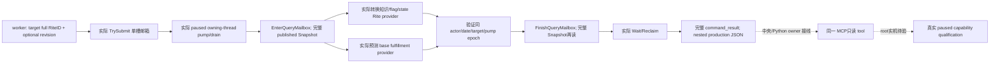

# 1.20.0.2 宗教转换输入：完整只读 Query 邮箱

2026-10-01 用户恢复宗教研究后，本包将已闭合的 [转换知识、近期旗标和国教输入](ck3-1.20.0.2-religion-conversion-gates.md) 与原生预测基础精神满足度放进同一个实际主线程 query。它固定读取当前玩家和一个目标 full RiteID，没有转换命令、counter-policy 或战争研究。

冻结版本为 **CK3 1.20.0.2 Crozier / Steam25588574**，EXE SHA-256 **AE1BA6FF060BA603842F6F4A2DED0AF4B7D3666B3DD271F75FB01B0DA8E81B2D**。实际 domain mailbox、两个 production provider、query envelope 和完整 command-result serializer 已 **static-ready**。当前证据均来自 fixture；未访问 CK3 进程、pipe、Steam 或 UI，未获得此接口的真实 paused artifact。

## 请求与真实输入

- selector：`query-player-religion-conversion-inputs-v1`。
- domain：`player_religion_conversion_inputs_v1`。
- backend：`ck3-1.20.0.2-native-player-religion-conversion-inputs-v1`。
- compile flag：既有、默认关闭的 `XAR_CK3_ENABLE_G2_RELIGION_CONVERSION_PRIVATE_QUERY_V1`；与最终转换 terms 查询复用，不新增动作能力。
- `target_rite_id`：必须提供 unsigned32 full-generation ref，**0 是合法目标**；`0xFFFFFFFF` 是 absent，拒绝作为目标；负数、浮点数及32位范围外数值拒绝。
- `expected_snapshot_revision` 或别名 `expected_revision`：可省略；提供时必须为非零且匹配当前 published revision，两者同时提供时必须相等。
- actor：从现有 CoreBindings 读取当前实际 played Character，没有任意 actor 选择。

Faith 转换用途的目标应是目标 Faith 的 main Rite；同 Faith 内 Rite 转换使用实际目标 Rite。该查询不会自动替换目标或把两种最终合法性合并。原生 final gate 和 exact cost 另由 [转换 terms](ck3-1.20.0.2-religion-conversion.md) 聚合；本包增加其所需的真实选择输入。

实际 DTO 位于 `result.player_religion_conversion_inputs`，schema 为 `ck3_12002_religion_conversion_inputs_v1`：

| 字段 | 含义与生产来源 |
| --- | --- |
| `available` / `unavailable_reason` | 两个实际输入组件都完成相同玩家/日期/目标/pump epoch 的观测时为true；否则保留明确组件失败原因 |
| `capture_epoch` / `date_raw` / `played_character_id` / `target_rite_id` | 已验证 query owner 帧及请求目标；epoch来自实际 drain，不冒充 published revision |
| `conversion_gates` | 原样 `SerializePlayedReligionConversionGates12002` JSON：实际 knowledge Q100000、recent flag、同 Faith/Religion 和 Realm State Rite/Faith target equality |
| `predicted_base_fulfillment` | 原样 `SerializeExpectedRiteFulfillment12002` JSON：实际原生 base evaluator 分别求当前/目标 Rite 基础满足度及两者差值 |

预测组件 namespace 为 `xar::ck3_12002::religion_conversion_ai_inputs`，getter 为 **`0x2BFC270`**，调用 ABI **`int64_t*(int64_t* out, Character*, Rite*)`**；query调用 `ReadExpectedRiteFulfillment12002(bindings,epoch,target,out)`。其原生基础值与差值采用 Q100000，**不是当前缓存的 Spiritual Fulfillment、转换后的实际收益或最终 AI desire**。实际 serializer 已明确写 `is_current_fulfillment=false`、`is_observed_conversion_gain=false`、`is_final_ai_desire=false`；查询保持这些字段和含义，不另造“收益已完成”状态。

某个 provider unavailable 时，顶层 `available=false`；另一个仍成功的 production DTO继续保留，失败组件的实际失败 key 和合法 partial identity 也保留。失败组件的 date/actor/epoch来自已进入的实际 owner envelope，不声称其原生值成功。读取失败的数字不填假零；目标代际错误也不替换为仅有 masked index 的对象。

## 实际邮箱与完整传输响应

[header](../../ck3_autonomous_player/native_bridge/include/xar_bridge/ck3_12002_religion_conversion_inputs_mailbox.hpp) 与 [runtime/handler/serializer](../../ck3_autonomous_player/native_bridge/src/ck3_12002_religion_conversion_inputs_mailbox.cpp) 提供：

```cpp
bool IsPlayerReligionConversionInputsPrivateStep12002(string_view step);
bool ParsePlayerReligionConversionInputsRequest12002(string_view payload,
    uint32_t& target_rite_id, uint64_t& expected_revision);
bool ExecutePlayerReligionConversionInputsMailbox12002(void*, const MainThreadExecutionStampV1&);
bool HandlePlayerReligionConversionInputsPrivate12002(const GameAdapter&,
    MainThreadQueryMailboxV1&, const Snapshot&, uint64_t revision,
    string_view step, string_view payload, string_view request_id,
    string& serialized, string& failure);
```

当前包不编辑中央 shared CMake/WorkerAdapter/permit/Python registry。中央生产入口可用独立 named permit **`permitted_executor_religion_conversion_inputs12002`**；fixture使用既有离线 primary permit，未把它称作生产 named-slot 集成已通过。



响应顶层是 `type=command_result`、**`protocol_version=1`**、原 request ID、`ok=true`。`result` 保留 `accepted=true`、`status=observed|unavailable`、`private_build=true`、`read_only=true`、`advertised=false`、exact version/SHA、domain/backend、published `snapshot_revision` 与 `date_raw`。`ok/accepted` 只代表成功完成本次查询传输，不是转换动作 ACK、合法性或游戏结果。

完整发布帧或原生时钟变化时，现有邮箱拒绝整次响应，保持无成功 JSON。邮箱只在 actual completed/reclaimed、domain completed、owner frame stable 后序列化；两个 provider均由同一个本 query owning-thread executor调用，没有 worker native读或直接 UI 输入。

## 已完成验证与保留 attempt

[fixture](../../ck3_autonomous_player/native_bridge/src/ck3_12002_religion_conversion_inputs_mailbox_test.cpp) 链接未替换的 core、现有宗教 context、现有 Realm State Rite、已提交 Gates provider、新 AI base provider、QueryMailboxEnvelope、主线程 mailbox、protocol 和新 handler/serializer。[runner](../../research/religion_conversion12002_inputs_mailbox_tests.py) 在 MSVC **`/W4 /WX /Od`、`/O2` 各通过51项检查、6份完整实际 C++响应 JSON**，再由 Python解析。

六个实际 wire case 为 `current-zero`、`signed-prediction`、`target-zero`、`gates-unavailable`、`prediction-unavailable`、`stale-target-generation`；覆盖真实0、signed Q100000、fullID零值与代际、单组件 unavailable 和独立partial输入。另验证 required target/两种 revision别名、实际 stale handler拒绝、真实提交→drain→wait→reclaim，以及实际 full published Snapshot/native clock变化不产生成功 JSON。fixture NativeAdapter12002 shim 仅覆盖 bare GameAdapter identity分支，没有替代 WorkerAdapter；所有 getter callbacks和对象属于fixture进程，**没有执行 CK3 EXE 函数**。

最终 receipt：`Z:/ck3_mod_rewrite/artifacts/g2-offline-2026-10-01/religion-conversion/inputs/mailbox-final-v2/result.json`，包括实际 source与每种模式的六份wire SHA。两次 **harness RED** 原样保留：

1. `inputs/attempt-001.json` / `inputs/mailbox/Od/build.log`：fixture拿 optional uint32目标与 signed0比较，被 `/WX` 拒绝；仅将测试常量改成0U。
2. `inputs/attempt-002.json` / `inputs/mailbox-final/Od/test.log`：fixture原先期待 native clock变化仍返回 typed unavailable，实际邮箱正确拒绝整次changed-clock查询；仅修正fixture预期为无成功JSON。

两次纠正均未更改已冻结 Gates/AI provider 或生产邮箱逻辑，也没有实机失败。旧包已GREEN的组件fixture不再重跑，本轮验证只覆盖新增actual query路径。

可复跑：

```text
python research/religion_conversion12002_inputs_mailbox_tests.py --output-dir <Z-artifact-dir>
```

下一步由中央和Python owner注册同一 MCP只读入口，root用实际暂停样本核验知识、flag/state Rite与预测基础值。没有root paused artifact前保持 `static-ready`；即使该query上线，也不替代原生最终转换门、最终AI选择或转换后的独立游戏结果，G2 completed计数不因此增加。
