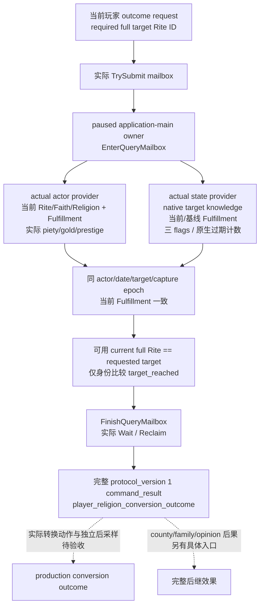

# CK3 1.20.0.2 宗教转换结果的独立只读查询

2026-10-01 项目所有者已允许宗教研究，并要求停止战争研究。本包把 [转换结果的原生树](ck3-1.20.0.2-religion-conversion-outcome.md) 中当前玩家身份、资源、精神满足度、目标 Rite 知识与三种转换标记接入完整只读 mailbox。冻结构建为 **CK3 1.20.0.2 Crozier / Steam 25588574**，EXE SHA-256 **`AE1BA6FF060BA603842F6F4A2DED0AF4B7D3666B3DD271F75FB01B0DA8E81B2D`**。

聚合、实际组件、caller、完整 protocol serializer 与离线 fixture 为 **`static-ready`**。本包没有访问 CK3、pipe、UI 或 Steam，没有提交转换、修改策略或研究战争；没有本包真实 paused artifact，不能称为 live、conversion primitive/loop 或 complete。既有 65 查询、named permits、旧 fixture 和组件实现保持不变；中央登记与实机由 root 接续。

## 原生结果怎样独立进入查询



[actor provider](../../ck3_autonomous_player/native_bridge/include/xar_bridge/conversion_outcome12002_actor.hpp) 的证据与独立 fixture 见 [actor 专题](ck3-1.20.0.2-conversion-outcome-actor.md)。它复用已经冻结的 [religion context](ck3-1.20.0.2-religion-context.md) 和真实 actor resources leaf，保持 full-generation Rite/Faith/Religion、原生 tag、fervor、当前 Fulfillment 与 signed Q100000 的 piety/gold/prestige。资源扩展缺失时，既有 native getter 的合法零值仍为观测值；实际读取失败保持 typed unavailable 与 absent 值。

[state provider](../../ck3_autonomous_player/native_bridge/include/xar_bridge/conversion_outcome12002_state.hpp) 的精确原生指令和独立 fixture 见 [state 专题](ck3-1.20.0.2-religion-conversion-outcome-state.md)。它使用实际 Rite storage、原生 `knows_rite_level` core `0x2BDBDE0`、当前 Fulfillment getter `0x28BCE40`、真实资源扩展 `+0x300` 基线和 existing atom lookup / FlagSet。它区分请求的 `requested_target_rite_id` 与实际解析的 `target_rite_id`；非法 generation 不会被同 index 的对象替代。

三种 flag 是 `faith_conversion_recently_converted`、`conversion_memory_recently_created` 和 `recent_convert`。每项保留 `key_registered`、`present`、`timed`、`expiry_counter_raw`、`current_counter_raw` 与 `remaining_updates`。原生 row `+0x0C` 和 FlagSet `+0x28` 使用 **FlagSet 自身更新计数**，不是游戏 calendar date；剩余值为两项实际 signed 差值，单位 `native_flag_updates`。存在且 expiry `<=-1` 的永久标记保留 sentinel、`timed=false` 与 `remaining_updates=null`。不存在的标记为实际 `present=false`，没有伪造 stock 期限或日历过期日期；row 存在性也不以剩余值正负代替。

这些都是实际当前状态。请求 ACK、[conversion terms 报价](ck3-1.20.0.2-religion-conversion.md)、预测 gain 和原版 duration 不参与结果推断。`target_reached` 只比较当前完整 Rite ID 与所请求目标，不证明这些资源、标记或后继效果由某一次转换造成；DTO 明确写 `target_reached_is_identity_only=true`、`conversion_causality_inferred=false`。没有给 county/family cascade、定向 opinion、延迟事件或冷启动持久性造空字段并称其完成。

## 可施工 API 与实际协议

源文件为 [aggregate header](../../ck3_autonomous_player/native_bridge/include/xar_bridge/conversion_outcome12002_query.hpp)、[aggregate implementation](../../ck3_autonomous_player/native_bridge/src/conversion_outcome12002_query.cpp)、[mailbox header](../../ck3_autonomous_player/native_bridge/include/xar_bridge/conversion_outcome12002_mailbox.hpp) 与 [runtime / caller / serializer](../../ck3_autonomous_player/native_bridge/src/conversion_outcome12002_mailbox.cpp)。

aggregate namespace 为 `xar::ck3_12002::religion_conversion::outcome`：

```cpp
Bindings BindConversionOutcomeImage12002(uintptr_t module_base, string_view executable_sha256) noexcept;
bool ReadPlayedConversionOutcome12002(const Bindings&, uint32_t target_rite_id,
    uint64_t capture_epoch, Context&) noexcept;
string SerializeConversionOutcome12002(const Context&);
```

mailbox namespace 为 `xar::ck3_12002`，提供 `IsPlayerReligionConversionOutcomePrivateStep12002`、`ParsePlayerReligionConversionOutcomeRequest12002`、`ExecutePlayerReligionConversionOutcomeMailbox12002`、`RunPlayerReligionConversionOutcomeMailbox12002`、`HandlePlayerReligionConversionOutcomePrivate12002` 与 `SerializePlayerReligionConversionOutcomeResult12002`。唯一 selector 为 **`query-player-religion-conversion-outcome-v1`**，使用同一默认关闭的 **`XAR_CK3_ENABLE_G2_RELIGION_CONVERSION_PRIVATE_QUERY_V1`**。中央需登记独立 callback **`permitted_executor_religion_conversion_outcome12002`**；本包没有修改 shared mailbox、registry、CMake、Python 或 Git refs。

请求必须含 `target_rite_id`，它是完整无符号 32 位 native ref，**`0` 合法，`4294967295` absent sentinel 拒绝**。`expected_snapshot_revision` 可省略，alias 为 `expected_revision`；提供时须为正整数、匹配当前 published revision，同时提供时须相等。没有 actor override，也不接受 `actor_id`、`played_character_id` 或 `target_faith_id` 参数。示例：

```json
{"target_rite_id":0,"expected_snapshot_revision":901}
```

完整 response 的顶层是 `type=command_result`、**`protocol_version=1`**、escaped `request_id` 与 `ok=true`。`result` 保留实际 `step`、`accepted=true`、`status=observed|unavailable`、`private_build=true`、`read_only=true`、`advertised=false`、exact game version/SHA、published `snapshot_revision` 与 `date_raw`。`domain_key` 为 **`player_religion_conversion_outcome_v1`**，`backend_id` 为 **`ck3-1.20.0.2-native-player-religion-conversion-outcome-v1`**。

唯一结果 key 为 **`player_religion_conversion_outcome`**，schema 为 **`ck3_12002_religion_conversion_outcome_v1`**。它含 `available`、`unavailable_reason`、actual `capture_epoch`、`date_raw`、`played_character_id`、所请求的完整 `target_rite_id`、`target_reached`，以及 **`actor`** 和 **`state`** 两个组件的原样实际生产 serializer。owner pump 的 capture epoch 与 published snapshot revision 是不同计数，不能互相替代。

`actor.current_religion` 保持既有 religion context 的身份、tag、fervor 与 Fulfillment；资源字段是 `actor.piety_raw`、`gold_raw`、`prestige_raw`，`raw_scale=100000`。`state` 保持目标知识、当前/基线 Fulfillment 和上述三 flags；`is_conversion_gain=false`。

## 组件失败与合法零值

两个组件在同一次 paused owner 请求中读取，并核对 actor/date/target/capture epoch；可用的两个 current Fulfillment 也必须一致。mailbox 再核对各可用组件与实际 published frame，并由既有 `FinishQueryMailbox` 核对完整 Snapshot。native pump 在进入前已与 published date 不同，或完整 Snapshot 在捕获中变化时，不产生成功 JSON。

目标 full ID `0`、资源或知识的观测零值保留 **`observed`**。合法缺失当前 Rite 时，既有 actor context 可用，`target_reached=null` 表示没有可比较的当前身份，不伪造 false 或零 ID。组件读取失败时整体 **`available=false` / `status=unavailable`**，两组件自己的 typed failure 原样保留；仍可用的另一组件保持实际观察。失败组件的 epoch/date/played 身份由仍一致的 owner envelope 标明真实捕获帧，没有将失败资源或知识填零。

actor 可用但 state 失败时，`target_reached` 可保留实际身份比较的 bool，**整体仍 unavailable**。actor 不可用时它为 `null`；state 实际 resolved target 失败也为 `null`，请求 ID 保留在 `requested_target_rite_id`，不能混淆两者。

## 一次必要验证与失败保留

[新增完整 caller fixture](../../ck3_autonomous_player/native_bridge/src/conversion_outcome12002_mailbox_test.cpp) 直接链接实际 core、已有宗教/资源 leaf、新 actor/state provider、新 aggregate/mailbox、`QueryMailboxEnvelope`、单槽 mailbox 和 protocol。worker 实际 TrySubmit，fixture owner 实际 pump/drain，然后实际 Wait/Reclaim，并由真实 C++ serializer 输出完整 command-result packet；没有手写 packet 代替传输。夹具使用 existing primary permit，中央独立 named slot 的生产登记由 root 完成；standalone `NativeAdapter12002` identity branch 仅为夹具 shim。

**MSVC `/W4 /WX /Od` 与 `/O2` 各通过 48 项检查、8 个 runtime cases、6 份实际 command-result JSON**。它覆盖当前身份/目标尚未到达、合法零目标/知识、实际当前目标身份、actor/state 各自不可用、双组件不可用、进入前日期不一致、捕获中完整 Snapshot 变化，以及完整 request/metadata 和真实 FlagSet timed/absent/permanent 语义。原生 callbacks 与内存属于夹具进程；`target-current` 只是设置夹具对象的实际当前身份再读回，未运行转换命令，也不是 CK3 live。

最终 artifact 为 `Z:/ck3_mod_rewrite/artifacts/g2-offline-2026-10-01/religion-conversion-outcome/query/mailbox-final/`。`result.json` 保存实际链接源 SHA、两种优化模式的可执行文件与六份 wire SHA；`O2/current.json`、`zero-target.json`、`target-current.json`、`actor-unavailable.json`、`state-unavailable.json`、`both-unavailable.json` 可直接交给 SDK。两个帧变化 case 只有实际失败 log，没有成功 packet。

`O2/current.json` 的 SHA-256 为 **`f3363c9187011d986db997773cc4eda967f821625b4e91484e3413995d842a92`**。两个优化模式的六组对应实际 wire 逐字节一致；这复用当前 fixture 结果，没有再跑旧组件矩阵。

首轮编译在新夹具中把 `optional<uint32_t>` 的完整 ID 与 signed `0` 比较，触发 `/WX`，属于 **harness RED**。原始新 fixture source、build.cmd、日志与中间编译对象保留在 `query/mailbox-attempt-001/`；仅将新 fixture 的对应 literal 改成 `0u` 后完成上述验证，production source 未改变。旧 65 查询、旧 named slots、组件独立矩阵与旧 fixture 没有重跑。

```text
python research/conversion_outcome12002_query_tests.py --output-dir <Z-artifact-dir>
```

下一步由 root 注册独立 permit/selector，由 Python owner 消费上述实际 packet，然后运行真实 paused query、独立后采样与需要的 cold 读回。完整转换动作、county/family/opinion 和延迟效果继续按原生结果树中明确入口推进；本包的静态成功不改变这些实机边界。
