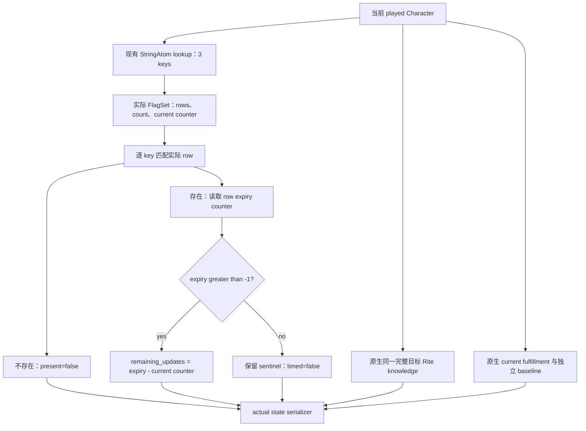

# CK3 1.20.0.2：转换后的知识、实际旗标期限与满足度

2026-10-01 17:59（Asia/Shanghai）冻结。状态为 **static-ready**：真实 provider、serializer 与 fixture 已实现；native callbacks 在此证据包中使用 fixture stub，尚无本组件的 paused live 样本。没有提交转换命令，也不宣称转换收益或完整转换 OODA。

版本是 1.20.0.2 Crozier / Steam build 25588574，EXE SHA-256 为 `AE1BA6FF060BA603842F6F4A2DED0AF4B7D3666B3DD271F75FB01B0DA8E81B2D`。只读取冻结 EXE 与脚本，沿用此前已闭合的 [知识与旗标输入](ck3-1.20.0.2-religion-conversion-gates.md)、[宗教上下文](ck3-1.20.0.2-religion-context.md) 和 [转换结果原生链](ck3-1.20.0.2-religion-conversion-outcome.md)。旧证明保持原样，未重测。

## 查询提供什么

入口位于 [`conversion_outcome12002_state.hpp`](../../ck3_autonomous_player/native_bridge/include/xar_bridge/conversion_outcome12002_state.hpp)，namespace 为 `xar::ck3_12002::religion_conversion::outcome::state`：

```cpp
Bindings BindConversionOutcomeStateImage12002(uintptr_t base, string_view sha);
bool ReadPlayedConversionOutcomeState12002(
    const Bindings&, uint32_t full_target_rite_id, uint64_t capture_epoch, Context&);
string SerializePlayedConversionOutcomeState12002(const Context&);
const char* ConversionOutcomeStateFailureKey(Failure);
```

固定读取当前 played character，目标使用完整 generation Rite ID。`0` 是合法引用，`0xFFFFFFFF` 是 absent；不会以 masked index 或请求参数冒充实际对象身份。目标解析通过后才填写 `target_rite_id`。核心 paused frame、日期、玩家与目标在读取前后保持一致，连续两个实际采样的字段也必须一致。

| 字段 | 读取来源与语义 |
| --- | --- |
| `knowledge_level_raw` | 原生 `0x2BDBDE0(out, Character*, Rite*)`，Q100000。before/after 都独立调用同一完整目标；没有把转换后的已知项补写等同于知识 100%。合法零值保持 `0`。 |
| `spiritual_fulfillment_raw` | 复用原生 `0x28BCE40(Character*, out)` 的当前 getter；有 extension 时读 `Character+0x1C8 -> +0xA0`，无 extension 时走原生默认 getter。 |
| `baseline_spiritual_fulfillment_raw` | 当前实际 `Character+0x1B0 -> +0x300` 有资源对象时读取 signed raw value；无资源对象时合法 `null`。它独立于当前值，不推断二者相等。 |
| 三种旗标 | 现有 StringAtom lookup `0x3F8A3A0` 和 Character FlagSet getter `0x1D67200`，不注册或插入键。每个独立返回实际存在及期限。 |

三种 key 与原版用途分别是 `faith_conversion_recently_converted`（转换 UI 的 5 年旗标）、`conversion_memory_recently_created`（转换记忆的 2 日去重）和 `recent_convert`（叙事事件的 20 年旗标）。这只是 frozen stock 语义；查询**不使用这些默认时长计算到期日**。它们也不代表同一个 native conversion legality gate。

每个 `FlagObservation` 的 JSON 包含：

```json
{
  "key_registered": true,
  "present": true,
  "timed": true,
  "expiry_counter_raw": 173,
  "current_counter_raw": 110,
  "remaining_updates": 63
}
```

合法 absence 是 `present:false`，到期与 timed 为 `null`。未注册 key、无 Character script data、原生 script index `-1` 的空默认集合都能确认 absence；`-1` 分支不会触发原生 lazy 初始化。getter/集合/atom 读取失败则组件 unavailable，实际字段回到 `null`，不会变成 absence 或零。存在的永久旗标保留原生 `expiry_counter_raw <= -1`、`timed:false` 与 `remaining_updates:null`。

## 到期字段确实是内部 counter

当前构建的 Character FlagSet：rows 在 `+0x10`，count 在 `+0x1C`，row stride `0x20`；row 的 key 在 `+0x08`，到期 counter 在 `+0x0C`，FlagSet 当前 counter 在 `+0x28`。原生 `add_character_flag` effect 在 `0x2D567E3` 取集合，并在 `0x2D5680A` 调 `0x3728420(FlagSet+8, key, payload, duration)`。

`0x372845E/0x3728461` 使用实际当前 counter 加原生 duration，`0x3728506` 写到 row+0x0C；非正 duration 在 `0x3728466` 写 `-1`。`0x3727636` 递增当前 counter，`0x3727643` 比较到期，再由 `0x372764E` 调 normalizer。Normalizer `0x88738E` 减掉实际 counter，`0x887395` 重写剩余值，`0x8873A3` 把 counter 清零；serializer 同样可做这种归一化。因此 **row+0x0C 不是游戏 calendar date，也不是永不改变的绝对期限**。



Provider 保留 signed 实际差值，不用 `remaining_updates > 0` 改写 row presence，不计算 calendar 到期日。JSON 明确标 `flag_expiry_unit:"native_flag_updates"`、`is_conversion_gain:false`。当前/基线值或两个采样间变化也不单独证明转换因果。

## 一次验证与冻结产物

[`conversion_outcome12002_state.py`](../../research/conversion_outcome12002_state.py) 对冻结 EXE 验证新增 8 个完整函数、26 条语义指令、3 个 source constants 与 3 个 frozen stock 窗口；只引用旧 knowledge/current/baseline 的 3 份 ABI manifest，不重复执行旧验证。新增 ABI manifest SHA-256：`54a7ff55cabd86815ab71c94c9c7924c2ce6f055d7eea810de55934fcb4da994`。

[`conversion_outcome12002_state_tests.py`](../../research/conversion_outcome12002_state_tests.py) 编译真实 core/provider/serializer，MSVC `/W4 /WX /Od` 与 `/O2` 各 **25 checks**、**6 actual serializer JSON** 全部 GREEN。覆盖分别读取的同目标 before/after、current 与 baseline 不同、合法零值、三个独立 key、实际 counter、永久 sentinel、旗标 absence、读取失败 unknown、目标 generation/合法 target 0、paused frame 与采样变化。这里的 before/after 是 fixture 所有对象，未在 CK3 执行转换。

产物根目录：`Z:\ck3_mod_rewrite\artifacts\g2-offline-2026-10-01\religion-conversion-outcome\state`。

- `native/native-verification.json`、`native/native-disassembly.txt`、`native/stock-evidence.txt`：新增 ABI 原字节与指令证明。
- `fixture/result.json`：两个构建及输入文件哈希；各 `Od` / `O2` 下的六份 JSON 是实际 production serializer 输出。
- `delivery-result.json`：七个独占 source/doc 的路径、SHA、readiness 与 artifact 清单。
- `report-fields.md`：供当日、当周报告协调者合并，避免共同文件冲突。

仅 static-ready；paused live 查询由本次独立 outcome 聚合与既有 native query owner 接入。首次 65 工具及 named6 源、旧 gates、共享 CMake/driver/registry 均未修改。完整转换因果、延迟叙事事件结果与生产闭环依然需对应实机证据。
