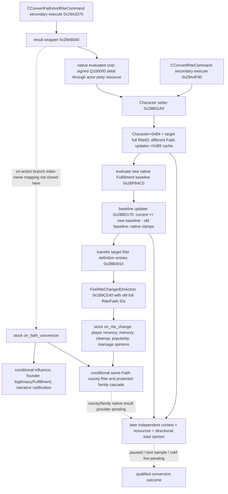

# CK3 1.20.0.2 宗教转换结果：独立身份、资源和后继脚本

状态为 **`research`**，下列原版脚本与 native 结果链为 **`static-confirmed`**。本包只读取冻结文件，没有访问 CK3 进程、pipe、UI 或 Steam，没有执行转换，也没有新增策略、转换 action 或宣称 live。项目所有者 2026-10-01 已开放宗教研究并停止战争研究；混合 on-action 中的军事事件不纳入本包树或提取窗口。

冻结：CK3 **1.20.0.2 Crozier / Steam 25588574**；EXE `101039736` bytes，SHA-256 `AE1BA6FF060BA603842F6F4A2DED0AF4B7D3666B3DD271F75FB01B0DA8E81B2D`。当前身份和精神满足度 getter 复用 [宗教 context](ck3-1.20.0.2-religion-context.md)，原版入口复用 [宗教 stock](ck3-1.20.0.2-religion-stock.md)。最终合法性、报价和 AI 选择由对应转换专题负责；本页只记录已经发生的结果应从哪里读回。

## 实际结果树与完成边界



实线 native 调用由冻结指令证明，stock 后果由脚本条件证明。图中的 wrapper→`on_faith_conversion` 仍保留 native branch-index 名称映射的缺口；不能凭函数名把全部脚本结果归为必定触发。没有任何 ACK、命令 enqueue、通知消失或同一个 callback 的返回值能替代 `READ`。

当前独立 context 已能读玩家实际 Rite、由该 Rite 解析出的 Faith/Religion、Faith main Rite、fervor 和当前 Fulfillment。它自身解锁身份观测，但本页尚未实现包含 county、family、recency 与转换原因的完整结果 query。

## Native 指令与对象身份

| 来源 | exact RVA / 字段 | 已证明的语义 |
| --- | --- | --- |
| `CConvertRiteCommand` | TypeDescriptor `0x5A163A8`; primary VT `0x47700E8`; secondary VT `0x4770180` | secondary subobject offset `0x18`，slot 1 为 `0x29A4F90`，尾跳 setter；不把 RTTI name 子串位置当 TypeDescriptor |
| `CConvertFaithAndRiteCommand` | TypeDescriptor `0x5A16768`; primary VT `0x4770340`; secondary VT `0x47703D8` | secondary slot 1 为 `0x29A3370`，调用实际 wrapper `0x29A8040` |
| Faith/Rite wrapper | `0x29A813A`, `0x29A813F`, `0x29A8143`, `0x29A8156` | 调用报价 core `0x29A3DE0`，取负、扩展为 signed 64 位、乘 `100000`，使用 actor resource `+0x1B0` 的 `+0x108` piety 对象；本包不重写报价或扣款算法 |
| Rite 写入 | setter `0x28B01A0`; write `0x28B0516` | 目标 `Rite+0x8` full ID 写入 `Character+0xB4`；完整 32 位 generation 保留 |
| Faith 缓存 | `0x28B057C`, `0x28B0597` | 仅在原先与新 Rite 的 Faith 不同时，清空/更新 `Character+0xB8` 缓存。独立读回继续用已审阅的 Rite→Faith getter，不能绕过 Rite 关系把该缓存当唯一权威 |
| 新基线计算 | setter `0x28B0635` → `0x2BFB4C0` | 转换后运行原生 default Fulfillment evaluator，输出为 signed Q100000 |
| 当前值与基线 | `0x28BD170` → `0x28BCE80` | clamp 新基线；与 resource extension `Character+0x1B0` 的 `+0x300` 旧基线相减；把差加入状态 extension `Character+0x1C8` 的 `+0xA0` 当前值，并经当前 setter 限幅；再存新基线 |
| 当前值写入 | `0x28BCEB2` | clamped signed 值写入实际状态 extension `+0xA0`；不是把 current 清零或简单覆盖为 default |
| Doctrine/Tenet knowledge 转移 | `0x28B064B` → `0x28B0910` | 遍历 Rite `+0x788/+0x794` 的 16-byte rows，仅 `row+0x8!=0` 时取 doctrine pointer；经 sibling 已闭合的 `0x28B0A30` 检查后向 Character state `+0xC8` 已知集合插入。row status 的枚举名称未闭合，不手写 Core/Permitted 含义 |
| 已知 Tenet 添加 | `0x28B0A06` → `0x28B0CD0` | 遍历 Rite `+0x7A0/+0x7AC` Tenet pointers，去重添加到 Character state `+0xE0`。group `+0xB08` 的 `+0x18C==1` 时还补 group 列表中相邻索引 entries；该条件的类别名字未互证，不自行命名 |
| Rite change on-action | `0x28B087E` → `0x289CE40` | 它保存旧 full RiteID/FaithID 并调 on-action；函数自带 `FireRiteChangedOnAction` 名称和 `character.cpp` 来源 literal |

setter 首部会检查目标对象和身份、相同 Rite 等条件，仍是一个 `void` 状态变更函数。它并没有返回可用作成功收据的 `bool`。本页保留这些路径用于归因，不发布或提交任何命令。

Fulfillment 的基线差有实际迁移影响：已有当局当前值、目标宗教原生 baseline 和 native 限幅都参与结果。脚本还可能给转换发起者而非被转换者增加 Fulfillment。单独观察 piety 花费或把 `current_after == default_after` 当判据都会误判。

## 原版非军事后果与独立读回对象

所有行号相对冻结 `installation/game/`，以 UTF-8 BOM 解码后的原始行号记录。

| 原版来源 | 条件与后果 | 应读回的独立对象 |
| --- | --- | --- |
| `religion_on_actions.txt:977–994` | `on_rite_change` 是角色变 Faith 或 Rite 的 code on-action，出生/创建身份赋值不调用。执行 PAM 冷却、个人 tenet 清理、liturgical language、doctrine 检查、held-title CoA 刷新、`changed_rite_flag` 与转换记忆 | 当前 Character Rite/Faith；具体 flags/记忆；不能仅靠 `changed_rite_flag` 证明本次目标达成 |
| `pam_effects.txt:11516–11524`; `pam_values.txt:167` | `pam_on_conversion_effect` 只给 `is_ai=no` 写 `faith_conversion_recently_converted`，期限 **5 年** | 玩家 flag 的当前有效性/过期日。不是 AI 的统一 scheduler，也不能假定所有转换只有一次调用 |
| `00_religion_effects.txt:1460–1511` | old Rite 存在且不同，且没有 `conversion_memory_recently_created` 时写记忆。**原版注释明确同 Faith 的窗口切换会触发两次 `on_rite_change`**，故用 2 日 flag 去重；Faith 分裂而 Rite 对象不变不算一次转换记忆 | full Rite/Faith 前后身份、实际 memory ID/type、去重 flag；不能把事件次数当转换次数 |
| `religion_on_actions.txt:843–940` | Faith conversion 保留 old Rite variable 30 日；有 state-faith 政府条件时，目标 Rite 与 top liege state Rite 相同且自身有 influence 才增加 `minor_influence_gain`；另有移除旧 state-faith opinion 的条件分支 | 原生 influence、state Rite、定向 opinion/modifier。不是每次转换固定增加 influence |
| `religion_on_actions.txt:941–968` | founder 的 Rite 有 Acts of Apostles 参数时，**founder** 按 converted ruler title tier 获 legitimacy；founder 可玩时加 `medium_spiritual_fulfillment_value=5` | founder 的 legitimacy/Fulfillment；不能记在 converted actor 名下 |
| `pam_on_actions.txt:268–281`; `pam_effects.txt:1381–1388` | actor scope 存在、与 root 不同且 actor 有对应 personal tenet flag 时，actor 得 `minor_spiritual_fulfillment_value` | interaction actor 的实际 Fulfillment；不能把其奖励写成 root 固定收益 |
| `faith_conversion_events.txt:3–67` | `.0001` 先要求 capital Faith==old Faith，**又只在 capital Faith==root 的当前 Faith 时**才尝试 `set_county_rite`。普通跨 Faith 转换不因事件头注释而免费改 capital Faith。同 Faith 改 Rite 时 clerical region holder 同首都且 Rite 不同，可尝试符合条件的自有邻县；否则改首都 Rite | capital/selected neighbor county 的 Rite/Faith 与 holder，保持 full IDs。`.0006` 是新建 Faith 的入口，不能外推为普通改宗后果 |
| `faith_conversion_events.txt:199–261` | spouse/close-family cascade 只带 AI、活着、旧 Faith 匹配且非受保护宗教 head/`ai_will_not_convert` 的角色；同 Religion 时还要求旧 Rite 匹配。spouse 须无领地；子女与下级亲属按实际年龄、领地和 guardian/liege 门检查，外域抚养的未成年有保护 | 每个实际家族角色的 full ID、Rite/Faith。不能把一人转换外推为全族或所有孩子同步 |
| `faith_conversion_events.txt:264–295` | 相符的 theocracy/lay-clergy 分支重配政府；存在 consort 时更新 active consort opinion | 原生政府和每个定向 spouse/consort opinion；不是一个固定 `conversion_opinion_delta` |
| `pam_effects.txt:8469–8512` | landed actor 改 Rite 时，仅相应 Faith 有 popularity 系统才减旧 Core Tenets popularity 并加新 Core Tenets popularity；两边各自有 gate | 两个 Faith 上的具体 Tenet popularity。不能以新 Rite 已生效推定 popularity 完成 |
| `faith_conversion_events.txt:456–541` | narrative `.1001` 的选项 b 才收 template priest 为 courtier、+50 定向 opinion 与 potential-friend；`after` 才设 `recent_convert` **20 年**。`.1002` 可延迟 **7 日**。`.1101` 的 toast 里 `show_as_tooltip` 不是执行第二次转换 | 真正选择、courtier/关系、各 flag 和后继日期；5 年 UI 冷却、2 日记忆去重、20 年 narrative flag 分开记录 |

`on_rite_change` 的其余脚本还含 condition-specific situation、折扣、clerical elector 和非军事 cleanup。本提取保留相关窗口作为后续入口，不宣称覆盖全部角色/政府/DLC 后果。军事事件虽然同处一个混合文件，已被明确排除。

## Knowledge、Hostility 与 Opinion 的施工入口

转换 gate owner 已定位 `knows_rite_level` native trigger `0x2AEA480` → core `0x2BDBDE0`，ABI 为 `int64_t*(out, Character*, Rite*)`；它按实际 doctrine/tenet 知晓比例求值，没有 eligible 条目时真实输出零。target Rite 不是 main Rite 时还合并 Faith main Rite 的 eligible Tenets，按实际 term ID 去重。此项是同批 sibling 的已闭合输入，本包不重复反汇编或冒充自己验证了该 core。已知 doctrine presence check `0x28B0A30` 和 known Tenet presence check `0x28B0C00` 与本包新定位的添加链互证，使转换后的知识增长有实际集合来源；其 row 状态名及 group 特殊类别名仍保留未知。

转换前后针对**相同 full target RiteID**调用该 core 可给独立当前 knowledge。转换添加了实际 entries，并不等价于把全部 eligible 知识直接设为 100%；main Rite 合并、资格过滤和新增/去重集合都必须由 getter 重算。不能把 transfer helper 的集合长度命名为 knowledge，或以 5 年 recency flag 代替知晓度。

定向 total opinion 可以直接复用 [gift opinion](ck3-1.20.0.2-gift-opinion.md) 的实际 `ReadCharacterOpinion12002`，native `0x28BC490(owner Character*, toward Character*)`，并保持 owner→toward 方向。它给转换后的可见实际关系值；转换引起的 modifier、faith hostility、consort 更新及同时发生的其它 effect 都可能参与，**两个 total opinion 样本的差不能单独命名为宗教 hostility 或本次 conversion-only delta**。

本包没有闭合 Faith/Rite 的 directional hostility breakdown getter。已发现 EXE `GetHostilityLevel` literal `0x4565F58`，但它的 owner type/callback 未互证，因此只作后续具体逆向入口，不进入 provider。优先施工顺序是：复用原生 total opinion 获得当前可见关系 → 沿 `0x28BC490` 中宗教 contribution 调用或 exact `GetHostilityLevel` registration 闭合**定向实际值** → 发布同帧只读查询和版本绑定 fixture。没有用 Faith/Religion equality 手写一个模拟 hostility 值。

最小 conversion-result query 的实际组成应为：已有 religion context 的当前 actor/full Rite/Faith/Religion/Fulfillment；已有 actor resources reader 的实际 piety/prestige/gold；同一目标 Rite 的 native knowledge；最终门 owner 的 recency/expiry；相关人物的定向 total opinion；有确实受影响 county/family 时继续补其身份读回。上述当前 getter 可先解锁独立可见观测；没有完成的 county/family/expiry 不能以全为 `null` 的 schema 宣称完整结果闭合。

只有实际 paused after artifact、下一次独立采样和必要 cold 读回闭合后，才能升级 conversion primitive/loop。当前代码没有动作入口，亦没有以固定资源增量或 narrative 通知替代真实状态。

## 可复现冻结结果

[提取/验证器](../../research/religion_conversion12002_outcome.py) 与 [ABI/stock manifest](../../research/religion_conversion12002_outcome_abi.json) 只读取冻结 EXE/游戏文件。首轮八个函数体已有结果后，sibling 的知识 getter 新证据使本包补入实际 Tenet 添加 body 与三个 source sites，最终必要增量验证通过：**9 个完整函数体（含 chained unwind body）、25 条语义指令、2 套 command RTTI/COL/vtable、14 个非军事 stock 窗口**。该验证未运行 EXE 指令，不是 CK3 的 `fixture-live`。

artifact 为 `Z:/ck3_mod_rewrite/artifacts/g2-offline-2026-10-01/religion-conversion/outcome/verified/`：

- manifest SHA-256：`68e8a2ff864c8ef3149a52f51d90001fc2be6c82d88fdbf0f7ba676d8fff98d4`。
- native disassembly SHA-256：`bf442bab6404fb91d3c601246fd56aaac2566d50ad52550eb8323be2b5030e3d`。
- stock evidence SHA-256：`d37bf6baf6e47c2bf2cd6c4e4842af2203c98c38a1c4e9bebe2e2c228e3cacd4`。

```text
python research/religion_conversion12002_outcome.py --exe <frozen-exe> --game <frozen-game> --output-dir <Z-artifact-dir>
```

未闭合：Rite doctrine row status/group 特殊类别的名称、方向 hostility breakdown、原生 recency expiry、county/family 完整结果 provider、真实 delayed event/选项执行与冷启动持久性。最终 gate/费用/AI 输入由并行转换专题接入；本包的上述缺口是具体施工入口，不是 live 或完整改宗 OODA 的完成证明。
