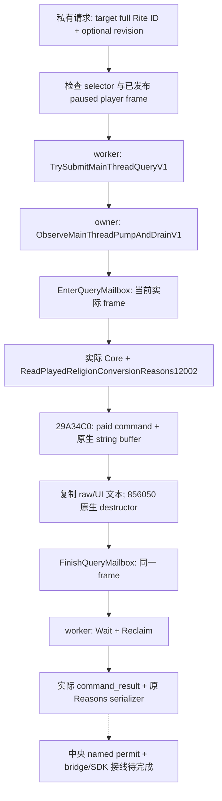

# CK3 1.20.0.2 religion conversion reasons query

2026-10-01，`static-ready`。这个独立只读查询提供当前玩家角色与指定完整 Rite ID 的原生付费转换校验结果及格式化理由，返回完整 `command_result`。底层字符串 ABI 和生命周期已经在[原生理由专题](ck3-1.20.0.2-religion-conversion-reasons.md)闭合；本增量复用该 provider，不重复它的矩阵。

冻结构建：CK3 1.20.0.2，EXE SHA-256 `AE1BA6FF060BA603842F6F4A2DED0AF4B7D3666B3DD271F75FB01B0DA8E81B2D`。当前增量没有访问 CK3、进程、pipe、GUI 或 Steam，没有执行转换。

## 请求与结果

编译开关为 `XAR_CK3_ENABLE_G2_RELIGION_CONVERSION_PRIVATE_QUERY_V1`。私有 selector 为 `query-player-religion-conversion-reasons-v1`，domain 为 `player_religion_conversion_reasons_v1`，backend 为 `ck3-1.20.0.2-native-player-religion-conversion-reasons-v1`。

请求正文：

```json
{"target_rite_id":2181038082,"expected_snapshot_revision":701}
```

`target_rite_id` 必填，保留 uint32 完整 generation。`0` 是合法 ID；`4294967295` 是 absent，拒绝请求。期望 revision 可省略；`expected_revision` 是别名。若同时提供，两者必须相同且非零。角色仅来自已发布的当前玩家快照，查询不使用外部 actor 输入。

成功命令响应的 `result` 包含 `step`、`accepted:true`、`status`、`private_build:true`、`read_only:true`、`advertised:false`、版本和 EXE SHA、domain/backend、`snapshot_revision`、`date_raw`，以及 `player_religion_conversion_reasons`。该 DTO 直接调用原库的 `SerializeReligionConversionReasons12002`，保持以下原生语义：

| 字段 | 含义 |
| --- | --- |
| `available` / `unavailable_reason` | 实际读取是否成功及失败源；有效的原生拒绝仍是 `available:true` |
| `capture_epoch` | 当前实际主线程 pump epoch，与已发布 snapshot revision 分开 |
| `played_character_id` / `date_raw` | 观测的当前玩家角色及日期；读取失败时保留所属已发布帧 |
| `current_rite_id` / `target_rite_id` | 原生完整 ID，零不代表缺失 |
| `native_paid_validator_passes` | 原生付费 validator 的独立 bool；读取失败为 `null` |
| `native_blocker_text_available` | 文本来源是否可用；已知空字符串仍为 `true` |
| `raw_native_text` | 原生 formatter 字节文本，保留 UTF-8、markup 和换行 |
| `ui_blocker_text` | 原 UI 的末尾 LF 行为：非空且不以 LF 结尾时补一 LF |
| `reason_codes_available` | `false`；当前 formatter 没有闭合稳定的机器理由枚举 |

文本长度不决定合法性。允许的原生结果可能带说明；拒绝也可能具有已知空理由。该查询的 paid bool 没有替代[terms 查询](ck3-1.20.0.2-religion-conversion.md)的不同目标入口门和费用整合。当前 terms 的文本字段保持原有版本契约；消费者需要解释时显式查询本独立域。

## 实际执行链



`ExecutePlayerReligionConversionReasonsMailbox12002` 沿现有 `QueryMailboxEnvelope` 进入与结束主线程观测。读取成功后核对角色和日期；原生读取失败仍可返回 `status:"unavailable"` 的具体 DTO。整个所属帧改变则不输出成功包。字符串构造、原生 formatter、一次析构及完整 ID 解析使用已冻结的理由库。

公共接线点位于 `ck3_12002_religion_conversion_reasons_mailbox.hpp/.cpp`：

- `IsPlayerReligionConversionReasonsPrivateStep12002` / `ParsePlayerReligionConversionReasonsRequest12002`。
- `HandlePlayerReligionConversionReasonsPrivate12002`，复用 `NativeAdapter12002` 与已发布 frame/revision。
- `PlayerReligionConversionReasonsMailboxContext12002` / `RunPlayerReligionConversionReasonsMailbox12002`。
- `ExecutePlayerReligionConversionReasonsMailbox12002` / `SerializePlayerReligionConversionReasonsResult12002`。

中央生产注册建议使用独立 `permitted_executor_religion_conversion_reasons12002`。本次 fixture 使用已有 primary `permitted_executor`，没有改共享 mailbox、CMake 或 bridge。生产 named permit 尚未在本增量验收。

## 一次必要验证

运行 `research/religion_conversion12002_reasons_mailbox_tests.py --artifacts <directory>`。新矩阵链接实际 `ck3_12002.cpp`、Rite/reasons provider、主线程 mailbox、query envelope、protocol 及本新模块，使用 fixture 原生回调与 fixture 内存；只有普通 adapter 的实例化使用独立测试 seam。实际 worker 提交、owner drain、Wait/Reclaim、provider 与完整响应 serializer 均执行。

artifact：`Z:\ck3_mod_rewrite\artifacts\g2-offline-2026-10-01\religion-conversion\reasons-query\attempt-1\result.json`，SHA-256 `089e59c9ec029e76f1f5fced3819f118e147bfe60c528ac7e62ff746d63c5778`。

`/Od` 与 `/O2` 首轮各 `/W4 /WX` GREEN，各 59 checks。每种编译模式保留八个由实际 serializer 产生的完整包：

| case | 核验结果 |
| --- | --- |
| `native-refusal-sso.json` | 原生拒绝、inline string、paid command、owner thread、一次析构 |
| `native-refusal-heap.json` | 原生 heap 文本复制与析构；中文、markup、引号与已有 LF 原样保留 |
| `native-allowed-empty.json` | 原生允许、已知空理由、`native_blocker_text_available:true` |
| `native-allowed-with-text.json` | 原生允许但带说明，文本不反推拒绝 |
| `native-refusal-empty.json` | 原生拒绝且已知空理由 |
| `target-zero.json` | 合法完整 ID 零通过实际 provider |
| `target-unavailable.json` | generation 不匹配，不调用原生 formatter，返回 typed unavailable |
| `native-text-unavailable.json` | 实际 source 的字符串读取失败，析构仍执行，理由与 bool 均不可用 |

另保留真实 `frame-drift.json.rejection.json` 和 `stale-request-rejection.json`；前者证明帧变化不产生成功包且 ticket 已回收，后者证明过期请求尚未提交。解析矩阵还覆盖 absent/溢出/负数/小数、零 revision 与冲突别名。运行中的已发布帧在 handler 前拒绝。

完整 wire 位于 `attempt-1/Od/wire/` 与 `attempt-1/O2/wire/`，可直接用于 Python 叶的协议夹具，不能自行拼 metadata。没有重复原理由库、Rite、terms、choices 或 inputs 的旧验证。

## Readiness 与下一步

本模块已交付可接线的真实只读 provider 与完整协议包，状态为 `static-ready`。中央生产 named permit、私有 selector dispatch、构建源注册与同 MCP Python 叶属于下一接线增量；接线后需要当前 paused CK3 的拒绝理由 snapshot。没有该 artifact 前，不称为 fixture-live 或 production-live。不存在转换动作、完整宗教 OODA 或稳定理由 code 的完成声明。
