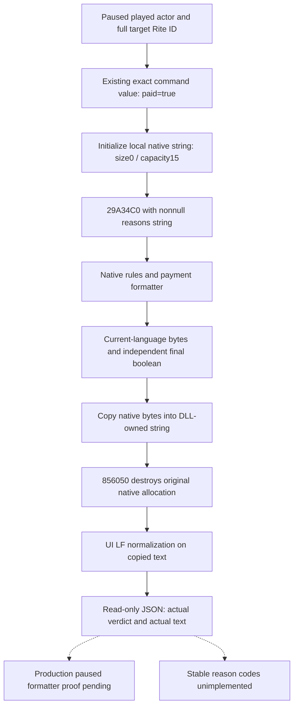

# CK3 1.20.0.2：转换拒绝理由的原生格式化观测

当前状态：**static-ready，独立增量**。现有 [Rite 最终判定](ck3-1.20.0.2-religion-conversion-rite.md) 与 terms/choices/inputs 包已经可独立交付；本包补充当最终结果为负时可供解释的真实 native 文本，没有修改或重测这些冻结包。没有真实 paused formatter artifact，不记 live，也不记转换动作/OODA 完成。

绑定 CK3 `1.20.0.2 Crozier / Steam25588574`，EXE SHA-256 `AE1BA6FF060BA603842F6F4A2DED0AF4B7D3666B3DD271F75FB01B0DA8E81B2D`。本包没有打开 GUI、操作游戏、触发改宗或新增战争研究。

## 原始 UI caller 与可调用 ABI

`FaithConversionWindow.GetConversionBlockers` 注册处 `0x22F463` 绑定反射 `0x1516DD0`。反射为返回文本准备栈对象，调用核心 `0x1516B20(window, nativeStringOut)`，把文本复制进反射输出，再调用游戏原生析构函数。核心的实际输出链如下：

| 项目 | exact-build 证据 |
| --- | --- |
| 原生字符串对象大小 | `0x20` |
| 内联文本/堆指针区 | `+0x00`，16 字节 |
| 文本 byte length | `+0x10`，64 位 |
| capacity | `+0x18`，64 位；小于 16 使用内联文本 |
| 构造 | `0x1516B40–4F` 内联设 size=0、capacity=15、首字节=0；不需要虚构单独 ctor |
| 实际格式化 caller | `0x1516B9B` → `0x29A34C0(command, nativeStringOut)` |
| Command | 与 Rite 包相同的 `FaithAndRiteConversionCommand`，paid flag=1 |
| 输出复制 | `0x1516DEF` → `0x879990` |
| 实际原生析构 | `0x1516DFA` → `0x856050(nativeString*)` |

`0x29A34C0` 保存非空的 reasons 参数后，建立规则 formatter 中间对象，最终由 `0x375DCC0` 写出原生理由文本。支付资格分支也把原生格式化结果追加到同一字符串；例如 `0x29A4216` → `0x885FD0`。该链使用游戏当前语言与原生格式，不通过我方重新列举或翻译资格原因。

析构 `0x856050` 在 capacity≥16 时释放游戏持有的 heap allocation；大 allocation 的内部指针处理也由它负责，之后复位 size=0、capacity=15、首字节=0。因此本 DLL 的标准库 allocator **不参与释放游戏字符串**。新 provider 使用相同的 caller-owned 32 字节 plain buffer，调用最终 validator 一次，将字节文本复制为 DLL 自有字符串，然后调用该原生析构一次。

这是直接可用的 `current played actor + target full Rite ID` 只读路径：无需构造窗口对象，不借用真实宗教窗口的成员，也不执行命令的 Submit/Execute。现有 Rite 包已经证明完整 Command 布局与 validator 的资格/支付调用；本轮只验证新增的 reasons 参数、格式化输出和字符串生命周期。

## 原生 UI 文本的尾部处理

`0x1516B20` 对非空文本检查最后一字节，使用 `0x448D028` 的 `"\n"` 常量及 `0x3EF1000` 的 native insert 方法，在文本缺少末尾 LF 时补一个 LF。已有 LF 和空文本保持不变。

查询分别公开：

- `raw_native_text`：最终 validator 格式化出的原始字节文本。
- `ui_blocker_text`：复制原始文本后应用上述 UI 的一个末尾 LF 处理。
- `native_paid_validator_passes`：同一次 paid=true validator 的实际 boolean。
- `native_blocker_text_available`：本次原生字符串已实际读取/复制。空字符串也可以是已知值，不能改写为未读取。

`GetConversionBlockers` 的 UI caller 没有根据 validator 的返回值决定是否取字符串；反射格式化说明和最终允许/拒绝结果是两份独立输出。**非空文本不能替代最终 boolean，也不能从文本长度判断转换是否被拒绝**。本包没有稳定 machine-readable reason codes，明确公开 `reason_codes_available=false`。

## 原生树

## 施工与验收

源码：`include/xar_bridge/ck3_12002_religion_conversion_reasons.hpp`、`src/ck3_12002_religion_conversion_reasons.cpp`。入口为 `ReadPlayedReligionConversionReasons12002(bindings, fullTargetRiteID, captureEpoch, out)`，绑定函数为 `BindReligionConversionReasonsImage12002`。只能由既有 paused application-main owner 调用，当前只是独立 library，不新增共享 CMake/bridge/MCP 注册。

ABI 脚本 `research/religion_conversion12002_reasons_verify.py` 一次验证 **30 个精确指令 span** 与原生 newline literal，结果 `artifacts/g2-offline-2026-10-01/religion-conversion/reasons/abi-verification.json` GREEN。旧 Rite 的完整 ID 和 validator 证据直接复用，不重跑旧 25-span 合同。

新增实际 C++ producer/serializer 夹具 `src/ck3_12002_religion_conversion_reasons_test.cpp` 在 MSVC `/Od`、`/O2`、`/W4 /WX` 各 **13 项检查 GREEN**。两组各产出 7 份实际 wire JSON：

- SSO 原生负例，原文与 UI 末尾 LF 可区分。
- heap-backed UTF-8 中文、多行、引号与原生 markup，先复制后由指定 destructor 回收。
- native 允许、native 拒绝的已知空字符串。
- native 允许且文本非空，最终 boolean 保持 true。
- target 读取失败与非暂停帧，和合法拒绝分开。

这些 callback 是夹具，证明新 provider 的真实代码路径与字符串调用合同，不能称为游戏格式化实测。首次 ABI/编译/夹具运行即 GREEN，无本包失败 attempt；旧包测试未重复执行。

下一步是聚合入口/MCP 增量接线后，由 root 在同一真实 paused 帧采样 native 负例及原生理由文本，记录 actor/target 完整身份、date/epoch、native final boolean、原文和 UI 文本。不能用 fixture 文案冒充游戏本次输出，也不能把 formatter ACK 当作实际字符串。当前 terms/choices/inputs 不以本增量作为交付等待条件。
