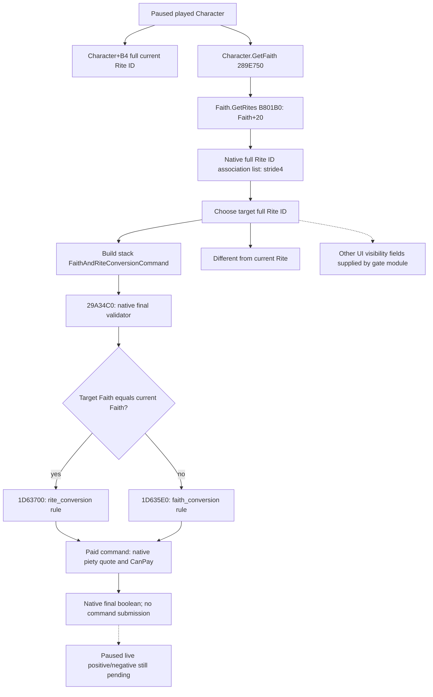

# CK3 1.20.0.2：目标 Rite 的只读转换预览

当前状态：**static-ready**。用户已明确恢复宗教研究并停止战争研究；本工作只读冻结 EXE 与宗教窗口/规则数据，没有操作 CK3、触发转换或新增战争研究。源查询和实际 C++ 序列化已在 Od/O2 夹具中通过；没有真实 paused artifact，不能记为 live 或完整宗教 OODA。

版本绑定：CK3 `1.20.0.2 Crozier / Steam25588574`，EXE SHA-256 `AE1BA6FF060BA603842F6F4A2DED0AF4B7D3666B3DD271F75FB01B0DA8E81B2D`。全部 RVA 相对该 EXE。`Character+B4` 是完整 **Rite** 引用；Faith 来自 Rite 的 `+4B8`，不继续使用旧版 Character 字段标签。

## 确认按钮的最终判定

原版 `gui/window_faith_conversion.gui:167` 调用 `FaithConversionWindow.ConvertFaithAndRite`；`:170` 的 enabled 来自 `FaithConversionWindow.CanConvertFaithAndRite`。反射注册 `0x22F2D3` 绑定 `0x1516D90`，其调用核心 `0x1516950`。核心在栈上构造 **CConvertFaithAndRiteCommand**，再调用其 primary vtable 的 `+0x30` 校验槽。该类型与另一个 CConvertRiteCommand 不能混用。

| 内容 | exact-build 证据 |
| --- | --- |
| Command 大小 | `0x30`，与窗口栈值一致 |
| Primary / secondary vtable | `0x4770340` / `0x47703D8` |
| Actor 完整 Character ID | Command `+0x20`；窗口从当前 played actor 全局副本取值 |
| Target 完整 Rite ID | Command `+0x24`；窗口从 `window+0xC8` 取值 |
| 支付虔诚标志 | Command `+0x28`，窗口设为 `1` |
| 最终 validator | vtable `+0x30`（slot `0x4770370`）→ `0x29A34C0` |
| Validator 签名 | `bool(const FaithAndRiteConversionCommand*, reasonsNullable)`；窗口传 `nullptr` |

`0x29A34C0` 解析 actor 与 target Rite 后，比较 target Rite 与当前 Rite 的 `+4B8` Faith ID：

- 同一 Faith：调用 `0x1D63700(Character*, fullRiteID, reasonsNullable)`。该函数创建角色根作用域及 type `42` 的 `new_rite` 目标，再对 rules instance 的 `+0xEF0` 对象、`+0x410` 成员求值。无 reasons 的实际路径调用 `0x372DF30`；有 reasons 才调用 `0x372E4F0`。
- 不同 Faith：调用 `0x1D635E0(Character*, fullFaithID, reasonsNullable)`。Faith 候选与该规则入口见对应 Faith 专题，不在本文件重复研究。
- 支付标志为 `1`：调用 `0x29A3DE0(command, tooltipNullable)` 获取 native whole-piety quote，乘 `100000` 形成引擎固定点，调用引擎的支付资格判定，与前述规则结果取 AND。

该 validator 也保留原生开发/调试条件下的短路分支；查询报告 native 原始结果，不把它重写为我方规则。**只调用 validator 不会提交或执行命令**，不需要创建/打开 FaithConversionWindow。

`validator_without_payment` 是把同一栈值 `pay_piety` 设为 `0` 的规则诊断。它不能当成可执行结果；实际按钮对应的是 `validator_with_payment`。两者都为 `false` 是可用的原生负例，和 `available=false` 的读取失败不同。

## 入口可见性与完整 ID

FaithWindow 的 `ConvertButtonIsShown` 反射 `0x14C8AB0` → 核心 `0x14C2F10`。已静态闭合的核心检查包括当前 played Character 有有效 Char tag/full ID、所选 Rite ID 不是 `FFFFFFFF`、所选 Rite 与当前 Character+B4 不同。原版窗口 `gui/window_faith.gui:1307` 另有外层 `Rite.IsVisibleInGui` 条件。

查询公开 `different_from_current_rite`，不会把同一 Rite 的 validator 结果称为新的转换动作资格。外层可见性和转换按钮最终结果必须保持为独立字段，由聚合查询消费对应实际原生判定；本模块没有编造可见性。

Rite storage 全局槽为 `0x5D1E2F8`。解析完整 ID 时低 24 位只用于查槽；槽数组 `storage+0x20`、槽数量 `+0x2C`、stride `0x10`、object pointer 在槽 `+8`。Rite 对象 `+8` 必须等于整个 32 位 ID，不能仅比较低位，也不能把引擎 default object 当成所请求的 Rite。

## 当前 Faith 的 Rite 候选入口

`Faith.GetRites` 的反射 `0x2444410` 调用 `0xB801B0(Faith*)`，后者返回 `Faith+0x20` 的原生关联容器。datamodel 实际消费者 `0xFBD030` 读取该容器 `+0x0C` 的 size、`+0x00` 的 data pointer，并按 **4 字节完整 Rite ID** 取元素，再调用 `0xF037C0(&fullRiteID)` 解析；范围消费者 `0xFBD1D0` 独立支持相同 stride。容器 `+8` 是容量，临近交换消费者也保留 size/capacity 的区别。

`ReadCurrentFaithRites12002` 使用当前 paused played actor → 实际 Character.GetFaith → 该关联容器，复制完整 Rite IDs，并核对每项的完整身份及 Faith 归属。原生列表的顺序、当前 Rite 和合法空列表都保留。**关联集合不是“全部合法转换候选”**；选定目标后仍要运行上述 native validator。本入口只列当前 Faith，跨 Faith 的候选主 Rite 来自 Faith 专题的原生 Faith registry。

## 原生树与我方查询边界

原版 `common/scripted_rules/00_rules.txt:94–126` 定义 `rite_conversion`：成人、宗教领袖/antipope 限制、原生运行状态限制、目标 Rite enabled/convertibility、相同 Faith、state Rite 的 knowledge/recency 特例及一般 knowledge/recency 条件。查询复用最终规则结果，不重新实现脚本，也不深入研究其战争状态分支。`can_convert_to_rite` 只属于目标 Rite 的可变旗标，不能单独替代 actor/target 的整套资格。

我方没有 conversion counter-policy、转换命令执行、自动目标选择或生产结果证明。当前交付提供真实的 native 观测入口，供下一步 paused 查询及宗教决策施工使用。

## 可复现验收与下一步

- ABI：`native_bridge/research/religion_conversion12002_rite_verify.py` 对 exact EXE 验证 **25 个指令 span** 和最终 validator vtable slot。结果 `artifacts/g2-offline-2026-10-01/religion-conversion/rite/abi-verification.json`。
- 生产源码：`include/xar_bridge/ck3_12002_religion_conversion_rite.hpp`、`src/ck3_12002_religion_conversion_rite.cpp`。
- 实际 C++ 路径夹具：`src/ck3_12002_religion_conversion_rite_test.cpp`，MSVC `/Od` 与 `/O2`、`/W4 /WX` 各 **14 项检查 GREEN**。覆盖 same/different Faith、支付拒绝、规则拒绝、原生当前目标区别、关联列表含合法零 ID、空列表和真实读取失败；native callback 仍是夹具，不能称为引擎实测。
- 夹具和实际序列化 wire：`artifacts/g2-offline-2026-10-01/religion-conversion/rite/fixture-result.json`，两组目录各 9 个 JSON；首次编译/测试即 GREEN，没有失败 attempt。
- 下一步：与 Faith 候选、实际费用和 UI gate 查询聚合后，在 root 独占的真实 paused frame 读取当前/目标完整身份、关联候选及 native 最终正负例；结果必须记录 artifact，再设计相应最小决策。当前不执行改宗，不增加 G2 credit。
