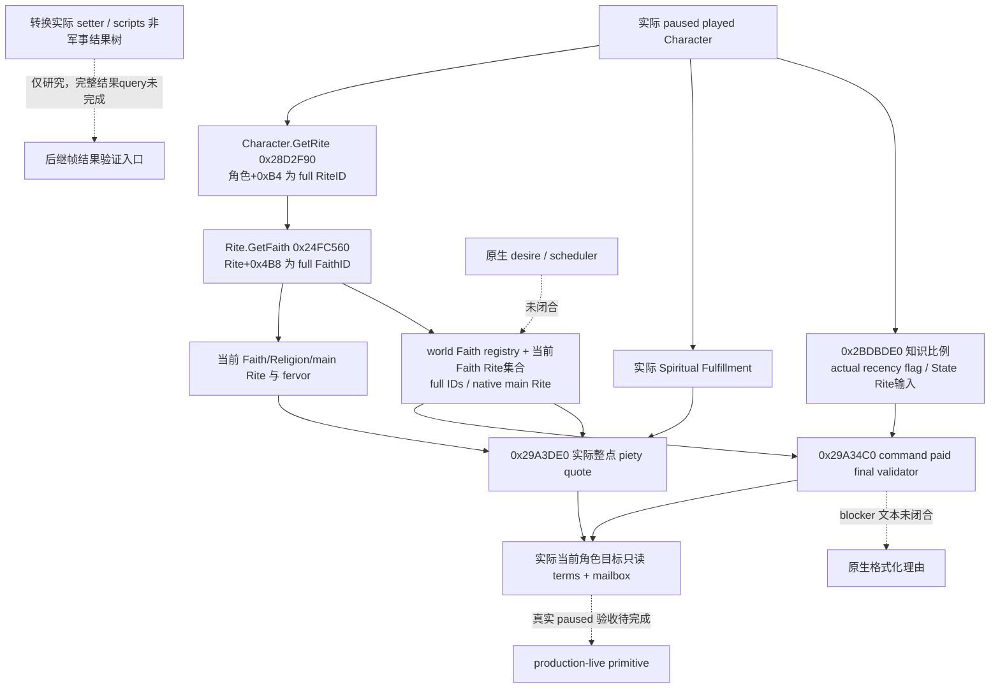

# CK3 1.20.0.2 宗教转换：原生只读施工入口

项目所有者在 2026-10-01 明确开放宗教研究，同时停止战争研究。本专题只推进 Faith/Rite 转换所需的候选、最终合法性、理由、费用与独立结果观测，不执行转换，也不设计自动玩家宗教策略。冻结版本为 **1.20.0.2 Crozier / Steam25588574**，EXE SHA-256 **AE1BA6FF060BA603842F6F4A2DED0AF4B7D3666B3DD271F75FB01B0DA8E81B2D**。

当前目标转换 terms、Faith 候选、当前 Faith 的 Rite 集合及知识/近期转换输入 provider 为 **static-ready**；非军事结果树为 **research/static-confirmed**，AI scheduler 尚未闭合。已有 [stock](ck3-1.20.0.2-religion-stock.md) 和 [当前宗教上下文](ck3-1.20.0.2-religion-context.md) 的证据直接复用。没有本转换包的 paused artifact、转换动作或 production-live loop。

## 并发工作包

| 包 | 明确交付 | 专题 |
| --- | --- | --- |
| Faith 资格 | 实际 world Faith 候选、主 Rite 与 `0x1D635E0` 规则结果；已实现 provider | [Faith](ck3-1.20.0.2-religion-conversion-faith.md) |
| Rite 与共用最终门 | `CanConvertFaithAndRite` 下层 `0x29A34C0` paid validator；当前 Faith Rite 集合；已实现 provider。blocker 文本尚未提取 | [Rite](ck3-1.20.0.2-religion-conversion-rite.md) |
| 费用 | `0x29A3DE0` 真实整点 piety 报价、实际余额与可支付性；已实现 provider，传输金额另换算 Q100000 | [费用](ck3-1.20.0.2-religion-conversion-cost.md) |
| Knowledge / recency | `0x2BDBDE0` 目标知识、实际近期 FlagSet 和复用 State Rite 身份例外输入；已实现 provider | [输入门](ck3-1.20.0.2-religion-conversion-gates.md) |
| AI 输入 | 原生转换 desire、候选选择与 scheduler，未闭合分支继续明确标注 | [AI](ck3-1.20.0.2-religion-conversion-ai.md) |
| 非军事结果 | Faith/Rite 身份、转换记录及资源/关系结果的独立来源 | [结果](ck3-1.20.0.2-religion-conversion-outcome.md) |

六包分别持有独立 research/topic/provider 前缀。共用窗口最终门集中到 Rite 包，避免六路重复解析同一函数。费用、knowledge 与最终 legality 分开，是为了取得完整原生结果及其必要输入；单独的可转换旗标或足够 piety 不能充作最终允许。

## 已知输入与待闭合分支



上述实线具有对应 exact-build ABI 与实际只读 provider/fixture。各子专题分别记录研究窗口、函数体/指令、失败 attempt 和实际生产源验证。窗口只用于定位实际 evaluator，terms 不打开窗口，也不调用命令 Execute/queue；paid command 的本地栈值只传给 native validator 与 quote getter。blocker 的原生格式化文字尚未提取，明确以虚线保留。

`can_convert_to_rite` 是目标 Rite 上可变的可转换状态，不能单独代替角色/目标的最终合法性。Faith 的 `main_rite` 与角色当前 Rite 也不等价。知识阈值、UI 玩家冷却和 AI 最短重评周期保留各自来源，不合并成一项手写五年判断。

## 收口条件与实机边界

当前已实现目标转换只读 terms：[header](../../ck3_autonomous_player/native_bridge/include/xar_bridge/ck3_12002_religion_conversion_terms.hpp)、[实际聚合](../../ck3_autonomous_player/native_bridge/src/ck3_12002_religion_conversion_terms.cpp) 与 [domain mailbox](../../ck3_autonomous_player/native_bridge/src/ck3_12002_religion_conversion_mailbox.cpp)。它读取实际当前玩家、目标完整 RiteID、paid native final verdict 及最终 piety quote，要求两组件报告同一角色、日期、目标 Faith 与同 Faith 分支。`can_convert` 保留 paid final verdict，并应用 native 转换入口已证的 target 与 current Rite 必须不同的身份门。足够余额或 unpaid 诊断不能覆盖原生拒绝。

namespace 为 `xar::ck3_12002::religion_conversion::terms`：

```cpp
Bindings BindReligionConversionTermsImage12002(uintptr_t base, string_view exe_sha);
bool ReadPlayedReligionConversionTerms12002(const Bindings&, uint32_t target_rite_id,
    uint64_t capture_epoch, Terms&);
string SerializeReligionConversionTerms12002(const Terms&);
```

唯一 private selector 为 `query-player-religion-conversion-terms-v1`，flag 为默认关闭的 `XAR_CK3_ENABLE_G2_RELIGION_CONVERSION_PRIVATE_QUERY_V1`。request 必须含 `target_rite_id`（full unsigned 32 位、零合法、`0xFFFFFFFF` absent 不作目标）；可含 `expected_snapshot_revision` 或别名 `expected_revision`，两者同时提供必须相同，显式 revision 必须匹配当前发布帧。没有 actor 选择，始终使用 actual played Character。接口为 `IsPlayerReligionConversionTermsPrivateStep12002`、`ExecutePlayerReligionConversionTermsMailbox12002`、`HandlePlayerReligionConversionTermsPrivate12002`。中央须注册独立 named executor；不能把现有 current-context 回调冒充 terms permit。

response 是完整 `command_result`（`protocol_version=1`），result 包含 `accepted=true`、`status=observed|unavailable`、`private_build=true`、`read_only=true`、`advertised=false`、exact build、`domain_key=player_religion_conversion_terms_v1`、`backend_id=ck3-1.20.0.2-native-player-religion-conversion-terms-v1` 和实际 published `snapshot_revision`。DTO key 为 **`player_religion_conversion_terms`**、schema 为 `ck3_12002_religion_conversion_terms_v1`；它含 `available`/`unavailable_reason`、实际 `capture_epoch`/`date_raw`/`played_character_id`/`target_rite_id`、`can_convert`、原生产出的嵌套 `final_gate` 和 `cost`。`capture_epoch` 不替代 published revision。`native_blocker_text_available=false` 诚实记录当前未提取原生理由文字；不会由 Python 猜造具体失败原因。

query 只复制结果，不提交 `CConvertFaithAndRiteCommand`、`CConvertRiteCommand` 或任何界面动作。Faith choices 中的 `native_faith_rule_passes` 仍只是 Faith rule，`rule_only=true`，完整 paid 条件必须对其 actual main Rite 或其它选定 Rite 进入本 terms。Rite 集合 membership 也不代表允许转换。

[实际 fixture](../../ck3_autonomous_player/native_bridge/src/ck3_12002_religion_conversion_terms_test.cpp) 链接原来的 core、Rite provider、cost provider、terms、domain runtime、`QueryMailboxEnvelope`、主线程 mailbox 和 serializer；[runner](../../research/religion_conversion12002_terms_tests.py) 首轮 MSVC `/W4 /WX /Od` 和 `/O2` **各 42 项检查、7 个场景、6 份实际完整 C++ response JSON GREEN**。包括原生允许、原生规则拒绝但余额足够、费用差一个 raw unit、current Rite、目标 generation 不匹配、cost 读取失败，以及实际 owner frame 漂移无成功 packet。worker 真实 submit，夹具 owner 真实 pump/drain，worker 真实 wait/reclaim；没有替换这些生产路径。native getter/predicate 使用夹具 callbacks 和对象；fixture 用既有 primary permit 和 bare NativeAdapter identity shim，不冒充已集成 WorkerAdapter 或 CK3 实机。

receipt 与 wires 在 `Z:/ck3_mod_rewrite/artifacts/g2-offline-2026-10-01/religion-conversion/terms/attempt-001/`，两模式的 JSON 由 Python 解析并验证实际协议字段、paid/unpaid 的差异与观测失败。没有失败 attempt；没有重复跑已 GREEN 的独立子组件。

下一步为中央 native named permit/route 与 Python MCP actual-wire consumer，再由 root 在真实 paused frame 查询可见目标，记录原生拒绝/费用不足/允许情况并用后继独立样本互证。本包不执行转换；完整 blocker 文本、AI final desire/scheduler、转换后全部家族/County/记忆期限 outcome 仍须后续具体工作包。没有把这些 unknown 填成零或宣布通用宗教决策已完成。

各包只进行一次与实现相称的 exact PE/实际生产源 fixture 验证，并保留失败 attempt。中央 CMake、shared bridge/driver/MCP 注册由协调者完成；实机由 root 独占。战争、圣战、holy order 不在本次施工范围。原生树完成并有实际 paused 证据以后，宗教策略才拥有可用输入；本专题当前不宣称完整宗教自动玩法。
