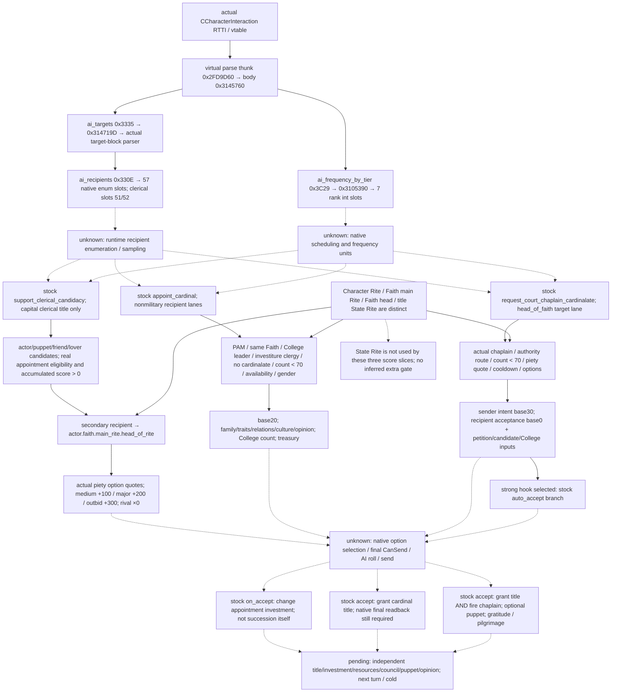

# 1.20.0.2 非军事宗教治理：教士候选、枢机任命与原生 AI 输入

状态为 **`research`**。已确认三个 stock AI 切片，以及真实 `CCharacterInteraction` 的 target/frequency 原生加载链；没有闭合实际 AI scheduler、候选枚举、选项选择或发送。这些 native 代码是解析输入的生产代码，不能称为完整 AI 决策树。没有 provider、counter-policy、宗教动作或本包 live artifact。

2026-10-01 项目所有者已明确开放宗教研究，并停止战争研究。范围仅为非军事教士治理；holy order 收件人 lane 与 monastic 专用 effect 不展开。原版混合交互中的既有战争状态布尔门由最终原生合法性保留，本包不研究其战争调用链。

冻结为 **CK3 1.20.0.2 Crozier / Steam25588574**，EXE `101039736` bytes，SHA-256 `AE1BA6FF060BA603842F6F4A2DED0AF4B7D3666B3DD271F75FB01B0DA8E81B2D`。本包仅读 `artifacts/migrations/2026-09-30/post-update-1.20.0.2/installation/`。通用宗教拆分和转换入口复用 [religion-stock](ck3-1.20.0.2-religion-stock.md)，当前身份 getter 复用 [religion-context](ck3-1.20.0.2-religion-context.md)；五类治理身份与 provider 由[治理总入口](ck3-1.20.0.2-religion-rite-governance.md)对应包维护。

## 可复现证据

- [提取与验证脚本](../../research/religion_rite_governance12002_ai.py)绑定 exact EXE、8 段完整 reviewed native body、23 条语义指令、真实 RTTI/COL/虚表、5 个 token registry 行及 57 个 native recipient enum slots。带 jump table 或 chained `.pdata` 的完整 body 均明确命名，没有只取第一段 prologue 冒充整函数。
- [冻结原生 map](../../research/religion_rite_governance12002_ai_native.json) SHA-256 `372909c6d22d87b3493f5bfe03015a557640061aae93146ec53dd6c3e60210bc`。
- [机器可读树与输入账本](../../research/religion_rite_governance12002_ai_tree.json)及[Mermaid 原件](../../research/religion_rite_governance12002_ai_tree.mmd)与本页保持同一范围。
- 实际提取 `verification.json`、`native-disassembly.txt`、`stock-evidence-windows.txt` 在 `Z:/ck3_mod_rewrite/artifacts/g2-offline-2026-10-01/religion-rite-governance/ai/final/`。disassembly SHA `0822f0ad44eec9b71901e44229e74e204b6c2cd14f6eb8f987b1028a6592ffae`，stock windows SHA `a81079c1873551aa299470bbf94ba733f0ffb36dd8cb5489078ef7ef4984f60d`。
- 初轮 verifier 将 COL 的 `cdOffset` 猜为 0 而失败；真实值为 **4**，与 parse thunk 的 `[this-4]` vtordisp 调整一致。该研究 harness RED 保留在 `ai/attempt-001-col-assumption.json`；最终 verifier 绑定实际六个 COL 字段后提取 GREEN。没有生产或 CK3 故障。

复现一次读取：

```text
python research/religion_rite_governance12002_ai.py --exe <frozen-exe> --game <frozen-game> --output-dir <Z-artifact-dir>
```

脚本没有 CK3 进程、内存、pipe、UI 或 Steam 入口；成功只证明离线文件匹配。`--record` 仅用于审阅后记录 native map，普通命令不刷新冻结 map。

## 原生输入加载链：已确认的边界

实际类 `CCharacterInteraction` 的 TypeDescriptor 为 `0x5538F10`，class name 在 `0x5538F20`。COL `0x4F834C0` 的 subobject offset 为 `0x2750`、cdOffset 为 `4`；虚表 `0x48C2228` 的 parse slot 是 `0x2FD9D60`。该 thunk 先读取 vtordisp `[this-4]`，再跳入 **`0x3145760`** 的实际交互 parser。这一类型证据把原生交互解析与同样支持 tier 字段的 `CDecisionType` 分开。

| 已确认生产链 | 真实意义 | 尚未证明 |
| --- | --- | --- |
| `ai_targets` runtime token `0x3335` → parser `0x314719D` → `0x314A7C0` → `0x314BB60` → `0x292E2C0` | 解析 authored target block；`ai_recipients` 在 `0x292E30B` 检查 token `0x330E` | 当局候选对象的实际枚举、抽样、去重和排序 |
| enum array `0x4766290`，57 个四字节 token；`0x292E33E` 查找 → `0x292E34F` 保存 index → `0x292E35E` 插入 | `rulers_in_clerical_region` token `0x42C5` 是 slot **51**；`clerical_region_rulers_in_realm` token `0x42C6` 是 slot **52** | 两种 enum 的执行 consumer、真实角色集合与边界 |
| `ai_frequency_by_tier` token `0x3C29` → `0x314781A` → `0x3145AB8` → `0x3105390` → `0x287F6A0` → `0x287F9D0` | 真实七 rank 四字节 int slots；`0x287FB3B` 按 rank index 定位，`:FB4A/FB50` 读、写解析后的 signed int | frequency 的时间单位、scheduler、到期检查和实际执行机会 |

全局字符串 registry 行的 second word 是此处 observed runtime token **+1**：例如 frequency 行 `0x46FAA28` 为 `0x3C2A`，实际 interaction parser 用 `0x3C29`；教区两行分别为 `0x42C6/0x42C7`，实际 recipient enum array 用 `0x42C5/0x42C6`。本包用真实 parser/array 互证这五个条目，不把 registry ordinal 直接当作执行 token，也没有推导整个 token 初始化机制。

图中实线为本包已闭合的加载或 stock 分支；虚线为尚未闭合的 native 运行环节。stock 后果也用虚线接入，以免图形暗示本次已执行。



## 教士候选支持：不是自动继承

`support_clerical_candidacy_interaction` 为 hidden stock AI 入口，来源 `pam_interactions.txt:1528–1847`。目标 title filter 为 domain clerical regions，但 `can_be_picked_title` 将它限为 actor 的 **capital county clerical region title**。当前 heir 已是 actor、其 puppet、friend 或 lover 时不走此竞争分支。候选须通过原版 appointment 有效性，且在该 title 上 `appointment_candidate_accumulated_score > 0`、不是现 holder。

`populate_recipient_list` 包含合法 actor、自身 theological agent、external theological agent、friend 与 lover；AI authored lanes 是 self、puppets、scripted relations（max20）。二者不能直接当成同一已经枚举的运行时列表。redirect 将原 recipient 保存在 `secondary_recipient`，真正 recipient 改为 **`actor.faith.main_rite.head_of_rite`**；不能用 actor 当前 Rite 的 head 或一般 Faith head 替代。

三个 send options 对应 `pam_clerical_candidacy_medium/major/outbid_piety_cost_value` 的真实报价。`ai_will_do` base0：选定 medium 且可负担 +100、major +200、outbid +300；secondary recipient 为 rival 时 factor0。原版注释明确这是避免依声明顺序选择选项，**仍未证明 native 总是选最贵或最高权重**。tier frequency authored 值为 barony0、county240、duchy60、kingdom/empire/hegemony12，本包不把这些数字翻译成已经验证的月份。

accept 通过 `change_appointment_investment` 修改 actor 对该候选的投资，score 又受 actor interaction multiplier 与 Christian situation multiplier 影响。它不立即取得头衔，不证明成为 current heir，更不证明完成一次自然继承。独立 readback 必须读取同 title/candidate 的投资与实际候选 score/current heir。

## 枢机任命与司祭申请是不同循环

`appoint_cardinal_interaction:4461–4887` 要求 PAM、同 Faith、actor 真正领导 College、recipient 为可获 cardinalate 的 investiture clergy、相关 pope 为其 Faith/Rite head 且没有 clerical elector title。actor 与 recipient 必须成人、非无能/囚禁/人质；recipient 不能 excommunicated，actor Rite 的 clergy gender 门仍适用。Faith clerical elector title count 必须 **<70**；不是任意全局 cardinal 总数。

`pam_is_investiture_clergy_trigger:5426–5431` 是 **held title has clerical region OR ecclesiastical government OR is_clergy**。单读 `is_clergy` 会漏掉 landed archbishop。`pam_can_hold_cardinalate_trigger:2974–2976` 读取 Faith doctrine parameter `has_clerical_electors`；`pam_leads_college_of_cardinals_trigger:5317–5320` 要 `k_papal_state` 和活跃 College election，**不是所有 Faith/Rite head 都可以任命**。

非军事 AI lanes 为 family max5、vassals、两种 clerical region rulers、subordinates、scripted relations、courtiers max5；同一个 authored target block 中的 holy-order lane 排除。意愿 base20，关键变化包含亲属+70、friend/lover 各+1000、recipient Rite head+50、同文化+40、rival factor0；count<20 +100、count<10 再+200。Christian situation desire-more-cardinals 且 count<40 另+150；count>=30 有0.5 factor，treasury<500 且 count>=30 再0.5，count>=40 再0.5。这些是 stock weight，不能换算成固定成功率或实际排序。

正常 actor 的 cost 为 `actor.minor_treasury_value`；puppet 行 UI cost 归零，accept effect 才从实际 `puppet_or_actor` 扣 treasury。有效性中的 puppet piety 门不等于声明额外 piety 支出。AI recipient 有 auto-accept 分支，stock `ai_accept` base100；实际 grant title、actor piety、扣款与后继独立观测尚未执行。

`request_court_chaplain_cardinalate_interaction:4889–5271` 从已有 **真实 court chaplain** 出发，AI authored recipient lane 为 head_of_faith。显示门还允许没有 Faith head 时、同 Rite 的真正 College leader；native lane 在该例外中能否枚举此 leader 仍未知。tier authored 值为 barony/county/duchy0、kingdom/empire/hegemony24。

sender intent base30，涉及司祭亲属/同 dynasty/受控 puppet、actor zealous/cynical、司祭 piety level、actor 对司祭 opinion。recipient acceptance base0，再合并 `clerical_petition_to_authority_acceptance_modifier`、hook/offer-pilgrimage、对司祭 opinion、不同 Rite -25、gender -50、每 virtue +10、每 sin -10、learning education +10、celibate/devoted 各+15、piety level0 -25、College count<20 +60、<10 +100。selected strong hook 有原版 auto-accept 门；真正最终 acceptance 与 options evaluated state 未提供。

本包没有展开共享 petition acceptance modifier、各 scripted-cost helper、College election helper 与 `grant_cardinal_title_effect` 内部的完整分支；这里只冻结它们确实参与上述入口的调用位置。树不宣称全链接受度、完整候选资格或 title allocation 已完成，下一 native target evaluator 要消费这些实际原版最终结果。

**申请接受后司祭会离开议会**：`:5021–5079` 先 grant cardinal title；没有 external theological agent 时 `fire_councillor` 并将其变为 clerical ruler puppet，否则也会 `fire_councillor`。随后 gratitude +50，移除 fired-from-council opinion，再调用所选 pilgrimage 后果。不能把这一动作当成只得头衔、原 council 完整保留的收益。后置应同时读 cardinalate、原 chaplain 位置、puppet、opinion 与 promised-pilgrimage 状态。

## 决策所需输入与下一包

| 优先级 | 必需观测 | 为何参与实际使用 | 当前缺口 |
| --- | --- | --- | --- |
| P0 | actual actor/puppet、当前 Rite、Faith main Rite、各 head 与宗教 authority | redirect 和 recipient 不同；不能以旧 Faith label 替代 Rite | 复用 context 与治理身份包；本页没有 live 资格 |
| P0 | capital clerical title、current heir、候选 eligibility/accumulated score/投资 | 支持只在单 title 上有意义 | 原生 target-bound candidate/evaluator query 与 readback |
| P0 | Faith clerical elector titles/count、recipient elector title、College leader | 容量与核心 shortage weights | 组织 getter/collection/readback 由治理包负责；不以 schema/null 收口 |
| P0 | 真实 court chaplain、完整 investiture-clergy/gender/availability | 找到候选与可见的 council vacancy 后果 | 复用 council，加原生最终 predicate；`is_clergy` 单字段不足 |
| P0 | 当前 target/options 的 final CanSend、reason、报价与 acceptance | 合法可负担的动作入口 | 需要具体交互 native 查询；加载链不是 final evaluator |
| P1 | opinion、traits、virtues/sins、culture、family/dynasty、hooks、piety level、Christian phase | 解释实际 sender/recipient 评分 | 先补缺失 read-only input，再设计我方策略 |
| P0 | title/investment/resources/council/puppet/opinion/pilgrimage 的独立后置 | 真正物质结果与持续状态 | 动作、next turn、规定 cold 都未执行 |

`title.state_rite` 与上述 actor/current Rite、main Rite、Faith head 保持独立。**本页三个 intent/acceptance 切片没有直接读取 State Rite**，不为它们增加虚构 State Rite gate。它作为其它治理入口的观测由总专题研究。

下一项可施工入口是同一 MCP 的具体交互只读 query：先复用三个独立治理 provider 的真实身份/候选/组织字段，定位 target/options 下最终 `CanSend`、cost 和 acceptance，再进行当前玩家 paused 正/负案例。原生 AI scheduler/实际 recipient enum consumers 列为研究输入账本；本包不在这些环节未知时编造“native always”或实现 counter-policy。

原版来源 SHA：`pam_interactions.txt` 为 `2db73b0da8572e218f1a677a91ff4281a890ade115e6dc40e696ecb59c0b1049`；`pam_scripted_triggers.txt` 为 `0ad98f123b6739593b9ab2c170d0e8c9b3d9d941baa9d3580296dd2139b2ea6e`。行号按 UTF-8 BOM 解码后首行1计数。
