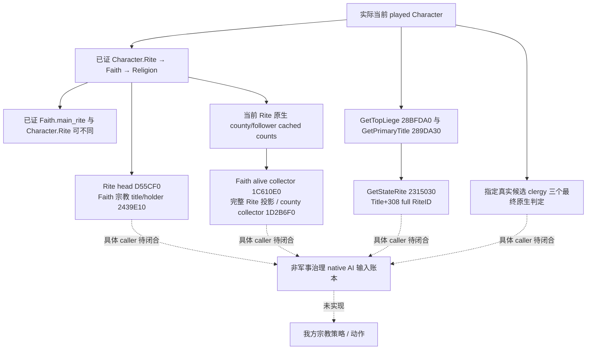

# CK3 1.20.0.2：Rite 的非军事治理观测

本轮由项目所有者在 2026-10-01 明确恢复宗教研究后开展，同时遵守停止战争研究的指令。冻结版本为 **1.20.0.2 Crozier / Steam build 25588574**，EXE SHA-256 为 `AE1BA6FF060BA603842F6F4A2DED0AF4B7D3666B3DD271F75FB01B0DA8E81B2D`。本专题只研究非军事宗教治理与只读观测；没有任命、转换、改革、我方策略或战争操作。

本包于 2026-10-01 16:18（Asia/Shanghai）落下施工索引。16:43 更新：国家仪轨、仪轨领袖、组织计数和神职候选原生判定四个实际只读 provider 已通过各自生产路径夹具，最高为 **static-ready**；组合 query 的实际 worker/mailbox 合同也已通过，两档编译的实际完整 C++ wire 已交 Python/MCP。中央专属注册与 paused 实机仍待。真实当前 Rite→Faith→Religion 身份与资源已由 [religion-context](ck3-1.20.0.2-religion-context.md) 单独交付，本包复用其结论，不重复研发，也不把该 context 当成国家仪轨、仪轨领袖或神职任命资格。

## 原生语义与施工依赖



虚线表示本次尚未闭合的具体入口，不是伪造的已实现字段。本图是研究与观测依赖索引；具体原生决策树在各独立专题落盘后才成为相应实现的输入。

| 独立包 | 实际观测价值 | 交付状态与剩余边界 |
| --- | --- | --- |
| 国家仪轨 | 从实际玩家所属 realm/title 读出 `state_rite`；区分玩家 Rite、Faith main Rite 与国家 Rite | provider static-ready：Od/O2 各14场景、22 checks、8份实际 wire；中央组合与 paused 读回待验 |
| 仪轨领袖 | 区分 Rite head、Faith head、相关 title 与其 holder，读取真实身份关系 | provider static-ready：Od/O2 各18 checks、6份实际 wire；制度分类依赖 effective doctrine，不按空领袖猜制度 |
| 神职任命 | 当前玩家 chaplain task、指定真实候选、三个独立原生最终 bool | provider static-ready：Od/O2 各23 checks、7份实际 wire；专属候选 query 和 paused 待验，不执行任命或称完整 action eligibility |
| 仪轨组织 | 当前 Rite 原生县数/追随者数；Faith 成员、精确 Rite 成员投影与 county Title IDs | 两个 provider static-ready：counter每档13 checks/4wire，members每档15 checks/4wire；独立成员query与 paused 读回待验，缓存刷新时机未知 |
| 治理 AI | 三个 stock 治理入口及真正 CharacterInteraction loader 输入账本 | research：8个body/23指令/57enum slots/2教区slots已证；scheduler/实际候选选择/意愿roll未闭合，不先制定我方策略 |

## 当前边界

各包只访问已冻结的文件，不访问 CK3 进程、内存、pipe、Steam 或桌面；实际游戏由 root 唯一负责。测试只要使用夹具自有对象与 callbacks，就记录为 static-ready 的合同证据，不能记作 fixture-live。命令 ACK、空 collection、合法没有领袖、未实现字段和读取失败分别保留原生语义。

宗教头衔的战争职责、圣战、holy order、参战与军事组织均排除。已存在的宗教 stock 分析与旧版实机证据保留其原范围；本包没有增加 G2、整局、百年或跨继承资格。

各工作包完成后在此补入实际专题、tracked paths、fixture artifact 与剩余实机入口；共享 CMake/route/MCP 接线和日报周报由对应 owner 合并，不在本专题虚填完成。

## 实际只读治理 query

组合接口位于 `religion_rite_governance12002_context.hpp/cpp`，namespace 为 `xar::ck3_12002::religion::governance`：

```cpp
Bindings BindRiteGovernanceImage12002(uintptr_t module_base, string_view exe_sha);
bool ReadPlayedRiteGovernance12002(const Bindings&, uint64_t epoch, Context&);
string SerializePlayedRiteGovernance12002(const Context&);
```

它直接调用三个实际 provider 和各自 serializer，不重新实现身份解析或原生计数。`state_rite`、`heads`、`organization` 各自保存 `available` 与原因；某一领袖读取失败不会隐去已经观测的国家仪轨或组织计数。顶层 `available` 表示至少一个实际组件已观测，`frame_available` 描述共同玩家暂停帧，`observed_components` 和 `all_components_available` 说明可用范围。没有把神职候选或完整成员 collector 的未实现字段填成 `null` 后称为完成。

实际 runtime/mailbox 位于 `religion_rite_governance12002_mailbox.hpp/cpp`，selector 为 `query-player-rite-governance-v1`，domain 为 `player_rite_governance_v1`，backend 为 `ck3-1.20.0.2-native-player-rite-governance-v1`。默认关闭编译 flag 为 `XAR_CK3_ENABLE_G2_PLAYER_RITE_GOVERNANCE_PRIVATE_QUERY_V1`。响应是完整 `command_result`，包括 `protocol_version=1`、`accepted/private_build/read_only/advertised`、actual published `snapshot_revision` 和 `result.player_rite_governance`。

query 没有 actor/target 选择参数，只读实际 played Character。`expected_snapshot_revision` 与 `expected_revision` 沿现有宗教 query 使用相同约定；实际 owner 执行、Finish 后 Wait/Reclaim，paused envelope 的完整 published frame 校验由已有组件负责。当前独立 fixture 使用既有 offline primary permit，不冒充中央治理 named permit 已安装或实机成功。中央下一增量需为 `ExecutePlayerRiteGovernanceMailbox12002` 登记独立 named permit，不能借用已供当前 religion context 使用的 production slot。

初次 nonwar `g2live` 已冻结，本新增只读包不会修改该输入；完成 domain fixture 后才交中央下一宗教增量，并由 root 独占真实 paused SDK 读取。clergy 候选资格具有真实 candidate/task 输入，因此保持独立 typed query，不使用空 candidate 混入当前玩家 context。

## 已冻结的独立组件

| 组件 | FINAL 交付清单 | 实际证据范围 |
| --- | --- | --- |
| State Rite | [delivery-result.json](Z:/ck3_mod_rewrite/artifacts/g2-offline-2026-10-01/religion-governance/state-rite/delivery-result.json)，SHA `5897a4bc1d2e847d50ceda78742db1d661093cec80bd3e5eacd4863686673a75` | 7文件；6完整函数、3注册片段、23指令、11生产常量、2 stock 文件；[原生专题](ck3-1.20.0.2-religion-rite-state.md) |
| Rite heads | [delivery-result.json](Z:/ck3_mod_rewrite/artifacts/g2-offline-2026-10-01/religion-rite-governance/head/delivery-result.json)，SHA `0c86143d062dcc2afc34d56175df92fe96544d1fdaacab20c8f167f5c68e1e96` | 7文件；6完整函数、3注册片段、14指令；[原生专题](ck3-1.20.0.2-religion-rite-head.md) |
| Organization counts | [delivery-result.json](Z:/ck3_mod_rewrite/artifacts/g2-offline-2026-10-01/religion-rite-governance/organization/delivery-result.json)，SHA `b012f4c9c282137029f8adb21a24aff6650c6d0e5c98dfa97613628720ed4d56` | 7文件；9 spans、15指令、4生产常量；[原生专题](ck3-1.20.0.2-religion-rite-organization.md) |
| Clergy predicates | [delivery-result.json](Z:/ck3_mod_rewrite/artifacts/g2-offline-2026-10-01/religion-governance/clergy/delivery-result.json)，SHA `0aba36036e20f4e353a4bb8f5154c9da5ef713bbc22a70bc093c2602328ce153` | 7文件；8 spans、5调用/注册 edges、3 stock 文件、1 reflection token、14生产常量；[原生专题](ck3-1.20.0.2-religion-clergy-appointment.md) |
| Organization members | [delivery-result.json](Z:/ck3_mod_rewrite/artifacts/g2-offline-2026-10-01/religion-rite-governance/organization-members/delivery-result.json)，SHA `4f2813e0ff9fec20c83fbea3a9bc447684b9a26d2fbd6a0319508a6846a3baf2` | 7独立文件；5 spans、33指令、14生产常量；不修改 counter 首包 |
| Governance AI research | [delivery-result.json](Z:/ck3_mod_rewrite/artifacts/g2-offline-2026-10-01/religion-rite-governance/ai/delivery-result.json)，SHA `848b342971c02b730595611a8b21bea6a8a709c314ae5e30ded5ec9ec989f52e` | 5独立文件；[原生专题](ck3-1.20.0.2-religion-rite-governance-ai.md)；loader/stock static-confirmed，不等于选择树闭合 |

四个 FINAL 组件不再修改。State Rite、head 与 clergy 首次 fixture 都出现 unsigned native ID 与 signed 测试常量比较导致 `/WX` 编译失败的 harness RED；修复夹具常量后通过，生产 provider 未改变。失败与修复 artifact 都保留，不写成实机或能力 RED。组织 counter 没有测试失败；首轮交付中未闭合的 collector 范围标签后来被撤回，FINAL 中明确保持 unknown，后续完整成员研究使用独立文件，不把探索推断带进已验证计数口。

组织 county/follower 数是原生 cached getter 的实际读回，不等同完整成员名单，也没有证明缓存刷新顺序。Head 制度分类的实际后续接口来自 `religion_doctrine12002_rite.hpp` 中 `ReadPlayedRiteDoctrines12002` 与 `HasRiteDoctrineByStableKey12002`；该依赖由 doctrine owner 验证，不能把当前 head identity provider 的通过倒算为 doctrine 或最终宗教权限完成。

## 组合 runtime 的实际验证

[runtime delivery-result.json](Z:/ck3_mod_rewrite/artifacts/g2-offline-2026-10-01/religion/rite-governance/runtime/delivery-result.json)，SHA `2f40982e328ecf1e6556f6bef6f772ed42cdc39777bc9f5d78e398e1ff5326b5`，冻结两个 fixture cpp、runner 和 provenance manifest。实际 [result.json](Z:/ck3_mod_rewrite/artifacts/g2-offline-2026-10-01/religion/rite-governance/runtime/attempt-002/result.json) SHA 为 `e0317d206ede0e00ae2498bf761d5b31683f66a068c2977a496d4f681b12882c`。

MSVC `/W4 /WX /Od` 与 `/O2` 各通过 **16 个组合 checks / 5 场景**、**46 个实际 worker/mailbox checks / 6 场景**。它链接三个实际 reader/serializer 和未替换的 `TrySubmit → owner pump/drain → Wait/Reclaim → wrapper`，fixture-owned 原生 callbacks 没有调用冻结 EXE。每档输出四份实际完整 `command_result`：`distinct-zero`、`legal-absent`、`heads-unavailable`、`components-unavailable`；Python JSON 解析直接检查生产输出的 protocol metadata、完整引用、零值、合法缺失与独立可用范围。实际 published frame 变化的场景没有成功 wire。

首 attempt-001 因 fixture 的 `optional<uint32_t>` 与 signed zero 比较触发 `/WX C4389`，仅将测试零改为匹配 native 类型；生产 context/mailbox 没有修改。失败日志保留，未重跑已通过的三个组件矩阵。实际 SDK 读取由 Python owner 验证，此处的 Python JSON 解析不能冒充 MCP SDK 或实机验收。

该新增 query 最高是 **static-ready**。专属中央 named permit、完整 DLL、真实 SDK 和 root paused artifact 仍需各自实际回执；没有宗教动作、G2 增量或完整宗教 OODA。
