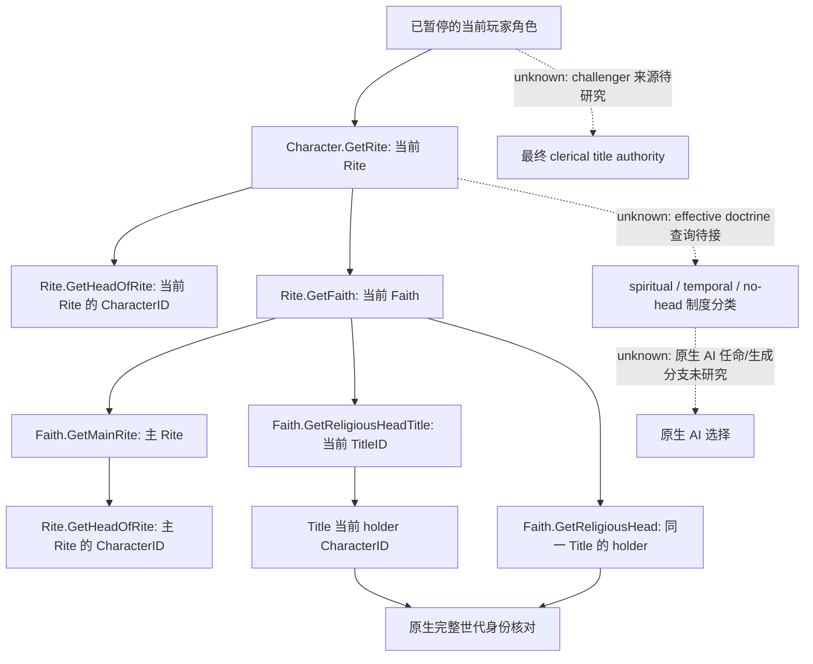

# CK3 1.20.0.2 Rite 宗教领袖与 Faith 头衔身份

本专题只研究当前非军事身份关系。项目所有者已于 2026-10-01 允许恢复宗教研究并停止战争研究；不读取或实现宗教领袖的战争职责、holy order、圣战或动作策略。

冻结构建为 `1.20.0.2 Crozier / Steam25588574`，EXE SHA-256 `AE1BA6FF060BA603842F6F4A2DED0AF4B7D3666B3DD271F75FB01B0DA8E81B2D`。只读当前宗教上下文复用[已证的 Rite→Faith 链](ck3-1.20.0.2-religion-context.md)，不重复将 Character `+0xB4` 解释为 Faith。

## 原生关系树

角色所属 Rite、Faith 主 Rite 和 Faith 当前宗教头衔是三个独立来源，不能用一个模糊的 `head_of_faith` 字段相互替代。原版 `pam_scripted_triggers.txt:1485–1512` 的 clerical title authority 先检查 `religious_head_or_challenger`，不存在时才回退到 `faith.main_rite.head_of_rite`。本 provider 不宣称完成这个最终 authority 判定，也不将其中的 fallback 与角色自身 Rite 的领袖混同。

没有 Rite、没有 head CharacterID、没有宗教 TitleID，或现有 title 没有 holder，均可能是合法的独立空值。不能据此推断 doctrine_no_head。`doctrine_no_head`、`doctrine_spiritual_head`、`doctrine_temporal_head` 是 `doctrine_head_of_faith` 组中的不同条目，原版定义分别位于 `common/religion/doctrine_types/20_doctrines.txt:1170`、`:1200`、`:1224`；制度类型应从当前 Rite 的有效 doctrine 得到，不能从领袖性别、政府、封地、是否等于玩家或是否存在猜测。

## exact-build ABI

| 入口 | RVA / 字段 | 实际语义 |
| --- | --- | --- |
| Rite.GetHeadOfRite | `0x24FC610` → `0xD55CF0` | 后者以 `(Rite*, uint32_t* out)` 返回 `Rite+0x4C0` 的完整 CharacterID；前者按原生 Character storage 完整世代解析 |
| Faith.GetReligiousHead | thunk `0x2443DF0` → `0x2439E10` | 先按 `Faith+0x300` 完整 TitleID 找 title，再按 `Title+0x128` 完整 CharacterID 找 holder |
| Faith.GetReligiousHeadTitle | `0x2443FA0` | 按同一 `Faith+0x300` 的完整 TitleID 解析；title 自身完整身份位于 `+0x10` |
| Rite head 角色身份 | Character `+0x18` | 完整世代身份；不得截成仅 24-bit index |
| Faith 头衔持有人 | Title `+0x128` → Character `+0x18` | 头衔存在与 holder 存在分别观测；不把 title 当作 character |

GUI `window_faith.gui:5429/5698` 使用 `Faith.GetReligiousHeadTitle`，并没有因此证明角色 Rite head 等于其 holder。当前 native 关系读取将保留三个来源，允许同一 Faith 下 actor Rite 与 main Rite 的领袖不同，也允许 Faith title holder 与二者不同。

## 施工与验收边界

独立 provider 位于 `include/xar_bridge/religion_rite_governance12002_head.hpp` / `src/religion_rite_governance12002_head.cpp`，namespace `xar::ck3_12002::religion::head`，入口 `BindRiteHeadsImage12002` / `ReadPlayedRiteHeads12002` / `SerializePlayedRiteHeads12002`。它复用已有宗教 context 的 native binding，不修改共享 Context、中央分派、CMake、MCP、driver 或策略。制度分类将复用另一个工作包的实际 effective doctrine provider；未接前如实标记依赖，不虚构完成。

exact-PE 验证器 [religion_rite_governance12002_head_native.py](../../research/religion_rite_governance12002_head_native.py) 已核对 **8 个实际 provider 常量、6 个完整函数、3 处 registration slice、14 条语义指令**。本域 manifest 同时冻结上述非军事 stock 窗口和其来源文件 SHA，artifact 位于 `Z:/ck3_mod_rewrite/artifacts/g2-offline-2026-10-01/religion-rite-governance/head/native/`。

[实际生产路径夹具 runner](../../research/religion_rite_governance12002_head_run_tests.py) 以 MSVC `/W4 /WX` 分别编译 `/Od` 和 `/O2`，两者各 **18 个 checks GREEN**，不称为 18 个独立测试。各输出六种真实 C++ serializer JSON：三来源领袖不同、title 存在但空缺 holder、合法 head 空缺、合法 Rite 空缺、玩家自身是 Rite head、实际 title lookup 世代不匹配。完整高位世代 ID、合法 ID 0、Title 与 Character 不同身份来源均保留。最终 receipt 为 `Z:/ck3_mod_rewrite/artifacts/g2-offline-2026-10-01/religion-rite-governance/head/fixtures-final/result.json`。首次 `/Od` 因 fixture 的 `optional<uint32_t> == 0` 有符号警告被 `/WX` 拒绝，保留在 `attempt-001.json` 与 `fixtures/Od/build.log`；改 fixture 字面量为 `uint32_t{0}`，实际 provider 不需语义修复，分类为 harness RED。

本域身份 provider 已为 **`static-ready`**，暂无真实 paused artifact；中央实际 query / MCP 接线与本机 paused 同帧核对是后续工作。身份观测不能冒充宗教动作、原生 AI 任命树或完整 OODA。剩余包括：effective doctrine 制度类型接线、`religious_head_or_challenger` 最终 authority、非主 Rite head 自有专属 title 的映射、原生 AI 的任命/生成选择树。未知项保持本图虚线，没有阻止已解锁的当前身份关系单独交付。
