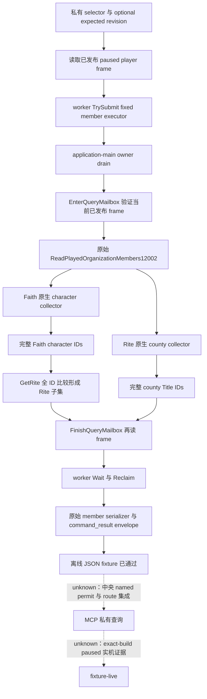

# CK3 1.20.0.2：当前玩家 Rite 成员只读传输

本增量把已冻结的[成员 collector/provider](ck3-1.20.0.2-religion-rite-members.md)接到实际 worker → application-main owner mailbox → native DTO → JSON 路径。状态为 **static-ready**；使用拥有内存的离线 fixture，没有读取、启动或操纵本机 CK3。中央 named permit、私有构建登记、MCP route 与真实 paused snapshot 验收由集成包继续完成，当前不能标记 `fixture-live` 或 production-live，也不增加 G2 完成数。

## 构建与证据复用

- 游戏版本：`1.20.0.2`。
- EXE SHA-256：`AE1BA6FF060BA603842F6F4A2DED0AF4B7D3666B3DD271F75FB01B0DA8E81B2D`。
- exact-build 原生字段、collector 调用链和 full generation ID 证明继续使用 `research/religion_rite_governance12002_organization_members_abi.json`；本增量没有猜测新的游戏 ABI。
- 已冻结的组织 count 包和成员 provider 包不修改，原有 15 项 provider 检查不重复执行。
- 新增代码只注册固定的 current played character 查询；没有任意 actor、动作、宗教军事或我方策略入口。



## 请求与生产接口

私有 flag：`XAR_CK3_ENABLE_G2_PLAYER_RITE_MEMBERS_PRIVATE_QUERY_V1`，默认不定义，保持 OFF。本包不修改共享 CMake、driver 或 mailbox 登记；中央建议使用 named slot `permitted_executor_rite_members12002` 指向 `ExecutePlayerRiteMembersMailbox12002`。离线 fixture 只复用既有 primary `permitted_executor`。

| 项目 | 值 |
| --- | --- |
| selector | `query-player-rite-members-v1` |
| domain_key | `player_rite_members_v1` |
| backend_id | `ck3-1.20.0.2-native-player-rite-members-v1` |
| 返回字段 | `result.player_rite_members` |
| optional revision | `expected_snapshot_revision` 或 `expected_revision`；二者同时提供时必须一致 |

请求 `{}` 使用当前已发布 frame；提供 revision 时必须为非零整数并匹配已发布 revision。actor 一律来自当前 played character，不接受 actor 选择参数。handler 与 governance 传输使用同一调用形状：

```cpp
bool HandlePlayerRiteMembersPrivate12002(
    const game::GameAdapter &, ck3_11906::MainThreadQueryMailboxV1 &,
    const game::Snapshot &published, std::uint64_t revision,
    std::string_view step, std::string_view payload, std::string_view request_id,
    std::string &serialized, std::string &failure) noexcept;
```

头文件是 `xar_bridge/religion_rite_governance12002_members_mailbox.hpp`，namespace 为 `xar::ck3_12002`。`RunPlayerRiteMembersMailbox12002` 是生产 handler 与拥有内存的 fixture 共用的实际 submit/wait/reclaim 路径；query context 必须存活到 ticket 终止并回收。provider 只在已进入的 owner executor 内运行。`SerializePlayerRiteMembersResult12002` 复用原始成员 serializer，不重新实现列表语义。

## 实际响应

外层完整 `command_result` 含 `protocol_version:1`、转义后的 `request_id`、`ok:true`。`result` 含固定 selector、`accepted:true`、`private_build:true`、`read_only:true`、`advertised:false`、exact-build 身份、domain/backend、published `snapshot_revision` 和 `date_raw`。`status` 为 `observed` 或 `unavailable`；受理标志不等于数据可用。

`result.player_rite_members` 保留原始 schema `ck3_12002_rite_organization_members_v1` 的全部字段：`available`、`unavailable_reason`、独立的 owner `capture_epoch`、`date_raw`、`played_character_id`、nullable `rite_id/faith_id/religion_id` 与三份 full generation ID 列表。`capture_epoch` 是 pump epoch，不能用 published revision 替换。

- `faith_character_ids` 是原生 Faith collector 的存活角色结果，可能包括同 Faith 的 sibling Rite。
- `rite_character_ids` 是在上述原生结果上使用 GetRite/full RiteID 的只读投影；不能把 Faith collector 改名宣称为原生 Rite character collector。
- `county_title_ids` 来自原生 Rite county collector，保留完整 TitleID，rank 2 是 county。
- 已知空 pool 返回 `available:true` 与空列表；合法没有 Rite 返回 `available:true`、三个 identity 为 `null`、三个列表为空。
- 原生 source 失败返回 `available:false` 和原始 failure key；不能把失败后的空列表当作已知零成员。
- owner 全 frame 在读取过程中发生变化时不发 success wire，仍等待终态并回收 mailbox。provider unavailable 与传输/owner 失败分开记录。

## 离线验收与继续入口

命令（只访问源文件及拥有内存的 fixture）：

```cmd
Z:\ck3_mod_rewrite\tools\.venv\Scripts\python.exe research\religion_rite_governance12002_members_mailbox_tests.py --artifacts Z:\ck3_mod_rewrite\artifacts\g2-offline-2026-10-01\religion-rite-governance\members-mailbox\runtime
```

MSVC `/W4 /WX`、`/Od` 与 `/O2` 并行运行，每个模式 **36 checks / 5 runtime cases** GREEN。旧成员 test 文件仅提供已冻结的内存 fixture，其独立 main 被重命名且未调用，原 15 项组件矩阵没有重跑。真实 worker 使用生产 Run；owner 使用生产 ObservePumpDrain；生产 Core/member provider 与两个原始 serializers 参与执行。collector callbacks 指向 fixture-owned 实现，真实游戏函数的 exact-build 证明复用此前 PE artifact，当前无实机证据。

artifact 根为 `Z:\ck3_mod_rewrite\artifacts\g2-offline-2026-10-01\religion-rite-governance\members-mailbox`；`runtime/result.json` SHA-256 是 `fd411712d67df7933861443d13f8129fb97ad99c4c8369108d809828bb9a8d46`。`runtime/O2/wire/` 含四份实际 JSON 和一份 rejection：`current-members.json`、`known-empty.json`、`title-unavailable.json`、`legal-no-rite.json`、`frame-changed-rejection.json`。本增量没有失败 attempt。contract 与全部源文件哈希见本增量 `delivery-result.json`。

接续工作是中央登记 fixed executor/private flag/handler、Python/MCP 消费上述实际 packet，然后保存 exact-build paused 实机 snapshot。实机需要验证当前 actor/full Rite/Faith/Religion IDs 和原生列表，并保留不可用/合法无 Rite 区分；当前离线结果不能替代这一步，也不解锁宗教动作或完整 OODA。
