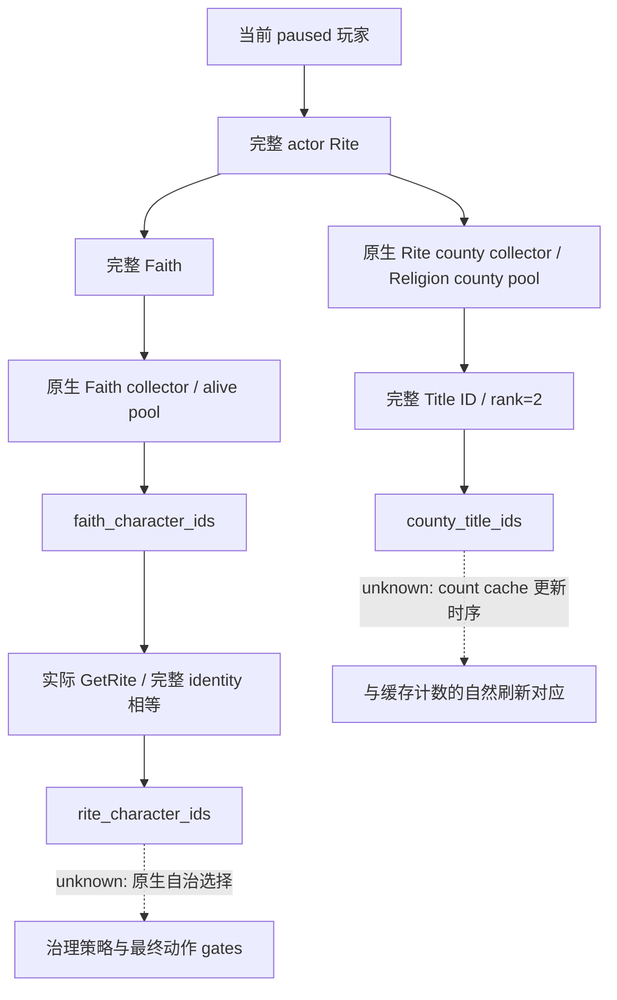

# CK3 1.20.0.2 宗教成员的原生收集范围

本专题为 [Rite 组织计数](ck3-1.20.0.2-religion-rite-organization.md) 的第二增量，绑定 EXE
`AE1BA6FF060BA603842F6F4A2DED0AF4B7D3666B3DD271F75FB01B0DA8E81B2D`。
只研究非军事、只读组织观测；没有命令、改宗、holy order 或战争工作。

## 原生源与完整身份

`CFaithCharacterList` 的无条件收集器 `0x1C610E0` 接受 Faith scope enum `0x0D`，解析 Faith
完整引用后遍历 `GameState+A0` 内 `+0x2EE60/+0x2EE6C` 的真实角色指针数组。
每个角色先以 `Character+B4` 解析 Rite，再比较 `Rite+4B8` 与输入 Faith 的完整 ID；
`Character+1D0 != nullptr` 的死亡角色排除。输出 row 为 `scope=4`、完整 Character ID
（源 `Character+18`）。这是 **Faith 成员**；同 Faith 的不同 Rite 仍属于该 collector 的范围。

当前玩家 Rite 成员由我方只读 provider 在这份真实原生输出中，以实际 `Character.GetRite` 和
完整 Rite identity 精确筛选。字段明确区分 `faith_character_ids` 和 `rite_character_ids`，
后者是已注明来源的查询投影，不把 Faith collector 重命名为 Rite collector。

Rite county 路径为 `0x1D40CA0 → 0x1D223B0 → 0x1D2B6F0`。
`0x1D2B6F0` 接受 Rite scope enum `0x2A`，从 Rite→Faith→Religion 解析完整引用，
遍历 `Religion+200/+20C` 的原生县对象池，比较 `County+384` 与输入 Rite 的完整 ID。
县对象 `+18` 是 full Title ID，通过原生 title storage 解析并核对 `Title+10`；
title template `+48 → +64` 的 rank 枚举在已有
[1.20 construction](ck3-1.20.0.2-construction.md) 和
[解约条款](ck3-1.20.0.2-betrothal-break-terms.md) 已证明为
`0=none / 1=barony / 2=county / 3=duchy / 4=kingdom / 5=empire / 6=hegemony`。
此 collector 的 rank 门为 `>=2`，barony 沿 `Title+108` 上溯到 county，并对 full Title ID 去重。
不能因看到数字 2 就把它解释为 duchy。provider 只发布最终 rank=2 的 county 身份列表。

## 调用者拥有的 scope 数组

原生输出 ABI 为 24-byte 数组：`data+0 / capacity+8 / size+C / allocator+10`；row 为
16-byte `scope kind+0 / flags+2 / full identity+8`。`0x880230` 只有在 `size==capacity` 时
调用 allocator；未满时直接复制16 bytes并增加 size。provider 为 Faith collector 按真实角色源池数、
county collector 按真实 Religion 县池数预分配足量 row。两个 collector 每个源项至多产生一条、
county 还去重，因此本次只读调用使用本地容器，不请求原生分配或修改游戏状态。
collector 的首个参数在两份完整函数中均未读取，可以为 `nullptr`；第三个参数只解引用首个 root
scope 指针。本合同绑定现有 application-main paused owner，没有外部进程/内存采集。

完整 collector ABI 与源在本包静态验证后才能标记 `static-ready`。独立成员身份列表能解除组织范围观测缺口；
它不证明宗教治理动作、原生 AI 选择、缓存刷新时序或改宗结果。真实 paused、MCP 与中央组合另行验收。

## 离线交付证据

2026-10-01：实际 source bindings **14 constants / 5 native spans / 33 semantic instructions GREEN**。
两份完整原生 collector、append ownership 分支和县 collector caller/dispatcher 已冻结；
复用现有 `religion12002_native_abi.json` 的 GetRite→Faith→Religion 完整身份合同，不重复原有检查。

生产调用者/reader/serializer 的 MSVC `/W4 /WX /Od` 与 `/O2` 各 **15 checks GREEN**，
每种模式输出四份实际 C++ JSON，由 Python 验证 Faith/Rite 范围差异、full-generation Character/Title IDs、
known-empty、legal-no-Rite 与 unavailable 区分。fixture 的 native collector callbacks 为夹具对象，
真正游戏函数的调用 ABI 由上述 exact PE 独立证明；没有把静态 callbacks 称为 live。

回执：`artifacts/g2-offline-2026-10-01/religion-rite-governance/organization-members/native/result.json`
与 `provider/result.json`。第一次 ABI verifier 对 conditional jump 错用了只支持 call/jmp 的 target 字段，
属于 **harness RED**；保存 `native-attempt-001.json`，修正后 exact `jne 0x8802FB` 指令检查通过。
当前为独立 library **static-ready**，中央组合、MCP 和实际 paused 当前成员读回待验。
