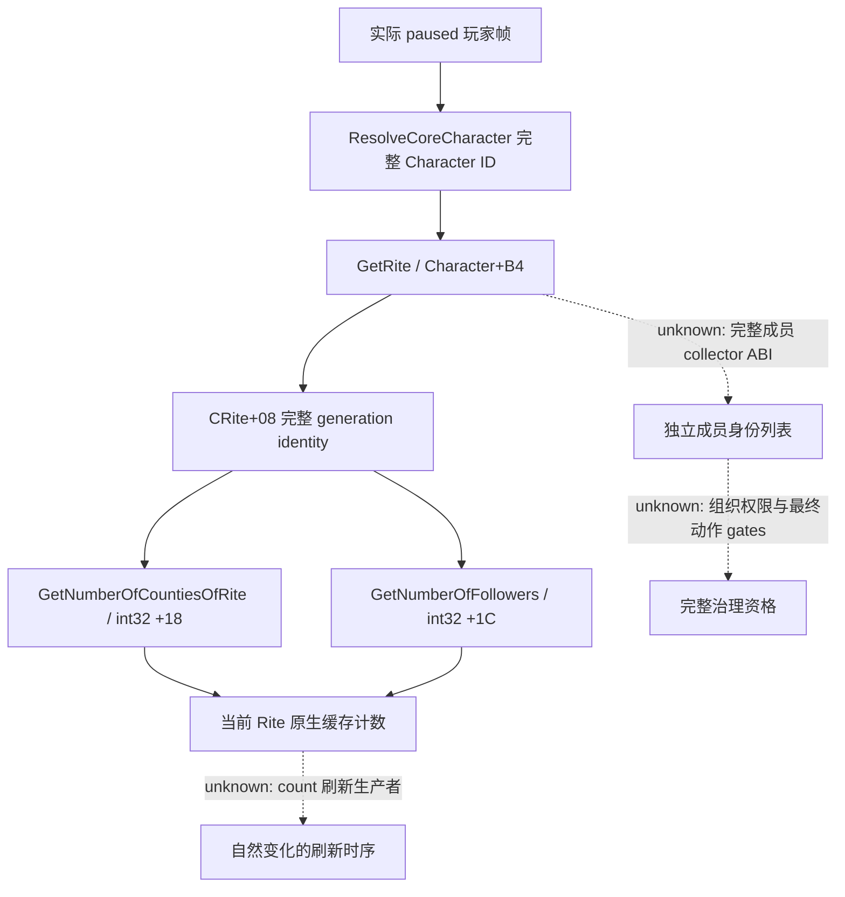

# CK3 1.20.0.2 Rite 组织计数与成员范围

本专题绑定 `1.20.0.2 Crozier / Steam25588574`，冻结 EXE SHA-256
`AE1BA6FF060BA603842F6F4A2DED0AF4B7D3666B3DD271F75FB01B0DA8E81B2D`。
项目所有者于 2026-10-01 明确恢复宗教研究、停止战争研究；本包只观察当前玩家的 Rite
组织范围，不研究宗教军事、holy order、动作或我方策略。

## 已闭合的组织入口

原版 `gui/window_ledger.gui:9041` 使用 `Rite.GetNumberOfCountiesOfRite`，`:9069` 使用
`Rite.GetNumberOfFollowers`。两项统计属于当前 Rite，不能替换为 Faith 或主 Rite 统计。

| 入口 | exact-build 路径 | 语义与范围 |
| --- | --- | --- |
| 玩家当前 Rite | `Character.GetRite` `0x28D2F90`，角色 `+0xB4`，对象 `+0x08` 匹配完整引用 | actor Rite，不是 Faith，也不自动替换为 main Rite |
| Rite 县数 | 注册 `0x4EEF43` → callback `0x2444640` → leaf `0xB80410` | 返回当前 Rite `+0x18` 的 signed `int32` 原生计数 |
| Rite 角色追随者数 | 注册 `0x4EF0D3` → callback `0x24FC210` → leaf `0xEDDB90` | 返回当前 Rite `+0x1C` 的 signed `int32` 原生计数 |
| Faith 角色 collector | `CFaithCharacterList` → `0x1C610E0` | 原生存活角色池、Rite 解析后的 `+0x4B8` **Faith ID** 匹配；不是 Rite 成员列表 |
| Rite 领地 iterator 候选 | `CRiteTitleListBuilder<1..5>`，已定位调用边 `0x1D40CA0` → `0x1D223B0` | 本首增量只冻结调用边；完整 collector 的 rank 范围、身份与输出 ABI 待第二增量闭合，不对外提供成员列表 |

两项计数 getter 与玩家 Rite 绑定为 `static-confirmed`；完整成员 collector 保持研究中。
计数更新生产者和刷新时序尚未闭合，输出明确叫
`native_cached_counts`；不能把 count 本身称为完整已枚举的成员，也不能把它当改宗后的即时结果。
负责人/头衔关系由独立 Rite head 专题负责，本包不复制其实现。

## 首增量 provider 合同

`religion_rite_governance12002_organization.hpp/cpp` 提供
`BindOrganizationImage12002` 与 `ReadPlayedOrganizationCounts12002`，只在现有 application-main
paused owner 内调用。输出包含 frame、完整 Rite ID、县数及角色追随者数，并保留合法零值、
合法无 Rite 和 native 读取失败三者区别。它不调用 GUI、脚本 effect 或命令。

当前是独立只读 library，中央组合/MCP 注册及真实 paused 读回由集成工作包验收。
本包没有 CK3 进程、内存、pipe、Steam 或桌面操作；fixture 不增加 `fixture-live` 或 G2 credit。
独立原生 ABI/fixture 的结果与 SHA 在交付回执中记录。

2026-10-01 首增量：ABI **9 spans / 15 semantic instructions / 4 provider constants GREEN**；
MSVC `/W4 /WX /Od` 与 `/O2` 各 **13 checks GREEN**，实际 reader→serializer 各输出四份 JSON。
正计数、零值、合法无 Rite、缺失对象 wire 都由 Python JSON parser 接收。回执在
`artifacts/g2-offline-2026-10-01/religion-rite-governance/organization/native/result.json`
与 `provider/result.json`，尚未完成真实 paused/MCP。

## 第二增量入口

继续追已定位的 `CRiteTitleListBuilder` 与原生 Rite county 专用 collector、output scope row 的
allocator/stride，再分别闭合 full Title ID 解析与 Rite 身份判定。角色列表优先复用原生
存活角色池的 collector；只有证明精确 Rite filter 后才可命名为 Rite 成员。
已定位的 Faith collector 使用 game-state character-manager 的真实数组而非猜测扫描角色数据库；
若输出 Faith 范围，必须保留 `faith_members` 名称。未闭合的字段不以长期 `null` 冒充完整成员。
