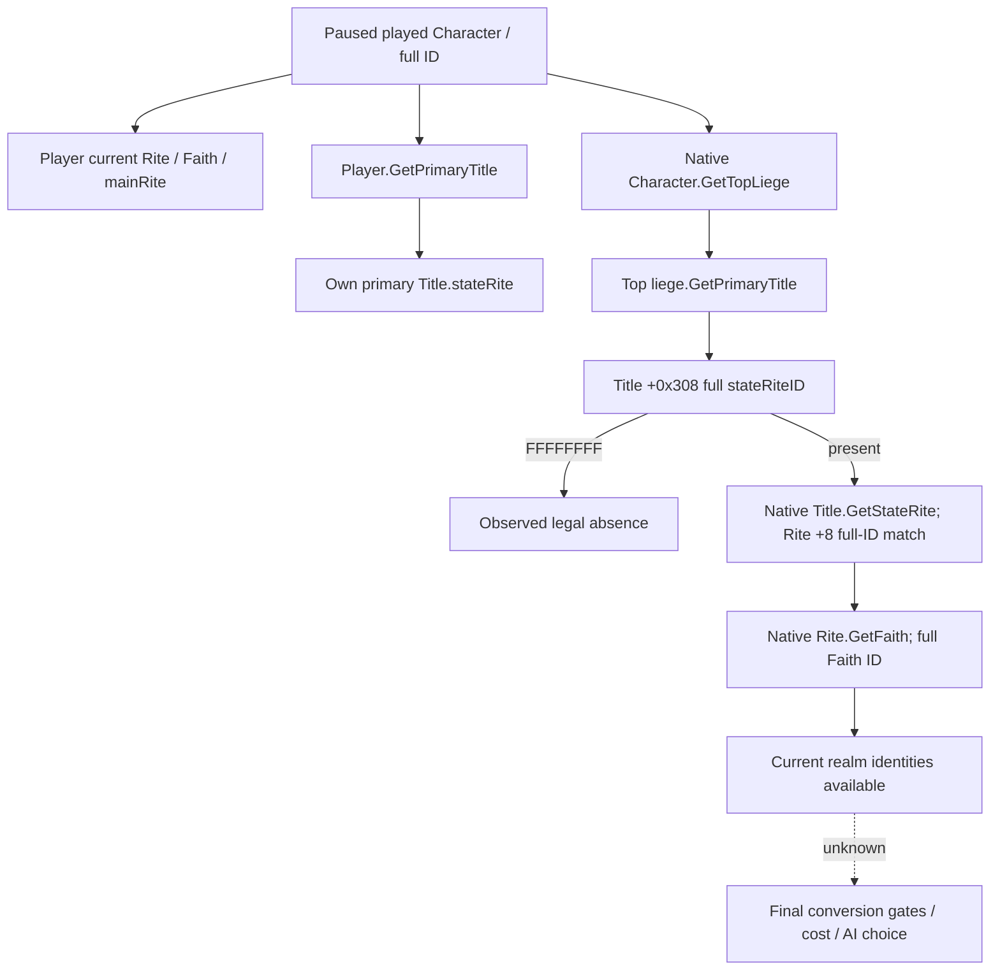

# CK3 1.20.0.2：realm／title stateRite 只读身份链

本专题按项目所有者 2026-10-01 的宗教研究恢复指令施工，只研究当前身份观测。战争、圣战、holy order、宗教动作及我方策略均不在本工作包中。2026-10-01 16:32（Asia/Shanghai）状态：**`static-ready`**；尚未触碰本机 CK3。

冻结输入为 CK3 **1.20.0.2 Crozier / Steam build 25588574**，EXE SHA-256 `AE1BA6FF060BA603842F6F4A2DED0AF4B7D3666B3DD271F75FB01B0DA8E81B2D`。磁盘副本在 `artifacts/migrations/2026-09-30/post-update-1.20.0.2/installation/binaries/ck3.exe`。复用[宗教当前上下文专题](ck3-1.20.0.2-religion-context.md)已闭合的 Character.Rite、Rite.Faith 与 Faith.mainRite，不重复其研究。

## 原版入口与身份边界

`common/scripted_rules/00_rules.txt:68–69`、`:111–112` 的 realm 范围是 **`top_liege.primary_title.state_rite`**。前者比较目标 Faith 与该 Rite.Faith；后者比较目标 Rite 与该 Rite。两处仅跳过各自规则中的知识和最近改宗分支，不能推出最终改宗合法性或价格。

`gui/window_government_administration.gui:1087–1089` 先进入 `[Title.GetStateRite]`，再进入 `[Rite.GetFaith]`，并由政府 `HasRule('state_faith')` 决定控件可见。数据存在与 GUI 可见是不同事实：本查询读取真实头衔字段，不能自行声称政府允许相关动作。

玩家自身主头衔、顶层领主主头衔、玩家当前 Rite 与玩家 Faith.mainRite 均是独立身份。玩家为封臣时，玩家自身主头衔的 stateRite 不能替代 realm stateRite；不能把 Character `+0xB4` 的 RiteID 当成 FaithID。

## Exact-build 原生读取链

| 环节 | RVA／字段 | 实际语义 |
| --- | --- | --- |
| Character.GetTopLiege | core `0x28BFDA0`，reflection thunk `0x28CE5B0` | 沿原生 landed liege／unlanded liege 链取得最终 Character；独立统治者返回自身 |
| Character.GetPrimaryTitle | core `0x289DA30`，thunk `0x28CE510` | 当前 landed data `+0x1C0` 的 held-title 数组 `+0x1E0`／数量 `+0x1EC` 首项；无 landed data 时使用 death data 的历史数组；无项目则 `0xFFFFFFFF` |
| Title 身份 | Title `+0x10` | 完整代际 TitleID；原生 storage 使用 24-bit index 查槽，但随后比较完整 ID |
| Title.GetStateRite | reflection registration slice `0x456972`，callback `0x2315030` | 调用 `0x11F8130` 复制 Title `+0x308` 的完整 RiteID，再解析实际 Rite 对象 |
| Title stateRite 引用 getter | `0x11F8130(Title*, uint32_t* out)` | 返回同一个 out；未设置引用为 `0xFFFFFFFF`，零是合法完整引用 |
| Rite 身份 | Rite `+0x08` | 原生 resolver 比较完整代际 ID；失败会返回 native default 对象，不能将其替代为真实 Rite |

最小查询交付目标是：在同一个真实 paused owner frame 上同时返回玩家当前宗教身份、玩家自身主头衔 stateRite 与顶层领主主头衔 stateRite／Faith。完整 ID 保留 generation；未设置引用与读取失败分别记录。该观测提供 realm 规则真实输入，不是宗教动作实现。

## 验证与剩余工作

生产实现为 `ck3_autonomous_player/native_bridge/include/xar_bridge/religion_rite_governance12002_state_rite.hpp` 与同名前缀 `.cpp`／`_test.cpp`，namespace `xar::ck3_12002::religion::state_rite`。调用 `BindStateRiteImage12002(base, sha)`、`ReadPlayedStateRite12002(bindings, capture_epoch, output)` 与 `SerializePlayedStateRite12002(output)`；复用当前宗教 context 的已验证原生 getters 和 `ReadCoreSnapshot`／`ResolveCoreCharacter`。

实际输出有 `actor_rite_id`、`actor_faith_id`、`actor_faith_main_rite_id`、`top_liege_character_id`，以及 `player_primary_title`／`realm_primary_title` 两个对象；每个对象包含 `title_id`、`state_rite_id`、`state_faith_id`。头衔确实无主头衔或 stateRite 未设置时，查询仍 `available=true` 并在对应字段返回 `null`；已有引用不能解析、代际不符或未暂停时，返回具体 `unavailable_reason`，不能冒充合法未设置或有效零值。这里的 `null` 描述已经读取到的合法缺省或本帧读取失败，不是尚未施工的长期占位。

原生验证脚本 `research/religion_rite_governance12002_state_rite_native.py` 和 ABI manifest 保存 **6 个完整函数、3 个注册切片、23 条语义指令、11 个生产源码常量、2 份 stock 文件哈希**。receipt：`artifacts/g2-offline-2026-10-01/religion-governance/state-rite/native/native-verification.json`，SHA-256 `8b9fed55795596e34fbca3bb0ddc738aea6a1af9f91947eb896e37072920061b`。

`research/religion_rite_governance12002_state_rite_run_tests.py` 用 MSVC `/W4 /WX` 编译实际 production reader／serializer，**`/Od` 与 `/O2` 各 14 cases、22 checks GREEN**；每种模式解析了 8 个实际 C++ JSON wire。包含封臣与独立统治者、玩家 Rite／mainRite／自身国教／realm 国教全部不相同、合法零 ID、stateRite 未设置、无主头衔、无领地玩家仍有 realm、玩家未设置 Rite 与原生读取失败。receipt：`artifacts/g2-offline-2026-10-01/religion-governance/state-rite/fixture-final/result.json`，SHA-256 `3d2fd7fcc31dab3f04563b3eb06df490e726d700e47a71470c42f125cd431379`。

首次 fixture 把 `optional<uint32_t>` 与 signed literal／int 比较，被 MSVC `/WX` 的 C4389 拒绝；这是一项 **harness RED**，生产 reader 已编译。原日志和失败 fixture 留在 `attempt-001-fixture-signed-comparison/`。修正 fixture 比较类型后，两种模式均通过，未重复其他域测试。

没有真实 paused artifact 前，不将其标记为 live。中央 dispatch、MCP 查询口以及本机 paused 交叉验证由协调者后续集成；不要用该 primitive 的 `available=true` 声称最终改宗可行、AI 选择已闭合或通用宗教 OODA 完成。
